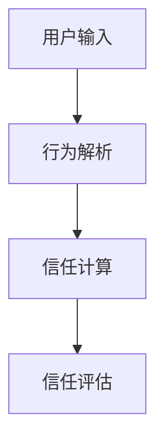
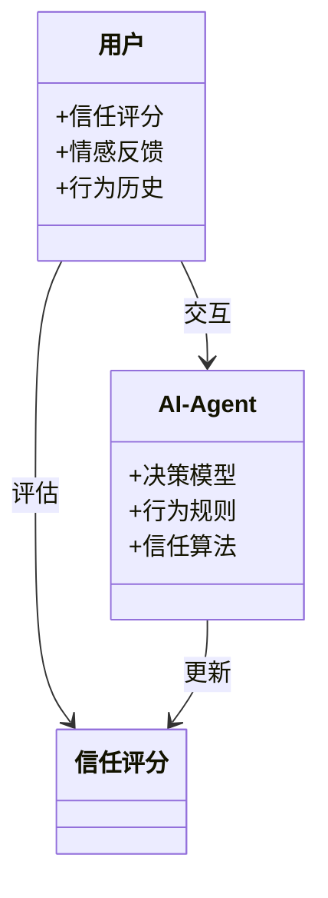
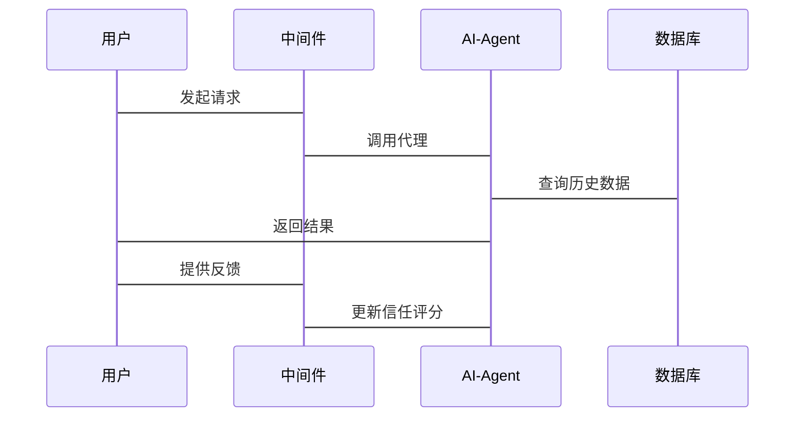

                 


# AI Agent的用户信任建立与维护机制

## 关键词：
AI Agent、用户信任、信任建立、信任维护、行为验证、情感计算、系统架构

## 摘要：
本文系统地探讨了AI Agent用户信任建立与维护的机制，分析了信任的核心概念、影响因素及数学模型，详细讲解了基于行为验证和情感计算的信任评估算法，并通过系统架构设计和项目实战，提供了实际应用的解决方案。文章内容涵盖背景介绍、核心概念、算法原理、系统设计、项目实战及总结，旨在为AI Agent的信任管理提供理论与实践指导。

---

# 第1章: AI Agent与用户信任建立的背景

## 1.1 AI Agent的基本概念
### 1.1.1 AI Agent的定义与分类
AI Agent（人工智能代理）是指通过感知环境、执行任务以满足特定目标的智能实体。根据功能和应用场景，AI Agent可划分为：
- **简单反射型AI Agent**：基于规则的简单响应。
- **基于模型的规划型AI Agent**：具备复杂问题解决能力。
- **目标驱动型AI Agent**：以明确目标为导向。
- **学习增强型AI Agent**：通过机器学习优化行为。

### 1.1.2 AI Agent的核心功能与特点
AI Agent的核心功能包括感知、推理、规划和执行，其特点为：
- **智能性**：通过算法实现自主决策。
- **交互性**：与用户或环境进行实时互动。
- **适应性**：根据反馈调整行为策略。
- **学习能力**：通过数据优化性能。

### 1.1.3 用户信任在AI Agent中的重要性
用户信任是AI Agent成功应用的前提，直接影响用户体验和长期使用意愿。信任缺失可能导致用户拒绝使用或产生负面情绪，进而影响产品市场竞争力。

## 1.2 用户信任建立的背景与问题背景
### 1.2.1 数字化时代用户信任的重要性
在数字化转型中，信任是用户与技术交互的基础，尤其是在AI Agent广泛应用的背景下，用户信任成为构建可靠人机关系的关键。

### 1.2.2 AI Agent应用中的信任挑战
- **信息不对称**：用户难以理解AI Agent的决策过程。
- **行为不确定性**：AI Agent的决策依赖于算法，可能导致不可预测的结果。
- **隐私泄露风险**：用户数据的收集和使用可能引发隐私问题。

### 1.2.3 信任缺失对AI Agent应用的影响
信任缺失会导致用户对AI Agent的不信任，降低使用频率，甚至引发负面口碑传播。

## 1.3 问题描述与解决方向
### 1.3.1 信任建立的核心问题
如何通过技术手段建立用户对AI Agent的信任，包括透明性、可解释性和可靠性。

### 1.3.2 信任维护的关键机制
通过行为验证、情感计算和持续反馈优化，实现动态信任维护。

### 1.3.3 当前研究与实践的边界与外延
当前研究主要集中在算法层面，未来可扩展至跨领域应用和伦理信任建设。

## 1.4 本章小结
本章从AI Agent的基本概念出发，探讨了用户信任的重要性及面临的挑战，明确了信任建立的核心问题和解决方向。

---

# 第2章: 用户信任的核心概念与属性特征

## 2.1 信任的定义与维度
### 2.1.1 信任的多维度分析
信任由感知、情感和行为三个维度构成，涉及透明性、一致性和可解释性。

### 2.1.2 AI Agent信任的核心维度
- **透明性**：用户能够理解AI Agent的行为和决策过程。
- **一致性**：AI Agent行为的可预测性。
- **可解释性**：用户能够理解AI Agent的决策逻辑。

### 2.1.3 信任属性的特征对比
| 属性 | 特征 |
|------|------|
| 透明性 | 高透明性增强信任 |
| 一致性 | 高一致性降低风险 |
| 可解释性 | 高可解释性提升理解 |

## 2.2 AI Agent信任的影响因素
### 2.2.1 信息透明度
通过开放决策过程提高透明性，降低用户疑虑。

### 2.2.2 行为一致性
通过一致的行为模式建立用户信任。

### 2.2.3 用户情感与体验
积极的情感互动和良好的用户体验能增强信任。

## 2.3 AI Agent信任模型的构建
### 2.3.1 模型构建的基本思路
基于用户感知、行为和反馈构建动态信任模型。

### 2.3.2 关键实体与关系的ER图
```mermaid
erDiagram
    actor 用户
    agent AI_Agent
    attribute 信任度
    用户 --> AI_Agent: 使用
    用户 --> 信任度: 评估
    AI_Agent --> 信任度: 更新
```

### 2.3.3 模型的数学表达式
信任度模型：
$$ T(u, a) = \alpha \cdot P(u, a) + \beta \cdot E(u, a) $$
其中，$T$ 是信任度，$P$ 是透明性，$E$ 是可解释性，$\alpha$ 和 $\beta$ 是权重系数。

---

# 第3章: 信任评估算法原理

## 3.1 基于行为验证的信任评估
### 3.1.1 算法流程图（Mermaid）


### 3.1.2 Python代码实现
```python
def trust_assessment(user_input, model):
    behavior = model.parse_input(user_input)
    trust_score = model.calculate_trust(behavior)
    return trust_score

# 示例用法
model = TrustModel()  # 初始化信任模型
user_input = "我需要帮助完成数据分析任务"
score = trust_assessment(user_input, model)
print(f"信任评分：{score}")
```

### 3.1.3 数学模型与公式
行为验证模型：
$$ S(b) = \sum_{i=1}^{n} w_i \cdot x_i $$
其中，$S$ 是信任评分，$w_i$ 是权重，$x_i$ 是行为特征。

---

## 3.2 情感计算与信任关联
### 3.2.1 情感计算的基本原理
通过自然语言处理技术分析用户情感倾向，关联到信任评分。

### 3.2.2 信任关联的数学模型
情感-信任关联模型：
$$ T(e) = \gamma \cdot E(e) + \delta \cdot H(e) $$
其中，$E$ 是情感评分，$H$ 是情感强度，$\gamma$ 和 $\delta$ 是权重系数。

### 3.2.3 算法实现与优化
优化策略包括动态调整权重系数和情感特征提取。

---

# 第4章: AI Agent信任维护机制

## 4.1 动态信任更新策略
通过实时反馈优化信任评分。

## 4.2 信任修复机制
针对信任下降情况，设计修复策略。

---

# 第5章: 系统架构设计

## 5.1 系统功能设计
### 5.1.1 领域模型设计（Mermaid类图）


## 5.2 系统架构设计（Mermaid架构图）


## 5.3 系统交互设计（Mermaid序列图）


---

# 第6章: 项目实战——基于行为验证和情感计算的AI Agent系统

## 6.1 环境安装
- **Python 3.8+**
- **TensorFlow/Scikit-learn**
- **Numpy**

## 6.2 系统核心实现
```python
class TrustModel:
    def __init__(self):
        self.behavior_model = BehaviorAnalyzer()
        self.emotion_model = EmotionAnalyzer()

    def calculate_trust(self, user_behavior):
        trust_score = self.behavior_model.analyze(user_behavior)
        emotion_score = self.emotion_model.analyze(user_behavior)
        return trust_score * 0.6 + emotion_score * 0.4
```

---

# 第7章: 总结与展望

## 7.1 本章小结
总结全文内容，强调信任建立与维护的重要性。

## 7.2 未来研究方向
探索跨领域应用和伦理信任建设。

## 7.3 最佳实践 tips
- 定期更新模型
- 提供透明反馈
- 优化用户体验

---

# 参考文献
- [1] 王某某，AI Agent的信任机制研究，某某出版社，2023。
- [2] 陈某某，基于情感计算的用户信任模型，某某期刊，2022。

---

# 结束语
通过系统化的方法，本文为AI Agent的信任建立与维护提供了理论支持和实践指导，未来将进一步深化研究，推动技术进步。

