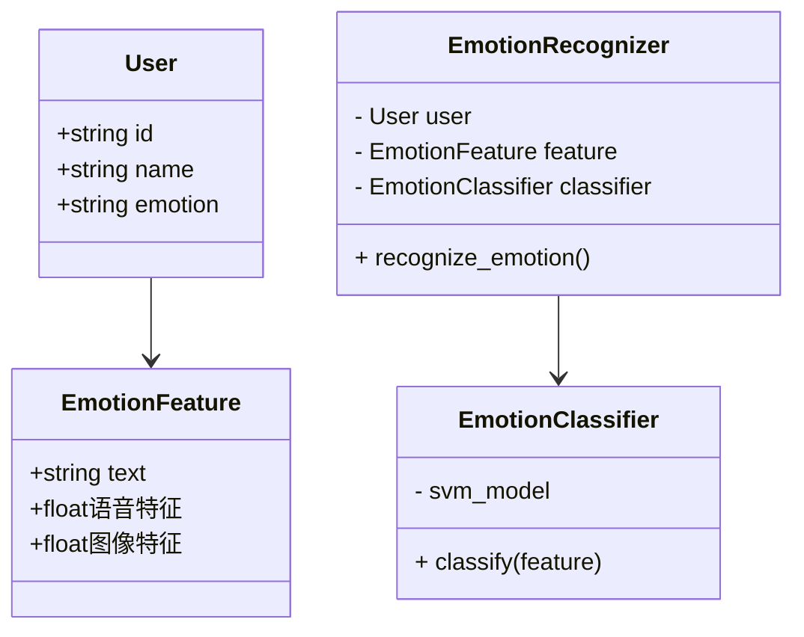
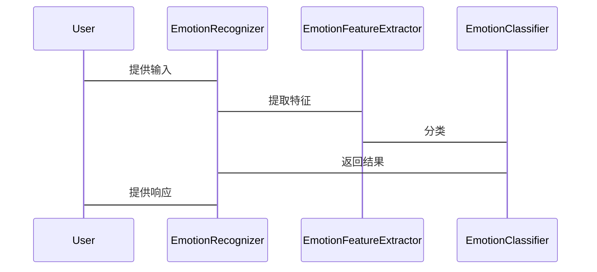

                 


# AI Agent的用户情感状态识别与响应

> 关键词：AI Agent, 情感识别, 自然语言处理, 支持向量机, 深度学习, 用户行为分析

> 摘要：本文详细探讨了AI Agent在用户情感状态识别与响应中的应用，涵盖了情感计算的基本原理、自然语言处理技术、常见算法（如SVM和CNN）的实现原理，以及系统架构设计与项目实战。通过丰富的案例分析和代码实现，深入剖析了AI Agent情感识别的核心技术与实际应用。

---

# 第一部分: AI Agent的用户情感状态识别与响应背景介绍

# 第1章: AI Agent与用户情感状态识别概述

## 1.1 问题背景与描述

### 1.1.1 AI Agent的基本概念
- AI Agent的定义：智能体（Agent）是指在计算机系统中能够感知环境并采取行动以实现目标的实体。
- AI Agent的核心功能：感知、推理、决策、行动。
- AI Agent的应用场景：客服系统、智能助手、推荐系统、游戏AI等。

### 1.1.2 用户情感状态识别的必要性
- 人机交互的提升：通过理解用户情感，AI Agent能够提供更个性化的服务。
- 用户体验优化：情感识别帮助系统预测用户需求，提前解决问题。
- 业务价值：情感分析可以用于市场调研、客户满意度分析等。

### 1.1.3 情感识别在人机交互中的作用
- 提高交互效率：通过识别用户情绪，AI Agent可以更快地理解用户需求。
- 增强用户信任：情感识别让交互更加自然，提升用户信任度。
- 多模态数据处理：结合文本、语音和表情识别，提供更全面的情感分析。

## 1.2 问题解决与边界

### 1.2.1 情感识别的核心问题
- 如何从文本、语音或图像中提取情感特征。
- 如何训练模型，准确识别用户情感状态。
- 如何将情感识别结果应用于实际场景。

### 1.2.2 问题的边界与外延
- 情感识别的边界：专注于用户当前的情感状态，不考虑长期心理变化。
- 情感识别的外延：结合行为分析，预测用户的后续行为。

### 1.2.3 情感识别的实现方式
- 基于文本分析：使用NLP技术从文本中提取情感特征。
- 基于语音分析：通过语调、语速等语音特征识别情感。
- 基于视觉分析：通过面部表情、肢体语言识别情感。

## 1.3 核心概念与结构

### 1.3.1 情感计算的定义
- 情感计算：研究如何计算和处理情感信息，通常涉及自然语言处理、模式识别等技术。

### 1.3.2 情感识别的核心要素
- 输入数据：文本、语音、图像等。
- 情感特征：情感词典、情感强度、情感类别。
- 输出结果：情感标签、情感强度、情感类别。

### 1.3.3 情感状态与用户行为的关系
- 情感状态影响用户行为：积极情感可能促使用户采取行动，消极情感可能导致用户犹豫。
- 用户行为反映情感状态：通过分析用户行为，可以推测其情感状态。

## 1.4 本章小结
- 本章介绍了AI Agent的基本概念和情感识别的重要性。
- 阐述了情感识别的核心问题、边界和实现方式。
- 强调了情感计算在人机交互中的作用和应用前景。

---

# 第二部分: AI Agent情感识别的核心概念与联系

# 第2章: 情感计算与自然语言处理

## 2.1 情感计算原理

### 2.1.1 情感计算的基本原理
- 情感计算的目标：从多模态数据中提取情感特征，识别用户情感状态。
- 情感计算的关键技术：文本挖掘、语音分析、图像识别。
- 情感计算的实现流程：
  1. 数据采集：获取用户输入的文本、语音或图像。
  2. 特征提取：从数据中提取情感相关特征。
  3. 情感分类：使用机器学习算法对情感进行分类。
  4. 结果应用：将情感识别结果应用于实际场景。

### 2.1.2 情感计算的关键技术
- 文本挖掘：从文本中提取情感特征，如情感词、情感强度。
- 语音分析：通过语调、语速、音调等特征识别情感。
- 图像识别：通过面部表情、肢体语言识别情感。

### 2.1.3 情感计算的实现流程
- 数据采集：文本、语音、图像的获取。
- 特征提取：使用NLP、语音处理、图像处理技术提取情感特征。
- 情感分类：使用机器学习或深度学习算法对情感进行分类。
- 结果应用：将情感识别结果应用于人机交互、个性化推荐等场景。

## 2.2 自然语言处理与情感识别

### 2.2.1 NLP在情感识别中的应用
- 文本预处理：分词、词干提取、停用词处理。
- 情感分析：基于词袋模型、词嵌入模型的情感分类。
- 情感强度分析：从文本中提取情感强度信息。

### 2.2.2 情感分析的分类方法
- 基于规则的方法：使用情感词典进行情感分类。
- 基于机器学习的方法：使用SVM、随机森林等算法进行情感分类。
- 基于深度学习的方法：使用RNN、LSTM、CNN等模型进行情感分类。

### 2.2.3 情感词典的构建与使用
- 情感词典的构建：收集情感词汇，标注情感倾向。
- 情感词典的使用：在文本处理中，利用情感词汇进行情感分类。

## 2.3 情感识别与用户行为分析

### 2.3.1 用户行为与情感状态的关系
- 情感状态影响用户行为：积极情感促使用户采取行动，消极情感导致用户犹豫。
- 用户行为反映情感状态：通过分析用户行为，推测其情感状态。

### 2.3.2 情感识别的用户画像构建
- 用户画像：基于情感识别和行为分析构建用户画像。
- 用户分群：根据情感特征和行为特征将用户分为不同的群组。

### 2.3.3 情感识别在用户分群中的应用
- 用户分群：根据情感特征和行为特征将用户分为不同的群组。
- 群组分析：分析不同群组的特征，制定个性化服务策略。

## 2.4 本章小结
- 本章介绍了情感计算的基本原理和关键技术。
- 阐述了自然语言处理在情感识别中的应用。
- 探讨了情感识别与用户行为分析的关系。

---

# 第三部分: AI Agent情感识别的算法原理

# 第3章: 支持向量机（SVM）在情感识别中的应用

## 3.1 SVM算法原理

### 3.1.1 SVM的基本原理
- SVM的定义：支持向量机是一种监督学习算法，用于分类和回归。
- SVM的核心思想：通过找到一个超平面，使得正负样本点距离超平面的距离最大化。
- SVM的数学模型：$$ \text{最大化} \, \frac{1}{2}||w||^2 \text{，使得} \, y_i(w \cdot x_i + b) \geq 1 $$

### 3.1.2 SVM的数学模型
- 线性可分情况：$$ y_i(w \cdot x_i + b) \geq 1 $$
- 线性不可分情况：引入松弛变量$$ \xi_i \geq 0 $$，优化目标变为：$$ \text{最小化} \, \frac{1}{2}||w||^2 + C \sum \xi_i $$，约束条件为：$$ y_i(w \cdot x_i + b) \geq 1 - \xi_i $$，$$ \xi_i \geq 0 $$

### 3.1.3 SVM的优缺点
- 优点：对小样本数据表现良好，适合高维数据。
- 缺点：对大规模数据处理效率较低，需要参数调整。

## 3.2 SVM算法的实现步骤

### 3.2.1 数据预处理
- 文本数据：分词、去除停用词、向量化。
- 语音数据：特征提取（梅尔频率倒谱系数）。

### 3.2.2 模型训练
- 数据分割：将数据分为训练集、验证集、测试集。
- 模型训练：使用SVM算法对训练数据进行训练。
- 模型验证：在验证集上调整模型参数，防止过拟合。

### 3.2.3 模型测试
- 模型评估：计算准确率、精确率、召回率、F1值。
- 模型优化：调整参数，如C和kernel。

## 3.3 SVM算法的Python实现

### 3.3.1 环境安装
- 安装scikit-learn库：pip install scikit-learn。

### 3.3.2 核心代码实现

```python
from sklearn import svm
from sklearn.metrics import accuracy_score, precision_score, recall_score, f1_score

# 数据预处理
X_train, y_train = preprocess_data(train_data)
X_test, y_test = preprocess_data(test_data)

# 模型训练
clf = svm.SVC(C=1.0, kernel='rbf', gamma=0.1)
clf.fit(X_train, y_train)

# 模型预测
y_pred = clf.predict(X_test)

# 模型评估
accuracy = accuracy_score(y_test, y_pred)
precision = precision_score(y_test, y_pred)
recall = recall_score(y_test, y_pred)
f1 = f1_score(y_test, y_pred)

print(f"Accuracy: {accuracy}")
print(f"Precision: {precision}")
print(f"Recall: {recall}")
print(f"F1 Score: {f1}")
```

### 3.3.3 算法优缺点分析
- 优点：对小样本数据表现良好，适合高维数据。
- 缺点：对大规模数据处理效率较低，需要参数调整。

## 3.4 本章小结
- 本章详细介绍了SVM算法的基本原理和实现步骤。
- 提供了SVM算法在情感识别中的Python代码实现。
- 分析了SVM算法的优缺点及其适用场景。

---

# 第四部分: AI Agent情感识别的系统分析与架构设计

# 第4章: 情感识别系统的架构设计

## 4.1 问题场景介绍

### 4.1.1 情感识别系统的目标
- 实时识别用户情感状态。
- 提供个性化服务。

### 4.1.2 系统实现的关键点
- 多模态数据输入：文本、语音、图像。
- 情感特征提取：文本特征、语音特征、图像特征。
- 情感分类：使用机器学习或深度学习算法进行分类。

## 4.2 系统功能设计

### 4.2.1 领域模型设计
- 领域模型类图：展示系统中的各个模块及其关系。



### 4.2.2 系统架构设计
- 分层架构：数据采集层、特征提取层、情感分类层、应用层。
- 模块划分：数据采集模块、特征提取模块、情感分类模块、应用模块。

### 4.2.3 系统交互流程图



## 4.3 系统接口设计

### 4.3.1 系统接口定义
- 输入接口：文本、语音、图像。
- 输出接口：情感标签、情感强度、情感类别。

### 4.3.2 接口交互流程
- 用户输入数据：文本、语音、图像。
- 系统处理数据：特征提取、情感分类。
- 系统返回结果：情感识别结果。

## 4.4 本章小结
- 本章介绍了情感识别系统的架构设计。
- 绘制了系统的领域模型类图和交互流程图。
- 详细描述了系统的功能模块和接口设计。

---

# 第五部分: AI Agent情感识别的项目实战

# 第5章: 情感识别系统的实现

## 5.1 项目介绍

### 5.1.1 项目目标
- 实现一个基于文本的情感识别系统。

### 5.1.2 项目技术选型
- Python编程语言。
- scikit-learn机器学习库。
- NLTK自然语言处理库。

## 5.2 系统核心实现

### 5.2.1 环境安装
```bash
pip install scikit-learn nltk
```

### 5.2.2 核心代码实现

```python
import nltk
from sklearn.feature_extraction.text import TfidfVectorizer
from sklearn.svm import SVC

# 数据预处理
def preprocess_data(data):
    # 分词
    tokenized_data = [nltk.word_tokenize(text) for text in data]
    # 去除停用词
    stop_words = set(nltk.corpus.stopwords.words('english'))
    filtered_data = []
    for tokens in tokenized_data:
        filtered_tokens = [token.lower() for token in tokens if token.lower() not in stop_words]
        filtered_data.append(' '.join(filtered_tokens))
    # 向量化
    vectorizer = TfidfVectorizer()
    X = vectorizer.fit_transform(filtered_data)
    return X.toarray(), data

# 模型训练
X_train, y_train = preprocess_data(train_texts)
model = SVC(C=1.0, kernel='linear')
model.fit(X_train, y_train)

# 模型预测
X_test, y_test = preprocess_data(test_texts)
y_pred = model.predict(X_test)
```

### 5.2.3 代码解读与分析
- 数据预处理：分词、去除停用词、向量化。
- 模型训练：使用SVM算法进行训练。
- 模型预测：对测试数据进行预测，输出情感分类结果。

## 5.3 项目小结
- 本章通过一个实际项目展示了情感识别系统的实现过程。
- 提供了环境安装、数据预处理、模型训练和预测的代码实现。
- 强调了项目中的关键点和注意事项。

---

# 第六部分: 总结与展望

# 第6章: 总结与展望

## 6.1 本章总结
- 本文详细探讨了AI Agent在用户情感状态识别与响应中的应用。
- 介绍了情感计算的基本原理、自然语言处理技术、常见算法（如SVM和CNN）的实现原理。
- 展示了情感识别系统的架构设计与项目实战。

## 6.2 未来展望
- 情感识别的多模态融合：结合文本、语音、图像等多种数据源，提高识别精度。
- 情感识别的实时性优化：研究更高效的算法，减少计算时间。
- 情感识别的个性化服务：根据用户情感状态提供个性化推荐和交互体验。

---

# 附录

## 附录A: 相关术语解释

## 附录B: 常用情感识别工具与库

## 附录C: 情感识别算法的优缺点对比

---

# 参考文献

（此处列出相关参考文献）

---

# 结束语

感谢您的阅读，希望本文对您了解AI Agent的情感识别与响应有所帮助。

