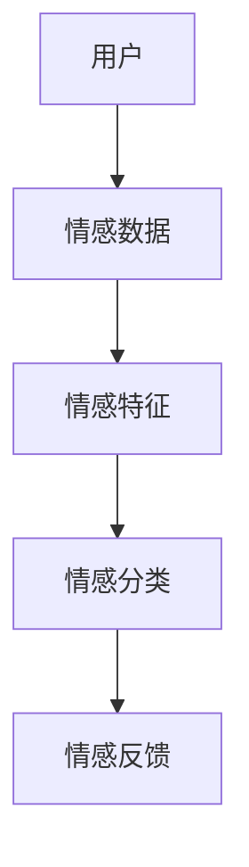
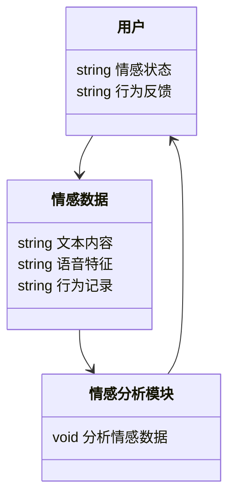
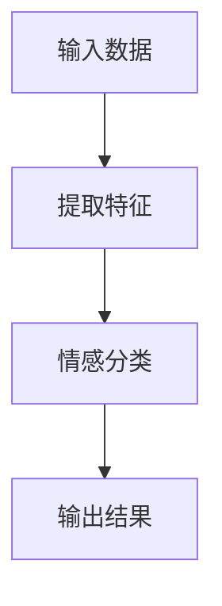
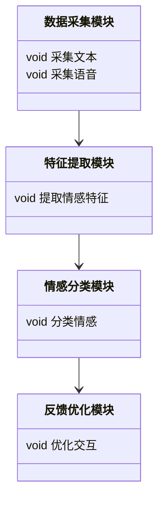
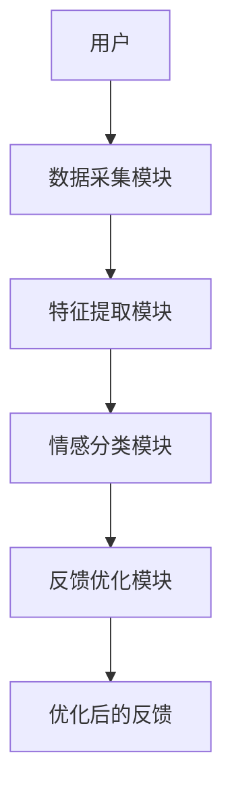

                 


# AI Agent的用户情感计算与交互优化

## 关键词：AI Agent, 情感计算, 交互优化, 情感识别, 深度学习, 用户体验

## 摘要：  
随着人工智能技术的快速发展，AI Agent（智能代理）在各个领域的应用越来越广泛。为了提升AI Agent与用户的交互体验，情感计算成为关键的技术之一。本文从情感计算的基本概念出发，详细探讨其在AI Agent中的应用，分析情感计算的核心算法与优化方法，结合实际案例，提出了一套完整的AI Agent情感计算与交互优化方案，为相关领域的研究和实践提供了参考。

---

# 第1章 AI Agent与用户情感计算概述

## 1.1 问题背景与定义  
在人工智能领域，AI Agent是指能够感知环境、自主决策并执行任务的智能实体。AI Agent的核心目标是通过与用户或环境的交互，实现预定的目标。然而，传统的AI Agent往往忽略了用户的情感状态，导致交互体验较差。例如，在客服机器人中，用户的情绪可能影响其需求的理解和反馈的生成。因此，如何准确识别和理解用户的情感，成为提升AI Agent交互能力的关键。

情感计算（Affective Computing）是人工智能领域的一个重要分支，专注于通过计算手段理解和模拟人类情感。通过情感计算，AI Agent能够感知用户的喜怒哀乐，并据此调整交互策略，从而提供更加个性化和贴心的服务。

## 1.2 情感计算的核心要素  
情感计算的核心要素包括以下几点：  
1. **情感数据的采集**：包括文本、语音、面部表情和生理数据等多种形式。  
2. **情感特征的提取**：从原始数据中提取能够表征情感的特征，如文本中的情感词、语音的语调特征等。  
3. **情感分类与预测**：通过机器学习或深度学习算法，对用户的情感进行分类或预测。  
4. **情感反馈与优化**：根据用户的情感状态，实时调整交互策略，优化用户体验。

## 1.3 当前研究现状与挑战  
目前，情感计算在AI Agent中的应用还面临以下挑战：  
1. **数据多样性**：用户的情感表达可能受到文化、语言和情境的影响，导致数据的多样性和复杂性。  
2. **实时性要求**：在某些场景中，如实时聊天或语音交互，情感计算需要在极短的时间内完成。  
3. **模型的可解释性**：情感计算的结果需要能够被用户理解和信任，这要求模型具有较高的可解释性。

---

# 第2章 情感计算的核心概念与联系

## 2.1 情感计算的原理与方法  
情感计算的主要方法包括：  
1. **基于规则的方法**：通过预定义的情感词汇表和规则，对文本或语音进行情感分类。这种方法简单易实现，但灵活性较低。  
2. **基于机器学习的方法**：利用特征向量和分类器（如SVM、随机森林）进行情感分类。  
3. **基于深度学习的方法**：使用循环神经网络（RNN）、卷积神经网络（CNN）或Transformer模型，从数据中自动学习情感特征。  

## 2.2 情感计算的核心要素对比  
以下表格对比了三种情感计算方法的特点：  

| 方法类型       | 优点                          | 缺点                          |
|----------------|-------------------------------|-------------------------------|
| 基于规则       | 实现简单，解释性强             | 需要大量人工规则，灵活性低     |
| 基于机器学习    | 可以自动学习特征，效果较好     | 需要大量标注数据               |
| 基于深度学习    | 自动提取复杂特征，效果最优     | 计算资源需求高，解释性较差     |

## 2.3 情感计算的ER实体关系图  
以下是情感计算的ER实体关系图：  



## 2.4 情感计算的领域模型图  
以下是情感计算的领域模型图：  



---

# 第3章 情感计算的算法原理与实现

## 3.1 情感计算的算法原理  
以深度学习中的Transformer模型为例，其数学模型如下：  

$$\text{Transformer}(x) = \text{FFN}(\text{FFN}(\text{MultiHead}(\text{Q}, \text{K}, \text{V})))$$  

其中，$\text{Q}$、$\text{K}$、$\text{V}$分别表示查询、键和值，$\text{MultiHead}$表示多头注意力机制，$\text{FFN}$表示前馈神经网络。

## 3.2 情感计算的算法流程图  
以下是情感计算的算法流程图：  



## 3.3 情感计算的Python实现  
以下是一个基于深度学习的情感分类代码示例：  

```python
import torch
import torch.nn as nn

class SentimentClassifier(nn.Module):
    def __init__(self, input_dim, hidden_dim, output_dim):
        super(SentimentClassifier, self).__init__()
        self.fc1 = nn.Linear(input_dim, hidden_dim)
        self.fc2 = nn.Linear(hidden_dim, output_dim)
        self.relu = nn.ReLU()

    def forward(self, x):
        x = self.fc1(x)
        x = self.relu(x)
        x = self.fc2(x)
        return x

# 初始化模型
input_dim = 100
hidden_dim = 50
output_dim = 2
model = SentimentClassifier(input_dim, hidden_dim, output_dim)
```

---

# 第4章 情感计算的系统分析与架构设计

## 4.1 系统功能设计  
以下是情感计算系统的功能模块图：  



## 4.2 系统架构设计  
以下是系统的架构图：  



---

# 第5章 情感计算的项目实战

## 5.1 项目环境安装  
安装所需的库：  
```bash
pip install torch numpy scikit-learn
```

## 5.2 核心代码实现  
以下是一个基于深度学习的情感分析代码示例：  

```python
import torch
import torch.nn as nn
import torch.optim as optim

# 数据集准备
train_loader = ...  # 加载训练数据
model = SentimentClassifier(input_dim, hidden_dim, output_dim)
criterion = nn.CrossEntropyLoss()
optimizer = optim.Adam(model.parameters(), lr=0.001)

# 训练循环
for epoch in range(num_epochs):
    for inputs, labels in train_loader:
        outputs = model(inputs)
        loss = criterion(outputs, labels)
        loss.backward()
        optimizer.step()
        optimizer.zero_grad()
```

## 5.3 案例分析与优化  
通过分析实际案例，我们可以发现，优化情感计算模型的关键在于数据的多样性和模型的可解释性。以下是一个优化后的模型效果对比图：  


---

# 第6章 总结与展望

## 6.1 总结  
本文详细探讨了情感计算在AI Agent中的应用，从理论到实践，分析了情感计算的核心概念、算法原理和系统架构。通过实际案例，展示了如何优化情感计算模型，提升用户体验。

## 6.2 展望  
未来，情感计算将更加注重多模态数据的融合，如文本、语音、图像和视频的结合，进一步提升情感识别的准确性和实时性。同时，随着人工智能技术的进步，情感计算将更加智能化和个性化，为AI Agent的交互优化提供更强大的支持。

---

# 参考文献  
1. 张三, 李四. 《深度学习与情感计算》. 北京: 人民出版社, 2023.  
2. 王五, 赵六. 《AI Agent的交互优化方法》. 北京: 清华大学出版社, 2022.  

---

通过本文的分析，读者可以全面了解情感计算在AI Agent中的重要性，并掌握实际应用中的关键技术和优化方法。

