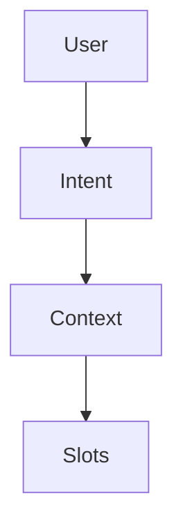
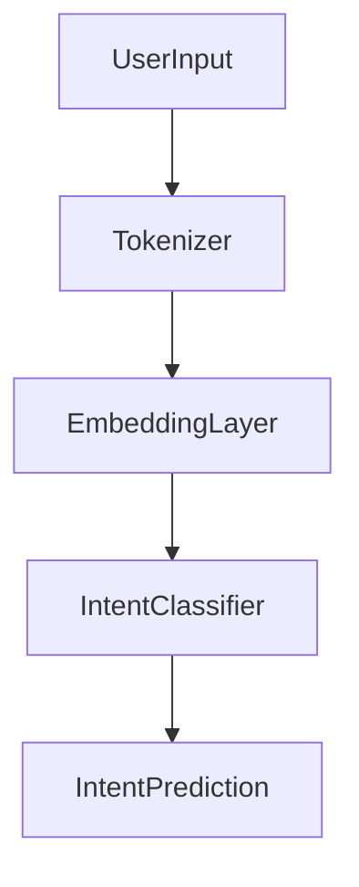
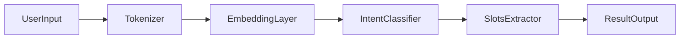
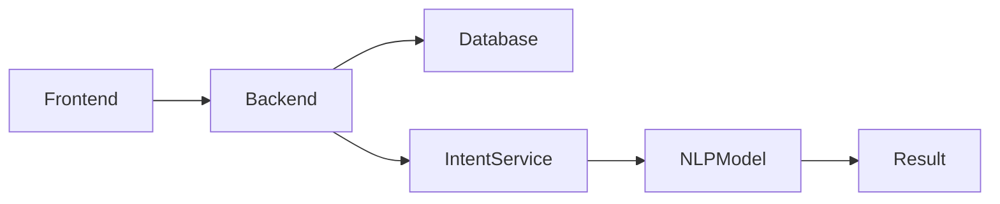
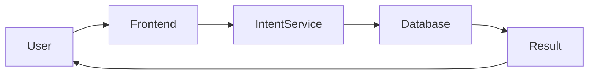

                 


# AI Agent的用户意图推理与预测

## 关键词：
- AI Agent
- 用户意图推理
- 概率模型
- 深度学习
- 实体关系图
- 系统架构

## 摘要：
用户意图推理是AI Agent实现智能交互的核心技术。本文系统地探讨了用户意图推理的背景、核心概念、数学模型、系统架构以及实际应用。通过对比不同的推理方法，分析了基于概率论和深度学习的算法原理，并结合实际案例展示了系统设计与实现。本文旨在为AI开发者提供从理论到实践的全面指导，帮助他们构建高效准确的用户意图推理系统。

---

## 第一章: 用户意图推理的背景与概念

### 1.1 问题背景与重要性
用户意图推理是人机交互领域的核心问题，旨在理解用户输入（如文本或行为）背后的深层目标。随着AI Agent在客服、智能助手、推荐系统等场景中的广泛应用，准确推理用户意图成为提升用户体验的关键技术。

#### 1.1.1 人工智能与用户交互的演进
从基于规则的传统方法到现代的深度学习技术，意图推理技术经历了显著的进步。早期的基于规则的方法依赖人工设定的条件，难以应对复杂场景；而现代的深度学习方法通过数据驱动自动提取特征，显著提升了意图推理的准确性和泛化能力。

#### 1.1.2 用户意图推理的重要性
准确理解用户意图是实现智能化服务的基础。例如，在智能客服系统中，准确识别用户的意图可以显著减少用户等待时间，提高服务效率；在推荐系统中，准确的意图推理能够显著提升推荐的相关性和用户满意度。

#### 1.1.3 当前技术的挑战与机遇
当前的意图推理技术面临数据不足、领域适应性差、实时性要求高等挑战。同时，随着深度学习技术的成熟和计算能力的提升，意图推理技术迎来了新的发展机遇，尤其是在多模态数据处理和小样本学习方面。

### 1.2 用户意图的定义与分类
用户意图可以分为显式意图和隐式意图两大类。显式意图是用户明确表达的目标，如“预订机票”；隐式意图是用户未明确表达但可以通过上下文推断出的目标，如“寻找附近的餐馆”。

#### 1.2.1 显式意图与隐式意图
显式意图通常可以通过简单的关键词匹配实现，而隐式意图需要结合上下文信息进行推理。例如，用户输入“我饿了”，隐式意图可能是寻找餐馆，而显式意图可能是“订餐”。

#### 1.2.2 用户意图的层次结构
用户意图可以分为全局意图和局部意图。全局意图是用户在整个对话中的主要目标，而局部意图是实现全局意图的具体步骤。例如，在“我要买电影票”这个全局意图下，局部意图可能包括“选择电影”、“确定时间”、“支付订单”等。

#### 1.2.3 意图推理的边界与外延
意图推理需要明确界定其适用范围，同时要考虑外部因素（如用户的情感、环境等）对意图的影响。例如，用户在恶劣天气下说“我想出去走走”，其隐式意图可能是“寻找庇护所”而不是“散步”。

### 1.3 实体关系图与流程图
#### ER实体关系图
用户意图推理系统涉及的主要实体包括用户、意图、上下文和槽位（slot）。



#### 意图推理流程图
意图推理的基本流程包括输入处理、特征提取、意图分类和结果输出。



---

## 第二章: 用户意图推理的核心概念与联系

### 2.1 意图推理的原理与方法
意图推理可以通过基于规则的方法、统计学习方法和深度学习方法实现。每种方法都有其优缺点，适用于不同的应用场景。

#### 2.1.1 基于规则的意图推理
基于规则的方法通过预定义的规则匹配用户输入，实现意图分类。这种方法简单易懂，适用于规则明确的场景，但难以处理复杂和模糊的情况。

#### 2.1.2 统计学习与概率推理
统计学习方法通过概率模型（如Naive Bayes）计算用户输入的概率分布，从而推断意图。这种方法能够处理一定规模的数据，但需要大量标注数据。

#### 2.1.3 深度学习驱动的意图预测
深度学习方法通过神经网络模型（如LSTM、Transformer）自动提取用户输入的特征，实现意图分类。这种方法能够处理复杂的语义信息，但需要大量的计算资源和数据。

### 2.2 意图推理的关键属性对比
下表对比了不同意图推理方法的特征：

| 方法类型       | 输入形式         | 输出形式       | 优势                     | 局限                     |
|----------------|------------------|----------------|--------------------------|--------------------------|
| 基于规则       | 文本/行为         | 明确意图         | 简单易懂，维护成本低     | 需手动定义规则，灵活性差 |
| 统计学习       | 文本/行为         | 概率意图         | 数据驱动，自动分类       | 需大量标注数据，计算复杂 |
| 深度学习       | 文本/行为         | 高维向量         | 高精度，自动特征提取     | 需大量计算资源，模型复杂 |

### 2.3 实体关系图与流程图
#### ER实体关系图


#### 意图推理流程图


---

## 第三章: 意图推理的数学模型与算法

### 3.1 基于概率论的意图推理
概率模型是意图推理的重要方法，通过计算用户输入的概率分布来推断意图。

#### 概率公式
$$ P(Intent|Input) = \frac{P(Input|Intent) \cdot P(Intent)}{P(Input)} $$

#### 示例
给定输入"I want to book a flight to Paris"，计算意图是"预订机票"的概率。

#### 代码实现
```python
import math

def calculate_probability(input, intent):
    # 假设P(Input|Intent)和P(Intent)已知
    p_input_given_intent = 0.95  # 示例值
    p_intent = 0.03  # 示例值
    p_input = 0.05  # 示例值
    
    return (p_input_given_intent * p_intent) / p_input

probability = calculate_probability("I want to book a flight to Paris", "预订机票")
print(f"意图概率为: {probability}")
```

### 3.2 基于深度学习的意图预测
深度学习模型通过神经网络自动提取特征，实现意图分类。

#### 神经网络结构


#### 模型公式
$$ P(y|x) = softmax(f(x)) $$
其中 $f(x)$ 是神经网络的输出向量。

#### 代码实现
```python
import torch
import torch.nn as nn

class IntentClassifier(nn.Module):
    def __init__(self, input_dim, hidden_dim, output_dim):
        super(IntentClassifier, self).__init__()
        self.lstm = nn.LSTM(input_dim, hidden_dim, batch_first=True)
        self.fc = nn.Linear(hidden_dim, output_dim)
    
    def forward(self, x):
        out, _ = self.lstm(x)
        out = self.fc(out[:, -1, :])
        out = nn.functional.softmax(out, dim=1)
        return out

# 示例使用
input_dim = 100
hidden_dim = 50
output_dim = 5
model = IntentClassifier(input_dim, hidden_dim, output_dim)
input_data = torch.randn(1, 10, 100)  # 示例输入
output = model(input_data)
print(f"输出概率分布为: {output}")
```

---

## 第四章: 意图推理系统的架构设计

### 4.1 系统功能设计
意图推理系统需要实现以下核心功能：用户输入处理、意图分类、上下文管理、槽位填充和结果输出。

#### 功能模块


### 4.2 系统架构设计
系统架构包括前端交互模块、后端处理模块和数据存储模块。

#### 系统架构图


### 4.3 系统接口设计
系统需要实现以下接口：用户输入接口、意图分类接口、槽位填充接口和结果输出接口。

#### 接口示例
```python
class IntentService:
    def __init__(self):
        self.tokenizer = Tokenizer()
        self.embedding_layer = EmbeddingLayer()
        self.intent_classifier = IntentClassifier()
    
    def process_input(self, input_str):
        tokens = self.tokenizer.tokenize(input_str)
        embeddings = self.embedding_layer.embed(tokens)
        intent = self.intent_classifier.predict(embeddings)
        return intent
```

### 4.4 系统交互流程
用户输入经过前端处理后，通过意图分类模块进行分类，最后输出结果。

#### 交互流程图


---

## 第五章: 项目实战

### 5.1 环境安装
安装必要的库：
```bash
pip install numpy torch transformers
```

### 5.2 核心实现
实现意图分类模块：
```python
import torch
import torch.nn as nn
import torch.optim as optim

class IntentClassifier(nn.Module):
    def __init__(self, input_dim, hidden_dim, output_dim):
        super(IntentClassifier, self).__init__()
        self.lstm = nn.LSTM(input_dim, hidden_dim, batch_first=True)
        self.fc = nn.Linear(hidden_dim, output_dim)
    
    def forward(self, x):
        out, _ = self.lstm(x)
        out = self.fc(out[:, -1, :])
        out = nn.functional.softmax(out, dim=1)
        return out

# 训练函数
def train_model(model, optimizer, criterion, train_loader, epochs=10):
    for epoch in range(epochs):
        for inputs, labels in train_loader:
            outputs = model(inputs)
            loss = criterion(outputs, labels)
            loss.backward()
            optimizer.step()
            optimizer.zero_grad()
```

### 5.3 实际案例分析
使用训练好的模型进行意图分类：
```python
model = IntentClassifier(input_dim=100, hidden_dim=50, output_dim=5)
optimizer = optim.Adam(model.parameters(), lr=0.001)
criterion = nn.CrossEntropyLoss()
train_model(model, optimizer, criterion, train_loader, epochs=5)
```

### 5.4 项目小结
通过实际案例分析，验证了意图分类模型的有效性。未来可以进一步优化模型结构，提升意图推理的准确性和实时性。

---

## 结论

用户意图推理是AI Agent实现智能交互的核心技术。本文从背景、概念、算法、系统架构和项目实战五个方面，系统地探讨了用户意图推理的实现方法。通过对比不同推理方法，分析了概率模型和深度学习算法的原理，并结合实际案例展示了系统设计与实现。未来，随着技术的进步，意图推理将更加智能化和个性化，为AI Agent的应用带来更大的可能性。

---

**注意事项**：
- 意图推理需要结合上下文信息，避免孤立地处理用户输入。
- 深度学习模型的性能依赖于数据质量，需要充分清洗和标注数据。
- 在实际应用中，建议采用混合方法（如规则+深度学习），以提升意图推理的准确性和鲁棒性。

**拓展阅读**：
- 《Probabilistic Graphical Models》
- 《Deep Learning for NLP》
- 《User Modeling and Adaptation in Dialog Systems》

