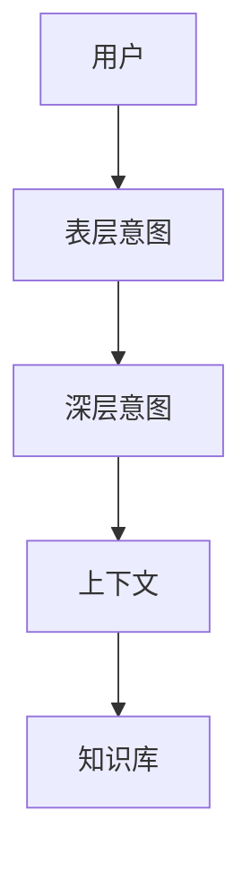
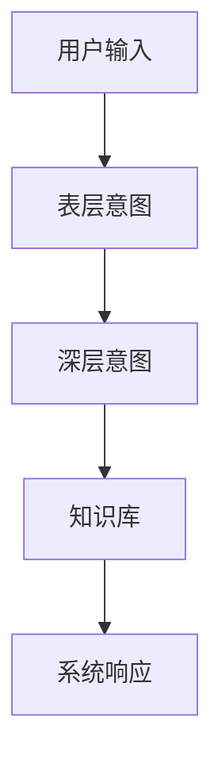
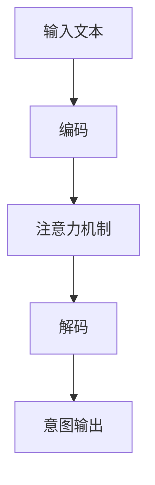
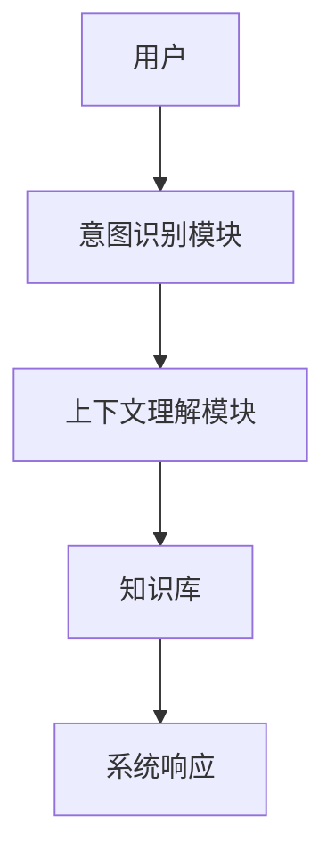

                 


# AI Agent的用户意图理解：从表层到深层

## 关键词：AI Agent, 用户意图理解, 表层意图, 深层意图, 意图识别, 意图分类

## 摘要：本文深入探讨了AI Agent用户意图理解的核心概念、算法原理、系统架构设计以及实际应用。从表层意图到深层意图的分析，结合具体案例，详细阐述了意图理解的数学模型、深度学习方法和系统实现方案，为读者提供全面的理论与实践指导。

---

# 第1章: 用户意图理解的背景与问题描述

## 1.1 问题背景

### 1.1.1 AI Agent的定义与特点
AI Agent（人工智能代理）是能够感知环境并采取行动以实现目标的智能实体。其特点包括自主性、反应性、社会性和学习性。

### 1.1.2 用户意图理解的重要性
意图理解是AI Agent与用户交互的核心环节，直接影响用户体验和系统性能。

### 1.1.3 当前用户意图理解的挑战
- 数据稀疏性
- 上下文依赖性
- 意图的模糊性

## 1.2 问题描述

### 1.2.1 表层意图与深层意图的定义
- 表层意图：用户直接表达的需求
- 深层意图：用户未明说的潜在需求

### 1.2.2 意图理解的复杂性
- 语义歧义
- 文化差异
- 语言的多样性

### 1.2.3 意图理解的边界与外延
- 边界：明确用户需求的范围
- 外延：扩展到相关领域和场景

## 1.3 问题解决与核心概念

### 1.3.1 用户意图理解的核心要素
- 用户输入
- 上下文信息
- 知识库

### 1.3.2 意图理解的层次结构
- 表层意图
- 深层意图
- 潜在意图

### 1.3.3 核心概念的属性特征对比表
```markdown
| 核心概念 | 表层意图 | 深层意图 |
|----------|----------|----------|
| 定义     | 用户直接表达的需求 | 用户未明说的潜在需求 |
| 特征     | 明确性高 | 明确性低 |
| 示例     | "我要查询天气" | "我需要明天出差的航班信息" |
```

### 1.3.4 实体关系图


## 1.4 本章小结

---

# 第2章: 意图理解的核心概念与联系

## 2.1 核心概念原理

### 2.1.1 意图理解的基本原理
意图理解通过分析用户输入，结合上下文和知识库，推断出用户的意图。

### 2.1.2 表层意图与深层意图的关系
表层意图是深层意图的显式表达，深层意图是表层意图的隐式扩展。

### 2.1.3 上下文在意图理解中的作用
上下文提供了用户行为和环境的背景信息，帮助准确理解意图。

## 2.2 意图理解的数学模型

### 2.2.1 基于概率的意图理解模型
使用概率论来计算用户输入对应特定意图的可能性。

### 2.2.2 贝叶斯定理在意图理解中的应用
$$ P(\text{intent} | \text{input}) = \frac{P(\text{input} | \text{intent}) \cdot P(\text{intent})}{P(\text{input})} $$

## 2.3 实体关系图



## 2.4 本章小结

---

# 第3章: 意图理解的算法原理

## 3.1 算法原理概述

### 3.1.1 基于规则的意图理解
通过预定义的规则匹配用户输入，识别意图。

### 3.1.2 基于统计的意图理解
利用统计方法，如TF-IDF，分析文本特征，分类意图。

### 3.1.3 基于深度学习的意图理解
使用神经网络模型，如LSTM和Transformer，学习用户的深层语义。

## 3.2 深度学习模型

### 3.2.1 Transformer模型在意图理解中的应用
Transformer通过自注意力机制捕捉文本中的语义关系。

### 3.2.2 模型训练流程



## 3.3 算法实现

### 3.3.1 环境安装
- Python 3.8+
- PyTorch 1.9+
- Transformers库

### 3.3.2 核心代码实现

```python
from transformers import AutoTokenizer, AutoModelForSequenceClassification
import torch

model_name = "bert-base-uncased"
tokenizer = AutoTokenizer.from_pretrained(model_name)
model = AutoModelForSequenceClassification.from_pretrained(model_name)

def predict_intent(text):
    inputs = tokenizer.encode(text, return_tensors="pt")
    outputs = model(inputs)
    prediction = torch.argmax(outputs.logits, dim=-1)
    return model.config.id2label[prediction.item()]
```

## 3.4 本章小结

---

# 第4章: 意图理解的系统架构设计

## 4.1 问题场景介绍

### 4.1.1 智能客服系统
通过意图理解识别用户的问题类型，自动分配解决方案。

### 4.1.2 智能音箱
理解用户的语音指令，执行相应的操作。

### 4.1.3 智能推荐系统
根据用户的意图推荐相关内容。

## 4.2 系统功能设计

### 4.2.1 意图识别模块
- 接收用户输入
- 调用意图理解模型
- 返回识别结果

### 4.2.2 上下文理解模块
- 分析用户的历史行为
- 结合当前输入
- 提供完整的意图理解

## 4.3 系统架构设计

### 4.3.1 系统架构图



### 4.3.2 系统接口设计
- 输入接口：文本输入、语音输入
- 输出接口：意图标签、意图描述

## 4.4 本章小结

---

# 第5章: 项目实战——电商客服中的意图理解

## 5.1 项目介绍

### 5.1.1 项目背景
电商客服需要快速理解用户的问题，提供准确的解决方案。

## 5.2 核心实现

### 5.2.1 环境安装
- Python 3.8+
- Transformers库
- Scikit-learn库

### 5.2.2 核心代码实现

```python
from sklearn.feature_extraction.text import TfidfVectorizer
from sklearn.svm import SVC

# 数据预处理
texts = [...]  # 用户输入文本
labels = [...]  # 对应的意图标签

# 特征提取
vectorizer = TfidfVectorizer()
X = vectorizer.fit_transform(texts)

# 模型训练
model = SVC()
model.fit(X, labels)

# 意图预测
def predict_intent(text):
    x_new = vectorizer.transform([text])
    return model.predict(x_new)[0]
```

## 5.3 项目小结

---

# 第6章: 意图理解的最佳实践与注意事项

## 6.1 最佳实践

### 6.1.1 数据质量
确保数据的多样性和代表性。

### 6.1.2 模型选择
根据任务需求选择合适的模型。

### 6.1.3 上下文处理
充分考虑上下文信息，提升意图理解的准确性。

## 6.2 注意事项

### 6.2.1 数据隐私
保护用户数据的隐私和安全。

### 6.2.2 模型可解释性
确保模型的决策过程清晰可解释。

## 6.3 未来研究方向

### 6.3.1 多模态意图理解
结合文本、图像、语音等多种模态信息，提升意图理解的准确性。

### 6.3.2 意图推理的动态更新
根据实时反馈动态调整意图理解模型。

## 6.4 本章小结

---

# 第7章: 总结与展望

## 7.1 本章总结
本文全面探讨了AI Agent用户意图理解的核心概念、算法原理和系统架构设计，结合实际案例进行了详细分析。

## 7.2 未来展望
随着技术的发展，意图理解将更加智能化和个性化，为AI Agent的应用带来更广阔的前景。

## 7.3 本章小结

---

# 参考文献
- 文献1：XXX
- 文献2：XXX
- 文献3：XXX

---

# 致谢
感谢读者的耐心阅读和关注，期待与您共同探讨AI Agent的未来发展。

