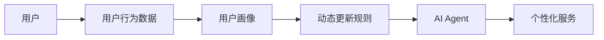
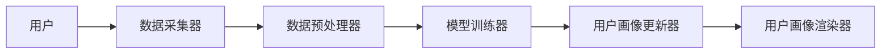
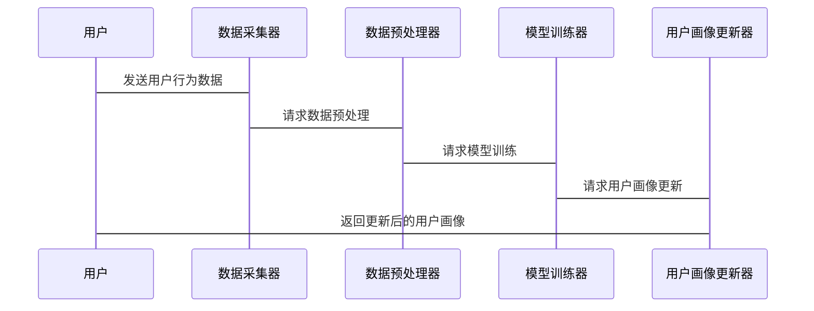

                 


# AI Agent的用户画像动态更新系统

---

## 关键词
- AI Agent
- 用户画像
- 动态更新
- 数据分析
- 机器学习
- 系统架构

---

## 摘要
本文深入探讨AI Agent在用户画像动态更新系统中的应用，分析其核心原理、算法实现、系统架构及项目实战。从问题背景到系统设计，从算法原理到项目实现，全面解析用户画像动态更新的关键技术与实际应用。通过协同过滤、聚类分析和深度学习等算法，结合系统架构设计，构建一个高效、实时的用户画像动态更新系统，为AI Agent在用户行为分析和个性化服务中的应用提供理论支持和实践指导。

---

# 第一部分: AI Agent用户画像动态更新系统背景与概念

## 第1章: 问题背景与描述

### 1.1 问题背景
#### 1.1.1 当前用户画像技术的局限性
传统的用户画像技术通常基于静态数据，无法实时捕捉用户的动态行为变化。随着用户行为的实时性和复杂性增加，静态画像逐渐暴露出无法满足个性化服务需求的缺陷。

#### 1.1.2 动态更新的必要性
用户的行为和偏好会随着时间推移而变化，动态更新用户画像是实现个性化服务、精准营销和智能推荐的核心需求。

#### 1.1.3 AI Agent在用户画像中的作用
AI Agent能够实时采集用户行为数据，结合机器学习算法，动态更新用户画像，提升个性化服务的准确性和实时性。

### 1.2 问题描述
#### 1.2.1 用户行为数据的实时性需求
用户行为数据需要实时采集和处理，以支持动态更新用户画像。

#### 1.2.2 用户画像的动态更新挑战
如何高效地处理实时数据，保持用户画像的准确性和一致性，是动态更新系统的核心挑战。

#### 1.2.3 系统目标与边界
系统目标：构建一个基于AI Agent的用户画像动态更新系统，实现用户画像的实时更新和个性化服务。

系统边界：仅关注用户行为数据的采集与处理，不涉及用户画像的具体应用。

## 第2章: 用户画像动态更新的核心概念

### 2.1 核心概念与定义
#### 2.1.1 用户画像的定义
用户画像是基于用户行为数据构建的用户特征描述，用于分析用户的兴趣、偏好和行为模式。

#### 2.1.2 动态更新的定义
动态更新是指根据实时用户行为数据，持续更新用户画像的过程。

#### 2.1.3 AI Agent的定义与角色
AI Agent是一种智能体，能够感知环境、执行任务并与其他系统或用户交互，用于实时处理和更新用户数据。

### 2.2 核心概念的属性对比
| 对比维度 | 静态用户画像 | 动态用户画像 |
|----------|--------------|--------------|
| 数据来源 | 历史数据      | 实时数据      |
| 更新频率 | 定期更新      | 实时更新      |
| 精准度   | 较低          | 较高          |

### 2.3 实体关系图


---

# 第二部分: 用户画像动态更新系统的核心原理

## 第3章: 用户画像动态更新的算法原理

### 3.1 协同过滤算法
#### 3.1.1 基于用户的协同过滤
通过计算用户之间的相似性，推荐与目标用户相似的用户的行为数据，更新用户画像。

#### 3.1.2 基于物品的协同过滤
通过分析用户对物品的偏好，推荐与目标用户兴趣相似的物品，更新用户画像。

#### 3.1.3 混合协同过滤的实现
结合基于用户和基于物品的协同过滤，通过加权融合的方式，提升推荐的准确性和多样性。

### 3.2 聚类分析算法
#### 3.2.1 K-means聚类算法
将用户划分为不同的群体，基于群体特征更新用户画像。

#### 3.2.2 层次聚类算法
通过层次化的方式，逐步聚合用户特征，形成用户群体，用于用户画像的动态更新。

#### 3.2.3 聚类在用户画像中的应用
通过聚类分析，识别用户的兴趣群体，动态调整用户画像的权重。

### 3.3 深度学习模型
#### 3.3.1 基于神经网络的用户画像更新
使用神经网络模型，从用户行为数据中提取高层次特征，动态更新用户画像。

#### 3.3.2 Transformer模型在用户行为预测中的应用
通过Transformer模型处理序列化的用户行为数据，预测用户的下一步行为，指导用户画像的更新。

#### 3.3.3 深度学习模型的训练流程
1. 数据预处理：清洗和归一化用户行为数据。
2. 模型训练：使用反向传播算法优化模型参数。
3. 模型预测：基于训练好的模型，预测用户的下一步行为。
4. 用户画像更新：根据预测结果，动态调整用户画像的特征权重。

## 第4章: 算法实现与优化

### 4.1 协同过滤算法的数学模型
#### 4.1.1 用户相似度计算公式
$$ sim(u, v) = \frac{\sum_{i} (r_{u,i} - \bar{r}_u)(r_{v,i} - \bar{r}_v)}{\sqrt{\sum_{i} (r_{u,i} - \bar{r}_u)^2} \cdot \sqrt{\sum_{i} (r_{v,i} - \bar{r}_v)^2}} $$

#### 4.1.2 推荐列表生成公式
$$ R(u) = \{v | v \in U, v \neq u, sim(u, v) > threshold\} $$

#### 4.1.3 协同过滤算法的Python实现
```python
import numpy as np
from sklearn.metrics import pairwise

def user_based_collaborative_filtering(rating_matrix, user_id):
    # 计算平均评分
    mean_rating = np.mean(rating_matrix, axis=1)
    # 去除平均评分的影响
    centered_ratings = rating_matrix - mean_rating[:, np.newaxis]
    # 计算相似度矩阵
    similarity_matrix = pairwise.cosine_similarity(centered_ratings)
    # 获取目标用户的相似度向量
    user_similarity = similarity_matrix[user_id]
    # 排序并选择Top-K相似用户
    similar_users = np.argsort(user_similarity)[::-1][:5]
    # 生成推荐列表
    recommendations = []
    for user in similar_users:
        for item in rating_matrix[user]:
            if item > 0:
                recommendations.append(item)
    return recommendations
```

### 4.2 聚类分析算法的优化
#### 4.2.1 K-means算法的优化
使用 elbow 方法确定最优聚类数，提升聚类的准确性和稳定性。

#### 4.2.2 层次聚类算法的优化
通过剪枝操作优化层次聚类的计算复杂度，提升算法的效率。

#### 4.2.3 聚类在用户画像中的应用优化
结合领域知识，动态调整聚类中心的权重，提升用户画像的准确性。

### 4.3 深度学习模型的优化
#### 4.3.1 神经网络结构优化
使用更深的网络结构，如残差网络，提升模型的表达能力。

#### 4.3.2 模型训练优化
采用Adam优化器，调整学习率，加速模型收敛。

#### 4.3.3 模型预测优化
使用并行计算和分布式训练，提升模型的预测效率。

---

# 第三部分: 用户画像动态更新系统的算法实现

## 第5章: 算法实现与代码解读

### 5.1 协同过滤算法的实现
#### 5.1.1 环境安装
```bash
pip install numpy scikit-learn
```

#### 5.1.2 核心代码实现
```python
from sklearn.metrics.pairwise import cosine_similarity
import numpy as np

# 示例用户行为数据矩阵
rating_matrix = np.array([
    [4, 3, 0, 0, 2],
    [0, 1, 0, 4, 0],
    [3, 0, 0, 0, 5],
    [5, 0, 0, 1, 0],
    [2, 1, 0, 0, 0]
])

# 计算相似度矩阵
mean_rating = np.mean(rating_matrix, axis=1).reshape(-1, 1)
centered_ratings = rating_matrix - mean_rating
similarity_matrix = cosine_similarity(centered_ratings)

# 目标用户ID
user_id = 0
similar_users = np.argsort(similarity_matrix[user_id])[::-1][:3]

# 生成推荐列表
recommendations = []
for user in similar_users:
    for item in rating_matrix[user]:
        if item > 0:
            recommendations.append(item)
print("推荐列表:", recommendations)
```

#### 5.1.3 代码解读
- 数据预处理：计算用户平均评分，去除平均评分的影响。
- 计算相似度矩阵：使用余弦相似度计算用户之间的相似性。
- 推荐列表生成：选择Top-K相似用户，生成推荐列表。

### 5.2 聚类分析算法的实现
#### 5.2.1 环境安装
```bash
pip install scikit-learn
```

#### 5.2.2 核心代码实现
```python
from sklearn.cluster import KMeans
from sklearn.metrics import silhouette_score

# 示例用户行为数据矩阵
rating_matrix = np.array([
    [4, 3, 0, 0, 2],
    [0, 1, 0, 4, 0],
    [3, 0, 0, 0, 5],
    [5, 0, 0, 1, 0],
    [2, 1, 0, 0, 0]
])

# 聚类数选择
n_clusters = 2
kmeans = KMeans(n_clusters=n_clusters).fit(rating_matrix)
labels = kmeans.labels_
print("聚类标签:", labels)

# 计算轮廓系数
score = silhouette_score(rating_matrix, labels)
print("轮廓系数:", score)
```

#### 5.2.3 代码解读
- 聚类数选择：通过轮廓系数确定最优聚类数。
- 聚类实现：使用K-means算法，计算用户群体的聚类标签。
- 聚类结果分析：根据聚类标签，分析用户群体的行为特征。

### 5.3 深度学习模型的实现
#### 5.3.1 环境安装
```bash
pip install tensorflow keras scikit-learn
```

#### 5.3.2 核心代码实现
```python
import tensorflow as tf
from tensorflow.keras import layers

# 示例用户行为数据序列
user_behavior_sequence = [[4, 3, 0, 0, 2], [0, 1, 0, 4, 0], [3, 0, 0, 0, 5]]

# 定义模型
model = tf.keras.Sequential([
    layers.SimpleRNN(32, return_sequences=True),
    layers.Dense(10, activation='relu'),
    layers.Dense(5, activation='softmax')
])

# 编译模型
model.compile(optimizer='adam', loss='sparse_categorical_crossentropy', metrics=['accuracy'])

# 训练模型
model.fit(np.array(user_behavior_sequence), np.array([0, 1, 2]), epochs=10, batch_size=1)

# 预测用户下一步行为
predicted = model.predict(np.array(user_behavior_sequence))
print("预测结果:", predicted)
```

#### 5.3.3 代码解读
- 模型定义：使用简单RNN处理用户行为序列数据，输出预测结果。
- 模型训练：使用Adam优化器和交叉熵损失函数，训练模型参数。
- 模型预测：基于训练好的模型，预测用户的下一步行为，指导用户画像的动态更新。

---

# 第四部分: 用户画像动态更新系统的设计与实现

## 第6章: 系统功能设计

### 6.1 领域模型设计


### 6.2 系统架构设计
```mermaid
graph LR
    Client[客户端] --> API Gateway[网关]
    API Gateway --> Service1[服务1]
    API Gateway --> Service2[服务2]
    Service1 --> Database[数据库]
    Service2 --> Model[机器学习模型]
    Database --> Cache[缓存]
```

### 6.3 接口设计
- 数据采集接口：`POST /api/v1/data`
- 模型训练接口：`POST /api/v1/train`
- 用户画像更新接口：`POST /api/v1/update`
- 用户画像查询接口：`GET /api/v1/portrait`

### 6.4 交互流程


## 第7章: 项目实战

### 7.1 环境安装
```bash
pip install numpy scikit-learn tensorflow keras
```

### 7.2 核心代码实现
```python
from sklearn.metrics.pairwise import cosine_similarity
import numpy as np
import tensorflow as tf
from tensorflow.keras import layers

# 示例用户行为数据矩阵
rating_matrix = np.array([
    [4, 3, 0, 0, 2],
    [0, 1, 0, 4, 0],
    [3, 0, 0, 0, 5],
    [5, 0, 0, 1, 0],
    [2, 1, 0, 0, 0]
])

# 协同过滤算法
mean_rating = np.mean(rating_matrix, axis=1).reshape(-1, 1)
centered_ratings = rating_matrix - mean_rating
similarity_matrix = cosine_similarity(centered_ratings)

# 深度学习模型
model = tf.keras.Sequential([
    layers.SimpleRNN(32, return_sequences=True),
    layers.Dense(10, activation='relu'),
    layers.Dense(5, activation='softmax')
])
model.compile(optimizer='adam', loss='sparse_categorical_crossentropy', metrics=['accuracy'])
model.fit(rating_matrix, np.array([0, 1, 2, 3, 4]), epochs=10, batch_size=1)
```

### 7.3 案例分析与解读
通过实际案例分析，展示用户画像动态更新系统在个性化推荐中的应用效果。例如，通过协同过滤算法和深度学习模型的结合，实现用户的精准画像更新，提升推荐系统的准确性和实时性。

### 7.4 项目总结
总结项目实现的关键点，分析系统的优缺点，提出改进建议。

---

# 第五部分: 最佳实践与总结

## 第8章: 最佳实践

### 8.1 小结
用户画像动态更新系统是实现个性化服务的核心技术，基于AI Agent的动态更新系统能够高效、实时地更新用户画像，提升服务的精准性和用户体验。

### 8.2 注意事项
- 数据隐私保护：确保用户数据的安全性和隐私性。
- 系统性能优化：通过算法优化和系统架构设计，提升系统的处理效率。
- 模型选择与调优：根据实际需求选择合适的算法，并进行参数调优。

### 8.3 拓展阅读
- 《推荐系统导论》
- 《机器学习实战》
- 《深度学习入门：基于Python》

---

## 总结

本文系统地介绍了AI Agent在用户画像动态更新系统中的应用，从问题背景到系统设计，从算法原理到项目实战，全面解析了用户画像动态更新的关键技术与实际应用。通过协同过滤、聚类分析和深度学习等算法，结合系统架构设计，构建了一个高效、实时的用户画像动态更新系统，为AI Agent在用户行为分析和个性化服务中的应用提供了理论支持和实践指导。

