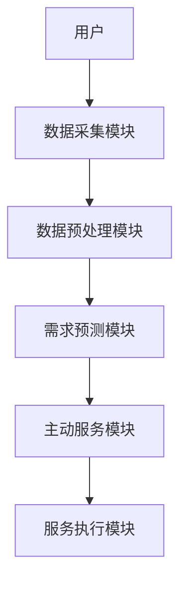

                 


# AI Agent的用户需求预测与主动服务

## 关键词：
AI Agent, 用户需求预测, 主动服务, 机器学习, 系统架构设计, 项目实战

## 摘要：
AI Agent作为一种智能实体，能够通过分析用户的交互行为和历史数据，主动预测用户的潜在需求，并提供相应的服务。本文从AI Agent的基本概念出发，深入探讨用户需求预测的核心算法和主动服务的实现机制，结合实际案例分析，系统地讲解如何构建一个高效的AI Agent系统。文章内容涵盖背景介绍、核心概念、算法原理、系统架构设计、项目实战以及最佳实践等方面，帮助读者全面掌握AI Agent在用户需求预测与主动服务领域的应用。

---

## 第1章: AI Agent概述

### 1.1 AI Agent的定义与特点
#### 1.1.1 AI Agent的定义
AI Agent（人工智能代理）是一种智能实体，能够感知环境、理解用户需求，并通过自主决策和执行动作来满足用户需求或优化系统运行。AI Agent可以是软件程序、智能设备或服务，其核心目标是通过智能化手段提高用户体验或系统效率。

#### 1.1.2 AI Agent的核心特点
- **自主性**：AI Agent能够自主决策，无需人工干预。
- **反应性**：能够实时感知环境变化并做出响应。
- **主动性**：能够主动预测用户需求并提供服务。
- **学习能力**：通过数据和反馈不断优化自身行为。
- **社交能力**：能够与其他系统或用户进行交互和协作。

#### 1.1.3 AI Agent与传统软件的区别
| 特性         | 传统软件                 | AI Agent                     |
|--------------|--------------------------|----------------------------|
| 智能性       | 基于规则和程序           | 基于机器学习和深度学习       |
| 用户交互     | 被动响应                 | 主动预测和交互               |
| 自适应能力   | 固定功能                 | 能够自适应环境变化           |

### 1.2 AI Agent的演进历程
#### 1.2.1 从传统软件到AI Agent的演进
- **阶段一**：基于规则的简单响应（如早期的聊天机器人）。
- **阶段二**：结合机器学习的智能响应（如Siri、Alexa等）。
- **阶段三**：基于知识图谱和强化学习的主动服务（如现代智能助手）。

#### 1.2.2 当前AI Agent的主要发展趋势
- 多模态交互：支持文本、语音、图像等多种交互方式。
- 持续学习：通过在线学习不断优化模型。
- 跨领域应用：从单一场景扩展到多领域服务。

#### 1.2.3 未来AI Agent的潜在方向
- **人机协作**：AI Agent成为人类的合作伙伴。
- **实时决策**：基于实时数据做出最优决策。
- **边缘计算**：在边缘设备上实现本地化的AI Agent服务。

### 1.3 AI Agent的应用场景
#### 1.3.1 智能助手
- 例如：智能音箱、智能手机助手。
- 功能：日程管理、信息查询、任务执行。

#### 1.3.2 智慧城市
- 例如：智能交通系统、智能能源管理。
- 功能：优化交通流量、降低能源消耗。

#### 1.3.3 智能客服
- 例如：在线客服机器人。
- 功能：自动响应客户咨询、处理订单问题。

#### 1.3.4 其他典型应用场景
- 智能医疗、智能家居、智能金融等。

### 1.4 AI Agent的核心挑战
#### 1.4.1 数据获取与处理的挑战
- 数据隐私问题。
- 数据质量和完整性问题。

#### 1.4.2 模型训练与优化的难点
- 高维数据的处理。
- 模型的可解释性问题。

#### 1.4.3 人机交互的复杂性
- 用户需求的多样性。
- 交互过程中的不确定性。

### 1.5 本章小结
本章从AI Agent的基本概念出发，介绍了其定义、特点和与传统软件的区别，分析了AI Agent的演进历程及其应用场景，并总结了当前面临的核心挑战。

---

## 第2章: 用户需求预测的核心概念

### 2.1 需求预测的定义与目标
#### 2.1.1 需求预测的定义
需求预测是指通过分析用户的历史行为和当前输入，预测用户在未来可能产生的需求或行为的过程。

#### 2.1.2 需求预测的目标
- 提供个性化推荐。
- 提高用户体验。
- 优化系统资源分配。

#### 2.1.3 需求预测的核心要素
- 用户行为数据。
- 系统环境数据。
- 时间序列特征。

### 2.2 用户行为分析与需求预测的关系
#### 2.2.1 用户行为分析的基本方法
- 统计分析：频数分析、关联规则学习。
- 机器学习：聚类分析、分类分析。

#### 2.2.2 需求预测如何基于用户行为分析
- 通过用户历史行为预测未来的潜在需求。
- 基于用户行为特征构建需求预测模型。

#### 2.2.3 需求预测的边界与外延
- 边界：需求预测仅关注用户的显式需求。
- 外延：需求预测可以结合上下文信息进行优化。

### 2.3 需求预测的数学模型与方法
#### 2.3.1 基于统计的需求预测方法
- 线性回归模型：用于预测连续型变量。
- 时间序列分析：用于预测时序数据。

#### 2.3.2 基于机器学习的需求预测模型
- **支持向量机（SVM）**：用于分类和回归任务。
- **随机森林**：用于分类和回归任务。
- **神经网络**：用于复杂模式识别。

#### 2.3.3 深度学习在需求预测中的应用
- **卷积神经网络（CNN）**：用于图像和序列数据的处理。
- **循环神经网络（RNN）**：用于时间序列数据的处理。
- **Transformer模型**：用于长文本和时序数据的处理。

### 2.4 本章小结
本章详细介绍了用户需求预测的核心概念，包括其定义、目标、核心要素以及实现方法。通过统计、机器学习和深度学习的方法，可以有效地提高需求预测的准确性和效率。

---

## 第3章: 主动服务的核心机制

### 3.1 主动服务的定义与特点
#### 3.1.1 主动服务的定义
主动服务是指AI Agent在预测到用户的需求后，主动提供相应的服务，而不需要用户明确请求。

#### 3.1.2 主动服务的核心特点
- 主动性：无需用户触发。
- 预测性：基于需求预测提供服务。
- 个性化：根据用户特征提供定制化服务。

### 3.2 主动服务的主要实现方式
#### 3.2.1 基于规则的主动服务
- 通过预定义的规则实现简单的主动服务。
- 例如：当用户登录后自动推荐热门商品。

#### 3.2.2 基于机器学习的主动服务
- 使用分类和回归模型预测用户需求。
- 例如：推荐系统中的协同过滤算法。

#### 3.2.3 基于知识图谱的主动服务
- 通过构建知识图谱实现语义理解。
- 例如：智能问答系统。

### 3.3 主动服务的优化策略
#### 3.3.1 基于反馈的主动服务优化
- 通过用户反馈不断优化推荐算法。
- 例如：A/B测试优化推荐策略。

#### 3.3.2 基于上下文的主动服务优化
- 结合用户当前的上下文信息进行推荐。
- 例如：基于地理位置的个性化推荐。

#### 3.3.3 基于用户画像的主动服务优化
- 基于用户画像实现精准推荐。
- 例如：基于用户兴趣标签的推荐。

### 3.4 本章小结
本章详细介绍了主动服务的核心机制，包括其定义、特点以及实现方式。通过结合需求预测和用户画像，可以显著提高主动服务的准确性和用户满意度。

---

## 第4章: 用户需求预测与主动服务的结合

### 4.1 需求预测与主动服务的关系
- 需求预测是主动服务的前提。
- 主动服务是需求预测的应用。

### 4.2 需求预测与主动服务的协同优化
- 通过反馈机制优化需求预测模型。
- 通过主动服务的效果评估优化需求预测。

### 4.3 需求预测与主动服务的系统设计
- **需求预测模块**：负责预测用户需求。
- **主动服务模块**：根据需求预测结果提供服务。

### 4.4 本章小结
本章讨论了用户需求预测与主动服务的结合，强调了两者协同优化的重要性。

---

## 第5章: 系统架构设计与实现

### 5.1 问题场景介绍
- 系统目标：构建一个基于AI Agent的用户需求预测与主动服务系统。
- 使用场景：智能客服、智能推荐等。

### 5.2 系统功能设计
#### 5.2.1 需求预测功能
- 数据采集：采集用户行为数据。
- 数据预处理：清洗和归一化数据。
- 模型训练：训练需求预测模型。

#### 5.2.2 主动服务功能
- 服务推荐：基于需求预测结果推荐服务。
- 服务执行：执行推荐的服务。

### 5.3 系统架构设计
#### 5.3.1 系统架构图（Mermaid）


#### 5.3.2 系统接口设计
- 数据接口：数据采集模块与数据预处理模块之间的接口。
- 模型接口：需求预测模块与主动服务模块之间的接口。

### 5.4 本章小结
本章详细介绍了系统架构设计，包括功能设计和架构图，为后续的实现奠定了基础。

---

## 第6章: 项目实战与代码实现

### 6.1 项目环境安装
- 安装Python、TensorFlow、Keras等依赖库。

### 6.2 系统核心实现
#### 6.2.1 需求预测模型实现
```python
import tensorflow as tf
from tensorflow.keras import layers

model = tf.keras.Sequential()
model.add(layers.Dense(64, activation='relu', input_shape=(n_features,)))
model.add(layers.Dense(1, activation='sigmoid'))
model.compile(optimizer='adam', loss='binary_crossentropy', metrics=['accuracy'])
```

#### 6.2.2 主动服务模块实现
```python
def predict_and_recommend(user_data):
    prediction = model.predict(user_data)
    if prediction > 0.5:
        return recommended_service
    else:
        return no_recommendation
```

### 6.3 代码应用解读与分析
- 数据预处理：对用户数据进行归一化处理。
- 模型训练：使用训练数据训练需求预测模型。
- 模型评估：使用测试数据评估模型性能。

### 6.4 实际案例分析
- 案例一：智能推荐系统。
- 案例二：智能客服系统。

### 6.5 项目小结
本章通过实际项目实战，详细讲解了AI Agent系统的核心实现过程。

---

## 第7章: 最佳实践与注意事项

### 7.1 数据质量的重要性
- 数据的完整性和准确性直接影响模型性能。

### 7.2 模型优化的技巧
- 使用交叉验证优化模型。
- 调参优化模型性能。

### 7.3 人机交互的注意事项
- 提供清晰的反馈机制。
- 处理用户的异常输入。

### 7.4 拓展阅读
- 推荐阅读《机器学习实战》、《深度学习入门》等书籍。

### 7.5 本章小结
本章总结了AI Agent系统开发中的最佳实践和注意事项，为读者提供了宝贵的参考。

---

## 第8章: 总结与展望

### 8.1 全文总结
- AI Agent的核心是通过需求预测实现主动服务。
- 需求预测与主动服务的结合是实现智能化系统的关键。

### 8.2 未来展望
- AI Agent将更加智能化和个性化。
- 预测模型将更加精准和高效。
- 人机交互将更加自然和流畅。

### 8.3 本章小结
全文总结了AI Agent的用户需求预测与主动服务的核心内容，并展望了未来的发展方向。

---

通过以上结构，我们可以系统地学习和实践AI Agent的用户需求预测与主动服务的实现过程。

