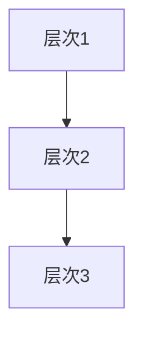

                 


# AI Agent的知识图谱可视化技术

> 关键词：AI Agent，知识图谱，可视化技术，图嵌入，网络表示学习

> 摘要：本文深入探讨了AI Agent在知识图谱可视化技术中的应用。通过分析知识图谱的结构和AI Agent的核心功能，结合具体算法和系统设计，详细讲解了如何通过可视化技术提升AI Agent的知识表示和推理能力。文章内容涵盖背景介绍、核心概念、算法原理、系统架构设计以及项目实战，旨在为读者提供全面的技术指导。

---

## 第1章: AI Agent与知识图谱可视化技术的背景

### 1.1 知识图谱的基本概念

#### 1.1.1 知识图谱的定义
知识图谱是一种用于描述实体及其关系的结构化数据模型。它通过将实体表示为节点，关系表示为边，构建了一个庞大的网络，能够有效地组织和表达海量数据。

#### 1.1.2 知识图谱的核心特点
- **结构化**：实体和关系都是明确定义的，便于计算机处理。
- **可扩展性**：能够动态添加新的实体和关系。
- **语义丰富**：通过多种关系描述，提供深层次的语义信息。

#### 1.1.3 知识图谱的构建与应用
知识图谱的构建通常涉及数据抽取、清洗、融合和推理等步骤。其应用广泛，包括搜索引擎优化、智能问答系统、推荐系统等。

---

### 1.2 AI Agent的基本概念

#### 1.2.1 AI Agent的定义
AI Agent是一种能够感知环境、执行任务并做出决策的智能体。它能够通过与用户的交互或环境的反馈，自主学习和优化行为。

#### 1.2.2 AI Agent的核心功能与特点
- **感知环境**：通过传感器或数据输入获取信息。
- **推理与决策**：基于知识库进行推理，做出最优决策。
- **自主学习**：通过机器学习算法不断优化自身的知识和行为。

#### 1.2.3 AI Agent与知识图谱的结合
知识图谱为AI Agent提供了丰富的语义信息，使其能够更好地理解和处理复杂任务。通过知识图谱的可视化技术，AI Agent可以更直观地展示和分析数据。

---

### 1.3 知识图谱可视化技术的背景与意义

#### 1.3.1 知识图谱可视化的必要性
知识图谱虽然结构化，但其复杂性使得直接使用困难。可视化技术能够将复杂的结构转化为直观的图形，便于理解和分析。

#### 1.3.2 知识图谱可视化的目标与价值
- **提高可理解性**：将抽象的数据转化为直观的图形。
- **支持决策**：通过可视化展示关键信息，辅助决策。
- **促进协作**：便于团队成员之间的沟通与协作。

#### 1.3.3 知识图谱可视化在AI Agent中的应用
在AI Agent中，知识图谱可视化技术主要用于知识表示、推理过程展示以及用户交互界面设计。

---

## 第2章: 知识图谱与AI Agent的核心概念

### 2.1 知识图谱的结构与组成

#### 2.1.1 实体与属性
实体是知识图谱的基本单元，表示现实世界中的对象。属性是对实体的描述，通常包括名称、类型和值。

#### 2.1.2 关系与边
关系描述实体之间的关联，边是连接两个实体的桥梁。例如，在知识图谱中，"张三"（实体）和"朋友"（关系）连接"李四"（实体）。

#### 2.1.3 知识图谱的层次结构
知识图谱通常采用层次化结构，从上到下分为概念层、模式层和实例层。

---

### 2.2 AI Agent的知识表示与推理

#### 2.2.1 知识表示的基本方法
- **一阶逻辑**：使用谓词和变量表示知识。
- **描述逻辑**：通过概念和角色描述实体。
- **规则表示**：基于if-then规则进行推理。

#### 2.2.2 基于知识图谱的推理机制
- **单步推理**：直接使用已知的关系进行推理。
- **多步推理**：通过多次推理得到结论。
- **不确定性推理**：处理不完全或不确定的知识。

#### 2.2.3 知识图谱在AI Agent中的应用
知识图谱为AI Agent提供了丰富的语义信息，支持其进行复杂的推理和决策。

---

### 2.3 知识图谱可视化的核心技术

#### 2.3.1 图形化表示方法
- **节点与边**：实体和关系的图形化表示。
- **布局算法**：通过算法优化图形的布局，使其更易理解。
- **交互式可视化**：支持用户与图形的交互，如缩放、旋转和查询。

#### 2.3.2 可视化工具与平台
- **Gephi**：一个基于Java的开源图分析工具。
- **Neo4j**：支持图数据存储和可视化的数据库。
- **D3.js**：用于前端数据可视化的JavaScript库。

#### 2.3.3 可视化效果的评估标准
- **清晰度**：图形是否易于理解。
- **美观性**：图形的布局是否合理。
- **交互性**：用户是否能够方便地与图形交互。

---

## 第3章: 知识图谱可视化的算法原理

### 3.1 知识图谱构建算法

#### 3.1.1 基于规则的构建方法
通过预定义的规则提取和整合数据，构建知识图谱。

#### 3.1.2 基于机器学习的构建方法
使用机器学习算法，从非结构化数据中学习和提取知识。

#### 3.1.3 基于图嵌入的构建方法
通过图嵌入技术，将图结构转化为低维向量表示。

---

### 3.2 知识图谱可视化的算法

#### 3.2.1 基于力导引的图布局算法
力导引算法模拟物理学中的力，通过不断调整节点位置，使图形布局更合理。


#### 3.2.2 基于层次化的图布局算法
将图结构分解为多个层次，逐步进行布局优化。



#### 3.2.3 基于多维投影的图布局算法
将高维数据投影到低维空间，减少数据维度。

---

### 3.3 算法原理的数学模型

#### 3.3.1 图嵌入的数学公式
图嵌入的目标是将图中的节点表示为低维向量。

$$
X = A \cdot W
$$

其中，X是节点的向量表示，A是邻接矩阵，W是嵌入矩阵。

#### 3.3.2 力导引算法的数学推导
力导引算法通过计算节点之间的排斥力和吸引力，调整节点位置。

$$
F = k \cdot \left( \frac{1}{d} - 1 \right)
$$

其中，F是力，k是常数，d是节点之间的距离。

---

## 第4章: 知识图谱可视化系统的架构设计

### 4.1 系统功能设计

#### 4.1.1 知识图谱构建模块
负责从数据源中提取和整合知识图谱。

#### 4.1.2 可视化展示模块
将知识图谱以图形形式展示给用户。

#### 4.1.3 AI Agent交互模块
支持AI Agent与用户的交互，提供实时反馈。

---

### 4.2 系统架构设计

#### 4.2.1 分层架构设计
系统分为数据层、逻辑层和表示层。

#### 4.2.2 组件之间的交互关系
- 数据层：存储知识图谱数据。
- 逻辑层：处理数据并生成图形。
- 表示层：展示图形并接受用户输入。

#### 4.2.3 系统的扩展性设计
支持动态添加新实体和关系，便于后续维护和升级。

---

### 4.3 系统接口设计

#### 4.3.1 API接口定义
- GET请求获取图形数据。
- POST请求更新图形数据。

#### 4.3.2 数据格式与传输协议
使用JSON格式，通过HTTP协议进行数据传输。

#### 4.3.3 接口的安全性设计
采用认证和加密技术，确保数据安全。

---

## 第5章: 知识图谱可视化技术的项目实战

### 5.1 项目环境与安装

#### 5.1.1 环境要求
- 操作系统：Windows、Linux或macOS。
- 开发工具：Python、Jupyter Notebook。
- 依赖库：networkx、matplotlib、pyvis。

#### 5.1.2 安装步骤
```bash
pip install networkx matplotlib pyvis
```

---

### 5.2 系统核心实现源代码

#### 5.2.1 知识图谱构建代码
```python
import networkx as nx

G = nx.Graph()
G.add_nodes_from(["A", "B", "C"])
G.add_edges_from([("A", "B"), ("B", "C")])
```

#### 5.2.2 可视化展示代码
```python
import matplotlib.pyplot as plt

nx.draw(G, node_size=1000, node_color="blue", edge_color="red")
plt.show()
```

---

### 5.3 代码应用解读与分析

#### 5.3.1 知识图谱构建模块
通过networkx库构建图结构，定义节点和边。

#### 5.3.2 可视化展示模块
使用matplotlib库绘制图结构，调整节点大小和颜色，使图形更美观。

---

### 5.4 实际案例分析和详细讲解剖析

#### 5.4.1 案例背景
假设我们有一个简单的知识图谱，包含三个实体A、B、C，以及它们之间的关系。

#### 5.4.2 案例实现
```python
G = nx.Graph()
G.add_nodes_from(["A", "B", "C"])
G.add_edges_from([("A", "B"), ("B", "C")])
nx.draw(G, node_size=1000, node_color="blue", edge_color="red")
plt.show()
```

#### 5.4.3 案例分析
通过上述代码，我们可以看到实体A、B、C之间的关系，并通过图形直观展示。

---

### 5.5 项目小结

#### 5.5.1 项目总结
通过本项目，我们学习了如何构建知识图谱并进行可视化展示。

#### 5.5.2 经验总结
- 确保数据的准确性和完整性。
- 选择合适的可视化工具和算法，提升展示效果。

---

## 第6章: 扩展阅读与最佳实践

### 6.1 扩展阅读

#### 6.1.1 推荐书籍
- 《知识图谱：概念、方法与应用》
- 《图算法与可视化》

#### 6.1.2 推荐论文
- “Knowledge Graphs: A New Perspective on Data Integration”
- “Visualizing Large Graphs: A Survey and New Directions”

---

### 6.2 最佳实践 tips

#### 6.2.1 小结
知识图谱可视化技术在AI Agent中的应用前景广阔，能够显著提升系统的智能化水平。

#### 6.2.2 注意事项
- 在构建知识图谱时，注意数据的准确性和完整性。
- 在选择可视化工具时，结合实际需求和团队技术栈。

#### 6.2.3 拓展阅读
深入学习图嵌入和网络表示学习的相关技术，探索更多应用场景。

---

## 第7章: 未来展望

### 7.1 知识图谱可视化技术的未来发展

#### 7.1.1 新技术与新趋势
- 增强现实技术在可视化中的应用。
- 大规模图数据的实时可视化。

#### 7.1.2 人工智能与知识图谱的深度融合
随着AI技术的不断进步，知识图谱可视化将更加智能化和自动化。

---

## 第8章: 总结

### 8.1 全文总结
通过本文的学习，读者能够深入了解AI Agent与知识图谱可视化技术的核心概念、算法原理和系统设计。掌握这些知识，有助于在实际项目中更好地应用知识图谱可视化技术。

### 8.2 致谢
感谢读者的耐心阅读，也感谢所有在写作过程中提供帮助和支持的人。

---

以上是《AI Agent的知识图谱可视化技术》的完整目录和内容概述。希望这篇文章能够为读者提供有价值的技术指导和启发。

