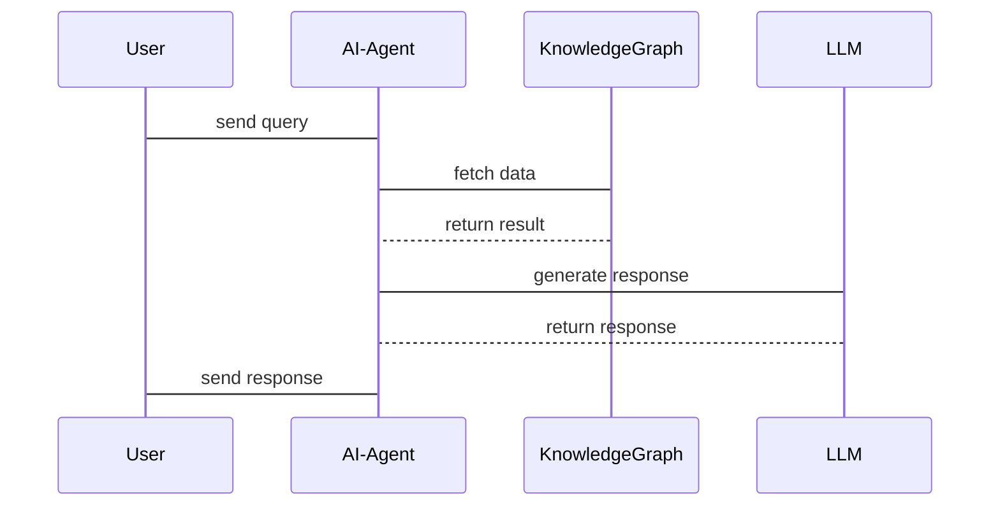

                 


```markdown
# AI Agent的知识图谱增强：整合LLM与结构化知识

> 关键词：知识图谱、LLM、AI Agent、结构化知识、增强学习、系统架构

> 摘要：本文探讨了如何通过整合大语言模型（LLM）与知识图谱，增强AI Agent的知识处理能力。文章从知识图谱与LLM的基本概念出发，分析了它们的结合方式，并详细讲解了算法原理、系统架构设计和项目实战，最后总结了最佳实践经验和小结。

---

## 第一部分：知识图谱与LLM的背景介绍

### 第1章：知识图谱的基本概念

#### 1.1 知识图谱的定义与特点
知识图谱是一种以结构化形式表示知识的网络，由实体和关系组成。其特点包括可扩展性、语义丰富性和可计算性。

#### 1.2 知识图谱的构建过程
知识图谱的构建包括数据抽取、实体识别、关系抽取和知识融合等步骤。

#### 1.3 知识图谱的表示方法
常用的知识图谱表示方法包括RDF、三元组和图数据库等。

### 第2章：大语言模型（LLM）的基本概念

#### 2.1 LLM的定义与特点
LLM是一种基于深度学习的自然语言处理模型，具有强大的文本生成和理解能力。

#### 2.2 LLM的训练过程
LLM的训练通常采用监督学习和强化学习相结合的方法，通过大量数据进行微调。

#### 2.3 LLM的应用场景
LLM广泛应用于文本生成、问答系统、机器翻译等领域。

### 第3章：AI Agent的定义与作用

#### 3.1 AI Agent的基本概念
AI Agent是一种能够感知环境并执行任务的智能体，具备自主决策和学习能力。

#### 3.2 AI Agent的核心功能
AI Agent的核心功能包括感知环境、知识表示、推理决策和自主学习。

#### 3.3 AI Agent的应用领域
AI Agent在智能客服、自动驾驶、智能助手等领域有广泛应用。

---

## 第二部分：知识图谱与LLM的结合原理

### 第4章：知识图谱与LLM的结合方式

#### 4.1 知识图谱作为LLM的知识库
知识图谱为LLM提供结构化的知识支持，增强其推理能力。

#### 4.2 LLM作为知识图谱的解释器
LLM能够帮助知识图谱进行自然语言解释，提高知识的可理解性。

#### 4.3 知识图谱与LLM的双向互动
知识图谱和LLM相互促进，共同提升AI Agent的知识处理能力。

### 第5章：知识图谱与LLM的协同工作流程

#### 5.1 知识图谱的构建与优化
知识图谱的构建需要数据抽取、实体识别和关系抽取等步骤，并不断优化其结构和质量。

#### 5.2 LLM的训练与微调
LLM的训练需要大量数据，并通过微调适应特定任务的需求。

#### 5.3 知识图谱与LLM的联合推理
知识图谱提供结构化知识，LLM进行自然语言处理，两者结合进行联合推理。

---

## 第三部分：知识图谱增强的AI Agent设计

### 第6章：知识图谱增强的设计目标

#### 6.1 提升LLM的准确性
通过知识图谱提供精确的知识支持，提高LLM的推理准确性。

#### 6.2 增强LLM的推理能力
结合知识图谱的结构化知识，增强LLM的推理能力。

#### 6.3 提高LLM的可解释性
通过知识图谱的可解释性，提高LLM的决策透明度。

### 第7章：知识图谱增强的实现方法

#### 7.1 知识图谱的动态更新
定期更新知识图谱，确保其准确性和时效性。

#### 7.2 LLM与知识图谱的交互接口设计
设计高效的接口，实现知识图谱与LLM之间的数据交互和协同工作。

#### 7.3 知识图谱的分布式存储与查询
采用分布式存储和高效查询技术，提升知识图谱的访问效率。

---

## 第四部分：知识图谱与LLM的数学模型与算法

### 第8章：知识图谱的构建算法

#### 8.1 基于规则的知识抽取
通过预定义规则从文本中抽取实体和关系。

#### 8.2 基于统计的实体识别
利用统计方法识别文本中的实体。

#### 8.3 基于深度学习的关系抽取
采用深度学习模型（如CNN、RNN）抽取文本中的关系。

### 第9章：LLM的训练与推理算法

#### 9.1 LLM的训练过程
- 输入：大规模文本数据
- 输出：生成语言模型参数
- 使用数学公式：交叉熵损失函数
$$ L = -\sum_{i=1}^{n} \sum_{j=1}^{m} y_{i,j} \log p(y_{i,j}|x_i) $$
- 其中，$x_i$是输入序列，$y_{i,j}$是目标概率分布。

#### 9.2 LLM的推理过程
- 输入：自然语言输入
- 输出：生成的文本
- 使用数学公式：解码过程
$$ y = \argmax p(y|x) $$

### 第10章：知识图谱与LLM的联合推理算法

#### 10.1 知识图谱的表示学习
- 使用向量表示实体和关系
- 示例公式：
$$ E = \{e_1, e_2, ..., e_n\} $$
$$ R = \{r_1, r_2, ..., r_m\} $$
- 其中，$e_i$表示实体，$r_j$表示关系。

#### 10.2 LLM与知识图谱的协同推理
- 使用知识图谱约束LLM的生成过程
- 示例公式：
$$ p(y|x, E, R) = \frac{p(y|x) \cdot p(E, R)}{p(E, R|x)} $$

---

## 第五部分：系统分析与架构设计方案

### 第11章：问题场景介绍

#### 11.1 问题背景
AI Agent需要处理复杂任务，依赖知识图谱和LLM的协同工作。

#### 11.2 项目介绍
本项目旨在开发一个增强的知识图谱驱动的AI Agent。

### 第12章：系统功能设计

#### 12.1 领域模型设计
- 使用Mermaid类图展示系统组成部分
- 示例：
```mermaid
classDiagram
    class KnowledgeGraph {
        + entities: List<Entity>
        + relations: List<Relation>
        - storage: Storage
        + query(k: Query): Result
    }
    class LLM {
        + model: Model
        + train(data: List<Text>): void
        + generate(text: String): String
    }
    class AI-Agent {
        + knowledgeGraph: KnowledgeGraph
        + llm: LLM
        + execute(task: Task): Result
    }
```

#### 12.2 系统架构设计
- 使用Mermaid架构图展示系统架构
- 示例：


#### 12.3 系统接口设计
- API接口定义
- 示例：
```json
{
  "api": "/api/v1/agent",
  "method": "POST",
  "params": {
    "task": "reasoning",
    "input": "..."
  }
}
```

### 第13章：系统交互设计

#### 13.1 交互流程
- 使用Mermaid序列图展示交互流程
- 示例：


---

## 第六部分：项目实战

### 第14章：环境安装与配置

#### 14.1 安装依赖
- 安装Python、TensorFlow、Keras等工具

#### 14.2 配置知识图谱存储
- 使用Neo4j或Redis等数据库存储知识图谱

### 第15章：核心代码实现

#### 15.1 知识图谱构建代码
```python
class KnowledgeGraph:
    def __init__(self):
        self.entities = []
        self.relations = []
    
    def add_entity(self, entity):
        self.entities.append(entity)
    
    def add_relation(self, relation):
        self.relations.append(relation)
    
    def query(self, query_str):
        # 实现查询逻辑
        pass
```

#### 15.2 LLM训练代码
```python
class LLM:
    def __init__(self):
        self.model = None
    
    def train(self, data):
        # 实现模型训练逻辑
        pass
    
    def generate(self, text):
        # 实现文本生成逻辑
        pass
```

### 第16章：案例分析与解读

#### 16.1 实际案例分析
- 例如：在智能客服中的应用

#### 16.2 代码应用解读
- 解释核心代码的功能和实现细节

### 第17章：项目小结

#### 17.1 项目总结
- 总结项目的实现过程和成果

#### 17.2 经验与教训
- 总结在开发过程中遇到的问题及解决方案

---

## 第七部分：最佳实践与小结

### 第18章：最佳实践 tips

#### 18.1 知识图谱优化
- 定期更新知识图谱，确保其准确性和完整性

#### 18.2 LLM微调
- 根据具体任务对LLM进行微调，提升性能

#### 18.3 系统安全性
- 注意数据安全和系统防护，防止攻击

### 第19章：小结

#### 19.1 内容回顾
- 总结全文的主要内容和关键点

#### 19.2 注意事项
- 提醒读者在实际应用中需要注意的问题

### 第20章：拓展阅读

#### 20.1 推荐资源
- 推荐相关书籍、论文和在线资源

#### 20.2 未来研究方向
- 展望知识图谱与LLM结合的未来研究方向

---

## 结语

通过整合知识图谱与大语言模型，AI Agent的知识处理能力得到了显著提升。本文详细探讨了相关技术和实现方法，为读者提供了从理论到实践的全面指导。希望本文能为AI Agent的未来发展提供有价值的参考。
```

