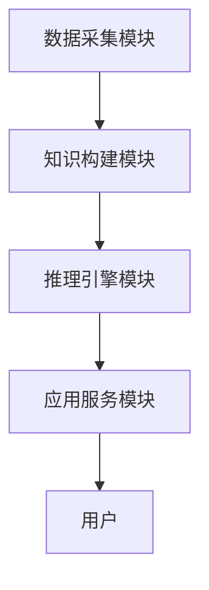

                 


# AI Agent的知识图谱构建与推理机制

## 关键词：AI Agent、知识图谱、推理机制、知识构建、系统设计、实体关系

## 摘要：  
本文深入探讨了AI Agent在知识图谱构建与推理机制中的应用。首先，我们介绍了知识图谱和AI Agent的基本概念及其相互关系，接着详细讲解了知识图谱的构建过程、管理方法和可视化分析。然后，我们重点分析了AI Agent的推理机制，包括基于规则、逻辑和机器学习的推理方法。最后，我们结合实际应用场景，展示了知识图谱与AI Agent的系统设计、项目实现和优化策略。

---

# 第1章: AI Agent与知识图谱的背景介绍

## 1.1 知识图谱的基本概念

### 1.1.1 知识图谱的定义与特点

知识图谱是一种以图结构形式表示知识的数据模型，节点表示实体或概念，边表示实体之间的关系。其特点包括：
- **结构化**：通过节点和边清晰表示实体及其关系。
- **语义丰富**：能够表达复杂的语义信息。
- **可扩展性**：支持大规模数据的扩展和更新。

### 1.1.2 知识图谱的构建目标与意义

目标：构建大规模、高准确性的知识图谱，为AI Agent提供知识基础。  
意义：提升AI Agent的理解能力和推理能力，使其能够更好地处理复杂任务。

### 1.1.3 知识图谱的核心要素与结构

核心要素包括：
- **实体**：现实世界中的具体事物（如人、组织、事件）。
- **属性**：描述实体的特征（如颜色、年龄）。
- **关系**：实体之间的关联（如“人出生在”）。

结构：
- **实体-关系-属性**三元组构成图的基本单元。

## 1.2 AI Agent的基本概念

### 1.2.1 AI Agent的定义与分类

定义：AI Agent是一种智能主体，能够感知环境并执行任务以实现目标。  
分类：
- **简单反射Agent**：基于预设规则执行任务。
- **基于模型的反射Agent**：利用知识库进行推理和决策。
- **实用Agent**：基于效用函数优化决策。

### 1.2.2 AI Agent的核心功能与特点

功能：
- **感知**：通过传感器或数据源获取信息。
- **推理**：基于知识库进行逻辑推理。
- **决策**：根据推理结果做出决策。
- **执行**：通过执行器完成任务。

特点：
- **自主性**：能够独立决策。
- **反应性**：能够实时响应环境变化。
- **学习能力**：能够通过经验改进性能。

### 1.2.3 AI Agent与知识图谱的关系

关系：
- 知识图谱为AI Agent提供知识基础，支持推理和决策。
- AI Agent利用知识图谱实现复杂任务，如问答、推荐和决策支持。

## 1.3 知识图谱与AI Agent的结合

### 1.3.1 知识图谱在AI Agent中的作用

- 提供语义理解能力，增强自然语言处理效果。
- 支持推理与决策，提升智能化水平。

### 1.3.2 AI Agent如何利用知识图谱进行推理

- 通过知识图谱获取实体关系，构建上下文理解。
- 基于知识图谱进行关联推理，生成合理决策。

### 1.3.3 知识图谱与AI Agent结合的应用场景

- **智能问答系统**：基于知识图谱提供准确答案。
- **推荐系统**：根据用户行为和知识图谱进行个性化推荐。
- **智能监控**：利用知识图谱进行异常检测和预测。

## 1.4 本章小结

- 知识图谱与AI Agent的结合是实现智能化系统的关键。
- 知识图谱构建与推理机制是提升AI Agent能力的核心技术。

---

# 第2章: 知识图谱的构建与管理

## 2.1 知识图谱的构建过程

### 2.1.1 数据获取与预处理

- 数据来源：结构化数据（数据库）、非结构化数据（文本、图像）。
- 数据清洗：去除冗余和噪声数据，确保数据质量。

### 2.1.2 知识抽取与融合

- 实体抽取：从文本中识别出实体（如人名、地名）。
- 关系抽取：识别实体之间的关系（如“出生在”）。
- 属性抽取：提取实体的属性（如性别、年龄）。
- 数据融合：整合多个数据源的信息，消除冲突。

### 2.1.3 知识存储与建模

- 存储技术：使用图数据库（如Neo4j）存储知识图谱。
- 建模方法：采用RDF（资源描述框架）或知识图谱表示法（如Ubergraph）。

### 2.1.4 知识图谱的可视化

- 可视化工具：如Gephi、Cytoscape。
- 可视化方法：节点链接图、关系网络图。

## 2.2 知识图谱的管理与优化

### 2.2.1 知识图谱的存储技术

- 图数据库：支持高效的查询和存储。
- 关系数据库：适用于结构化数据存储。

### 2.2.2 知识图谱的查询与检索

- 查询语言：SPARQL用于图数据查询。
- 检索算法：基于索引的高效检索。

### 2.2.3 知识图谱的动态更新与维护

- 更新机制：支持实时更新和版本控制。
- 维护工具：自动化校验和修复错误。

## 2.3 知识图谱的可视化与分析

### 2.3.1 知识图谱的可视化方法

- 使用Gephi进行网络可视化。
- 使用Cytoscape进行关系网络分析。

### 2.3.2 知识图谱的分析工具

- 数据分析工具：Python的网络分析库（如NetworkX）。
- 可视化工具：Tableau、Power BI。

### 2.3.3 知识图谱的应用案例

- 企业知识管理：构建企业知识图谱，支持内部决策。
- 医疗知识图谱：辅助医生进行诊断和治疗建议。

## 2.4 本章小结

- 知识图谱的构建与管理是实现智能化系统的基础。
- 合适的存储和可视化方法能够提升知识图谱的应用价值。

---

# 第3章: AI Agent的推理机制

## 3.1 推理机制的基本概念

### 3.1.1 推理的定义与分类

- 推理：从已有知识中推导出新结论的过程。
- 分类：基于规则推理、逻辑推理和机器学习推理。

### 3.1.2 推理的基本原理与特点

- 基于规则推理：利用预定义规则进行推理。
- 基于逻辑推理：利用逻辑推理进行结论推导。
- 基于机器学习推理：利用机器学习模型进行预测。

### 3.1.3 推理在AI Agent中的作用

- 支持AI Agent做出决策和判断。
- 基于知识图谱进行关联推理，提升智能性。

## 3.2 基于知识图谱的推理方法

### 3.2.1 基于规则的推理

- 规则定义：如“如果一个人出生在某个城市，则该城市是他的出生地”。
- 实现方法：基于规则引擎进行推理。

### 3.2.2 基于逻辑的推理

- 逻辑推理：如一阶逻辑推理，用于复杂关系推理。
- 实现方法：使用逻辑推理引擎进行推导。

### 3.2.3 基于机器学习的推理

- 机器学习模型：如图神经网络（GNN）用于图结构数据推理。
- 实现方法：利用训练好的模型进行预测。

## 3.3 推理机制的优化与提升

### 3.3.1 推理效率的优化方法

- 算法优化：如剪枝、并行计算。
- 知识图谱优化：如减少冗余关系，提高查询效率。

### 3.3.2 推理准确率的提升策略

- 数据增强：增加高质量训练数据。
- 模型优化：如使用更复杂的模型结构。

### 3.3.3 推理机制的可解释性问题

- 提升可解释性：如使用可解释的推理规则。
- 解释生成：如通过中间步骤解释推理过程。

## 3.4 本章小结

- 推理机制是AI Agent实现智能决策的核心。
- 结合知识图谱的推理方法能够提升推理的准确性和效率。

---

# 第4章: 知识图谱与AI Agent的结合应用

## 4.1 知识图谱在AI Agent中的应用场景

### 4.1.1 智能问答系统

- 实现：基于知识图谱进行语义理解，提供准确答案。
- 示例：问答系统利用知识图谱回答用户问题。

### 4.1.2 智能推荐系统

- 实现：基于知识图谱分析用户行为，推荐相关内容。
- 示例：电商推荐系统根据用户购买历史推荐商品。

### 4.1.3 自动推理与决策系统

- 实现：基于知识图谱进行关联推理，生成决策建议。
- 示例：自动驾驶系统利用知识图谱进行路径规划和决策。

## 4.2 知识图谱与AI Agent的系统设计

### 4.2.1 系统功能设计

- 数据采集与处理：收集和预处理数据。
- 知识构建：抽取实体、关系和属性，构建知识图谱。
- 推理引擎：基于知识图谱进行推理，生成决策结果。
- 用户交互：与用户进行交互，提供服务。

### 4.2.2 系统架构设计

- 分层架构：数据层、知识层、推理层、应用层。
- 组件设计：数据采集模块、知识构建模块、推理模块、应用模块。

### 4.2.3 系统接口设计

- 数据接口：数据输入和输出接口。
- 推理接口：推理服务接口。
- 用户接口：用户交互接口。

### 4.2.4 系统交互设计

- 用户请求：用户发送查询请求。
- 系统处理：系统解析请求，进行推理，返回结果。
- 交互流程：用户-系统交互流程图（Mermaid）。

## 4.3 项目实战

### 4.3.1 环境搭建

- 安装Python、Jupyter Notebook。
- 安装知识图谱构建工具（如NetworkX、Gephi）。
- 安装推理引擎（如RDF4J、SPARQL查询工具）。

### 4.3.2 核心代码实现

#### 4.3.2.1 知识图谱构建代码

```python
import networkx as nx

# 创建知识图谱
G = nx.DiGraph()

# 添加节点
G.add_node("Alice", role="Person")
G.add_node("Paris", role="City")
G.add_node("France", role="Country")

# 添加关系
G.add_edge("Alice", "Paris", label="born_in")
G.add_edge("Paris", "France", label="located_in")

# 可视化
nx.draw(G, with_labels=True, edge_labels=True)
plt.show()
```

#### 4.3.2.2 基于规则的推理代码

```python
from rule_engine import RuleEngine

# 定义规则
rules = [
    "如果X born_in Y，且Y located_in Z，则X的出生地是Z"
]

# 创建推理引擎
engine = RuleEngine(rules)

# 推理过程
engine.add_fact("Alice", "born_in", "Paris")
engine.add_fact("Paris", "located_in", "France")
engine.run()
```

### 4.3.3 案例分析与详细解读

- **案例分析**：构建一个小型知识图谱，包含人物、地点和国家的关系。
- **详细解读**：通过推理引擎验证规则，展示知识图谱在推理中的应用。

## 4.4 本章小结

- 知识图谱与AI Agent的结合能够实现智能化应用。
- 通过项目实战可以更好地理解知识图谱构建与推理机制。

---

# 第5章: 知识图谱与AI Agent的系统架构与优化

## 5.1 系统架构设计

### 5.1.1 系统模块划分

- 数据采集模块：负责数据的获取和预处理。
- 知识构建模块：负责知识图谱的构建和存储。
- 推理引擎模块：负责基于知识图谱进行推理。
- 应用服务模块：负责与用户的交互和结果展示。

### 5.1.2 系统架构图



### 5.1.3 系统接口设计

- 数据接口：提供REST API用于数据的上传和下载。
- 推理接口：提供REST API用于推理服务的调用。
- 用户接口：提供Web界面用于用户与系统的交互。

## 5.2 系统优化与扩展

### 5.2.1 知识图谱的动态更新

- 实时更新：支持实时数据的更新和同步。
- 版本控制：记录知识图谱的变更历史。

### 5.2.2 推理引擎的性能优化

- 并行计算：利用多线程或多进程提高推理效率。
- 索引优化：优化数据索引结构，提高查询速度。

### 5.2.3 系统的可扩展性设计

- 模块化设计：各模块独立开发，便于扩展。
- 扩展接口：提供扩展接口，支持新增功能模块。

## 5.3 本章小结

- 系统架构设计是知识图谱与AI Agent结合的关键。
- 优化与扩展能够提升系统的性能和应用价值。

---

# 第6章: 项目实战与最佳实践

## 6.1 项目环境搭建

### 6.1.1 安装必要的工具与库

- Python 3.8+
- Jupyter Notebook
- NetworkX、Gephi、SPARQL工具

### 6.1.2 环境配置与测试

- 配置虚拟环境，安装必要的库。
- 测试知识图谱构建和推理功能。

## 6.2 核心代码实现

### 6.2.1 知识图谱构建与存储

```python
import networkx as nx
from neo4j import GraphDatabase

# 创建Neo4j连接
driver = GraphDatabase.driver("bolt://localhost:7687", auth=("user", "password"))

# 构建知识图谱
def create_knowledge_graph(tx):
    tx.run("CREATE (:Person {name: 'Alice', role: 'Developer'})")
    tx.run("CREATE (:City {name: 'Paris', country: 'France'})")
    tx.run("CREATE (:Country {name: 'France', population: 67 million})")
    tx.run("MATCH (a:Person), (c:City) WHERE a.name = 'Alice' AND c.name = 'Paris' CREATE (a)-[:BORN_IN]->(c)")

with driver.session() as session:
    session.write_transaction(create_knowledge_graph)

driver.close()
```

### 6.2.2 基于知识图谱的推理实现

```python
from SPARQLWrapper import SPARQLWrapper

# 连接到知识图谱
sparql = SPARQLWrapper("http://localhost:3030/dataset")

# 定义查询
query = """
    PREFIX ex: <http://example.org/>
    SELECT ?x ?y
    WHERE {
        ?x ex:born_in ?y
    }
"""

# 执行查询
sparql.setQuery(query)
sparql.setReturnFormat('json')
results = sparql.query().convert()

# 处理结果
for result in results['results']['bindings']:
    print(result['x']['value'], result['y']['value'])
```

## 6.3 案例分析与详细解读

### 6.3.1 案例分析

- **案例**：构建一个简单的知识图谱，包含人物、地点和国家的关系。
- **分析**：通过SPARQL查询，验证推理规则是否正确。

### 6.3.2 详细解读

- **代码解读**：展示知识图谱构建和推理的具体实现步骤。
- **结果分析**：解释查询结果，验证推理的准确性。

## 6.4 本章小结

- 通过项目实战可以深入理解知识图谱构建与推理机制。
- 最佳实践能够提升项目的可维护性和可扩展性。

---

# 第7章: 总结与展望

## 7.1 本章总结

- 知识图谱为AI Agent提供了丰富的知识基础。
- AI Agent的推理机制能够基于知识图谱进行智能决策。

## 7.2 未来展望

- **知识图谱的动态更新**：支持实时数据的更新和同步。
- **推理机制的优化**：提升推理的效率和准确率。
- **多模态知识图谱**：结合图像、视频等多种数据源，构建更丰富的知识图谱。
- **可解释性增强**：提升推理过程的透明性和可解释性。

## 7.3 最佳实践与注意事项

### 7.3.1 最佳实践

- **模块化设计**：各模块独立开发，便于维护和扩展。
- **数据质量管理**：确保数据的准确性和完整性。
- **推理引擎优化**：定期优化推理算法，提升推理效率。

### 7.3.2 注意事项

- **数据隐私**：注意数据的安全性和隐私保护。
- **系统性能**：确保系统的高效运行，避免性能瓶颈。
- **用户体验**：注重用户体验设计，提升用户满意度。

---

# 结语

通过本文的深入探讨，我们了解了AI Agent的知识图谱构建与推理机制的核心内容。知识图谱为AI Agent提供了丰富的知识基础，而推理机制则使其能够基于知识图谱进行智能决策。未来，随着技术的不断发展，知识图谱与AI Agent的结合将更加紧密，推动人工智能技术的进一步发展。

