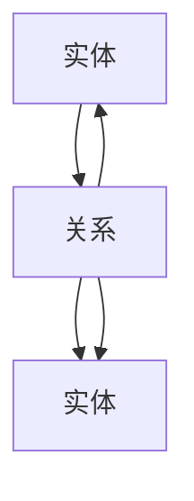
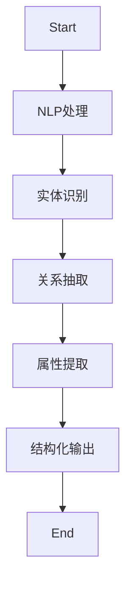
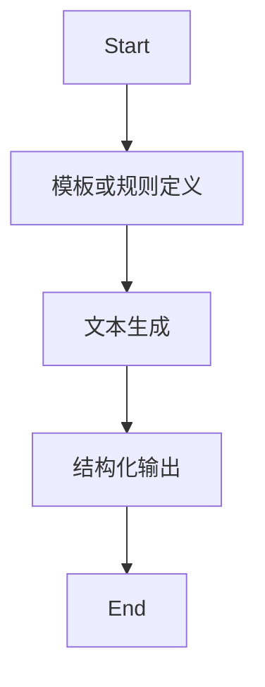
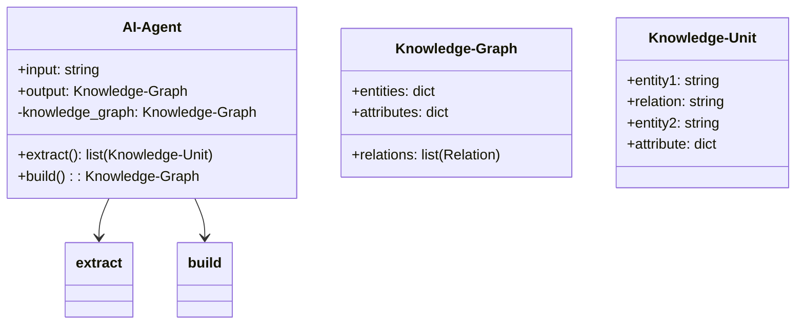
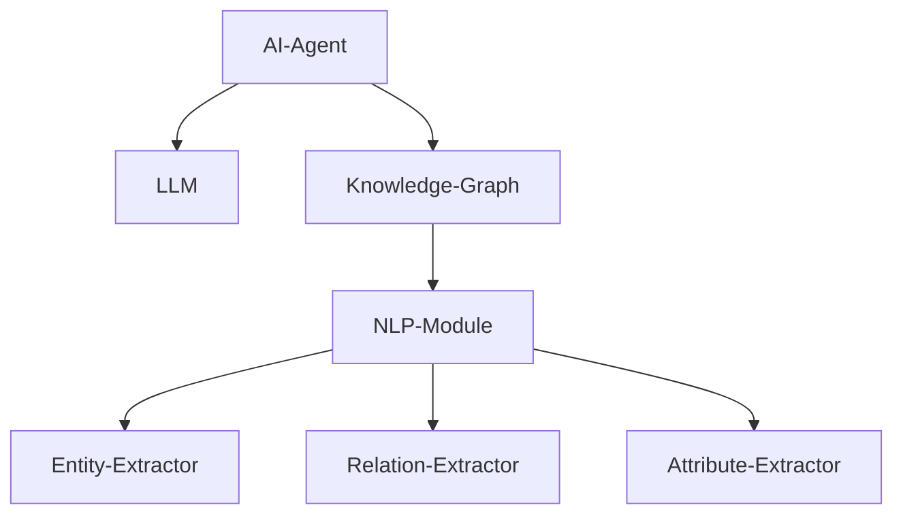
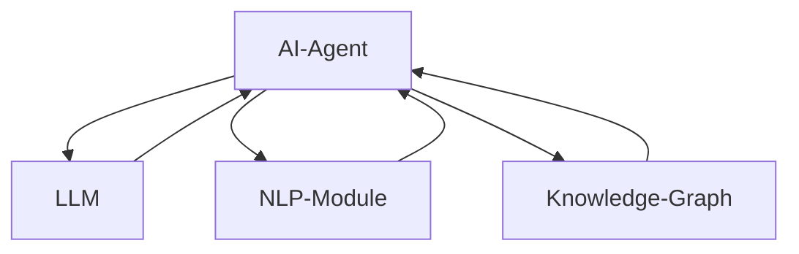

                 


# AI Agent的知识图谱构建：从LLM输出提取结构化信息

**关键词**：知识图谱，LLM，AI Agent，结构化信息提取，自然语言处理，大语言模型，知识表示

**摘要**：本文深入探讨了AI Agent在知识图谱构建中的应用，重点分析了如何从大语言模型（LLM）的输出中提取结构化信息。文章首先介绍了知识图谱和LLM的基本概念及其在AI Agent中的作用，随后详细讲解了从LLM输出中提取结构化信息的算法原理，包括抽取式和生成式方法。接着，文章分析了系统的架构设计，包括领域模型、系统架构和交互流程。最后，通过实际项目案例展示了如何将理论应用于实践，并提出了最佳实践和未来研究方向。

---

# 第1章: 问题背景与核心概念

## 1.1 问题背景介绍

### 1.1.1 知识图谱的定义与作用
知识图谱是一种以结构化的形式表示知识的网络，由实体和关系组成，广泛应用于搜索引擎、智能问答系统等领域。知识图谱能够帮助AI Agent更好地理解和推理信息。

### 1.1.2 LLM输出的特点与挑战
大语言模型（LLM）能够生成高质量的自然语言文本，但其输出是非结构化的，难以直接用于需要结构化信息的场景，如知识图谱构建。

### 1.1.3 AI Agent在知识图谱构建中的角色
AI Agent作为中间桥梁，负责从LLM的输出中提取结构化信息，并将其整合到知识图谱中。

## 1.2 核心概念与问题描述

### 1.2.1 知识图谱构建的必要性
知识图谱能够提供结构化的信息表示，使得AI Agent能够更高效地进行推理和决策。

### 1.2.2 LLM输出的结构化需求
为了将LLM的输出应用于知识图谱构建，需要将其从非结构化的文本转换为结构化的三元组形式。

### 1.2.3 AI Agent的知识图谱构建目标
AI Agent的目标是从LLM输出中提取结构化信息，构建或完善知识图谱，以支持更复杂的任务。

## 1.3 问题解决与边界定义

### 1.3.1 知识图谱构建的解决方案
通过自然语言处理技术从LLM输出中提取实体和关系，构建结构化的知识图谱。

### 1.3.2 LLM输出的结构化处理边界
仅处理LLM输出中的实体和关系，不涉及其他类型的信息（如情感分析）。

### 1.3.3 AI Agent的知识图谱构建范围
AI Agent专注于从LLM输出中提取结构化信息，不涉及外部数据源的整合。

## 1.4 核心要素与概念结构

### 1.4.1 知识图谱构建的核心要素
- 实体：具体事物或概念。
- 关系：实体之间的联系。
- 属性：实体的描述性特征。

### 1.4.2 LLM输出的结构化信息特征
- 实体识别：从文本中提取实体。
- 关系抽取：识别实体之间的关系。
- 属性提取：提取实体的属性信息。

### 1.4.3 AI Agent的知识图谱构建流程
1. 输入LLM的输出文本。
2. 使用NLP技术提取实体、关系和属性。
3. 将提取的信息整合到知识图谱中。

---

# 第2章: 知识图谱与LLM的关系

## 2.1 知识图谱的核心原理

### 2.1.1 知识图谱的三元组表示法
知识图谱中的信息通常表示为三元组（头实体，关系，尾实体）。

### 2.1.2 知识图谱的构建方法
- 人工构建：手动整理知识。
- 半自动构建：结合人工和自动化工具。
- 完全自动化：通过算法从文本中抽取信息。

### 2.1.3 知识图谱的存储与查询
知识图谱通常存储在图数据库中，支持高效的查询和推理操作。

## 2.2 LLM的输出特点与结构化需求

### 2.2.1 LLM输出的文本特征
- 生成的文本通常是自然语言，非结构化。
- 文本中包含丰富的语义信息，但缺乏结构化的表示。

### 2.2.2 LLM输出的结构化信息提取
- 使用NLP技术从文本中提取实体、关系和属性。
- 将提取的信息转化为结构化的形式，如三元组。

### 2.2.3 LLM输出的语义理解
- 理解文本的语义是提取结构化信息的前提。
- 需要处理文本中的歧义和上下文依赖。

## 2.3 AI Agent的知识图谱构建与LLM的关系

### 2.3.1 知识图谱构建对LLM输出的依赖
- LLM输出提供了丰富的语义信息，是知识图谱构建的重要来源。
- LLM输出的质量直接影响知识图谱的准确性和完整性。

### 2.3.2 LLM对知识图谱构建的辅助作用
- LLM可以帮助生成候选实体和关系，辅助知识图谱的构建。
- LLM可以提供上下文信息，帮助AI Agent理解文本中的语义。

### 2.3.3 AI Agent在知识图谱构建中的桥梁作用
- AI Agent负责协调LLM的输出和知识图谱的构建过程。
- AI Agent可以利用知识图谱中的信息，进一步优化LLM的输出。

## 2.4 核心概念对比表

| 对比维度 | 知识图谱 | LLM输出 |
|----------|----------|----------|
| 表示形式 | 结构化的三元组 | 非结构化的文本 |
| 信息来源 | 实体和关系 | 自然语言文本 |
| 处理方式 | 提取和整合 | 生成和理解 |

## 2.5 ER实体关系图



---

# 第3章: 知识图谱构建的算法原理

## 3.1 知识抽取算法

### 3.1.1 抽取式方法

#### 3.1.1.1 实体识别
- 使用命名实体识别（NER）技术从文本中提取实体。
- 示例：从“李明是北京大学的学生”中提取“李明”（实体）和“北京大学”（实体）。

#### 3.1.1.2 关系抽取
- 识别实体之间的关系，如“是”、“属于”等。
- 示例：从“李明是北京大学的学生”中提取关系“属于”。

#### 3.1.1.3 属性提取
- 提取实体的属性，如“年龄”、“职业”等。
- 示例：从“李明是25岁的学生”中提取属性“年龄=25”。

### 3.1.2 基于规则的抽取

#### 3.1.2.1 规则定义
- 根据领域知识定义规则，用于从文本中提取信息。
- 示例：规则“如果出现‘是’，则提取前后的实体作为主语和宾语”。

#### 3.1.2.2 规则应用
- 使用规则匹配文本，提取结构化信息。
- 示例：从“李明是北京大学的学生”中匹配“是”关系，提取“李明”和“北京大学”。

### 3.1.3 抽取式方法的流程图



### 3.1.4 抽取式方法的代码示例

```python
import spacy

nlp = spacy.load("en_core_web_sm")
text = "李明是北京大学的学生"
doc = nlp(text)

# 实体识别
entities = [(ent.text, ent.label_) for ent in doc.ents]

# 关系抽取
relations = []
for i, token in enumerate(doc):
    if token.text == "是":
        if i > 0 and i < len(doc)-1:
            head = doc[i-1].text
            tail = doc[i+1].text
            relations.append((head, "是", tail))

print(entities, relations)
```

## 3.2 知识生成算法

### 3.2.1 生成式方法

#### 3.2.1.1 基于模板的生成
- 使用预定义的模板生成结构化信息。
- 示例：模板“{A}是{B}的学生”生成“李明是北京大学的学生”。

#### 3.2.1.2 基于规则的生成
- 根据规则生成结构化信息。
- 示例：规则“如果A是B的学生，则生成三元组（A，属于，B）”。

#### 3.2.1.3 生成式方法的流程图



### 3.2.2 生成式方法的代码示例

```python
def generate_knowledge(entity1, entity2, relation):
    return f"{entity1} {relation} {entity2}"

knowledge = generate_knowledge("李明", "属于", "北京大学")
print(knowledge)
```

### 3.2.3 生成式方法的数学模型

生成式方法通常基于概率模型，例如：

$$ P(knowledge | input) = \prod_{i=1}^{n} P(word_i | input, context) $$

其中，$input$ 是输入文本，$context$ 是上下文信息，$word_i$ 是生成的单词。

---

# 第4章: 系统分析与架构设计

## 4.1 问题场景介绍

### 4.1.1 问题场景描述
- AI Agent需要从LLM的输出中提取结构化信息，构建或完善知识图谱。
- 示例场景：从新闻文章中提取实体和关系，构建公司之间的关联关系。

## 4.2 系统功能设计

### 4.2.1 领域模型设计



### 4.2.2 系统架构设计



### 4.2.3 系统接口设计

#### 4.2.3.1 输入接口
- 输入：LLM的输出文本。
- 输出：结构化的知识单元。

#### 4.2.3.2 输出接口
- 输入：知识单元。
- 输出：更新的知识图谱。

## 4.3 交互流程图



---

# 第5章: 项目实战

## 5.1 环境安装

### 5.1.1 安装Python和相关库
- 安装Python 3.8及以上版本。
- 安装spacy、networkx等库。

```bash
pip install spacy networkx
python -m spacy download en_core_web_sm
```

## 5.2 系统核心实现

### 5.2.1 知识抽取模块

```python
import spacy

nlp = spacy.load("en_core_web_sm")
text = "苹果公司成立于1971年，总部位于美国加利福尼亚州库比蒂诺。"
doc = nlp(text)

entities = [(ent.text, ent.label_) for ent in doc.ents]
print(entities)
```

### 5.2.2 知识图谱构建模块

```python
from networkx import DiGraph

G = DiGraph()
G.add_node("苹果公司")
G.add_node("1971年")
G.add_node("美国加利福尼亚州库比蒂诺")
G.add_edge("苹果公司", "成立于", "1971年")
G.add_edge("苹果公司", "总部位于", "美国加利福尼亚州库比蒂诺")
```

## 5.3 代码应用解读与分析

### 5.3.1 知识抽取模块
- 使用spacy的NER模型提取实体。
- 实体包括“苹果公司”、“1971年”、“美国加利福尼亚州库比蒂诺”。

### 5.3.2 知识图谱构建模块
- 使用networkx构建有向图，表示实体之间的关系。
- 关系包括“成立于”和“总部位于”。

## 5.4 实际案例分析

### 5.4.1 案例背景
- 输入文本：“苹果公司成立于1971年，总部位于美国加利福尼亚州库比蒂诺。”

### 5.4.2 案例实现
- 提取实体：“苹果公司”、“1971年”、“美国加利福尼亚州库比蒂诺”。
- 提取关系：“成立于”、“总部位于”。
- 构建知识图谱：表示苹果公司的成立时间和总部位置。

## 5.5 项目小结

---

# 第6章: 最佳实践与总结

## 6.1 最佳实践

### 6.1.1 知识图谱构建的注意事项
- 确保LLM输出的质量，避免噪声信息。
- 使用多种NLP技术结合，提高提取的准确性。

### 6.1.2 AI Agent的知识图谱构建优化
- 定期更新知识图谱，保持信息的时效性。
- 结合外部数据源，丰富知识图谱的内容。

## 6.2 本章小结

### 6.2.1 全文总结
本文详细介绍了AI Agent在知识图谱构建中的应用，从LLM输出中提取结构化信息的算法原理，以及系统的架构设计和项目实战。

### 6.2.2 未来研究方向
- 研究更高效的实体识别和关系抽取算法。
- 探索多模态信息的融合，提升知识图谱的构建效率。

### 6.2.3 注意事项
- 确保知识图谱的准确性和完整性。
- 处理LLM输出中的歧义和不确定性。

## 6.3 拓展阅读

### 6.3.1 推荐书籍
- 《知识图谱：概念、方法与应用》
- 《大语言模型：原理与实践》

### 6.3.2 推荐博客和资源
- Medium上的NLP相关文章。
- GitHub上的知识图谱构建项目。

---

# 结语

通过本文的学习，读者可以全面理解AI Agent在知识图谱构建中的作用，掌握从LLM输出中提取结构化信息的算法和系统设计方法，并能够将理论应用于实际项目中。希望本文能为读者提供有价值的参考和启发。

