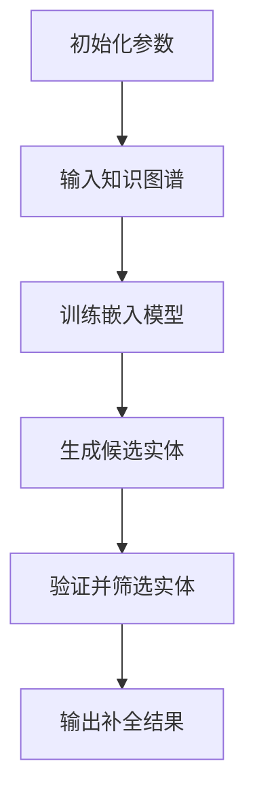
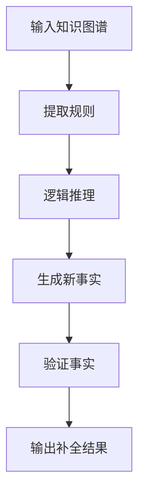
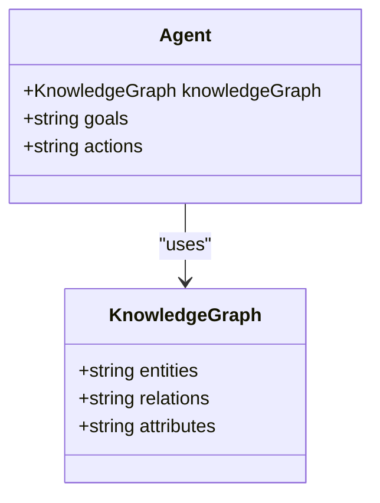
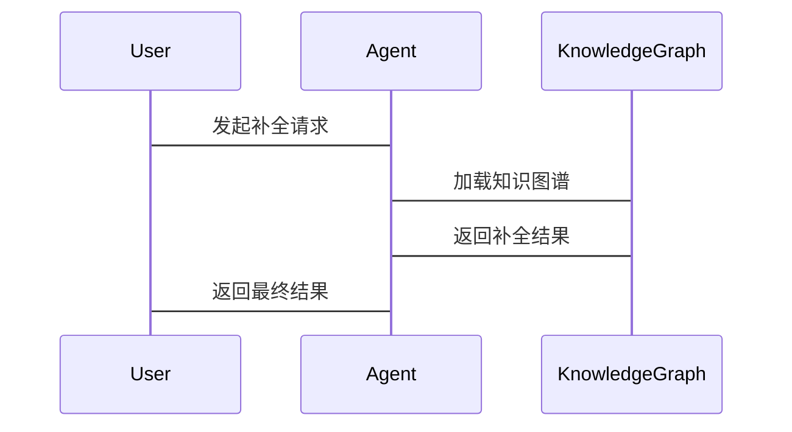

                 


# AI Agent的知识图谱补全技术

## 关键词
- 知识图谱
- AI Agent
- 语义理解
- 知识补全
- 图嵌入

## 摘要
知识图谱是一种以结构化方式表示知识的数据形式，广泛应用于搜索引擎、语义理解、智能问答等领域。然而，知识图谱的不完整性和动态性常常限制了其应用效果。AI Agent作为一种智能主体，能够通过感知环境、推理和学习来动态地补充和更新知识图谱。本文详细探讨AI Agent在知识图谱补全中的应用，从算法原理、系统架构到项目实战，全面分析知识图谱补全的核心技术与实现方法。

---

## 第一部分: AI Agent与知识图谱概述

### 第1章: AI Agent的基本概念

#### 1.1 AI Agent的定义
AI Agent（人工智能主体）是指能够感知环境、自主决策并执行任务的智能系统。与传统程序不同，AI Agent具有以下核心特点：
- **自主性**：能够在没有外部干预的情况下独立运行。
- **反应性**：能够根据环境的变化动态调整行为。
- **目标导向**：具有明确的目标，并通过规划和推理来实现目标。
- **学习能力**：能够通过数据和经验不断优化自身的性能。

#### 1.2 知识图谱的基本概念
知识图谱是一种以图结构形式表示知识的数据模型，节点表示实体，边表示实体之间的关系。知识图谱的特点包括：
- **结构化**：实体与关系的明确定义使知识图谱具有高度的结构化特性。
- **可扩展性**：能够通过不断添加新的实体和关系进行扩展。
- **语义丰富性**：通过语义信息的关联，能够支持复杂的语义理解任务。

#### 1.3 AI Agent与知识图谱的结合
AI Agent通过与知识图谱的结合，能够实现知识的动态更新和补全。例如，在智能问答系统中，AI Agent可以根据用户的问题检索知识图谱中的相关信息，并通过推理和学习不断完善知识图谱的内容。

---

### 第2章: 知识图谱补全的核心概念

#### 2.1 知识图谱补全的定义与目标
知识图谱补全是指通过算法和技术手段，填补知识图谱中缺失的实体、关系或属性信息的过程。其目标是提升知识图谱的完整性和准确性，使其能够更好地支持上层应用。

#### 2.2 实体、关系与属性的对比
| 概念 | 定义 | 示例 |
|------|------|------|
| 实体 | 知识图谱中的基本单元，表示具体事物或概念 | "北京"、"李白" |
| 关系 | 表示实体之间的关联 | "位于"、"创作" |
| 属性 | 表示实体的特征或性质 | "首都"、"作者" |

#### 2.3 ER实体关系图架构
使用Mermaid绘制ER实体关系图：

```mermaid
erDiagram
    customer[CUSTOMER] {
        +string customerID
        +string name
        +string email
    }
    product[PRODUCT] {
        +string productID
        +string name
        +number price
    }
    order[ORDER] {
        +string orderID
        +date orderDate
        +number total
    }
    CUSTOMER o-- ORDER : "places"
    ORDER o-- PRODUCT : "includes"
```

---

## 第二部分: 知识图谱补全的算法原理

### 第3章: 基于嵌入的补全算法

#### 3.1 嵌入模型的基本原理
嵌入模型通过将实体和关系映射到低维向量空间，捕捉语义信息。常用算法包括Word2Vec、TransE、TransH等。

#### 3.2 知识图谱嵌入的数学模型
以TransE为例，其目标是最小化头实体和尾实体之间的向量差：

$$ \text{score}(h, r, t) = \| h + r - t \| $$

其中，$h$、$r$、$t$分别表示头实体、关系和尾实体的向量。

#### 3.3 基于嵌入的补全算法流程
使用Mermaid绘制算法流程图：



#### 3.4 Python实现示例
```python
import numpy as np

def trans_e_loss(h, r, t):
    return np.linalg.norm(h + r - t)

# 示例数据
head = np.array([1, 2])
relation = np.array([3, 4])
tail = np.array([6, 6])

loss = trans_e_loss(head, relation, tail)
print("Loss:", loss)
```

---

### 第4章: 符号逻辑推理方法

#### 4.1 符号逻辑推理的基本原理
符号逻辑推理通过形式化规则和逻辑推理引擎，从知识图谱中推导新的事实。

#### 4.2 知识图谱中的逻辑推理
使用一阶逻辑（FOL）表示规则：

$$ \forall x, P(x) \rightarrow Q(x) $$

其中，$P(x)$表示$x$是人类，$Q(x)$表示$x$会说话。

#### 4.3 基于符号逻辑的补全算法流程
使用Mermaid绘制算法流程图：



---

## 第三部分: 知识图谱补全的系统架构

### 第5章: 系统功能设计

#### 5.1 系统功能模块
使用Mermaid绘制系统类图：



#### 5.2 系统接口设计
系统接口包括：
- **知识图谱加载接口**：将知识图谱数据加载到系统中。
- **补全请求接口**：接收用户的补全请求并返回结果。
- **更新接口**：更新知识图谱的内容。

#### 5.3 系统交互流程
使用Mermaid绘制交互序列图：



---

## 第四部分: 项目实战

### 第6章: 知识图谱补全的实战案例

#### 6.1 项目背景与目标
以医疗领域为例，构建一个疾病知识图谱，并通过AI Agent补全缺失的疾病关系。

#### 6.2 环境配置
```bash
pip install numpy
pip install networkx
pip install py2neo
```

#### 6.3 核心代码实现
```python
from py2neo import Graph, Node, Relationship

# 初始化Neo4j图数据库
graph = Graph("http://localhost:7474", auth=("neo4j", "password"))

# 创建节点
node1 = Node('Disease', name='癌症')
node2 = Node('Symptom', name='疼痛')

# 创建关系
relationship = Relationship(node1, '伴随症状', node2)
graph.create(node1, relationship, node2)
```

#### 6.4 案例分析与总结
通过实际案例分析，验证算法的有效性，并总结经验教训。

---

## 第五部分: 高级主题与未来展望

### 第7章: 高级主题探讨

#### 7.1 知识图谱补全的未来方向
- 结合大语言模型（如GPT）进行知识补全。
- 研究分布式知识图谱的补全方法。

#### 7.2 性能优化与评估指标
- **准确率**：补全结果的正确性。
- **召回率**：补全结果的全面性。
- **F1分数**：综合准确率和召回率的指标。

#### 7.3 数学公式与性能优化
通过公式优化算法性能：

$$ F1 = \frac{2 \times \text{准确率} \times \text{召回率}}{\text{准确率} + \text{召回率}} $$

---

## 第六部分: 总结与展望

### 第8章: 总结

#### 8.1 全文总结
本文系统地探讨了AI Agent在知识图谱补全中的应用，从算法原理到系统架构，再到项目实战，全面分析了知识图谱补全的核心技术。

#### 8.2 未来展望
知识图谱补全技术仍有许多挑战和机遇，未来的研究方向包括结合大语言模型、分布式计算和边缘计算等。

---

### Tips
- 在实际应用中，建议结合具体领域特点，优化算法和系统架构。
- 知识图谱补全的性能优化需要在准确性和效率之间找到平衡。

---

### 小结
通过本文的学习，读者可以全面了解AI Agent在知识图谱补全中的应用，并能够将其应用于实际项目中。希望本文能为相关领域的研究和实践提供有价值的参考。

