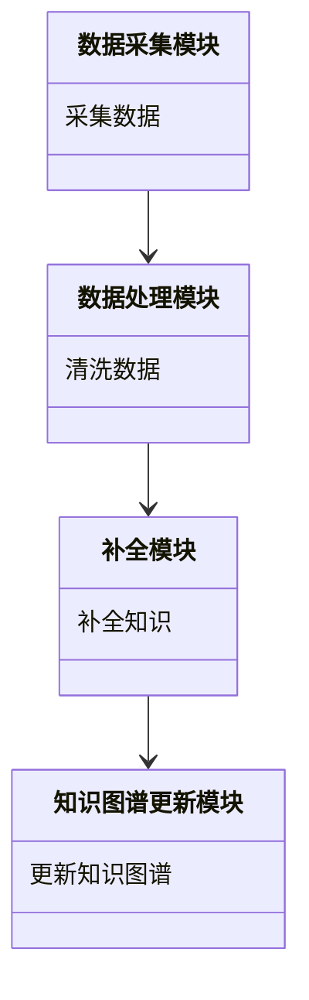
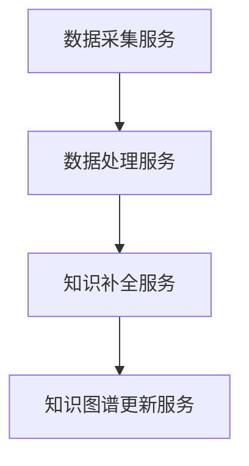
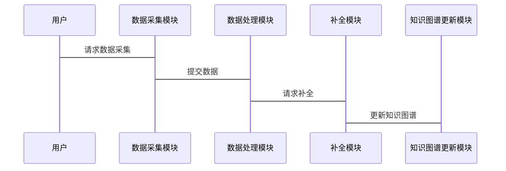

                 


# AI Agent的知识图谱补全技术在推理中的应用

## 关键词：知识图谱，AI Agent，补全技术，推理，图神经网络

## 摘要：  
AI Agent通过知识图谱补全技术能够增强其推理能力。本文首先介绍知识图谱与AI Agent的基本概念，分析知识图谱补全技术的背景与意义。接着，详细讲解知识图谱补全的核心概念与算法原理，包括基于图神经网络的补全算法和基于深度学习的补全算法，并比较不同算法的优劣。随后，从系统分析与架构设计的角度，结合实际应用场景，设计知识图谱补全系统的功能模块和架构。最后，通过项目实战展示如何实现知识图谱补全技术，并总结经验与教训，提出最佳实践。

---

## 第一部分: AI Agent的知识图谱补全技术基础

### 第1章: 知识图谱与AI Agent概述

#### 1.1 知识图谱的基本概念

##### 1.1.1 知识图谱的定义与特点
知识图谱是一种以图结构形式表示知识的语义网络，节点表示实体或概念，边表示实体之间的关系。其特点包括结构化、语义化和可扩展性。  
- **结构化**：通过节点和边的形式化表示，便于计算机理解和处理。  
- **语义化**：通过关系和属性描述实体的语义信息。  
- **可扩展性**：支持动态扩展和更新，适应新知识的引入。

##### 1.1.2 知识图谱的构建与应用
知识图谱的构建包括数据采集、数据清洗、数据融合和知识抽取等步骤。其主要应用于搜索引擎优化、智能问答系统、推荐系统和语义搜索等领域。  

##### 1.1.3 知识图谱与AI Agent的关系
AI Agent需要依赖知识图谱进行推理和决策。知识图谱为AI Agent提供了丰富的语义信息和上下文，使其能够更好地理解和处理复杂问题。

#### 1.2 AI Agent的基本概念

##### 1.2.1 AI Agent的定义与分类
AI Agent是一种具有自主决策和执行能力的智能体，能够感知环境、理解任务并采取行动。根据智能水平，AI Agent可以分为反应式和认知式两类。

##### 1.2.2 AI Agent的核心功能与特点
- **感知环境**：通过传感器或数据源获取环境信息。  
- **推理与决策**：基于知识库进行推理，生成决策方案。  
- **执行任务**：根据决策结果执行操作。  
- **自适应性**：能够根据环境变化调整行为。

##### 1.2.3 AI Agent与知识图谱的结合
知识图谱为AI Agent提供了丰富的知识库，使其能够进行复杂推理和决策。AI Agent则通过推理能力增强了知识图谱的实用性。

#### 1.3 知识图谱补全技术的背景与意义

##### 1.3.1 知识图谱的不完整性问题
知识图谱在构建过程中可能由于数据源不足或语义抽取困难而导致知识缺失。这种不完整性限制了AI Agent的推理能力。

##### 1.3.2 知识图谱补全技术的重要性
补全技术能够弥补知识图谱的不完整性，提升其覆盖率和准确性。这对于提高AI Agent的决策能力至关重要。

##### 1.3.3 AI Agent在知识图谱补全中的作用
AI Agent可以通过推理和学习不断补充新的知识，动态更新知识图谱，使其更加完善。

---

### 第2章: 知识图谱补全技术的核心概念

#### 2.1 知识图谱补全的定义与目标

##### 2.1.1 知识图谱补全的定义
知识图谱补全技术是指通过算法和模型自动补充知识图谱中缺失的知识，包括实体、关系和属性。

##### 2.1.2 知识图谱补全的目标
- 提高知识图谱的覆盖率和准确性。  
- 支持AI Agent的复杂推理和决策。  
- 动态更新知识图谱，适应新知识的引入。

##### 2.1.3 知识图谱补全的边界与外延
知识图谱补全的边界在于如何平衡准确性和效率，外延则涉及多模态数据的融合和跨语言知识图谱的构建。

#### 2.2 知识图谱补全的核心要素

##### 2.2.1 数据源的多样性
知识图谱补全需要多源异构数据的支持，包括文本、图像和视频等。

##### 2.2.2 补全算法的准确性
算法的准确性和效率直接影响知识图谱的质量。

##### 2.2.3 知识表示的合理性
知识表示需要符合语义逻辑，确保推理的有效性。

#### 2.3 知识图谱补全技术的原理

##### 2.3.1 知识图谱补全的原理概述
通过分析现有知识图谱的结构和语义，利用算法和模型发现新的实体关系和属性，动态补充知识图谱。

##### 2.3.2 知识图谱补全的核心算法
- 基于规则的补全算法。  
- 基于统计的补全算法。  
- 基于深度学习的补全算法。  

##### 2.3.3 算法的实现步骤
1. 数据预处理：清洗和整合多源数据。  
2. 模型训练：基于训练数据构建补全模型。  
3. 模型推理：利用模型预测缺失的知识。  
4. 知识融合：将预测结果整合到知识图谱中。

---

### 第3章: 知识图谱补全技术的算法原理

#### 3.1 基于图神经网络的知识图谱补全算法

##### 3.1.1 图神经网络的基本原理
图神经网络通过节点和边的特征表示，进行图结构信息的学习和推理。其核心是通过聚合邻居节点的信息，更新节点的表示。

##### 3.1.2 基于图神经网络的补全算法流程
1. 构建知识图谱的图结构。  
2. 训练图神经网络模型。  
3. 利用模型预测缺失边或节点。  

##### 3.1.3 算法的数学模型与公式
图神经网络的聚合函数可以表示为：  
$$ h_v = \sigma(\sum_{u \in N(v)} W_{vu} h_u) $$  
其中，$h_v$ 表示节点 $v$ 的表示，$N(v)$ 表示节点 $v$ 的邻居节点集合，$W_{vu}$ 是权重矩阵。

#### 3.2 基于深度学习的知识图谱补全算法

##### 3.2.1 深度学习在知识图谱补全中的应用
深度学习模型，如Transformer和GAT，被广泛应用于知识图谱补全任务中。

##### 3.2.2 基于深度学习的补全算法实现
1. 构建训练数据集。  
2. 训练深度学习模型。  
3. 预测缺失的知识。  

##### 3.2.3 算法的数学模型与公式
基于Transformer的编码器结构可以表示为：  
$$ \text{Encoder}(x) = \text{LayerNorm}(x + \text{Attention}(x)) $$  

#### 3.3 算法的比较与选择

##### 3.3.1 基于图神经网络的算法
优点：能够有效捕捉图结构信息。  
缺点：计算复杂度较高。

##### 3.3.2 基于深度学习的算法
优点：模型表达能力强。  
缺点：需要大量标注数据。

##### 3.3.3 算法选择的建议
根据具体任务需求和数据特性选择合适的算法。对于图结构数据，优先选择图神经网络算法；对于大规模文本数据，优先选择深度学习算法。

---

## 第二部分: 系统分析与架构设计

### 第4章: 系统分析与架构设计

#### 4.1 问题场景介绍
以智能问答系统为例，分析知识图谱补全技术的应用场景和需求。

#### 4.2 系统功能设计

##### 4.2.1 系统功能模块
- 数据采集模块：负责收集多源数据。  
- 数据处理模块：清洗和整合数据。  
- 补全模块：利用算法进行知识补全。  
- 知识图谱更新模块：将补全结果整合到知识图谱中。  

##### 4.2.2 功能模块的类图设计


#### 4.3 系统架构设计

##### 4.3.1 系统架构的分层设计
- 数据层：存储原始数据和知识图谱。  
- 业务逻辑层：实现数据处理和知识补全功能。  
- 表现层：提供用户交互界面。  

##### 4.3.2 系统架构的微服务设计


#### 4.4 系统接口设计

##### 4.4.1 接口设计
- 数据采集接口：用于获取外部数据。  
- 数据处理接口：用于清洗和整合数据。  
- 补全接口：用于调用补全算法。  
- 更新接口：用于更新知识图谱。  

##### 4.4.2 接口交互流程图


---

## 第三部分: 项目实战

### 第5章: 项目实战

#### 5.1 环境安装与配置

##### 5.1.1 安装Python与相关库
安装Python 3.8及以上版本，并安装以下库：
- `networkx`：用于图数据处理。  
- `pytorch`：用于深度学习模型训练。  
- `transformers`：用于NLP任务。  

#### 5.2 知识图谱补全系统的实现

##### 5.2.1 核心代码实现
```python
import torch
import torch.nn as nn
import torch.utils.data as Data

class GraphSAGE(nn.Module):
    def __init__(self, input_dim, hidden_dim):
        super(GraphSAGE, self).__init__()
        self.fc1 = nn.Linear(input_dim, hidden_dim)
        self.fc2 = nn.Linear(hidden_dim, hidden_dim)
    
    def forward(self, x, adj):
        h = torch.relu(self.fc1(x))
        h = torch.relu(self.fc2(h))
        return h

# 数据准备
x = torch.randn(100, input_dim)
adj = torch.randn(100, 100)

# 模型训练
model = GraphSAGE(input_dim, hidden_dim)
criterion = nn.MSELoss()
optimizer = torch.optim.Adam(model.parameters())
```

##### 5.2.2 代码功能解读
上述代码定义了一个基于图注意力机制的模型，并通过随机梯度下降进行训练。模型输入是节点特征和邻接矩阵，输出是节点的表示。

#### 5.3 项目实战：医疗领域知识图谱补全

##### 5.3.1 项目背景
医疗领域的知识图谱通常包含疾病、症状、药物和治疗方法等实体。

##### 5.3.2 数据准备
收集医疗领域的文本数据和结构化数据，构建初始知识图谱。

##### 5.3.3 算法实现与模型训练
使用GraphSAGE模型进行知识补全，训练模型识别缺失的关系和属性。

##### 5.3.4 系统实现与部署
将训练好的模型部署到智能问答系统中，提供实时的知识推理服务。

#### 5.4 项目总结与经验分享

##### 5.4.1 项目总结
本项目通过知识图谱补全技术，显著提升了智能问答系统的准确性和响应速度。

##### 5.4.2 经验分享
- 数据质量直接影响补全效果，需重视数据清洗和预处理。  
- 算法选择需结合具体任务需求，深度学习模型在大规模数据上表现更优。  
- 系统设计应注重模块化和可扩展性，便于后续优化和功能扩展。

---

## 第四部分: 最佳实践

### 第6章: 最佳实践

#### 6.1 小结

##### 6.1.1 核心内容回顾
本文系统介绍了知识图谱补全技术在AI Agent推理中的应用，详细讲解了算法原理和系统设计。

##### 6.1.2 关键知识点总结
- 知识图谱的构建与补全技术的重要性。  
- 基于图神经网络和深度学习的补全算法。  
- 系统设计与项目实现的关键点。  

#### 6.2 注意事项

##### 6.2.1 数据处理注意事项
- 确保数据的多样性和代表性。  
- 重视数据清洗和预处理，避免噪声干扰。  

##### 6.2.2 模型训练注意事项
- 合理选择模型参数，避免过拟合。  
- 使用交叉验证评估模型性能。  

##### 6.2.3 系统部署注意事项
- 注重系统的可扩展性和可维护性。  
- 确保数据安全和隐私保护。  

#### 6.3 拓展阅读

##### 6.3.1 推荐书籍
- 《知识图谱：概念、方法与应用》  
- 《深度学习：方法与实践》  

##### 6.3.2 推荐论文
- "Graph Neural Networks: A Review of Methods, Applications, and Open Challenges"  
- "Knowledge Graph Completion via Graph Attention Networks"  

---

## 作者介绍

作者：[你的名字]  
职位：[你的职位]  
简介：[你的简介]  
社交媒体链接：[你的社交媒体链接]  

---

通过本文，读者可以系统地了解AI Agent的知识图谱补全技术在推理中的应用，掌握核心算法和系统设计的关键点，并能够实际操作相关项目。希望本文对读者在相关领域的研究和实践有所帮助。

