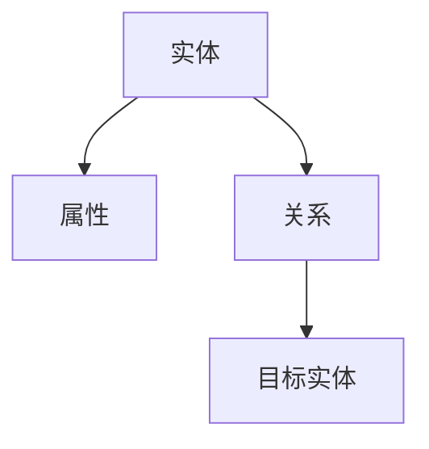
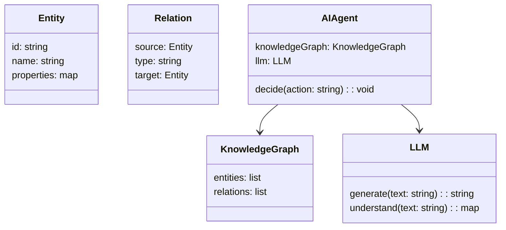
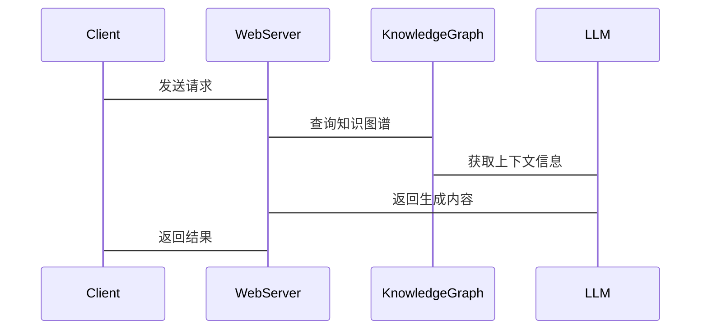

                 


# AI Agent的知识图谱：整合LLM与结构化知识库

## 关键词：知识图谱，大语言模型，AI Agent，LLM，结构化知识库

## 摘要：  
随着人工智能技术的飞速发展，知识图谱与大语言模型（LLM）的结合成为提升AI Agent智能水平的关键技术。本文将深入探讨知识图谱的构建与管理、LLM的工作原理及其与知识图谱的整合方法，通过算法原理、系统架构设计和实际案例分析，全面解析AI Agent的知识图谱整合技术。从理论到实践，本文将为读者提供系统化的知识体系和技术实现方案，帮助读者理解如何通过整合LLM与结构化知识库，构建高效、智能的AI Agent系统。

---

# 第1章: 问题背景与目标

## 1.1 问题背景

### 1.1.1 从传统知识库到知识图谱的演进  
传统的知识库通常以结构化数据形式存在，例如关系型数据库，但其灵活性和可扩展性有限。随着大数据和人工智能技术的发展，知识图谱作为一种语义网络，能够更好地表示复杂的实体关系，成为现代智能系统的核心组件。

### 1.1.2 大语言模型（LLM）的崛起  
大语言模型（如GPT、BERT）通过海量数据的预训练，具备强大的自然语言处理能力。然而，LLM在处理结构化知识和复杂推理任务时仍存在局限性，需要结合外部知识库进行优化。

### 1.1.3 AI Agent的定义与特点  
AI Agent是一种能够感知环境、执行任务的智能实体。它需要结合知识图谱的结构化知识和LLM的自然语言处理能力，才能在复杂场景中实现高效决策。

## 1.2 问题描述

### 1.2.1 知识图谱与LLM的结合需求  
知识图谱提供结构化知识，而LLM擅长生成和理解自然语言。两者的结合能够弥补各自的不足，提升AI Agent的智能水平。

### 1.2.2 AI Agent在智能系统中的角色  
AI Agent需要通过知识图谱获取上下文信息，利用LLM进行语言理解和生成，完成复杂任务。

### 1.2.3 当前技术的局限性与挑战  
当前技术在知识图谱构建、LLM与知识图谱的整合以及AI Agent的实时决策能力方面仍面临诸多挑战。

## 1.3 问题解决

### 1.3.1 知识图谱的构建与管理  
通过实体识别、关系抽取等技术，构建高质量的知识图谱。

### 1.3.2 LLM与知识图谱的整合方法  
通过知识增强的LLM训练和知识图谱驱动的生成与推理，实现LLM与知识图谱的高效结合。

### 1.3.3 AI Agent的知识驱动与决策优化  
利用知识图谱和LLM的结合，优化AI Agent的决策过程，提升其智能水平。

---

# 第2章: 核心概念与联系

## 2.1 知识图谱与LLM的原理

### 2.1.1 知识图谱的构建与表示  
知识图谱通过实体识别、关系抽取等技术构建，以图结构形式表示知识。

### 2.1.2 LLM的工作原理与特点  
LLM通过大规模预训练，具备强大的语言理解和生成能力，但缺乏结构化知识。

### 2.1.3 知识图谱与LLM的结合方式  
通过知识增强的LLM训练、知识图谱驱动的生成与推理等方式，实现两者的结合。

## 2.2 核心概念对比

### 2.2.1 知识图谱与传统数据库的对比  
| 特性         | 知识图谱                     | 传统数据库                 |
|--------------|-----------------------------|-----------------------------|
| 数据结构     | 图结构，支持复杂关系         | 表结构，支持简单关系         |
| 可扩展性     | 高                          | 低                          |
| 知识表示     | 语义丰富                   | 语义有限                   |

### 2.2.2 LLM与传统NLP模型的对比  
| 特性         | LLM                         | 传统NLP模型                 |
|--------------|-----------------------------|-----------------------------|
| 参数规模     | 大型或超大规模               | 小型或中型                   |
| 训练数据     | 海量多样                    | 有限且特定                  |
| 任务能力     | 多任务通用                   | 专注于特定任务               |

### 2.2.3 AI Agent与传统智能体的对比  
| 特性         | AI Agent                     | 传统智能体                 |
|--------------|-----------------------------|-----------------------------|
| 智能水平     | 高度智能化                   | 较低或无智能                 |
| 任务能力     | 复杂任务                     | 简单任务                     |
| 知识来源     | 知识图谱和LLM结合            | 仅依赖预设规则或数据         |

## 2.3 实体关系图架构



---

# 第3章: 算法原理与数学模型

## 3.1 知识图谱构建算法

### 3.1.1 实体识别与抽取  
通过自然语言处理技术，从文本中提取实体。

### 3.1.2 关系抽取与推理  
通过模式匹配或深度学习模型，识别实体之间的关系。

### 3.1.3 知识融合与优化  
通过冲突检测和合并，优化知识图谱的质量。

## 3.2 LLM与知识图谱的结合算法

### 3.2.1 知识增强的LLM训练  
通过将知识图谱嵌入到LLM的训练数据中，增强模型的领域知识。

### 3.2.2 知识图谱驱动的生成与推理  
利用知识图谱中的实体关系，指导LLM的生成和推理过程。

### 3.2.3 基于知识图谱的上下文理解  
通过知识图谱提供上下文信息，提升LLM的理解能力。

## 3.3 数学模型与公式

### 3.3.1 知识图谱表示模型  
知识图谱可以通过向量空间模型表示：

$$
E(e, r, e') = \text{score}(e, r, e')
$$

其中，$e$、$r$、$e'$分别表示实体、关系和目标实体。

### 3.3.2 LLM的概率生成模型  
LLM的生成过程基于概率模型：

$$
P(w_{n}|w_{1}, w_{2}, ..., w_{n-1}) = \text{score}(w_{n}|w_{1}, ..., w_{n-1})
$$

---

# 第4章: 系统分析与架构设计方案

## 4.1 问题场景介绍  
本节将介绍AI Agent在实际应用中的问题场景，例如智能问答系统。

## 4.2 系统功能设计

### 4.2.1 领域模型设计  


### 4.2.2 系统架构设计  


### 4.2.3 系统接口设计  
定义系统的交互接口，例如API接口。

### 4.2.4 系统交互流程  


---

# 第5章: 项目实战

## 5.1 环境安装  
安装必要的依赖，例如Python、TensorFlow、Keras等。

## 5.2 系统核心实现源代码

### 5.2.1 知识图谱构建代码  
```python
class Entity:
    def __init__(self, id, name):
        self.id = id
        self.name = name
        self.properties = {}
```

### 5.2.2 LLM与知识图谱的结合代码  
```python
def generate_with_knowledge(llm, knowledge_graph, prompt):
    # 获取上下文信息
    context = knowledge_graph.get_context()
    # 调用LLM生成内容
    response = llm.generate(prompt + context)
    return response
```

## 5.3 实际案例分析  
通过实际案例分析，展示如何在智能问答系统中应用知识图谱和LLM。

## 5.4 项目小结  
总结项目的实现过程和经验教训。

---

# 第6章: 总结与展望

## 6.1 总结  
本文系统地介绍了AI Agent的知识图谱整合技术，从理论到实践，全面解析了相关技术和实现方法。

## 6.2 未来展望  
未来，随着技术的进步，知识图谱与LLM的结合将更加紧密，AI Agent的智能水平将进一步提升。

## 6.3 最佳实践 tips  
- 定期更新知识图谱，保持其准确性。
- 在实际应用中，结合具体场景优化系统性能。

---

通过本文的系统化讲解，读者可以全面理解AI Agent的知识图谱整合技术，并能够将其应用到实际项目中，构建高效、智能的AI系统。

