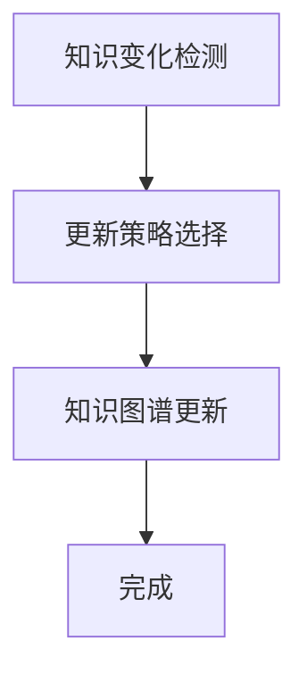
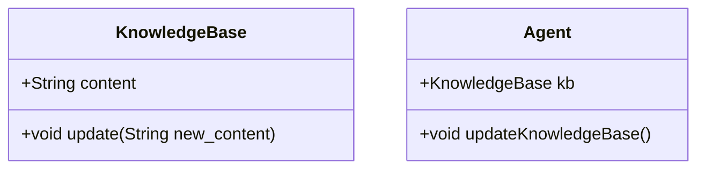
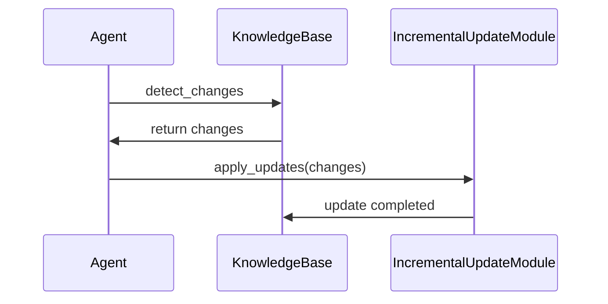

                 


# AI Agent的知识库增量更新策略：保持信息时效性

> 关键词：AI Agent，知识库，增量更新，信息时效性，算法原理，系统架构，最佳实践

> 摘要：本文详细探讨了AI Agent的知识库增量更新策略，重点分析了如何保持信息的时效性。通过介绍核心概念、算法原理、系统架构设计和实际案例分析，本文为AI Agent的知识库管理提供了全面的解决方案，帮助读者理解并实现高效的增量更新策略。

---

# 第一部分：AI Agent与知识库增量更新概述

## 第1章：AI Agent与知识库增量更新概述

### 1.1 问题背景与挑战

#### 1.1.1 知识库时效性问题的提出
知识库是AI Agent获取信息的主要来源，但信息的时效性是一个关键问题。随着时间推移，知识库中的部分信息可能变得不准确或过时，导致AI Agent的决策出现偏差。

#### 1.1.2 AI Agent在动态环境中的知识更新需求
AI Agent通常运行在动态环境中，需要实时或定期更新知识库以应对变化。例如，智能客服系统需要及时更新产品信息，医疗AI Agent需要更新最新的医学研究。

#### 1.1.3 当前知识库更新的痛点与局限性
传统的知识库更新方式通常采用全量更新，这种方法虽然能确保数据准确性，但存在资源消耗大、效率低的问题，尤其在处理大规模数据时表现不佳。

---

### 1.2 问题描述与目标

#### 1.2.1 知识库增量更新的核心问题
如何高效检测知识库的变化，并仅更新变化的部分，以减少资源消耗和时间成本。

#### 1.2.2 AI Agent的知识库更新目标
实现动态、高效、精准的知识库更新，确保信息的时效性和准确性。

#### 1.2.3 保持信息时效性的关键挑战
需要平衡更新频率与资源消耗，同时确保更新的信息能够及时反映最新变化。

---

### 1.3 解决方案与边界

#### 1.3.1 知识库增量更新的解决方案
采用增量更新策略，仅更新变化的部分，减少资源消耗。结合AI算法，提高更新的智能化水平。

#### 1.3.2 AI Agent的知识库更新边界
明确知识库更新的范围和优先级，避免过度更新或遗漏重要信息。

#### 1.3.3 信息时效性的衡量标准
根据信息类型和应用场景，设定不同的更新频率和优先级。

---

### 1.4 核心概念与结构

#### 1.4.1 AI Agent的定义与组成
AI Agent是一个智能实体，能够感知环境并采取行动。它通常包括感知模块、推理模块和执行模块。

#### 1.4.2 知识库的结构与属性
知识库由知识节点、关系和属性组成，每个节点代表一个实体或概念，关系描述节点之间的关联。

#### 1.4.3 增量更新的核心要素
增量更新涉及变化检测、更新策略选择和知识图谱更新三个关键步骤。

---

## 第2章：AI Agent知识库增量更新的核心概念

### 2.1 知识库的结构与属性

#### 2.1.1 知识库的层次结构
知识库通常分为概念层、数据层和存储层，不同层次的结构和功能各不相同。

#### 2.1.2 知识节点的属性与关系
每个知识节点有多个属性，如名称、类型、时间戳等，并通过关系连接形成知识图谱。

#### 2.1.3 知识图谱的构建与更新
知识图谱通过构建实体间的关系，形成语义网络，支持高效的语义检索和推理。

---

### 2.2 增量更新的机制与原理

#### 2.2.1 增量更新的基本原理
通过检测知识库中的变化，仅更新变化的部分，减少资源消耗。

#### 2.2.2 知识库变化检测的方法
采用时间戳、版本控制等技术，检测知识库中的变化。

#### 2.2.3 增量更新的触发条件
根据时间、事件或优先级触发更新，确保信息的时效性。

---

### 2.3 AI Agent的知识库更新策略

#### 2.3.1 基于时间的更新策略
定期检查知识库，按时间间隔更新信息，适用于时效性要求较高的场景。

#### 2.3.2 基于事件的更新策略
当检测到特定事件（如新信息发布）时，立即触发更新。

#### 2.3.3 基于优先级的更新策略
根据信息的重要性，优先更新高优先级的信息。

---

### 2.4 与相关技术的对比分析

#### 2.4.1 与传统知识库更新的区别
增量更新仅更新变化部分，而传统方法通常进行全量更新。

#### 2.4.2 与实时数据流处理的对比
增量更新侧重于知识库的更新，而实时数据流处理侧重于快速处理流数据。

#### 2.4.3 与机器学习模型更新的联系
增量更新与模型微调类似，通过更新部分数据或参数，保持模型的准确性。

---

## 第3章：知识库增量更新的算法原理

### 3.1 增量更新算法的流程

#### 3.1.1 知识变化检测
通过比较当前知识库和最新数据，检测是否有变化。

#### 3.1.2 更新策略选择
根据变化的类型和影响程度，选择合适的更新策略。

#### 3.1.3 知识图谱更新
仅更新变化的部分，保持知识图谱的完整性和准确性。

---

### 3.2 算法原理的数学模型

#### 3.2.1 知识节点的表示模型
使用图论中的节点和边表示知识节点及其关系。

#### 3.2.2 知识图谱的更新公式
$$ \text{更新公式} = \text{变化部分} \cup \text{旧部分} $$

#### 3.2.3 增量更新的优化算法
通过优化算法，减少更新过程中的计算量和资源消耗。

---

### 3.3 增量更新算法的实现

#### 3.3.1 算法流程图（Mermaid）


#### 3.3.2 核心代码实现
```python
def knowledge_update():
    changes = detect_changes(knowledge_base)
    if changes:
        apply_updates(changes)
    return knowledge_base
```

---

## 第4章：系统架构设计与实现

### 4.1 系统功能设计

#### 4.1.1 领域模型（Mermaid类图）


---

### 4.2 系统架构设计（Mermaid架构图）
```mermaid
archiecture
    [AI Agent] --(1)--> [知识库]
    [知识库] --(2)--> [增量更新模块]
    [增量更新模块] --(3)--> [外部数据源]
```

---

### 4.3 系统接口设计

#### 4.3.1 接口定义
- `detect_changes()`: 检测知识库的变化。
- `apply_updates()`: 应用变化到知识库。

#### 4.3.2 接口实现
```python
def detect_changes(kb):
    return kb.compare_with_latest_data()
```

---

### 4.4 系统交互（Mermaid序列图）


---

## 第5章：项目实战与案例分析

### 5.1 环境安装与配置

#### 5.1.1 环境要求
- Python 3.8+
- 必要的库：networkx, py2neo

#### 5.1.2 安装步骤
```bash
pip install networkx py2neo
```

---

### 5.2 核心代码实现

#### 5.2.1 知识变化检测
```python
def detect_changes(kb):
    return kb.get_diff_with_latest()
```

#### 5.2.2 更新策略选择
```python
def choose_update_strategy(changes):
    if changes.affect_critical_info():
        return 'urgent'
    else:
        return 'scheduled'
```

#### 5.2.3 知识图谱更新
```python
def apply_updates(changes):
    for change in changes:
        update_graph(change)
```

---

### 5.3 实际案例分析

#### 5.3.1 案例背景
一家电商公司的智能客服系统需要实时更新产品信息，确保客户咨询时信息准确。

#### 5.3.2 案例分析
通过增量更新策略，智能客服系统仅更新产品库存和价格的变化，减少更新频率和资源消耗。

---

## 第6章：最佳实践与注意事项

### 6.1 最佳实践

#### 6.1.1 策略选择
根据具体场景选择合适的更新策略，平衡资源消耗与信息时效性。

#### 6.1.2 系统架构
设计高效的系统架构，确保增量更新的可扩展性和可维护性。

#### 6.1.3 代码优化
优化代码性能，减少增量更新过程中的计算消耗。

---

### 6.2 小结

通过本文的分析，AI Agent的知识库增量更新策略在保持信息时效性方面具有重要的意义。采用合适的增量更新策略和高效的算法实现，能够显著提高系统的性能和资源利用率。

---

### 6.3 注意事项

- 定期测试和优化更新策略，确保系统的稳定性和准确性。
- 注意数据安全和隐私保护，确保更新过程中的数据不被泄露。
- 及时监控和处理更新过程中可能出现的异常情况。

---

## 第7章：总结与展望

### 7.1 总结

本文详细探讨了AI Agent的知识库增量更新策略，从概念到算法，再到系统实现，为读者提供了全面的解决方案。通过增量更新策略，AI Agent能够高效地保持知识库的时效性，提高系统的性能和用户体验。

---

### 7.2 展望

未来，随着AI技术的不断发展，增量更新策略将更加智能化和自动化。结合实时数据流处理和分布式系统架构，AI Agent的知识库增量更新将更加高效和灵活，为各种应用场景提供更强大的支持。

---

# 结语

通过本文的分析和探讨，希望读者能够深入了解AI Agent的知识库增量更新策略，并在实际应用中灵活运用这些策略，保持知识库的时效性，提升系统的整体性能。

