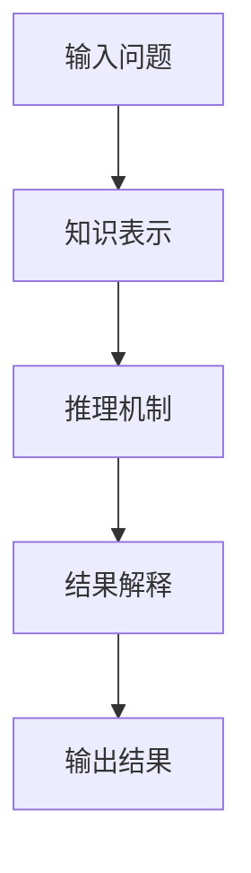

                 


# AI Agent的知识推理链：逐步解决复杂问题

---

## 关键词：
AI Agent、知识推理链、复杂问题解决、人工智能算法、知识表示、推理机制、系统架构

---

## 摘要：
本文探讨AI Agent如何通过知识推理链逐步解决复杂问题。知识推理链是AI Agent的核心机制，通过知识表示、推理机制和结果解释三个步骤，帮助AI Agent在复杂问题中找到最优解决方案。文章从基础知识、核心概念、算法原理、系统架构设计到项目实战，全面解析知识推理链的实现与应用，并通过案例分析和经验总结，为读者提供深入的技术洞察。

---

## 第1章: AI Agent与知识推理链概述

### 1.1 AI Agent的基本概念
AI Agent（人工智能代理）是能够感知环境、执行任务并做出决策的智能实体。它通过与环境交互，利用传感器获取信息，并通过执行器采取行动。AI Agent的核心特征包括自主性、反应性、目标导向性和社会性。

知识推理链是AI Agent实现复杂问题解决的关键机制，它通过一系列步骤将问题转化为可执行的解决方案。知识推理链的定义可以理解为：通过知识表示、推理机制和结果解释，将问题转化为可执行的解决方案的过程。

### 1.2 知识推理链的核心要素
知识推理链的核心要素包括知识表示、推理机制和结果解释。

- **知识表示**：将问题中的信息转化为计算机可理解的形式，通常采用符号逻辑、语义网络或概率图模型。
- **推理机制**：根据知识库中的信息，通过逻辑推理或概率推理，推导出新的结论。
- **结果解释**：将推理结果转化为人类可理解的形式，并提供解决方案。

### 1.3 知识推理链的应用场景
知识推理链在复杂问题解决中具有广泛应用，例如医疗诊断、金融风险评估、自动驾驶等领域。通过知识推理链，AI Agent能够处理复杂的信息，提供高效的解决方案。

---

## 第2章: 知识推理链的核心概念与联系

### 2.1 核心概念原理
知识推理链的核心概念包括知识表示、推理机制和结果解释。

- **知识表示**：通过符号逻辑或概率模型，将问题中的信息表示为计算机可处理的形式。
- **推理机制**：利用逻辑推理或概率推理，从已知信息推导出新的结论。
- **结果解释**：将推理结果转化为人类可理解的形式，并提供解决方案。

### 2.2 核心概念属性特征对比表格

| 概念       | 输入形式 | 输出形式 | 主要功能 | 示例 |
|------------|----------|----------|----------|------|
| 知识表示     | 文本、数据 | 符号、图模型 | 表示问题中的信息 | 将问题转化为符号逻辑 |
| 推理机制     | 符号、图模型 | 结论 | 推导出新的结论 | 根据症状推导疾病 |
| 结果解释     | 结论 | 自然语言 | 提供可理解的解决方案 | 解释推理结果 |

### 2.3 ER实体关系图架构

```mermaid
erd
    顾客
    订单
    产品
    供应商
    仓库
    顾客 --[购买]-> 订单
    订单 --[包含]-> 产品
    产品 --[来自]-> 供应商
    产品 --[存储]-> 仓库
```

---

## 第3章: 知识推理链的算法原理

### 3.1 算法原理讲解
知识推理链的算法流程包括知识表示、推理机制和结果解释三个步骤。

- **知识表示**：将问题中的信息转化为符号逻辑或概率图模型。
- **推理机制**：利用逻辑推理或概率推理，推导出新的结论。
- **结果解释**：将推理结果转化为自然语言，提供解决方案。

### 3.2 算法mermaid流程图



### 3.3 算法实现代码

```python
def knowledge_reasoning_chain(input):
    # 知识表示
    knowledge = represent_knowledge(input)
    # 推理机制
    result = infer(knowledge)
    # 结果解释
    explanation = explain(result)
    return explanation

def represent_knowledge(input):
    # 将输入转化为符号逻辑或概率图模型
    return "符号逻辑表示"

def infer(knowledge):
    # 利用逻辑推理或概率推理，推导出新的结论
    return "推理结果"

def explain(result):
    # 将推理结果转化为自然语言，提供解决方案
    return "解决方案"
```

### 3.4 数学模型与公式
- **知识表示的数学模型**：
  $$ P(A|B) = \frac{P(B|A)P(A)}{P(B)} $$
  例如，贝叶斯定理用于概率推理。

- **推理机制的数学公式**：
  $$ \text{结论} = \text{推理函数}(\text{前提}) $$
  例如，逻辑推理中，结论是前提的函数。

---

## 第4章: 系统分析与架构设计方案

### 4.1 问题场景介绍
以医疗诊断系统为例，AI Agent需要根据患者的症状、病史和检查结果，推断出可能的疾病，并提供诊断建议。

### 4.2 系统功能设计
- **领域模型设计**：
  ```mermaid
  classDiagram
      class Patient {
          + symptoms: list
          + medical_history: list
      }
      class Diagnosis {
          + disease: str
          +建议: list
      }
      Patient --> Diagnosis: 提供症状和病史
  ```

- **系统架构设计**：
  ```mermaid
  graph TD
      A[输入] --> B[知识库]
      B --> C[推理引擎]
      C --> D[结果]
      D --> E[输出]
  ```

- **系统接口设计**：
  - 输入接口：接收患者的症状和病史。
  - 输出接口：输出诊断结果和建议。

- **系统交互设计**：
  ```mermaid
  sequenceDiagram
      患者 ->> 系统: 提供症状和病史
      系统 ->> 知识库: 查询相关知识
      知识库 ->> 推理引擎: 提供知识
      推理引擎 ->> 系统: 返回诊断结果
      系统 ->> 患者: 提供诊断建议
  ```

---

## 第5章: 项目实战

### 5.1 环境安装
安装Python和相关库：
```bash
pip install numpy
pip install networkx
pip install matplotlib
```

### 5.2 系统核心实现源代码
```python
import networkx as nx
from matplotlib import pyplot as plt

def represent_knowledge(input):
    # 创建知识图谱
    G = nx.Graph()
    G.add_nodes_from(['症状', '疾病', '检查'])
    G.add_edges_from([('症状', '疾病'), ('疾病', '检查')])
    nx.draw(G, node_size=1500, font_size=12)
    plt.show()

def infer(knowledge):
    # 逻辑推理
    return knowledge['疾病']

def explain(result):
    # 提供诊断建议
    return f"建议进行{result}检查。"
```

### 5.3 代码应用解读与分析
- **represent_knowledge函数**：创建知识图谱，展示症状、疾病和检查之间的关系。
- **infer函数**：根据知识库推断出疾病。
- **explain函数**：提供诊断建议。

### 5.4 案例分析
以患者症状为“发热、咳嗽”，病史为“无”，推理出可能的疾病为“感冒”，并建议进行“体温测量和血常规检查”。

### 5.5 项目小结
通过知识推理链，AI Agent能够根据症状和病史，推断出疾病，并提供诊断建议，实现复杂问题的解决。

---

## 第6章: 最佳实践

### 6.1 小结
知识推理链是AI Agent解决复杂问题的核心机制，通过知识表示、推理机制和结果解释，帮助AI Agent找到最优解决方案。

### 6.2 注意事项
- 知识表示需要准确，否则推理结果可能不正确。
- 推理机制需要选择合适的算法，以提高推理的准确性。
- 结果解释需要清晰，以便用户理解。

### 6.3 拓展阅读
- 《人工智能：一种现代的方法》
- 《知识图谱与推理》

---

## 结语
通过本文的详细讲解，读者可以了解AI Agent如何通过知识推理链逐步解决复杂问题。从基础知识到系统架构设计，再到项目实战，我们全面解析了知识推理链的实现与应用。希望本文能够为读者在AI Agent和知识推理链的研究和应用中提供有益的指导。

--- 

如果需要进一步探讨或扩展内容，请随时告知！

