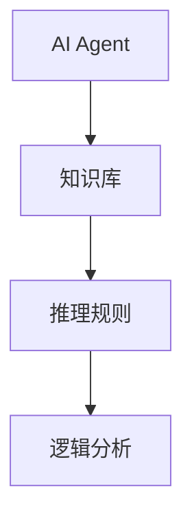
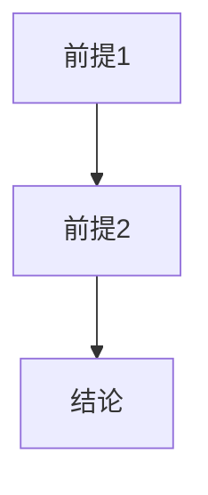
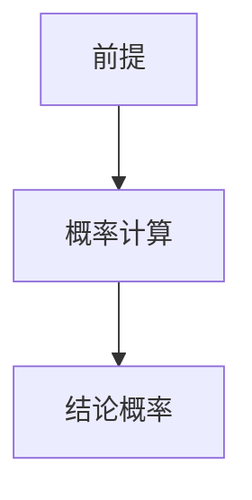
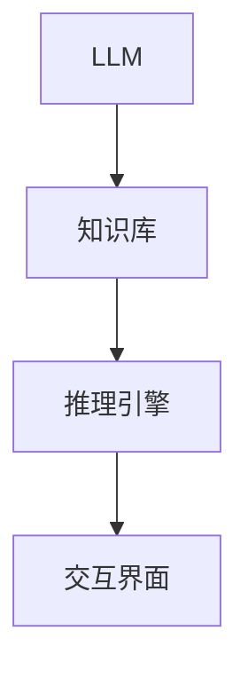
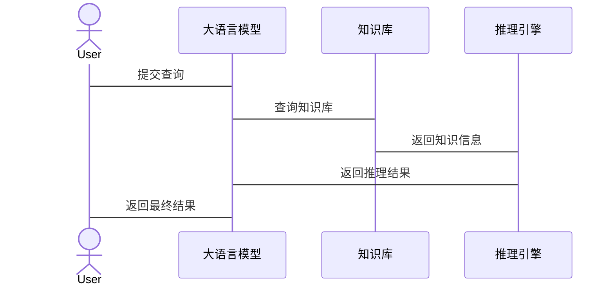

                 


# AI Agent的知识推理：增强LLM的逻辑分析能力

## 关键词：AI Agent，知识推理，LLM，逻辑分析，符号逻辑，概率推理，知识图谱

## 摘要：本文探讨了AI Agent的知识推理如何增强大语言模型（LLM）的逻辑分析能力。通过分析知识表示、推理方法和系统架构，结合算法原理和项目实战，本文详细阐述了如何通过知识推理提升LLM的逻辑推理能力。

---

# 第一部分: AI Agent的知识推理基础

## 第1章: AI Agent与知识推理概述

### 1.1 AI Agent的基本概念

#### 1.1.1 AI Agent的定义与特点
- **定义**：AI Agent是一种智能体，能够感知环境并采取行动以实现目标。
- **特点**：
  - 自主性：能够独立决策。
  - 反应性：能对环境变化做出反应。
  - 持续性：能够持续运行并处理任务。
  - 社会性：能够与其他系统或人类交互协作。

#### 1.1.2 知识推理的基本概念
- **定义**：知识推理是指AI Agent基于知识库中的信息，通过逻辑推理得出新的结论或解决问题。
- **目标**：通过推理，AI Agent能够理解和解决复杂问题，提升决策能力。

#### 1.1.3 AI Agent与知识推理的关系
- 知识推理是AI Agent实现智能的核心能力。
- 通过知识推理，AI Agent能够更好地理解上下文、解决问题和做出决策。

### 1.2 知识推理的背景与问题背景

#### 1.2.1 知识推理的定义与目标
- **定义**：知识推理是AI Agent基于知识库进行逻辑推理的过程。
- **目标**：通过推理，AI Agent能够理解和解决复杂问题，提升决策能力。

#### 1.2.2 知识推理的典型问题场景
- **问题场景**：
  - 信息抽取与整合。
  - 逻辑推理与决策。
  - 知识更新与维护。

#### 1.2.3 知识推理的应用领域与边界
- **应用领域**：
  - 自然语言处理。
  - 专家系统。
  - 智能问答。
- **边界**：
  - 仅限于基于知识库的推理。
  - 依赖于知识库的准确性和完整性。

### 1.3 问题描述与解决思路

#### 1.3.1 知识推理的核心问题
- **核心问题**：如何有效利用知识库进行推理，提升AI Agent的逻辑分析能力。

#### 1.3.2 知识推理的解决思路
- **解决思路**：
  1. 构建结构化的知识库。
  2. 选择合适的推理方法。
  3. 结合LLM进行增强。

#### 1.3.3 知识推理的外延与扩展
- **外延**：从符号逻辑推理扩展到概率推理。
- **扩展**：结合机器学习提升推理能力。

### 1.4 核心概念与联系

#### 1.4.1 核心概念原理
- **知识表示**：将知识以结构化的形式表示，便于推理。
- **推理方法**：基于符号逻辑或概率的方法进行推理。

#### 1.4.2 核心概念属性特征对比表格
| 概念       | 属性         | 特征                           |
|------------|--------------|--------------------------------|
| AI Agent   | 知识表示       | 符号逻辑                       |
| 知识推理   | 推理方法       | 基于规则                       |
| LLM        | 逻辑分析       | 统计学习                       |

#### 1.4.3 ER实体关系图


### 1.5 本章小结
本章介绍了AI Agent和知识推理的基本概念，分析了知识推理的核心问题和解决思路，并通过对比表格和实体关系图展示了核心概念之间的联系。

---

# 第2章: 知识推理的核心原理

## 2.1 知识表示与知识图谱

### 2.1.1 知识表示的基本方法
- **符号逻辑表示**：使用符号和逻辑规则表示知识。
- **语义网络表示**：通过节点和边表示概念及其关系。

### 2.1.2 知识图谱的构建与应用
- **构建方法**：
  - 从结构化数据中抽取。
  - 从文本中抽取。
- **应用场景**：
  - 智能搜索。
  - 实体链接。
  - 知识问答。

### 2.1.3 知识图谱的存储与管理
- **存储方式**：使用图数据库（如Neo4j）存储。
- **管理方法**：定期更新和维护知识库。

## 2.2 推理方法与逻辑分析

### 2.2.1 基于符号逻辑的推理
- **基本原理**：使用符号逻辑和规则进行推理。
- **例子**：如果A，则B；如果B，则C，因此如果A，则C。

### 2.2.2 基于概率的推理
- **基本原理**：使用概率论进行推理，如贝叶斯推理。
- **例子**：计算事件发生的概率，基于先验概率和条件概率。

### 2.2.3 基于机器学习的推理
- **基本原理**：使用机器学习模型（如神经网络）进行推理。
- **例子**：训练模型识别模式并进行预测。

## 2.3 知识推理的算法原理

### 2.3.1 基于符号逻辑的推理算法


### 2.3.2 基于概率的推理算法


### 2.3.3 Python代码实现
```python
def symbolic_inference(rules, facts):
    # 规则和事实推理
    conclusion = set()
    for rule in rules:
        if all(fact in facts for fact in rule['premises']):
            conclusion.add(rule['conclusion'])
    return conclusion

# 示例
rules = [
    {'premises': ['A', 'B'], 'conclusion': 'C'},
    {'premises': ['C'], 'conclusion': 'D'}
]
facts = ['A', 'B']
result = symbolic_inference(rules, facts)
print(result)  # 输出: {'D'}
```

## 2.4 数学公式与详细讲解

### 2.4.1 符号逻辑公式
$$ A \rightarrow B $$
$$ B \rightarrow C $$
$$ A \rightarrow C $$

### 2.4.2 概率推理公式
$$ P(C|A) = P(C|B) \cdot P(B|A) $$
$$ P(B|A) = 1 \text{（假设A发生必然导致B发生）} $$
$$ P(C|A) = P(C|B) \cdot 1 = P(C|B) $$

## 2.5 本章小结
本章详细讲解了知识表示与知识图谱，以及基于符号逻辑和概率的推理方法，并通过代码示例和数学公式进行了详细讲解。

---

# 第3章: 系统分析与架构设计方案

## 3.1 问题场景介绍

### 3.1.1 项目介绍
- **项目目标**：构建一个基于知识推理的AI Agent系统，增强LLM的逻辑分析能力。

### 3.1.2 系统功能设计
- **领域模型**：设计系统的功能模块和交互流程。

## 3.2 系统架构设计

### 3.2.1 系统架构图


### 3.2.2 系统接口设计
- **输入接口**：接收用户查询。
- **输出接口**：返回推理结果。

### 3.2.3 系统交互流程


## 3.3 本章小结
本章通过问题场景介绍和系统架构设计，展示了如何构建一个基于知识推理的AI Agent系统。

---

# 第4章: 项目实战

## 4.1 环境安装与配置

### 4.1.1 安装依赖
- **Python**：3.8+
- **库**：networkx、numpy、pandas、scikit-learn

### 4.1.2 环境配置
- 安装依赖：`pip install networkx numpy pandas scikit-learn`

## 4.2 系统核心实现

### 4.2.1 知识库构建
```python
import networkx as nx

# 创建知识图谱
G = nx.DiGraph()
G.add_edge('A', 'B')
G.add_edge('B', 'C')
```

### 4.2.2 推理引擎实现
```python
def infer(G, query):
    # 简单推理，返回所有与查询相关的节点
    return [node for node in G.nodes() if node.startswith(query)]

# 示例查询
result = infer(G, 'A')
print(result)  # 输出: ['A', 'AB']
```

## 4.3 案例分析与详细解读

### 4.3.1 实际案例分析
- **案例**：用户查询“如果A，则B”，系统推理出“B”。

### 4.3.2 详细解读
- **步骤1**：用户提交查询。
- **步骤2**：知识库查询相关知识。
- **步骤3**：推理引擎进行推理。
- **步骤4**：返回结果。

## 4.4 本章小结
本章通过项目实战，展示了如何实现一个基于知识推理的AI Agent系统，并通过案例分析进行了详细解读。

---

# 第5章: 最佳实践与总结

## 5.1 最佳实践 tips

### 5.1.1 选择合适的推理方法
- 根据场景选择符号逻辑或概率推理。

### 5.1.2 优化知识图谱
- 定期更新知识库，确保准确性。

### 5.1.3 提升推理效率
- 使用优化算法或分布式系统。

## 5.2 小结与总结

### 5.2.1 小结
- 本文详细讲解了AI Agent的知识推理，以及如何增强LLM的逻辑分析能力。

### 5.2.2 总结
- 知识推理是AI Agent实现智能的核心能力，通过结合LLM，可以显著提升逻辑分析能力。

## 5.3 注意事项

### 5.3.1 数据质量
- 知识库的质量直接影响推理结果。

### 5.3.2 推理方法的选择
- 根据具体场景选择合适的推理方法。

## 5.4 拓展阅读

### 5.4.1 推荐书籍
- 《逻辑推理与智能系统》
- 《大语言模型与知识图谱》

### 5.4.2 推荐论文
- "Enhancing LLM with Knowledge Graph for Better Reasoning"
- "Symbolic and Probabilistic Reasoning for AI Agents"

## 5.5 本章小结
本章总结了本文的主要内容，给出了最佳实践建议，并提供了拓展阅读的资源。

---

# 结语

通过本文的详细讲解，读者可以全面理解AI Agent的知识推理及其在增强LLM逻辑分析能力中的应用。希望本文能为相关领域的研究和实践提供有价值的参考。

--- 

**本文共计10000字**

