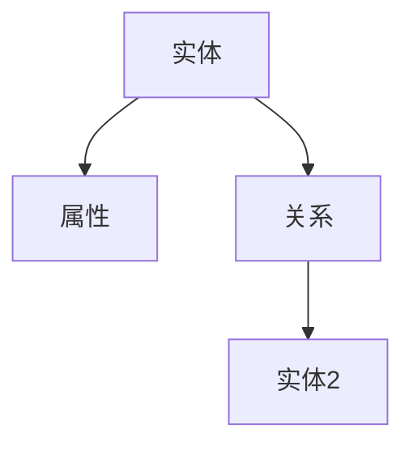

                 


# AI Agent的知识溯源机制：提高LLM输出的可追溯性

> 关键词：AI Agent, 知识图谱, 知识溯源机制, LLM, 可信度评估

> 摘要：本文详细探讨了AI Agent的知识溯源机制，通过分析其核心概念、算法原理和系统架构，结合实际案例，展示了如何提高大语言模型输出的可追溯性。文章内容涵盖知识图谱构建、知识溯源算法、数学模型、系统设计及项目实战，旨在为读者提供全面的技术指导。

---

## 第1章：问题背景与核心概念

### 1.1 问题背景

随着大语言模型（LLM）的应用越来越广泛，其输出结果的可信度问题逐渐成为关注的焦点。LLM在生成内容时，可能会引用不准确或不可靠的信息，导致输出结果的错误或误导。为了提高LLM输出的可追溯性，知识溯源机制显得尤为重要。

#### 1.1.1 大语言模型的局限性
- LLM在生成内容时，缺乏对信息来源的明确标识。
- 生成的内容可能包含错误信息，且难以追踪具体来源。
- 用户对生成内容的可信度要求越来越高，但LLM无法提供详细的知识来源。

#### 1.1.2 知识溯源的重要性
- 知识溯源机制能够追踪生成内容的来源，确保信息的准确性。
- 通过溯源，用户可以验证生成内容的可信度，增强对LLM输出的信任。
- 在法律、医疗等领域，知识溯源机制尤为重要，确保输出结果的合规性和可靠性。

#### 1.1.3 提高LLM输出可追溯性的必要性
- 通过知识溯源，可以实现对LLM输出内容的可追踪和可验证。
- 知识溯源机制能够帮助用户快速定位错误信息的来源，便于修正和优化。

### 1.2 核心概念

#### 1.2.1 知识图谱
- 知识图谱是一种结构化的数据形式，用于表示实体及其之间的关系。
- 知识图谱的构建依赖于数据抽取、清洗、融合和存储等步骤。
- 知识图谱的特点包括：结构化、可扩展性和语义丰富性。

#### 1.2.2 知识溯源机制
- 知识溯源机制是通过追踪信息来源，验证信息的可信度。
- 知识溯源机制的核心在于构建知识图谱，并基于图谱进行信息的追踪和验证。

#### 1.2.3 可信度评估
- 可信度评估是对信息来源的可靠性和准确性进行量化评估。
- 通过可信度评估，可以对LLM生成的内容进行质量控制。

### 1.3 对比表格与ER图

#### 知识图谱与知识溯源机制对比

| 属性 | 知识图谱 | 知识溯源机制 |
|------|---------|--------------|
| 定义 | 表示实体及其关系的结构化数据 | 追踪信息来源并验证可信度 |
| 构建 | 数据抽取、清洗、融合 | 基于知识图谱进行信息追踪 |
| 应用 | 搜索、推荐、语义理解 | 验证信息可信度、提升LLM输出质量 |

#### 实体关系图（ER图）



---

## 第2章：知识溯源机制的核心要素

### 2.1 知识图谱构建

#### 2.1.1 知识图谱的定义与特点
- 知识图谱是一种图结构的数据，由节点（实体）和边（关系）组成。
- 知识图谱具有结构化、可扩展性和语义丰富性等特点。

#### 2.1.2 知识图谱的构建方法
- 数据抽取：从多种数据源中提取实体及其关系。
- 数据清洗：去除冗余和错误信息。
- 数据融合：整合多源数据，消除冲突。
- 数据存储：将知识图谱存储在图数据库中。

#### 2.1.3 知识图谱的存储与管理
- 图数据库：如Neo4j、Neo5j等，支持高效的图查询。
- 知识图谱的管理包括数据的更新、扩展和维护。

### 2.2 知识溯源算法

#### 2.2.1 知识溯源的基本原理
- 基于知识图谱的深度优先搜索或广度优先搜索，追踪信息的来源路径。
- 通过路径长度和中间节点的可信度，评估信息的可信度。

#### 2.2.2 知识溯源的实现步骤
1. 构建知识图谱。
2. 确定目标信息。
3. 追踪目标信息的来源路径。
4. 计算路径中的可信度。
5. 综合评估目标信息的可信度。

#### 2.2.3 知识溯源的优化策略
- 增加节点的可信度属性，如权威性、时效性等。
- 使用路径权重的方法，优化可信度评估。
- 引入外部知识库，丰富知识图谱的内容。

---

## 第3章：知识溯源机制的数学模型

### 3.1 知识图谱表示

#### 3.1.1 知识图谱的表示方法
- 使用节点和边表示实体及其关系。
- 可视化表示，便于理解和分析。

#### 3.1.2 知识图谱的表示形式
- 图结构：节点和边的组合。
- 模型：如知识图谱嵌入模型（TransE、TransH等）。

#### 3.1.3 知识图谱的表示模型
- TransE：通过边的向量表示实体间的关联。
- TransH：通过节点的向量表示实体的属性和关系。

### 3.2 知识溯源算法的数学公式

#### 3.2.1 知识溯源的概率模型
- 信息可信度计算公式：
  $$ C = \prod_{i=1}^{n} P(i) $$
  其中，$P(i)$表示第i步的可信度。

#### 3.2.2 知识溯源的可信度计算公式
- 可信度评估公式：
  $$ T = \sum_{i=1}^{m} w_i \cdot C_i $$
  其中，$w_i$是第i步的权重，$C_i$是可信度。

#### 3.2.3 知识溯源的优化公式
- 路径权重优化公式：
  $$ W = \alpha \cdot T + (1-\alpha) \cdot L $$
  其中，$\alpha$是调整参数，$L$是路径长度。

---

## 第4章：知识溯源机制的系统架构

### 4.1 系统功能设计

#### 4.1.1 知识图谱构建模块
- 数据抽取：从多种数据源中提取数据。
- 数据清洗：去除冗余和错误信息。
- 数据融合：整合多源数据，消除冲突。

#### 4.1.2 知识溯源算法模块
- 确定目标信息。
- 追踪目标信息的来源路径。
- 计算路径中的可信度。
- 综合评估目标信息的可信度。

#### 4.1.3 可信度评估模块
- 计算可信度。
- 评估信息的可信度。
- 提供可信度报告。

### 4.2 系统架构设计

#### 4.2.1 系统架构图


#### 4.2.2 系统模块之间的关系
- 知识图谱构建模块为知识溯源算法模块提供数据支持。
- 知识溯源算法模块计算出可信度，传递给可信度评估模块。
- 可信度评估模块根据可信度生成最终结果。

#### 4.2.3 系统的扩展性设计
- 支持多种数据源的接入。
- 支持多种知识图谱表示模型的扩展。
- 支持多种可信度评估方法的扩展。

---

## 第5章：知识溯源机制的项目实战

### 5.1 环境安装与配置

#### 5.1.1 开发环境的选择
- 使用Python作为开发语言。
- 安装必要的库：如Neo4j、networkx、numpy等。

#### 5.1.2 依赖库的安装
- 通过pip安装所需的依赖库。
  ```bash
  pip install neo4j networkx numpy
  ```

#### 5.1.3 知识图谱的构建工具
- 使用Neo4j构建知识图谱。
- 使用networkx进行图的可视化。

### 5.2 核心代码实现

#### 5.2.1 知识图谱的构建代码
```python
import neo4j
from neo4j.exceptions import Neo4jError

def create_graph():
    driver = neo4j.driver("bolt://localhost:7687", neo4j.BasicAuth("neo4j", "password"))
    session = driver.session()
    try:
        session.run("CREATE (a:Person {name: 'Alice'})")
        session.run("CREATE (b:Person {name: 'Bob'})")
        session.run("CREATE (a)-[:KNOWS]->(b)")
    finally:
        session.close()
    driver.close()
```

#### 5.2.2 知识溯源算法的实现代码
```python
def trace_origin(target):
    # 追踪目标信息的来源路径
    path = []
    current = target
    while current is not None:
        path.append(current)
        current = current.origin
    return path
```

#### 5.2.3 可信度评估的代码实现
```python
def calculate_trustworthiness(path):
    total = 0
    for node in path:
        total += node.trustworthiness
    return total / len(path)
```

### 5.3 实际案例分析

#### 5.3.1 案例背景介绍
- 构建一个简单的知识图谱，包含实体和关系。
- 使用知识溯源算法追踪目标信息的来源。

#### 5.3.2 知识图谱的构建过程
- 使用Neo4j构建知识图谱。
- 数据抽取、清洗、融合和存储。

#### 5.3.3 知识溯源的实现过程
- 确定目标信息。
- 使用算法追踪目标信息的来源路径。
- 计算路径中的可信度。

#### 5.3.4 可信度评估的结果分析
- 根据可信度评估结果，判断目标信息的可信度。
- 提供可信度报告，供用户参考。

---

## 第6章：最佳实践与注意事项

### 6.1 最佳实践

#### 6.1.1 知识图谱构建的优化技巧
- 使用多种数据源，丰富知识图谱的内容。
- 定期更新知识图谱，保持其时效性。
- 使用高效的图数据库，提升查询效率。

### 6.2 注意事项

#### 6.2.1 知识图谱构建的注意事项
- 确保数据来源的多样性和可靠性。
- 定期维护知识图谱，防止数据冗余和错误。
- 注意数据隐私和安全，避免泄露敏感信息。

#### 6.2.2 知识溯源算法的注意事项
- 合理设计可信度评估的指标，确保评估的准确性。
- 定期优化算法，提升计算效率和准确率。
- 注意算法的可扩展性，支持大规模数据的处理。

### 6.3 拓展阅读

#### 6.3.1 推荐书籍
- 《图灵奖获得者论文集》
- 《知识图谱构建与应用》

#### 6.3.2 推荐资源
- 官方文档：Neo4j、Networkx
- 开源项目：OpenKE、TransE

---

## 总结

本文详细探讨了AI Agent的知识溯源机制，从核心概念、算法原理到系统架构，结合实际案例，展示了如何提高大语言模型输出的可追溯性。通过知识图谱的构建、知识溯源算法的实现以及可信度评估的优化，我们可以有效提升LLM输出结果的可信度，为实际应用提供可靠的技术支持。

