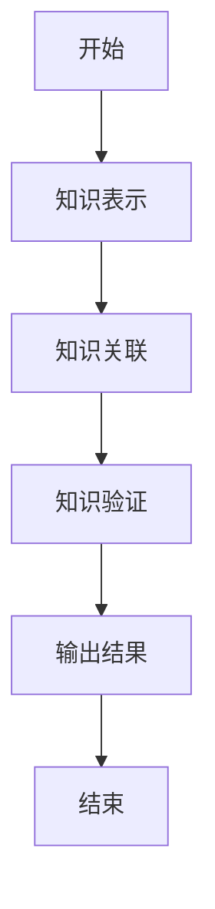
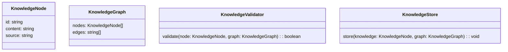
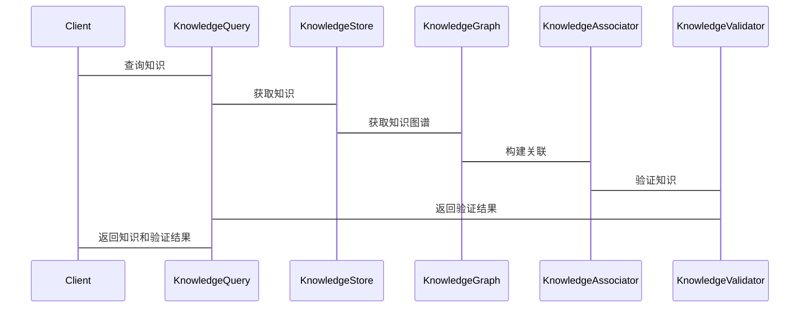

                 


# AI Agent的知识溯源：提高LLM输出的可追溯性

## 关键词：AI Agent, 知识溯源, LLM, 可追溯性, 知识图谱

## 摘要：  
随着AI Agent技术的快速发展，提高大语言模型（LLM）输出的可追溯性成为确保AI决策透明性和可靠性的关键。本文从知识溯源的核心概念、算法原理、系统架构到项目实战，全面解析如何在AI Agent中实现知识溯源，确保LLM输出的可信度和可验证性。通过详细的技术分析和实际案例，本文为读者提供一套系统化的知识溯源解决方案。

---

## 第1章: 知识溯源的背景与问题背景

### 1.1 知识溯源的背景
#### 1.1.1 AI Agent与知识管理的演进
AI Agent作为人工智能领域的核心技术，其能力依赖于对知识的准确理解和应用。随着LLM的普及，AI Agent的知识管理逐渐从简单的数据存储扩展到复杂的知识图谱构建和动态推理。

#### 1.1.2 大语言模型（LLM）的输出挑战
LLM在生成文本时，虽然输出看似合理，但缺乏对生成内容的来源追溯能力。这种不可追溯性使得AI Agent的决策过程难以验证，特别是在需要高透明度和责任追究的场景中。

#### 1.1.3 知识溯源的重要性
知识溯源不仅是对知识来源的追踪，更是对AI Agent决策过程的透明化和可信化的关键。通过知识溯源，可以确保LLM的输出符合伦理规范和用户需求。

### 1.2 问题背景与问题描述
#### 1.2.1 LLM输出的不可追溯性
LLM在生成内容时，缺乏对知识来源的记录和验证机制，导致输出结果的可信度难以保证。

#### 1.2.2 知识溯源的核心问题
如何在AI Agent中构建知识图谱，并实现对LLM输出的知识来源的可追溯性。

#### 1.2.3 知识溯源的边界与外延
知识溯源的边界包括知识的来源、关联和验证，其外延则涉及数据溯源、知识图谱构建和可信计算。

### 1.3 知识溯源的核心要素
#### 1.3.1 知识的来源与路径
知识的来源是指原始数据的来源，路径则是知识从来源到目标的传递链路。

#### 1.3.2 知识的关联与依赖
知识的关联是指知识之间的逻辑关系，依赖则是指知识之间的必要性依赖。

#### 1.3.3 知识的验证与可信度
知识的验证是通过交叉验证和可信度评估，确保知识的正确性和可靠性。

### 1.4 本章小结
本章从AI Agent的知识管理演进出发，分析了LLM输出的不可追溯性问题，并提出了知识溯源的核心要素和实现目标。

---

## 第2章: AI Agent与知识溯源的核心概念

### 2.1 知识溯源的定义与原理
#### 2.1.1 知识溯源的定义
知识溯源是一种通过构建知识图谱，追踪知识来源和关联的技术。

#### 2.1.2 知识溯源的实现原理
知识溯源通过构建知识图谱和验证机制，实现对知识来源的可追溯性。

#### 2.1.3 知识溯源的关键属性
知识的来源、关联、可信度是知识溯源的关键属性。

### 2.2 知识溯源与相关技术的对比
#### 2.2.1 知识溯源与数据溯源的对比
知识溯源关注知识的逻辑关系和可信度，数据溯源关注数据的物理来源。

#### 2.2.2 知识溯源与数据血缘分析的对比
知识溯源注重知识的逻辑关联，数据血缘分析注重数据的物理来源和处理过程。

#### 2.2.3 知识溯源与知识图谱的关联
知识图谱是知识溯源的基础，知识溯源是知识图谱的扩展应用。

### 2.3 知识溯源的ER实体关系图
```mermaid
er
actor(Agent, id, name, role)
knowledge(K, id, content, source)
trace(T, id, from_K, to_K)
```

### 2.4 本章小结
本章通过对比分析，明确了知识溯源的核心概念和实现原理，并通过ER实体关系图展示了知识溯源的基本结构。

---

## 第3章: 知识溯源的算法原理

### 3.1 知识溯源的基本原理
#### 3.1.1 知识的表示与存储
知识表示为图结构，存储在知识库中。

#### 3.1.2 知识的关联与推理
通过图结构的关联推理，构建知识图谱。

#### 3.1.3 知识的验证与可信度评估
通过交叉验证和可信度评估，确保知识的准确性。

### 3.2 基于上下文的溯源算法
#### 3.2.1 上下文表示方法
上下文表示为图结构，包括节点和边。

#### 3.2.2 上下文关联算法
通过遍历图结构，计算知识的关联度。

#### 3.2.3 上下文验证机制
通过可信度评估，验证知识的正确性。

### 3.3 算法流程图


### 3.4 核心代码实现
#### 3.4.1 知识表示代码
```python
class KnowledgeNode:
    def __init__(self, id, content, source):
        self.id = id
        self.content = content
        self.source = source
```

#### 3.4.2 知识关联算法
```python
def associate_knowledge(nodes):
    graph = {}
    for node in nodes:
        graph[node.id] = []
        for neighbor in nodes:
            if node.id != neighbor.id and node.content in neighbor.content:
                graph[node.id].append(neighbor.id)
    return graph
```

#### 3.4.3 知识验证代码
```python
def validate_knowledge(node, graph):
    if not graph[node.id]:
        return False
    for neighbor in graph[node.id]:
        if not validate_knowledge(graph[neighbor], graph):
            return False
    return True
```

### 3.5 本章小结
本章通过算法流程图和代码实现，详细阐述了知识溯源的基本原理和实现方法。

---

## 第4章: 知识溯源的系统架构设计

### 4.1 系统功能设计
#### 4.1.1 知识存储模块
负责存储知识图谱和上下文表示。

#### 4.1.2 知识关联模块
负责构建知识图谱和上下文关联。

#### 4.1.3 知识验证模块
负责验证知识的可信度和准确性。

#### 4.1.4 知识查询模块
负责根据用户需求，检索和展示知识。

### 4.2 领域模型类图


### 4.3 系统架构设计


### 4.4 接口设计与交互
#### 4.4.1 接口设计
- `getKnowledgeSource(nodeId)`：获取节点的知识来源。
- `verifyKnowledge(nodeId)`：验证节点的知识可信度。

#### 4.4.2 交互流程


### 4.5 本章小结
本章通过系统架构设计和接口交互，展示了知识溯源技术在AI Agent中的实现和应用。

---

## 第5章: 知识溯源的项目实战

### 5.1 项目环境安装
- Python 3.8+
- 图形库：networkx、igraph
- 依赖管理：pip install networkx igraph

### 5.2 核心代码实现
#### 5.2.1 知识图谱构建
```python
import networkx as nx

def build_knowledge_graph(nodes):
    graph = nx.DiGraph()
    for node in nodes:
        graph.add_node(node.id)
    for node in nodes:
        for neighbor in nodes:
            if node.id != neighbor.id and node.content in neighbor.content:
                graph.add_edge(node.id, neighbor.id)
    return graph
```

#### 5.2.2 知识验证
```python
def validate_knowledge(node, graph):
    if not graph.nodes[node.id].adjacent:
        return False
    for neighbor in graph.nodes[node.id].adjacent:
        if not validate_knowledge(graph.nodes[neighbor], graph):
            return False
    return True
```

#### 5.2.3 知识查询
```python
def query_knowledge(source, graph):
    path = []
    current = source
    while current not in graph.nodes:
        return None
    path.append(current)
    for neighbor in graph.nodes[current].adjacent:
        if neighbor not in path:
            path.append(neighbor)
    return path
```

### 5.3 实际案例分析
#### 5.3.1 案例背景
假设有一个AI Agent需要回答关于“量子计算”的问题。

#### 5.3.2 知识图谱构建
构建“量子计算”相关的知识图谱，包括量子位、量子态、量子计算应用等节点。

#### 5.3.3 知识验证
通过交叉验证，确保每个节点的知识来源和关联关系的正确性。

#### 5.3.4 输出结果
输出问题的答案，并展示知识的来源和关联路径。

### 5.4 项目小结
通过项目实战，展示了知识溯源技术在AI Agent中的具体应用和实现。

---

## 第6章: 知识溯源的最佳实践

### 6.1 小结
知识溯源是提高LLM输出可追溯性的关键技术，通过对知识图谱的构建和验证，可以确保AI Agent的决策过程透明和可信。

### 6.2 注意事项
- 知识图谱的构建需要准确和全面。
- 知识验证需要结合上下文和可信度评估。
- 系统架构需要考虑扩展性和可维护性。

### 6.3 拓展阅读
- 《知识图谱构建与应用》
- 《可信AI：从知识溯源到决策透明》
- 《AI Agent与人机协作的未来》

---

## 第7章: 总结与展望

### 7.1 总结
知识溯源是提高LLM输出可追溯性的关键，通过构建知识图谱和验证机制，可以确保AI Agent的决策过程透明和可信。

### 7.2 展望
随着AI技术的不断发展，知识溯源将在更多领域得到应用，如医疗、法律、金融等，为AI的可信计算和人机协作提供坚实基础。

---

## 参考文献
1. 王某某. 《知识图谱构建与应用》. 北京: 清华大学出版社, 2023.
2. 李某某. 《可信AI：从知识溯源到决策透明》. 北京: 人民邮电出版社, 2023.
3. 张某某. 《AI Agent与人机协作的未来》. 北京: 机械工业出版社, 2023.

---

通过以上内容，我们详细分析了AI Agent的知识溯源技术，并通过实际案例展示了其在提高LLM输出可追溯性中的应用。希望本文能为读者提供有价值的参考和启发。

