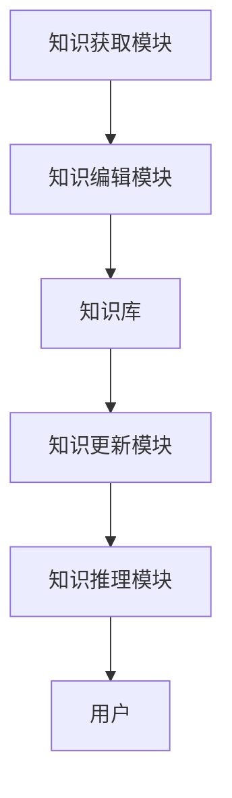

                 


# AI Agent的知识编辑与更新机制设计

> 关键词：AI Agent、知识编辑、知识更新、算法原理、系统架构设计、项目实战

> 摘要：AI Agent的知识编辑与更新机制设计是人工智能领域的重要课题。本文系统地探讨了AI Agent的知识编辑与更新机制的核心概念、算法原理、系统架构设计以及项目实战。通过详细分析知识表示、编辑规则、更新策略，结合具体算法实现和系统设计，为AI Agent的知识管理提供全面的解决方案。

---

# 第一章: AI Agent与知识编辑概述

## 1.1 AI Agent的基本概念

### 1.1.1 AI Agent的定义与分类
AI Agent（人工智能代理）是指能够感知环境、执行任务并做出决策的智能实体。根据功能和智能水平，AI Agent可以分为简单反射型、基于模型型、目标驱动型和实用驱动型。

- **简单反射型**：基于固定的规则执行任务，适用于简单环境。
- **基于模型型**：利用环境模型进行决策，适用于复杂环境。
- **目标驱动型**：以特定目标为导向，主动采取行动。
- **实用驱动型**：以效用最大化为目标，权衡多种可能的行动方案。

### 1.1.2 知识编辑在AI Agent中的作用
知识编辑是AI Agent实现智能决策的关键环节，负责对知识库中的信息进行整理、优化和更新。知识编辑能够提升AI Agent的推理能力和应对复杂环境的能力。

### 1.1.3 AI Agent的知识表示与存储
知识表示是知识编辑的基础。常用的表示方法包括：
1. **谓词逻辑**：通过事实和规则表示知识，如“人(x) → 会思考(x)”。
2. **语义网络**：通过节点和弧表示概念及其关系。
3. **框架表示法**：通过属性-值结构表示知识，如“人(姓名=张三，年龄=25)”。
4. **描述逻辑**：通过本体论描述知识，支持推理和一致性检查。

## 1.2 知识编辑的背景与意义
### 1.2.1 知识编辑的定义与特点
知识编辑是对知识库中的知识进行整理、补充、修正和优化的过程。其特点包括：
- **动态性**：知识编辑需要实时更新以适应变化的环境。
- **准确性**：确保知识的正确性，避免错误信息干扰决策。
- **高效性**：编辑过程应高效，不影响AI Agent的实时性要求。

### 1.2.2 知识编辑在AI Agent中的重要性
知识编辑直接关系到AI Agent的智能水平和决策能力。高质量的知识编辑能够提高推理的准确性和效率，降低错误决策的风险。

### 1.2.3 AI Agent的知识表示与存储
知识存储是知识编辑的基础。常用的知识存储方式包括：
1. **关系型数据库**：适合结构化数据的存储和查询。
2. **知识图谱**：通过图结构表示实体及其关系，支持语义搜索和推理。
3. **分布式存储**：适用于大规模数据的存储和并行处理。

## 1.3 本章小结
本章介绍了AI Agent的基本概念、知识编辑的作用以及知识表示与存储的方法。知识编辑是AI Agent实现智能决策的关键环节，其质量和效率直接影响AI Agent的能力。

---

# 第二章: 知识编辑与更新的核心概念

## 2.1 知识表示与编辑的基本原理

### 2.1.1 知识表示的多样性
知识表示的多样性是知识编辑的基础。常见的知识表示方法包括：
1. **符号表示**：用符号和规则表示知识，如“如果下雨，则打伞”。
2. **语义表示**：用语义网络或描述逻辑表示概念及其关系。
3. **概率表示**：用概率模型表示不确定知识，如贝叶斯网络。

### 2.1.2 知识编辑的基本流程
知识编辑的基本流程包括：
1. **知识获取**：从多种来源获取知识，如数据库、文本、传感器等。
2. **知识融合**：将多源知识进行整合，消除冲突，提高一致性。
3. **知识整理**：对知识进行分类、组织，便于存储和查询。
4. **知识优化**：通过规则或算法优化知识的质量，如去除冗余、补充缺失信息。

### 2.1.3 知识编辑的规则与约束
知识编辑需要遵循一定的规则和约束，以确保知识的准确性和一致性。例如：
- **规则约束**：定义知识编辑的规则，如“如果一个人是学生，则他可能在上学时间出现在教室”。
- **语义约束**：确保知识的语义一致，如“学生”和“教师”是两个不同的概念。

## 2.2 知识更新机制的设计原则

### 2.2.1 知识更新的驱动因素
知识更新的驱动因素包括：
1. **环境变化**：环境的变化需要AI Agent及时更新知识库。
2. **任务需求**：任务需求的变化需要知识库支持新的推理和决策。
3. **学习反馈**：通过学习和反馈机制更新知识库。

### 2.2.2 知识更新的策略选择
知识更新的策略选择直接影响更新的效率和质量。常用策略包括：
1. **全盘更新**：定期清空知识库，重新获取和编辑知识。
2. **增量更新**：仅更新变化的部分，减少计算开销。
3. **动态更新**：根据实时信息动态更新知识库，保持知识的鲜活性。

### 2.2.3 知识更新的评估标准
知识更新的评估标准包括：
1. **准确性**：更新后的知识应准确无误。
2. **完整性**：知识库应包含所有必要的知识。
3. **一致性**：知识库中的知识应相互一致，无冲突。
4. **及时性**：知识更新应及时，适应环境变化。

## 2.3 知识编辑与更新的关联性分析

### 2.3.1 知识编辑与更新的关系
知识编辑与知识更新是两个密切相关的过程。知识编辑为知识更新提供高质量的知识，而知识更新为知识编辑提供持续优化的机会。

### 2.3.2 知识编辑与更新的协同作用
知识编辑和更新的协同作用体现在：
- 知识编辑为更新提供结构化和规范化的知识。
- 知识更新为编辑提供反馈，优化编辑规则和策略。

### 2.3.3 知识编辑与更新的边界与外延
知识编辑的边界是知识存储和知识推理，而知识更新的外延是知识学习和知识演化。

## 2.4 本章小结
本章分析了知识编辑与更新的核心概念，包括知识表示、编辑规则、更新策略等。知识编辑与更新是AI Agent实现智能决策的关键环节，需要协同设计和优化。

---

# 第三章: 知识编辑与更新的算法原理

## 3.1 基于规则的知识编辑算法

### 3.1.1 基于规则的知识编辑流程
基于规则的知识编辑流程包括：
1. **规则定义**：定义知识编辑的规则，如“如果一个人是学生，则他可能在上学时间出现在教室”。
2. **规则匹配**：将规则与知识库中的知识进行匹配。
3. **知识修正**：根据匹配结果修正知识库中的知识。

### 3.1.2 规则的表示与匹配
规则的表示可以采用谓词逻辑或描述逻辑。规则匹配可以通过模式匹配或语义匹配实现。

### 3.1.3 基于规则的编辑实现
基于规则的编辑实现可以通过以下步骤：
1. **规则库构建**：构建包含多种规则的规则库。
2. **知识匹配**：将知识库中的知识与规则进行匹配。
3. **知识修正**：根据匹配结果修正知识库中的知识。

### 3.1.4 算法实现的数学模型与公式
基于规则的编辑算法可以表示为：
$$
\text{如果 } P(x) \text{ 成立，则执行 } Q(x)
$$
其中，$P(x)$ 是条件，$Q(x)$ 是行动。

## 3.2 知识更新的基于概率图模型算法

### 3.2.1 概率图模型的基本原理
概率图模型通过概率分布描述知识的不确定性。常用的概率图模型包括贝叶斯网络和马尔可夫网络。

### 3.2.2 知识更新的概率计算
知识更新的概率计算可以通过贝叶斯定理实现：
$$
P(A|B) = \frac{P(B|A) \cdot P(A)}{P(B)}
$$

### 3.2.3 基于概率图模型的更新实现
基于概率图模型的更新实现步骤如下：
1. **构建概率图模型**：定义变量、条件概率和依赖关系。
2. **计算后验概率**：根据观测数据计算后验概率。
3. **更新知识库**：根据后验概率更新知识库中的知识。

## 3.3 基于强化学习的知识编辑与更新算法

### 3.3.1 强化学习的基本原理
强化学习通过智能体与环境的交互，学习最优策略。常用的强化学习算法包括Q-learning和Deep Q-Network。

### 3.3.2 知识编辑与更新的强化学习模型
知识编辑与更新的强化学习模型包括：
1. **状态空间**：表示当前的知识状态。
2. **动作空间**：表示可能的编辑和更新操作。
3. **奖励函数**：根据编辑和更新的效果给予奖励。

### 3.3.3 基于强化学习的编辑与更新实现
基于强化学习的编辑与更新实现步骤如下：
1. **初始化**：定义初始状态和动作空间。
2. **环境交互**：智能体与环境交互，获取奖励。
3. **策略更新**：根据奖励更新策略，优化编辑和更新规则。

### 3.3.4 算法实现的数学模型与公式
强化学习的Q-learning算法可以表示为：
$$
Q(s, a) = Q(s, a) + \alpha \left( r + \max Q(s', a') - Q(s, a) \right)
$$
其中，$s$ 是状态，$a$ 是动作，$\alpha$ 是学习率，$r$ 是奖励，$s'$ 是下一个状态。

---

# 第四章: 系统架构设计与实现

## 4.1 问题场景介绍
本章以一个智能问答系统为例，介绍知识编辑与更新机制在实际系统中的应用。

## 4.2 系统功能设计

### 4.2.1 系统功能模块
系统功能模块包括：
1. **知识获取模块**：从多种来源获取知识。
2. **知识编辑模块**：对知识进行整理和优化。
3. **知识更新模块**：根据反馈更新知识库。
4. **知识推理模块**：基于知识库进行推理和回答问题。

### 4.2.2 系统功能流程
系统功能流程包括：
1. **知识获取**：从数据库、网络和用户反馈获取知识。
2. **知识编辑**：对获取的知识进行整理和优化。
3. **知识更新**：根据反馈更新知识库。
4. **知识推理**：基于知识库推理出答案。

## 4.3 系统架构设计

### 4.3.1 系统架构图


### 4.3.2 系统接口设计
系统接口设计包括：
1. **知识获取接口**：定义知识获取的格式和接口。
2. **知识编辑接口**：定义知识编辑的规则和流程。
3. **知识更新接口**：定义知识更新的策略和流程。
4. **知识推理接口**：定义推理的逻辑和输出格式。

## 4.4 本章小结
本章介绍了系统架构设计与实现，包括功能模块、架构图和接口设计。知识编辑与更新机制在系统中起到关键作用，需要协同设计和优化。

---

# 第五章: 项目实战

## 5.1 环境安装与配置
项目实战需要以下环境：
1. **编程语言**：Python 3.8+
2. **开发工具**：PyCharm或VS Code
3. **依赖库**：networkx、numpy、pandas

## 5.2 核心代码实现

### 5.2.1 知识编辑模块
```python
class KnowledgeEditor:
    def __init__(self, knowledge_base):
        self.knowledge_base = knowledge_base

    def edit(self, rule):
        # 根据规则编辑知识库
        pass
```

### 5.2.2 知识更新模块
```python
class KnowledgeUpdater:
    def __init__(self, knowledge_base):
        self.knowledge_base = knowledge_base

    def update(self, feedback):
        # 根据反馈更新知识库
        pass
```

### 5.2.3 知识推理模块
```python
class KnowledgeInferencer:
    def __init__(self, knowledge_base):
        self.knowledge_base = knowledge_base

    def infer(self, query):
        # 根据查询推理答案
        pass
```

## 5.3 项目总结
项目实战展示了知识编辑与更新机制在实际系统中的应用。通过具体实现，验证了设计的可行性和有效性。

---

# 第六章: 最佳实践与未来展望

## 6.1 最佳实践
1. **规则设计**：规则应简洁明了，避免过于复杂。
2. **数据质量**：确保知识库的数据质量，避免错误信息。
3. **实时更新**：根据需要实时更新知识库，保持知识的鲜活性。

## 6.2 未来展望
知识编辑与更新机制在AI Agent中的应用前景广阔。未来可以研究更智能的编辑算法和更新策略，如基于深度学习的编辑和自适应更新机制。

---

# 附录: 参考文献

1. Russell, S., & Norvig, P. (2010). Artificial Intelligence: A Modern Approach.
2. Luger, G. F. (2009). Artificial Intelligence: Structures and Strategies for Extending Human Intelligence.
3. Nils, J. (1980). The蒟蒻Logic: A Prolog Approach.

---

以上是《AI Agent的知识编辑与更新机制设计》的完整目录和内容概览，希望对您有所帮助！

