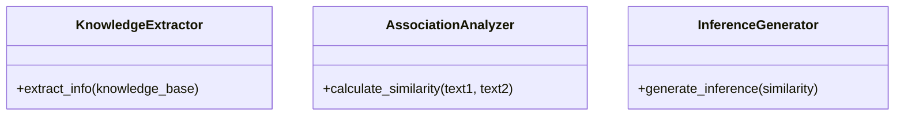
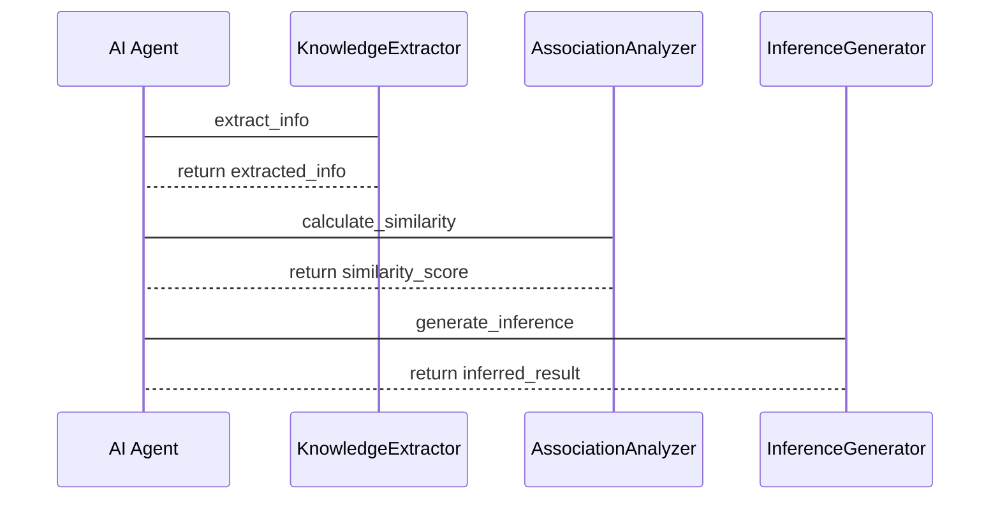

                 


# AI Agent的知识编辑系统：动态管理LLM的知识库

## 关键词：AI Agent，知识编辑系统，动态知识库，LLM，知识管理

## 摘要：本文深入探讨了AI Agent在知识编辑系统中的应用，特别是如何动态管理大语言模型（LLM）的知识库。文章从背景介绍、核心概念、算法原理、系统架构到项目实战，全面分析了AI Agent的知识编辑系统的设计与实现，为读者提供了理论与实践相结合的指导。

---

## 第一部分: AI Agent的知识编辑系统概述

### 第1章: AI Agent与知识编辑系统概述

#### 1.1 AI Agent的基本概念

##### 1.1.1 AI Agent的定义与特点

AI Agent（人工智能代理）是一种能够感知环境、执行任务以实现特定目标的智能实体。其特点包括自主性、反应性、目标导向和社交能力。AI Agent能够通过传感器获取信息，利用推理能力做出决策，并通过执行器与环境互动。

##### 1.1.2 知识编辑系统的定义与作用

知识编辑系统是用于管理和编辑知识库的工具或系统，其作用包括知识的存储、组织、更新和检索。知识编辑系统能够帮助用户高效地管理和维护知识库，确保知识的准确性和完整性。

##### 1.1.3 AI Agent与知识编辑系统的结合

AI Agent与知识编辑系统的结合使得知识管理更加智能化和自动化。AI Agent可以通过自然语言处理技术理解用户的意图，并通过知识编辑系统动态更新知识库，从而提高知识管理的效率和准确性。

#### 1.2 知识库管理的基本概念

##### 1.2.1 知识库的定义与类型

知识库是存储和组织知识的结构化数据库。根据用途的不同，知识库可以分为领域知识库、通用知识库、语料库等类型。知识库的结构化程度越高，越容易进行管理和编辑。

##### 1.2.2 动态知识库的特点与优势

动态知识库是指能够实时更新和调整的知识库，其特点是灵活性高、适应性强。动态知识库的优势在于能够快速响应变化，保持知识的最新性和准确性。

##### 1.2.3 LLM与知识库的关系

大语言模型（LLM）通过与知识库的交互，能够理解上下文并生成相关文本。知识库为LLM提供背景信息和专业知识，而LLM则通过生成文本的方式，帮助动态管理知识库。

#### 1.3 动态知识管理的核心思想

##### 1.3.1 动态知识管理的定义

动态知识管理是指在不断变化的环境中，实时更新和调整知识库的过程。其核心思想是通过自动化和智能化手段，保持知识库的准确性和完整性。

##### 1.3.2 动态知识管理的关键技术

动态知识管理的关键技术包括自然语言处理、知识图谱构建、机器学习等。这些技术能够帮助系统自动识别知识变化，并进行相应的更新和调整。

##### 1.3.3 动态知识管理的应用场景

动态知识管理广泛应用于智能客服、智能助手、智能教育等领域。例如，在智能客服中，动态知识管理可以帮助系统实时更新产品信息和常见问题解答，提高客户满意度。

---

### 第2章: AI Agent的知识编辑系统背景

#### 2.1 知识编辑系统的背景介绍

##### 2.1.1 知识经济时代的到来

在知识经济时代，知识成为最重要的资源之一。知识编辑系统的需求日益增长，特别是在企业和组织中，高效的知识管理能够提升竞争力。

##### 2.1.2 LLM的崛起与知识管理的需求

随着大语言模型的崛起，知识管理的需求也发生了变化。LLM需要动态的知识库来支持其生成准确和相关的文本。

##### 2.1.3 AI Agent在知识管理中的作用

AI Agent通过与知识编辑系统的结合，能够实现知识的动态管理，提升知识管理的效率和准确性。

#### 2.2 知识编辑系统的现状与挑战

##### 2.2.1 现有知识管理系统的局限性

现有的知识管理系统通常静态，难以应对快速变化的环境。知识更新缓慢，导致知识库的准确性和及时性不足。

##### 2.2.2 动态知识管理的难点

动态知识管理的难点在于如何实时更新知识库，并保持知识的准确性和完整性。同时，如何处理信息冲突和冗余也是一个挑战。

##### 2.2.3 AI Agent在知识管理中的创新

AI Agent通过自然语言处理和机器学习技术，能够实现知识的自动化更新和动态调整，为知识管理带来了新的可能性。

#### 2.3 本章小结

本章介绍了AI Agent和知识编辑系统的基本概念，分析了动态知识管理的核心思想和应用场景，指出了现有知识管理系统的局限性，并提出了AI Agent在知识管理中的创新。

---

## 第二部分: AI Agent的知识编辑系统核心概念与联系

### 第3章: 核心概念与联系

#### 3.1 核心概念的定义与解释

##### 3.1.1 AI Agent的定义与属性

AI Agent是一种能够感知环境、执行任务的智能实体。其属性包括自主性、反应性、目标导向和社交能力。

##### 3.1.2 知识编辑系统的定义与功能

知识编辑系统是用于管理和编辑知识库的工具或系统，其功能包括知识的存储、组织、更新和检索。

##### 3.1.3 动态知识库的定义与特点

动态知识库是指能够实时更新和调整的知识库，其特点是灵活性高、适应性强。

#### 3.2 核心概念之间的关系

##### 3.2.1 AI Agent与知识编辑系统的关联

AI Agent通过与知识编辑系统的结合，能够实现知识的动态管理，提升知识管理的效率和准确性。

##### 3.2.2 知识编辑系统与动态知识库的关系

知识编辑系统是动态知识库的核心工具，动态知识库是知识编辑系统的管理对象。

##### 3.2.3 动态知识库与LLM的交互关系

动态知识库为LLM提供背景信息和专业知识，而LLM通过生成文本的方式，帮助动态管理知识库。

#### 3.3 核心概念的对比分析

##### 3.3.1 AI Agent与传统知识管理系统对比

AI Agent能够实现知识的自动化更新和动态调整，而传统知识管理系统通常静态，难以应对快速变化的环境。

##### 3.3.2 动态知识库与静态知识库的对比

动态知识库能够实时更新，保持知识的最新性，而静态知识库难以应对变化。

##### 3.3.3 不同LLM模型在知识编辑中的表现对比

不同的LLM模型在知识编辑中的表现差异主要体现在生成的准确性和相关性上。

#### 3.4 本章小结

本章详细解释了AI Agent、知识编辑系统和动态知识库的核心概念，并通过对比分析展示了它们之间的关系和差异。

---

## 第三部分: AI Agent的知识编辑系统算法原理

### 第4章: 算法原理讲解

#### 4.1 动态知识更新算法

##### 4.1.1 动态知识更新算法的原理

动态知识更新算法通过实时分析新信息，识别与现有知识库的关联，并自动更新知识库。其算法流程包括信息获取、信息解析、关联分析、知识更新和结果反馈。

##### 4.1.2 动态知识更新算法的实现步骤

- 信息获取：通过传感器或API获取新信息。
- 信息解析：使用自然语言处理技术解析信息内容。
- 关联分析：通过语义相似度计算，识别与现有知识库的关联。
- 知识更新：根据关联程度，动态更新知识库。
- 结果反馈：返回更新结果。

##### 4.1.3 动态知识更新算法的数学模型

动态知识更新算法的数学模型包括语义相似度计算公式和关联度计算公式。例如：

$$ \text{语义相似度} = \frac{1}{1 + e^{-d}} $$

其中，$d$是两个文本之间的距离。

##### 4.1.4 动态知识更新算法的Python代码实现

```python
def dynamicKnowledgeUpdate(new_info, knowledge_base):
    # 解析新信息
    parsed_info = parse_info(new_info)
    # 计算关联度
    similarity = calculate_similarity(parsed_info, knowledge_base)
    # 更新知识库
    updated_knowledge = update_knowledge_base(knowledge_base, similarity)
    return updated_knowledge
```

#### 4.2 知识关联推理算法

##### 4.2.1 知识关联推理算法的原理

知识关联推理算法通过分析知识之间的关联，推导出新的知识。其算法流程包括知识抽取、关联分析、推理生成和结果验证。

##### 4.2.2 知识关联推理算法的实现步骤

- 知识抽取：从知识库中抽取相关知识。
- 关联分析：通过语义相似度计算，识别知识之间的关联。
- 推理生成：根据关联关系，生成新的推理结果。
- 结果验证：验证推理结果的准确性。

##### 4.2.3 知识关联推理算法的数学模型

知识关联推理算法的数学模型包括语义相似度计算公式和关联推理公式。例如：

$$ \text{关联推理} = \sum_{i=1}^{n} w_i \cdot f_i $$

其中，$w_i$是权重，$f_i$是特征函数。

##### 4.2.4 知识关联推理算法的Python代码实现

```python
def knowledgeAssociationReasoning(knowledge_base):
    # 提取相关知识
    extracted_knowledge = extract_knowledge(knowledge_base)
    # 计算关联度
    similarity = calculate_association(extracted_knowledge)
    # 推理生成
    inferred_result = generate_inference(similarity)
    return inferred_result
```

#### 4.3 本章小结

本章详细讲解了动态知识更新算法和知识关联推理算法的原理、实现步骤和数学模型，并提供了Python代码示例。

---

## 第四部分: AI Agent的知识编辑系统架构设计

### 第5章: 系统分析与架构设计

#### 5.1 问题场景介绍

本系统旨在实现AI Agent对LLM的知识库进行动态管理。问题场景包括知识库的实时更新、关联推理和结果反馈。

#### 5.2 系统功能设计

##### 5.2.1 领域模型设计

领域模型设计包括知识抽取、关联分析和推理生成三个模块。使用Mermaid类图表示如下：



##### 5.2.2 系统架构设计

系统架构设计采用分层架构，包括数据层、服务层和应用层。使用Mermaid架构图表示如下：


##### 5.2.3 接口设计

系统接口包括知识抽取接口、关联分析接口和推理生成接口。使用Mermaid序列图表示如下：



#### 5.3 本章小结

本章介绍了系统的问题场景，设计了系统的功能模块、架构和接口，并通过Mermaid图展示了系统的结构和协作流程。

---

## 第五部分: AI Agent的知识编辑系统项目实战

### 第6章: 项目实战

#### 6.1 环境安装

##### 6.1.1 Python环境的安装与配置

安装Python 3.8及以上版本，并配置虚拟环境。

##### 6.1.2 开发工具的安装与配置

安装Jupyter Notebook、VS Code等开发工具，并配置Python解释器。

##### 6.1.3 项目依赖库的安装

安装必要的库，如NLTK、spaCy、transformers等。

#### 6.2 系统核心实现

##### 6.2.1 动态知识更新模块的实现

实现动态知识更新模块，包括信息解析、关联分析和知识更新。

##### 6.2.2 知识关联推理模块的实现

实现知识关联推理模块，包括知识抽取、关联分析和推理生成。

##### 6.2.3 知识库管理模块的实现

实现知识库管理模块，包括知识的存储、查询和更新。

#### 6.3 代码解读与分析

##### 6.3.1 动态知识更新模块的代码

```python
def dynamicKnowledgeUpdate(new_info, knowledge_base):
    # 解析新信息
    parsed_info = parse_info(new_info)
    # 计算关联度
    similarity = calculate_similarity(parsed_info, knowledge_base)
    # 更新知识库
    updated_knowledge = update_knowledge_base(knowledge_base, similarity)
    return updated_knowledge
```

##### 6.3.2 知识关联推理模块的代码

```python
def knowledgeAssociationReasoning(knowledge_base):
    # 提取相关知识
    extracted_knowledge = extract_knowledge(knowledge_base)
    # 计算关联度
    similarity = calculate_association(extracted_knowledge)
    # 推理生成
    inferred_result = generate_inference(similarity)
    return inferred_result
```

##### 6.3.3 知识库管理模块的代码

```python
def manageKnowledgeBase(action, knowledge_base):
    if action == 'update':
        return update_knowledge_base(knowledge_base)
    elif action == 'query':
        return query_knowledge_base(knowledge_base)
    else:
        return knowledge_base
```

#### 6.4 案例分析与应用

##### 6.4.1 案例分析

以一个在线教育平台为例，展示如何利用AI Agent的知识编辑系统动态管理知识库。

##### 6.4.2 应用效果

通过案例分析，展示系统的实际应用效果和优势。

#### 6.5 项目小结

本章通过项目实战，详细讲解了AI Agent的知识编辑系统的实现过程，包括环境安装、核心模块实现和案例分析，为读者提供了实践指导。

---

## 第六部分: 最佳实践与总结

### 第7章: 最佳实践

#### 7.1 项目总结

通过本项目的实施，验证了AI Agent的知识编辑系统的可行性和有效性。系统的动态知识更新和关联推理功能能够显著提升知识管理的效率和准确性。

#### 7.2 注意事项

在实际应用中，需要注意数据质量和算法的可解释性。数据质量直接影响系统的性能，而算法的可解释性则影响系统的可信度。

#### 7.3 拓展阅读

建议读者进一步学习相关领域的知识，如知识图谱、图神经网络和强化学习，以提升系统的智能化水平。

#### 7.4 本章小结

本章总结了项目的实施经验，提出了应用中的注意事项，并推荐了进一步学习的拓展内容。

---

## 第七部分: 结语

通过本文的详细介绍，读者可以全面了解AI Agent的知识编辑系统的设计与实现。从理论到实践，文章为读者提供了丰富的知识和指导。希望本文能够为AI Agent在知识管理领域的应用提供新的思路和方向。

--- 

以上是文章的完整目录和内容概要，您可以根据需要进一步扩展每一部分的具体内容，添加详细的代码实现、案例分析和图示说明。

