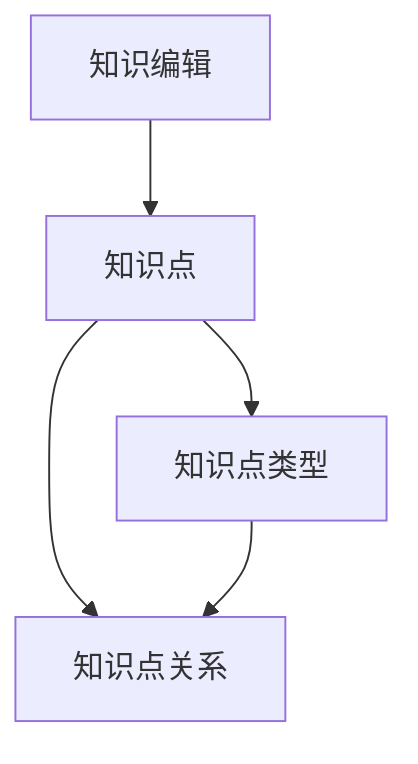
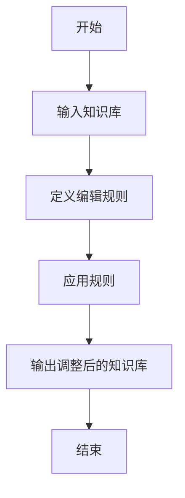
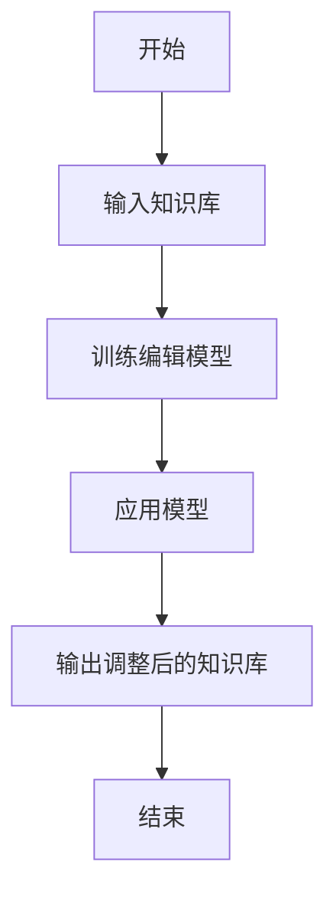
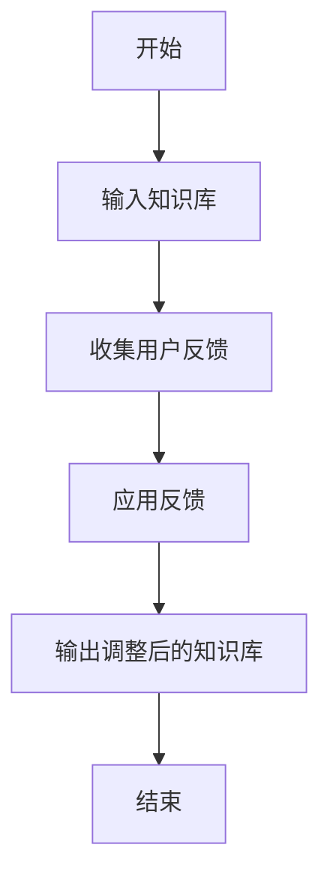
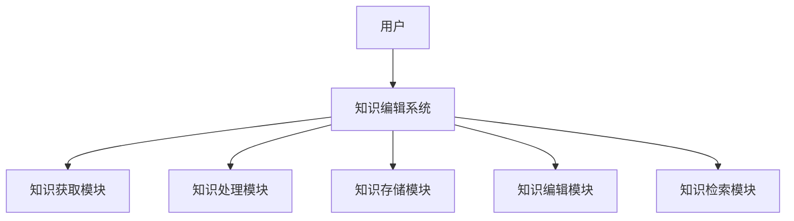
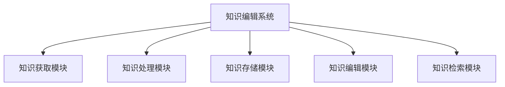
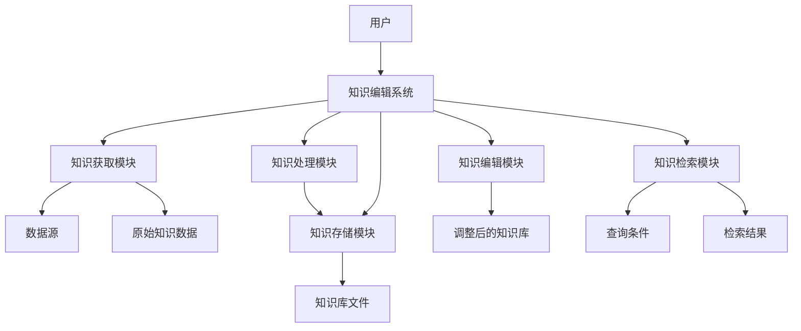

                 


# AI Agent的知识编辑：动态调整LLM的知识库

> 关键词：AI Agent, LLM, 知识编辑, 动态知识库, 知识表示, 知识更新, 知识检索

> 摘要：本文深入探讨AI Agent在动态调整LLM知识库中的知识编辑方法，从背景、核心概念、算法原理、系统架构到项目实战，全面解析知识编辑的技术细节和实现方案。通过详细的技术分析和实际案例，帮助读者理解如何高效地管理和优化LLM的知识库。

---

# 第一部分: AI Agent的知识编辑背景与核心概念

## 第1章: AI Agent的知识编辑概述

### 1.1 问题背景与问题描述
AI Agent是一种能够感知环境、自主决策并执行任务的智能实体。在实际应用中，AI Agent需要依赖大规模语言模型（LLM）的知识库来完成复杂任务。然而，LLM的知识库通常是静态的，无法动态适应实时变化的环境或用户需求。动态调整LLM的知识库是AI Agent实现高效、准确和智能化的关键。

#### 1.1.1 AI Agent的核心概念
- **定义**：AI Agent是一个能够感知环境、自主决策并执行任务的智能实体。
- **分类**：基于智能水平，AI Agent可以分为简单反射型、基于模型的反应型、目标驱动型和效用驱动型。
- **功能**：感知、推理、决策、执行。

#### 1.1.2 知识编辑的基本问题与边界
- **问题背景**：LLM的知识库通常基于训练数据，无法动态更新。
- **问题描述**：AI Agent需要实时调整知识库以适应新任务或环境变化。
- **解决方法**：通过知识编辑技术，动态调整LLM的知识库，使其适应实时需求。

#### 1.1.3 知识编辑的核心要素
- **知识表示**：将知识以结构化形式存储，便于编辑和检索。
- **知识更新**：动态添加、删除或修改知识库中的信息。
- **知识检索**：快速定位所需知识，支持AI Agent的实时决策。

### 1.2 知识编辑的核心概念
#### 1.2.1 知识表示与存储
- **知识表示方法**：常用的知识表示方法包括符号逻辑、语义网络和知识图谱。
- **知识存储形式**：结构化数据（如JSON、XML）、半结构化数据（如文本文件）和非结构化数据（如自然文本）。
- **知识存储系统**：分布式存储系统（如数据库、图数据库）和文件存储系统。

#### 1.2.2 知识更新与优化
- **知识更新策略**：基于规则的更新、基于模型的更新和基于反馈的更新。
- **知识优化方法**：去除冗余信息、消除矛盾信息和补充缺失信息。
- **知识版本控制**：记录知识的修改历史，支持回滚和版本管理。

#### 1.2.3 知识检索与应用
- **检索算法**：基于关键词的检索、基于语义的检索和基于上下文的检索。
- **检索优化**：通过索引优化、缓存优化和分布式计算优化检索效率。
- **知识应用**：将检索到的知识应用于AI Agent的任务执行和决策优化。

### 1.3 本章小结
本章介绍了AI Agent的知识编辑背景，分析了知识编辑的核心概念和要素，为后续章节的深入讨论奠定了基础。

---

## 第2章: AI Agent与LLM的知识编辑

### 2.1 AI Agent的基本原理
#### 2.1.1 AI Agent的定义与分类
- **定义**：AI Agent是一个能够感知环境、自主决策并执行任务的智能实体。
- **分类**：基于智能水平，AI Agent可以分为简单反射型、基于模型的反应型、目标驱动型和效用驱动型。

#### 2.1.2 LLM在AI Agent中的角色
- **LLM的作用**：LLM作为AI Agent的核心，负责理解和生成自然语言文本，支持任务执行和决策优化。
- **知识库的作用**：LLM的知识库是AI Agent进行推理和决策的基础。

#### 2.1.3 知识库在AI Agent中的作用
- **知识表示**：知识库以结构化形式存储，便于AI Agent理解和推理。
- **知识更新**：动态调整知识库，以适应实时任务需求。
- **知识检索**：快速定位所需知识，支持AI Agent的实时决策。

### 2.2 知识编辑的核心概念
#### 2.2.1 知识编辑的定义
- **定义**：知识编辑是通过添加、删除或修改知识库中的信息，动态调整知识库内容的过程。

#### 2.2.2 知识编辑的关键属性
- **实时性**：动态调整知识库，以适应实时任务需求。
- **准确性**：确保知识库中的信息准确无误。
- **一致性**：保持知识库内部的一致性和逻辑性。

#### 2.2.3 知识编辑与AI Agent的联系
- **知识编辑是AI Agent的核心能力**：AI Agent需要通过知识编辑动态调整知识库，以支持实时任务执行。
- **知识编辑是LLM的核心能力**：LLM的知识库需要通过知识编辑动态调整，以支持AI Agent的智能决策。

### 2.3 知识编辑的特征对比
#### 2.3.1 知识编辑与传统数据处理的对比
| 特征         | 知识编辑          | 传统数据处理      |
|--------------|-------------------|-------------------|
| 目标         | 动态调整知识库内容 | 固定数据处理流程  |
| 实时性       | 高               | 低               |
| 精准性       | 高               | 中               |

#### 2.3.2 知识编辑与机器学习的对比
| 特征         | 知识编辑          | 机器学习          |
|--------------|-------------------|-------------------|
| 目标         | 动态调整知识库内容 | 学习数据模式      |
| 输入         | 知识库内容        | 数据集           |
| 输出         | 调整后的知识库    | 模型或预测结果    |

#### 2.3.3 知识编辑与自然语言处理的对比
| 特征         | 知识编辑          | 自然语言处理      |
|--------------|-------------------|-------------------|
| 目标         | 动态调整知识库内容 | 处理自然语言文本  |
| 输入         | 知识库内容        | 自然语言文本      |
| 输出         | 调整后的知识库    | 结构化输出或结果   |

### 2.4 知识编辑的ER实体关系图


### 2.5 本章小结
本章详细介绍了AI Agent与LLM的知识编辑，分析了知识编辑的核心概念、特征和ER实体关系图，为后续章节的深入讨论提供了理论基础。

---

## 第3章: 知识编辑的算法原理

### 3.1 知识编辑算法的概述
#### 3.1.1 知识编辑的基本流程
1. 知识获取：从数据源获取知识。
2. 知识处理：对获取的知识进行清洗、转换和结构化。
3. 知识存储：将处理后的知识存储到知识库中。
4. 知识更新：根据需求动态调整知识库内容。
5. 知识检索：根据查询条件快速定位所需知识。

#### 3.1.2 知识编辑的核心算法
- **基于规则的编辑算法**：通过预定义规则对知识库进行编辑。
- **基于模型的编辑算法**：基于机器学习模型对知识库进行编辑。
- **基于反馈的编辑算法**：根据用户反馈对知识库进行编辑。

### 3.2 基于规则的知识编辑算法
#### 3.2.1 算法流程图


#### 3.2.2 算法实现
```python
def knowledge Editing(knowledge_base, rules):
    edited_knowledge = knowledge_base.copy()
    for rule in rules:
        if rule.type == "add":
            edited_knowledge.add(rule.data)
        elif rule.type == "delete":
            edited_knowledge.remove(rule.data)
        elif rule.type == "modify":
            edited_knowledge.update(rule.data)
    return edited_knowledge
```

#### 3.2.3 算法数学模型
$$
\text{edited\_knowledge} = \text{knowledge\_base} \triangle \text{rule\_data}
$$
其中，$\triangle$ 表示根据规则进行编辑操作。

### 3.3 基于模型的知识编辑算法
#### 3.3.1 算法流程图


#### 3.3.2 算法实现
```python
def model_based_editing(knowledge_base, model):
    edited_knowledge = knowledge_base.copy()
    predictions = model.predict(edited_knowledge)
    for pred in predictions:
        if pred.type == "add":
            edited_knowledge.add(pred.data)
        elif pred.type == "delete":
            edited_knowledge.remove(pred.data)
        elif pred.type == "modify":
            edited_knowledge.update(pred.data)
    return edited_knowledge
```

#### 3.3.3 算法数学模型
$$
\text{edited\_knowledge} = \text{knowledge\_base} \oplus \text{model\_predictions}
$$
其中，$\oplus$ 表示基于模型的编辑操作。

### 3.4 基于反馈的知识编辑算法
#### 3.4.1 算法流程图


#### 3.4.2 算法实现
```python
def feedback_based_editing(knowledge_base, feedback):
    edited_knowledge = knowledge_base.copy()
    for fb in feedback:
        if fb.type == "add":
            edited_knowledge.add(fb.data)
        elif fb.type == "delete":
            edited_knowledge.remove(fb.data)
        elif fb.type == "modify":
            edited_knowledge.update(fb.data)
    return edited_knowledge
```

#### 3.4.3 算法数学模型
$$
\text{edited\_knowledge} = \text{knowledge\_base} \otimes \text{user\_feedback}
$$
其中，$\otimes$ 表示基于反馈的编辑操作。

### 3.5 本章小结
本章详细介绍了知识编辑的算法原理，包括基于规则、基于模型和基于反馈的知识编辑算法，并通过流程图和代码示例进行了详细讲解。

---

## 第4章: 知识编辑的系统分析与架构设计

### 4.1 系统分析
#### 4.1.1 知识编辑系统的核心功能
- 知识获取：从数据源获取知识。
- 知识处理：对知识进行清洗、转换和结构化。
- 知识存储：将知识存储到知识库中。
- 知识编辑：根据需求动态调整知识库内容。
- 知识检索：根据查询条件快速定位所需知识。

#### 4.1.2 系统架构设计


### 4.2 系统功能设计
#### 4.2.1 知识获取模块
- 功能：从数据源获取知识。
- 输入：数据源（如数据库、API接口）。
- 输出：原始知识数据。

#### 4.2.2 知识处理模块
- 功能：对知识进行清洗、转换和结构化。
- 输入：原始知识数据。
- 输出：结构化知识数据。

#### 4.2.3 知识存储模块
- 功能：将知识存储到知识库中。
- 输入：结构化知识数据。
- 输出：知识库文件或数据库。

#### 4.2.4 知识编辑模块
- 功能：根据需求动态调整知识库内容。
- 输入：知识库文件或数据库。
- 输出：调整后的知识库。

#### 4.2.5 知识检索模块
- 功能：根据查询条件快速定位所需知识。
- 输入：查询条件。
- 输出：检索结果。

### 4.3 系统架构设计
#### 4.3.1 系统架构图


#### 4.3.2 系统交互流程图


### 4.4 本章小结
本章详细分析了知识编辑系统的功能和架构设计，通过模块化设计和流程图展示，帮助读者理解知识编辑系统的实现过程。

---

## 第5章: 知识编辑的项目实战

### 5.1 环境安装
#### 5.1.1 安装Python环境
- 使用Anaconda或Miniconda安装Python 3.8及以上版本。
- 安装必要的Python包：`pip install numpy pandas requests`

#### 5.1.2 安装知识编辑工具
- 安装知识编辑框架：`pip install knowledge-editing`

### 5.2 知识编辑系统核心实现
#### 5.2.1 知识获取模块实现
```python
import requests

def get_knowledge(base_url):
    response = requests.get(base_url)
    if response.status_code == 200:
        return response.json()
    else:
        return None
```

#### 5.2.2 知识处理模块实现
```python
import json

def process_knowledge(data):
    processed_data = []
    for item in data:
        processed_item = {
            "id": item["id"],
            "content": item["content"],
            "type": item["type"]
        }
        processed_data.append(processed_item)
    return processed_data
```

#### 5.2.3 知识存储模块实现
```python
import json

def save_knowledge(data, filename):
    with open(filename, "w") as f:
        json.dump(data, f, indent=2)
```

#### 5.2.4 知识编辑模块实现
```python
def edit_knowledge(data, rules):
    edited_data = data.copy()
    for rule in rules:
        if rule["type"] == "add":
            edited_data.append(rule["data"])
        elif rule["type"] == "delete":
            edited_data = [item for item in edited_data if item["id"] != rule["data"]["id"]]
        elif rule["type"] == "modify":
            for item in edited_data:
                if item["id"] == rule["data"]["id"]:
                    item["content"] = rule["data"]["content"]
                    break
    return edited_data
```

#### 5.2.5 知识检索模块实现
```python
def search_knowledge(data, query):
    results = []
    for item in data:
        if query in item["content"]:
            results.append(item)
    return results
```

### 5.3 项目实战案例分析
#### 5.3.1 实战场景
假设我们有一个医疗领域的知识库，需要动态调整疾病症状和治疗方法。

#### 5.3.2 知识获取与处理
```python
data = get_knowledge("https://example.com/medical_knowledge")
processed_data = process_knowledge(data)
```

#### 5.3.3 知识编辑与检索
```python
rules = [
    {"type": "add", "data": {"id": "new_disease", "content": "新型疾病症状与治疗方法"}},
    {"type": "delete", "data": {"id": "old_disease"}},
    {"type": "modify", "data": {"id": "existing_disease", "content": "更新后的内容"}}
]
edited_data = edit_knowledge(processed_data, rules)
results = search_knowledge(edited_data, "疾病症状")
```

### 5.4 本章小结
本章通过实际项目案例，详细展示了知识编辑系统的实现过程，包括环境安装、核心模块实现和案例分析。

---

## 第6章: 知识编辑的总结与展望

### 6.1 本章小结
知识编辑是AI Agent实现动态调整LLM知识库的核心技术，通过知识表示、知识更新和知识检索等方法，能够有效优化知识库内容，提升AI Agent的智能水平。

### 6.2 注意事项
- **知识一致性**：确保知识库内部的一致性和逻辑性。
- **知识准确性**：确保知识库中的信息准确无误。
- **知识实时性**：动态调整知识库内容，以适应实时任务需求。

### 6.3 未来展望
- **分布式知识编辑**：研究分布式知识编辑方法，提升知识编辑的效率和扩展性。
- **跨语言知识编辑**：研究跨语言知识编辑方法，支持多语言环境下的知识编辑。
- **自适应知识编辑**：研究自适应知识编辑方法，根据环境变化自动调整知识库内容。

### 6.4 拓展阅读
- **《Large Language Models for Question Answering》**
- **《Dynamic Knowledge Management in AI Systems》**
- **《Knowledge Representation and Reasoning》**

---

通过以上详细的技术分析和实际案例，本文全面解析了AI Agent的知识编辑技术，为实现动态调整LLM的知识库提供了理论和实践指导。

