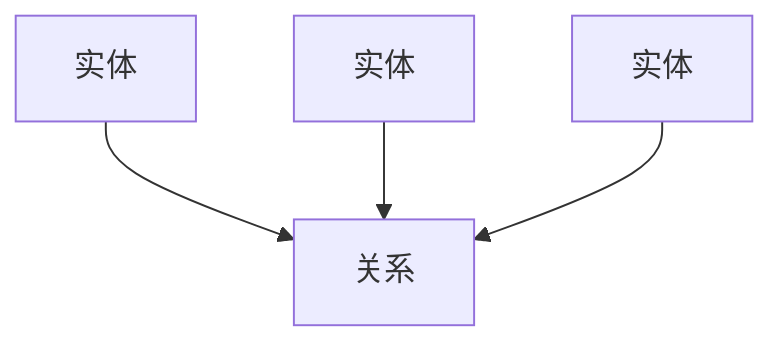
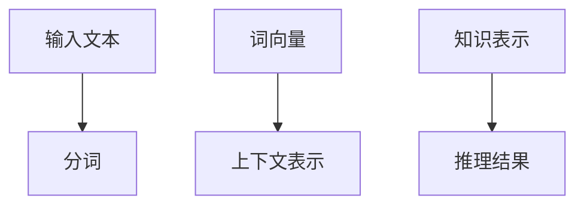
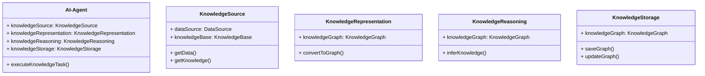
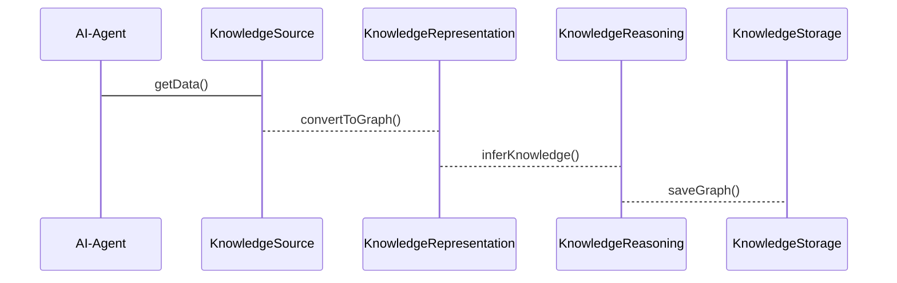
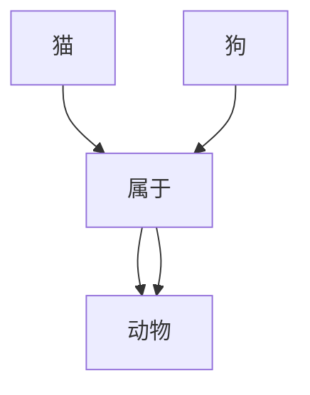

                 


# AI Agent的知识获取：利用LLM进行持续学习

> 关键词：AI Agent, 知识获取, 大语言模型, 持续学习, 知识图谱, 逻辑推理

> 摘要：本文详细探讨了AI Agent如何通过大语言模型（LLM）进行知识获取与持续学习。从AI Agent的基本概念到知识获取的核心要素，从LLM的算法原理到系统架构设计，从项目实战到最佳实践，本文为读者提供了全面而深入的解析。

---

# 第一部分: AI Agent与知识获取的背景与基础

## 第1章: AI Agent的基本概念与知识获取的必要性

### 1.1 AI Agent的定义与特点

AI Agent（人工智能代理）是指具有感知环境、做出决策并采取行动以实现目标的智能实体。AI Agent可以是软件程序、机器人或其他智能系统，其核心特点包括：

- **自主性**：能够在没有外部干预的情况下独立运作。
- **反应性**：能够感知环境并实时做出反应。
- **目标导向**：所有行为都围绕实现特定目标展开。
- **学习能力**：通过经验或数据优化自身的知识库和行为策略。

### 1.2 知识获取的背景与问题背景

知识获取是AI Agent实现目标的核心能力之一。在复杂多变的环境中，AI Agent需要不断获取、理解和利用新知识，以适应新的任务和挑战。以下是知识获取的关键背景：

- **问题背景**：AI Agent需要处理的任务往往涉及大量的不确定性、动态变化和复杂关系，仅依赖预设规则难以应对。
- **知识缺口**：AI Agent在运行过程中可能会遇到超出其知识库范围的问题，需要通过学习和推理来填补知识缺口。
- **知识的动态性**：知识不是静态的，AI Agent需要通过持续学习来更新和扩展其知识库。

### 1.3 LLM在知识获取中的作用

大语言模型（LLM）通过其强大的自然语言处理能力，为AI Agent的知识获取提供了新的可能性。以下是LLM的关键作用：

- **知识表示**：LLM能够将文本信息转化为结构化的知识表示，帮助AI Agent理解复杂的语义关系。
- **推理能力**：LLM可以通过上下文推理得出隐含的信息，增强AI Agent的推理能力。
- **持续学习**：通过与LLM的交互，AI Agent可以实时获取最新的知识和信息，实现持续学习。

---

## 第2章: 知识获取的核心概念与体系结构

### 2.1 知识表示与知识图谱

知识表示是AI Agent理解世界的基础。以下是关键概念：

- **知识表示**：将知识以某种形式表示出来，使其可以被计算机理解和处理。常见的表示方法包括符号逻辑、向量表示和图结构表示。
- **知识图谱**：一种以图结构形式表示知识的模型，由实体（节点）和关系（边）组成。知识图谱可以表示复杂的语义关系，是知识表示的重要形式。



### 2.2 知识推理与逻辑推理

知识推理是AI Agent利用知识图谱进行推理的过程。以下是核心概念：

- **知识推理**：基于已有的知识图谱，推导出新的知识或结论。
- **逻辑推理**：通过逻辑规则对知识进行推导。常见的逻辑推理方法包括命题逻辑和谓词逻辑。

### 2.3 AI Agent的知识获取体系结构

AI Agent的知识获取体系结构包括以下几个模块：

- **知识源**：AI Agent获取知识的来源，包括文本数据、数据库、知识库等。
- **知识表示模块**：将知识源中的信息转化为结构化的知识表示。
- **知识推理模块**：基于知识图谱进行推理，生成新的知识或结论。
- **知识存储模块**：存储和管理知识图谱，支持持续学习和更新。

---

## 第3章: 知识获取的核心要素与关系

### 3.1 知识源与数据源的分类

知识源是AI Agent获取知识的来源，主要包括以下几类：

- **文本数据源**：包括书籍、论文、网页等。
- **结构化数据源**：包括数据库、知识库等。
- **实时数据源**：包括传感器数据、实时新闻等。

### 3.2 知识表示与知识推理的关系

知识表示与知识推理是密不可分的：

- **知识表示对推理的影响**：知识表示的结构和形式直接影响推理的效率和准确性。
- **推理对知识表示的反馈作用**：推理的结果可以反哺知识表示，优化知识图谱的结构和内容。

### 3.3 知识获取的ER实体关系图

以下是知识获取的ER实体关系图：

```mermaid
erd
A[知识]
B[数据源]
C[知识表示]
D[知识图谱]
E[逻辑推理]

A --> B
C --> D
D --> E
```

---

# 第二部分: 利用LLM进行知识获取的算法原理

## 第4章: LLM的知识获取算法原理

### 4.1 大语言模型的基本原理

大语言模型通过大量的数据训练，学习语言的分布规律。以下是其基本原理：

- **训练目标**：模型通过预测下一个词的概率分布来学习语言的规律。
- **训练过程**：模型通过自监督学习，逐步优化参数，使其能够生成连贯且合理的文本。

### 4.2 LLM的知识表示与推理

以下是LLM的知识表示与推理流程：



---

## 第5章: LLM的知识获取算法实现

### 5.1 知识获取的算法流程

以下是知识获取的算法流程：


### 5.2 算法的数学模型

以下是知识获取算法的数学模型：

$$ P(y|x) = \frac{P(x,y)}{P(x)} $$

---

## 第6章: 系统架构与设计

### 6.1 系统模块划分

AI Agent的知识获取系统主要包括以下几个模块：

- **知识源管理模块**：负责管理知识源的接入和配置。
- **知识表示模块**：负责将知识源中的信息转化为结构化的知识表示。
- **知识推理模块**：负责基于知识图谱进行推理，生成新的知识或结论。
- **知识存储模块**：负责存储和管理知识图谱，支持持续学习和更新。

### 6.2 系统架构设计

以下是系统架构设计的类图：



### 6.3 系统接口设计

以下是系统接口设计的序列图：



---

## 第7章: 项目实战

### 7.1 环境安装

以下是项目实战的环境安装步骤：

```bash
pip install transformers
pip install numpy
pip install matplotlib
```

### 7.2 核心代码实现

以下是核心代码实现：

```python
from transformers import AutoTokenizer, AutoModelForMaskedLM
import torch

tokenizer = AutoTokenizer.from_pretrained('bert-base-uncased')
model = AutoModelForMaskedLM.from_pretrained('bert-base-uncased')

input_text = "The quick brown fox jumps over the lazy dog."
tokens = tokenizer.tokenize(input_text)
tensor = tokenizer.encode(input_text, return_tensors='pt')

output = model(tensor)[0]
predicted_index = torch.argmax(output[0, 5]).item()
predicted_word = tokenizer.decode([predicted_index])
```

### 7.3 案例分析与详细解读

以下是案例分析与详细解读：

假设我们有一个简单的知识图谱，包含以下实体和关系：



通过LLM的知识推理，我们可以推导出“猫和狗都属于动物”的结论。

---

## 第8章: 总结与展望

### 8.1 总结

通过本文的详细讲解，我们可以看到，AI Agent的知识获取是一个复杂而重要的过程。通过大语言模型（LLM）的持续学习能力，AI Agent能够不断获取新知识，优化自身的知识库，从而更好地完成任务。

### 8.2 展望

未来，随着大语言模型的不断发展，AI Agent的知识获取能力将更加智能化和高效化。我们可以期待更多创新性的应用和更强大的知识推理能力。

---

## 第9章: 最佳实践与注意事项

### 9.1 最佳实践

- **数据多样性**：确保知识源的多样性，以提高知识获取的全面性。
- **模型调优**：根据具体任务需求，对LLM进行针对性的调优。
- **持续更新**：定期更新知识图谱，确保知识的时效性。

### 9.2 注意事项

- **数据隐私**：注意保护知识源中的敏感数据，确保数据的安全性。
- **模型鲁棒性**：在实际应用中，注意模型的鲁棒性，避免因知识图谱的错误导致系统崩溃。
- **性能优化**：根据实际需求，对系统进行性能优化，确保知识获取的高效性。

---

通过以上内容，我们对AI Agent的知识获取有了全面而深入的理解。希望本文能为读者提供有价值的参考和启发。

