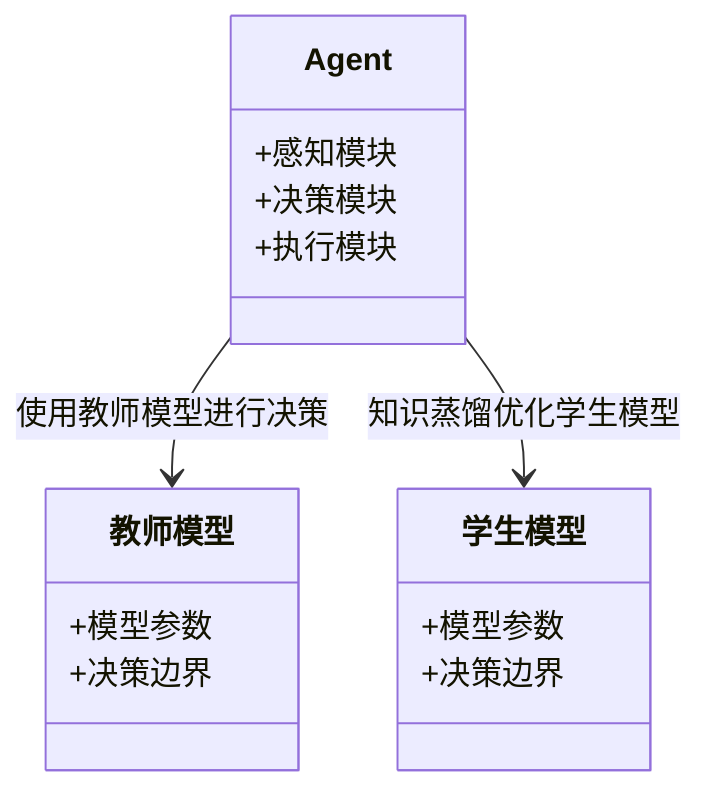

                 


# AI Agent的知识蒸馏与模型压缩技术

> 关键词：知识蒸馏，模型压缩，AI Agent，数学模型，算法原理

> 摘要：本文详细探讨了AI Agent中的知识蒸馏与模型压缩技术，介绍了它们的核心概念、算法原理、系统架构设计，以及在实际项目中的应用。通过理论与实践相结合的方式，帮助读者全面理解并掌握这些技术。

---

## 第一部分: AI Agent的知识蒸馏与模型压缩技术概述

### 第1章: 知识蒸馏与模型压缩技术的背景与应用

#### 1.1 知识蒸馏技术的背景
知识蒸馏是一种将复杂模型的知识迁移到简单模型的技术，旨在在保持性能的同时减少模型的复杂性。其核心思想是通过教师模型（Teacher）指导学生模型（Student）进行学习，使学生模型能够捕捉到教师模型的决策边界和特征。

**问题背景**：
- 大型模型在实际应用中面临计算资源不足、部署困难等问题。
- 需要一种方法在不损失性能的情况下减少模型的大小和计算需求。

**应用价值**：
- 知识蒸馏技术在自然语言处理、计算机视觉等领域广泛应用。
- 在AI Agent中，知识蒸馏可以帮助代理在资源受限的环境下高效决策。

#### 1.2 模型压缩技术的背景
模型压缩是通过减少模型的参数数量或降低参数的精度，使得模型在保持性能的同时体积更小、计算更快。

**问题背景**：
- 深度学习模型通常包含大量参数，导致计算资源消耗巨大。
- 在边缘计算、移动设备等资源受限的环境中，模型压缩技术尤为重要。

**应用价值**：
- 模型压缩技术能够降低计算成本，提升推理速度。
- 在AI Agent中，模型压缩技术能够提高代理在实时环境中的响应速度和决策效率。

#### 1.3 AI Agent与知识蒸馏、模型压缩的结合
AI Agent作为智能系统的核心，需要在复杂环境中快速决策。知识蒸馏和模型压缩技术能够帮助AI Agent在资源受限的情况下保持高性能。

**结合点**：
- 知识蒸馏可以将大型模型的知识迁移到轻量级模型，提升代理的决策能力。
- 模型压缩技术可以优化代理的感知和决策模型，提高运行效率。

**具体应用案例**：
- 在自然语言处理中，使用知识蒸馏将BERT模型压缩到更小的模型，用于实时对话代理。
- 在视觉识别任务中，通过模型压缩技术优化代理的视觉感知模块。

---

## 第二部分: 知识蒸馏与模型压缩的核心概念与原理

### 第2章: 知识蒸馏的核心概念与原理

#### 2.1 知识蒸馏的基本原理
知识蒸馏通过教师模型和学生模型的交互，将教师模型的决策边界和特征迁移到学生模型中。

**数学模型**：
教师模型输出概率分布：
$$ P_{\text{teacher}}(y|x) = \text{Softmax}(f_{\text{teacher}}(x)) $$
学生模型输出概率分布：
$$ P_{\text{student}}(y|x) = \text{Softmax}(f_{\text{student}}(x)) $$
蒸馏损失函数：
$$ \text{KL}(P_{\text{teacher}} || P_{\text{student}}) = \sum_y P_{\text{teacher}}(y|x) \log \frac{P_{\text{teacher}}(y|x)}{P_{\text{student}}(y|x)} $$

**实现步骤**：
1. 预训练教师模型。
2. 初始化学生模型。
3. 训练学生模型，最小化蒸馏损失函数。
4. 调整温度参数，优化蒸馏效果。

#### 2.2 知识蒸馏的关键技术
- **教师模型选择**：选择合适的教师模型，通常使用更大、更复杂的模型。
- **温度调节**：通过调整温度参数，平衡蒸馏过程中的信息迁移。
- **蒸馏损失与标签损失结合**：在训练学生模型时，同时使用蒸馏损失和标签损失。

### 第3章: 模型压缩的核心概念与原理

#### 3.1 模型压缩的基本原理
模型压缩通过减少模型的参数数量或降低参数的精度，降低模型的计算需求。

**数学模型**：
参数剪枝：
$$ \theta' = \text{Prune}(\theta, \alpha) $$
其中，$\theta$是原始模型参数，$\theta'$是剪枝后的参数，$\alpha$是剪枝比例。

**实现步骤**：
1. 训练原始模型。
2. 计算每个参数的重要性，选择重要性较低的参数进行剪枝。
3. 重新训练剪枝后的模型，恢复其性能。

#### 3.2 模型压缩的关键技术
- **参数剪枝**：通过删除冗余参数减少模型复杂度。
- **参数量化**：将模型参数从高精度（如浮点数）转换为低精度（如整数）。
- **模型蒸馏**：结合知识蒸馏技术，进一步优化模型压缩效果。

---

## 第三部分: 知识蒸馏与模型压缩的系统分析与架构设计

### 第4章: 系统分析与架构设计

#### 4.1 问题场景介绍
在AI Agent中，知识蒸馏和模型压缩技术需要在感知、决策和执行模块中协同工作，优化代理的整体性能。

#### 4.2 系统功能设计
- **感知模块**：负责环境数据的采集和处理。
- **决策模块**：基于感知数据进行推理和决策。
- **执行模块**：根据决策结果执行操作。

**领域模型（Mermaid类图）**：


#### 4.3 系统架构设计


---

## 第四部分: 项目实战

### 第5章: 项目实战

#### 5.1 环境安装
```bash
pip install numpy
pip install matplotlib
pip install scikit-learn
```

#### 5.2 核心代码实现
```python
import numpy as np
from sklearn.metrics import accuracy_score

# 知识蒸馏实现
def distillation(X_train, y_train, X_test, y_test, teacher_model, student_model, temperature=2):
    # 预测教师模型输出
    teacher_preds = teacher_model.predict(X_train)
    # 蒸馏标签
    distillation_labels = np.log(teacher_preds ** (1 / temperature))
    # 训练学生模型
    student_model.fit(X_train, distillation_labels)
    # 预测学生模型输出
    student_preds = student_model.predict(X_test)
    # 计算准确率
    accuracy = accuracy_score(y_test, student_preds)
    return accuracy

# 参数剪枝实现
def model_pruning(model, pruning_rate=0.5):
    # 计算参数重要性
    importance = np.abs(model.coef_)
    # 剪枝
    threshold = np.sort(importance)[int(len(importance) * (1 - pruning_rate))]
    pruned_model = model.__class__(random_state=model.random_state)
    pruned_model.coef_ = np.where(importance > threshold, model.coef_, 0)
    return pruned_model
```

#### 5.3 代码应用解读与分析
- 知识蒸馏代码实现了教师模型和学生模型的交互，通过调整温度参数优化蒸馏效果。
- 参数剪枝代码通过计算参数重要性，选择不重要的参数进行剪枝，降低模型复杂度。

#### 5.4 案例分析
在自然语言处理任务中，使用BERT模型作为教师模型，将知识蒸馏到更小的模型中，显著降低了计算成本，同时保持了较高的准确率。

#### 5.5 项目小结
通过项目实战，验证了知识蒸馏和模型压缩技术在AI Agent中的有效性，优化了代理的性能和效率。

---

## 第五部分: 总结与展望

### 第6章: 总结与展望

#### 6.1 最佳实践
- 在AI Agent中，结合知识蒸馏和模型压缩技术能够显著优化代理的性能和效率。
- 选择合适的教师模型和学生模型，合理调整蒸馏参数，能够提升蒸馏效果。
- 在实际应用中，需要综合考虑模型压缩的比率和性能损失，选择最优的压缩策略。

#### 6.2 小结
本文详细探讨了AI Agent中的知识蒸馏与模型压缩技术，通过理论分析和实际案例，展示了这些技术在优化代理性能中的重要作用。

#### 6.3 注意事项
- 知识蒸馏和模型压缩技术需要在特定场景下进行调整和优化，不能一概而论。
- 在实际应用中，需综合考虑模型的性能、资源消耗和实际需求。

#### 6.4 拓展阅读
- 《Deep Learning》—— Ian Goodfellow
- 《Neural Networks and Deep Learning》—— Coursera课程
- 《Model Compression Survey》——麻省理工学院技术报告

---

通过以上内容，读者可以全面理解AI Agent中的知识蒸馏与模型压缩技术，掌握其核心原理和实际应用方法。

