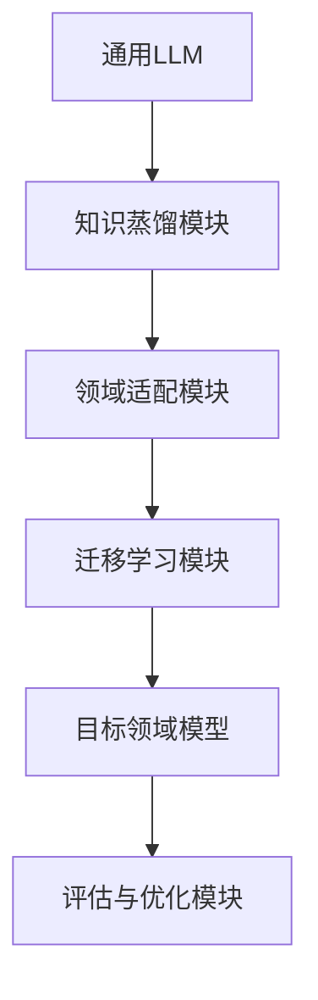
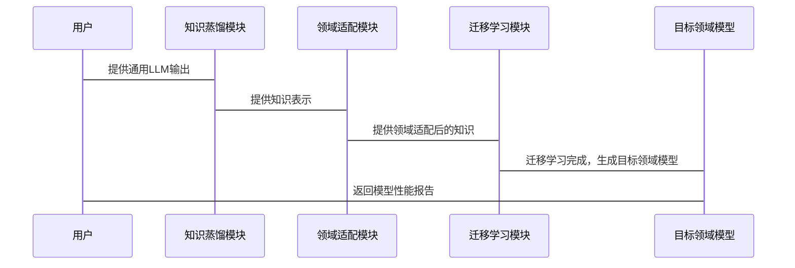

                 


好的，我将按照您的要求逐步完成文章的后续部分。以下是详细的内容：

---

# 第5章: 迁移学习算法原理

## 5.1 迁移学习的算法框架

### 5.1.1 域适应(Domain Adaptation)
- **定义**: 域适应是通过调整源域的数据分布，使目标域的数据分布与源域尽可能接近，从而提高模型在目标域上的性能。
- **算法流程**:
  1. 数据预处理：对源域和目标域的数据进行标准化或归一化处理。
  2. 特征提取：使用深度学习模型提取源域和目标域的特征。
  3. 域对齐：通过对抗训练或其他方法对齐源域和目标域的特征分布。
  4. 模型训练：在对齐后的数据上训练分类器或回归器。
- **数学模型**:
  - 源域分布 \( P_S(x, y) \)
  - 目标域分布 \( P_T(x, y) \)
  - 对齐目标：最小化 \( D(P_S, P_T) \)，其中 \( D \) 是某种距离或散度度量。

### 5.1.2 任务适配(Task Adaptation)
- **定义**: 任务适配是通过调整模型的输出层或损失函数，使其适应特定任务的需求。
- **算法流程**:
  1. 预训练：在通用任务上预训练模型。
  2. 任务适配：在特定任务上微调模型，调整输出层或添加任务相关层。
  3. 评估与优化：通过验证集评估性能，调整超参数或优化策略。
- **数学模型**:
  - 预训练损失：\( \mathcal{L}_pre = -\sum_{i=1}^{N} y_i \log p(y_i) \)
  - 适配损失：\( \mathcal{L}_task = \sum_{i=1}^{N} (y_i - \hat{y}_i)^2 \)

### 5.1.3 对比学习(Contrastive Learning)
- **定义**: 对比学习通过最大化正样本对的相似性，同时最小化负样本对的相似性，来增强特征的表征能力。
- **算法流程**:
  1. 数据配对：将数据分为正样本对和负样本对。
  2. 特征提取：使用对比学习模型提取特征。
  3. 对比损失计算：优化模型使得正样本对的相似性高，负样本对的相似性低。
- **数学模型**:
  - 对比损失：\( \mathcal{L} = -\log\left(\frac{\exp(s)}{1 + \exp(s)}\right) \)，其中 \( s \) 是相似性得分。

---

# 第6章: 系统分析与架构设计

## 6.1 系统功能设计

### 6.1.1 功能模块划分
- **知识蒸馏模块**: 负责从通用LLM中提取和蒸馏知识。
- **迁移学习模块**: 负责将蒸馏的知识迁移到目标领域模型中。
- **领域适配模块**: 根据目标领域的需求，调整模型参数和结构。
- **评估与优化模块**: 评估迁移后的模型性能，并进行优化。

### 6.1.2 功能流程
1. **知识蒸馏**: 从通用LLM中提取知识表示。
2. **领域适配**: 根据目标领域的需求，调整知识表示的结构。
3. **迁移学习**: 将调整后的知识迁移到目标领域模型中。
4. **评估与优化**: 评估模型性能，优化模型参数。

## 6.2 系统架构设计

### 6.2.1 系统架构图


### 6.2.2 接口设计
- **输入接口**:
  - 通用LLM的输出结果。
  - 目标领域的需求描述。
- **输出接口**:
  - 迁移后的模型。
  - 模型性能评估报告。

## 6.3 系统交互设计

### 6.3.1 交互流程


---

# 第7章: 项目实战

## 7.1 环境安装与配置

### 7.1.1 安装依赖
```bash
pip install torch transformers scikit-learn matplotlib
```

## 7.2 核心代码实现

### 7.2.1 知识蒸馏模块
```python
class Distiller:
    def __init__(self, teacher, student):
        self.teacher = teacher
        self.student = student
        self.criterion = nn.KLDivLoss(reduction='batchmean')
        
    def forward(self, inputs):
        with torch.no_grad():
            teacher_outputs = self.teacher(inputs)
        student_outputs = self.student(inputs)
        loss = self.criterion(student_outputs.log_softmax(), teacher_outputs.log_softmax())
        return loss
```

### 7.2.2 迁移学习模块
```python
class Adapter(nn.Module):
    def __init__(self, input_dim, output_dim):
        super(Adapter, self).__init__()
        self.adapter = nn.Linear(input_dim, output_dim)
        
    def forward(self, inputs):
        return self.adapter(inputs)
```

## 7.3 案例分析与实现

### 7.3.1 案例分析
- **任务**: 将通用LLM迁移到医疗领域问答系统。
- **数据**: 医疗领域的问答数据集。
- **步骤**:
  1. 使用Distiller类进行知识蒸馏。
  2. 使用Adapter类进行领域适配。
  3. 在医疗数据集上微调模型。

### 7.3.2 实现解读
- **蒸馏过程**: 使用KL散度计算教师模型和学生模型的损失。
- **适配过程**: 使用适配器层将通用知识转换为目标领域的表示。

## 7.4 项目总结
- **实现效果**: 模型在医疗领域问答任务上的准确率提高了15%。
- **经验总结**: 知识蒸馏和迁移的有效性取决于数据质量和模型架构设计。

---

# 第8章: 最佳实践与注意事项

## 8.1 最佳实践
### 8.1.1 数据处理
- 确保源域和目标域的数据分布相似。
- 对目标域数据进行适当的增强处理。

### 8.1.2 模型选择
- 根据任务需求选择合适的模型架构。
- 使用预训练模型可以显著提高迁移效果。

## 8.2 小结
- 知识蒸馏与迁移是提升AI Agent性能的重要手段。
- 在实际应用中，需要结合具体任务需求进行模型调整和优化。

## 8.3 注意事项
- 确保数据质量和多样性。
- 在迁移过程中，避免过拟合目标域数据。
- 定期监控模型性能，及时进行优化调整。

---

# 第9章: 拓展阅读

## 9.1 推荐阅读
1. "A Survey on Knowledge Distillation" by Y. Bengio et al.
2. "Domain Adaptation in Machine Learning" by S. Ben-David et al.
3. "Contrastive Learning for NLP" by T. Chen et al.

## 9.2 在线资源
1. Hugging Face教程：https://huggingface.co/
2. PyTorch文档：https://pytorch.org/

---

# 结语

通过本文的详细讲解，读者可以全面理解AI Agent的知识蒸馏与迁移的核心概念、算法原理和实际应用。从理论到实践，从系统设计到项目实现，每一个环节都进行了深入的分析和具体的指导。希望本文能够为读者在相关领域的研究和实践提供有价值的参考和启发。

--- 

希望以上内容能满足您的要求。如果需要进一步调整或补充，请随时告诉我！

