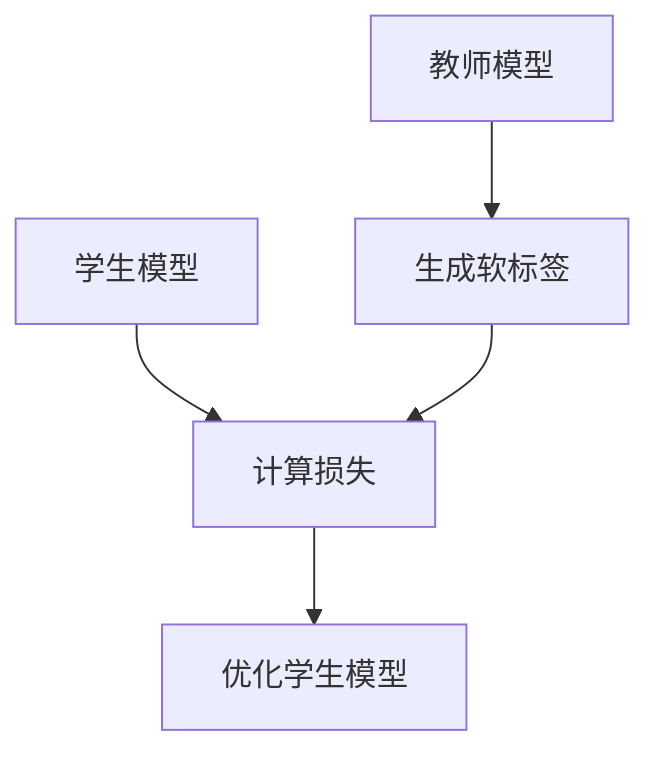
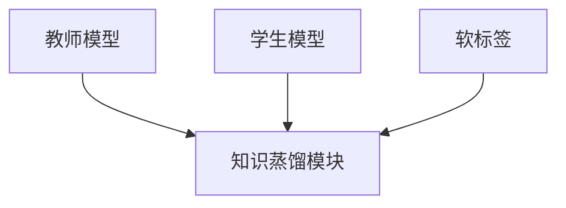
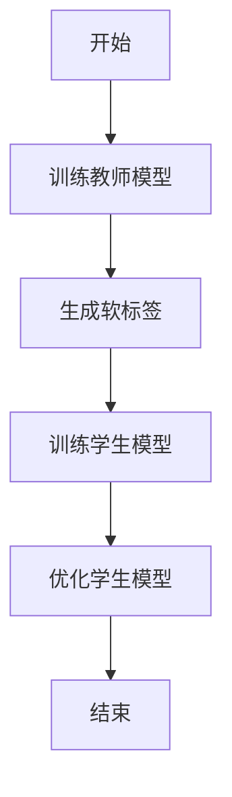

                 


# AI Agent的知识蒸馏在IoT设备中的应用

> 关键词：AI Agent，知识蒸馏，IoT设备，模型压缩，边缘计算，智能优化

> 摘要：本文详细探讨了AI Agent在IoT设备中的应用，重点分析了知识蒸馏技术如何在资源受限的IoT环境中优化AI模型的性能。文章从知识蒸馏的基本原理出发，结合AI Agent的知识表示与学习机制，系统性地分析了知识蒸馏在IoT设备中的实现过程、算法优化策略以及实际应用场景。通过具体案例分析和代码实现，本文为IoT设备中的AI Agent部署提供了理论支持与实践指导。

---

# 第一部分：AI Agent与知识蒸馏概述

## 第1章：AI Agent与知识蒸馏的背景介绍

### 1.1 问题背景

#### 1.1.1 IoT设备的计算能力限制
物联网（IoT）设备通常具有有限的计算能力和存储空间，难以直接运行复杂的人工智能模型。传统的深度学习模型（如卷积神经网络、循环神经网络）通常需要大量的计算资源和内存，这在IoT设备上难以实现。

#### 1.1.2 AI模型在IoT中的应用需求
尽管IoT设备资源有限，但其应用场景对AI模型的需求却日益增长。例如，智能家电、工业传感器、智能手表等设备都需要实时处理数据并做出决策，这需要高效且轻量级的AI模型。

#### 1.1.3 知识蒸馏技术的提出
知识蒸馏是一种将复杂模型的知识迁移到简单模型的技术。通过教师模型（Teacher）和学生模型（Student）的交互，学生模型可以从教师模型中学习到复杂的知识，同时保持较低的计算复杂度。这种技术非常适合在IoT设备上部署复杂的AI模型。

### 1.2 问题描述

#### 1.2.1 复杂AI模型在IoT中的部署挑战
复杂AI模型的计算需求远超IoT设备的能力，直接部署在IoT设备上会导致性能下降、延迟增加甚至无法运行。

#### 1.2.2 知识蒸馏的目标与意义
知识蒸馏的目标是将复杂模型的知识迁移到简单模型，使其能够在IoT设备上高效运行。这不仅降低了计算资源的需求，还提高了模型的运行效率和响应速度。

#### 1.2.3 知识蒸馏在IoT中的应用场景
知识蒸馏在IoT中的应用场景包括智能传感器数据分类、智能家居设备控制、智能监控系统等，这些场景都需要高效且轻量级的AI模型。

### 1.3 问题解决

#### 1.3.1 知识蒸馏的核心思想
知识蒸馏的核心思想是通过教师模型和学生模型的交互，将教师模型的知识迁移到学生模型中。教师模型通常是一个复杂的预训练模型，而学生模型是一个简单且高效的模型。

#### 1.3.2 AI Agent在知识蒸馏中的作用
AI Agent作为知识蒸馏的执行者，负责在IoT设备上接收和处理教师模型的知识，并将其转化为适用于IoT设备的简单模型。

#### 1.3.3 知识蒸馏的实现步骤
1. 训练教师模型。
2. 使用教师模型生成软标签（Soft Labels）。
3. 训练学生模型，使其预测结果与教师模型的软标签一致。
4. 部署学生模型到IoT设备上。

### 1.4 边界与外延

#### 1.4.1 知识蒸馏的适用范围
知识蒸馏适用于需要在IoT设备上部署复杂AI模型的场景，尤其是当IoT设备资源受限时。

#### 1.4.2 知识蒸馏的局限性
知识蒸馏的局限性包括教师模型的训练成本高、知识蒸馏过程中的计算开销等。

#### 1.4.3 知识蒸馏与其他模型压缩技术的对比
与传统的模型剪枝、量化等压缩技术相比，知识蒸馏通过知识迁移的方式实现模型的轻量化，同时保持较高的模型性能。

### 1.5 概念结构与核心要素

#### 1.5.1 知识蒸馏的基本概念框架
知识蒸馏的核心概念包括教师模型、学生模型、软标签和知识蒸馏损失函数。

#### 1.5.2 AI Agent的知识表示方式
AI Agent的知识表示方式包括符号表示、概率表示和图结构表示。

#### 1.5.3 知识蒸馏的核心要素组成
知识蒸馏的核心要素包括教师模型、学生模型、软标签生成和知识蒸馏损失函数。

### 1.6 本章小结

---

## 第2章：知识蒸馏的核心概念与联系

### 2.1 知识蒸馏的原理

#### 2.1.1 教师模型与学生模型的关系
教师模型是一个复杂的预训练模型，学生模型是一个简单且高效的模型。通过知识蒸馏，学生模型可以从教师模型中学习到复杂的知识。

#### 2.1.2 知识蒸馏的实现机制
知识蒸馏的实现机制包括软标签生成和知识蒸馏损失函数。

#### 2.1.3 知识蒸馏的目标函数
知识蒸馏的目标函数包括学生模型预测与教师模型软标签之间的交叉熵损失。

### 2.2 AI Agent的知识表示

#### 2.2.1 知识表示的基本形式
知识表示的基本形式包括符号表示、概率表示和图结构表示。

#### 2.2.2 知识图谱的构建与应用
知识图谱是一种图结构的知识表示方式，广泛应用于语义理解、实体识别等领域。

#### 2.2.3 知识蒸馏中的符号表示
符号表示是一种基于符号逻辑的知识表示方式，适用于规则明确的知识迁移。

### 2.3 知识蒸馏与AI Agent的联系

#### 2.3.1 知识蒸馏如何增强AI Agent的能力
知识蒸馏通过将复杂模型的知识迁移到简单模型，增强AI Agent的推理能力和决策能力。

#### 2.3.2 AI Agent在知识蒸馏中的角色
AI Agent作为知识蒸馏的执行者，负责在IoT设备上接收和处理教师模型的知识。

#### 2.3.3 知识蒸馏如何优化AI Agent的性能
知识蒸馏通过轻量化模型实现高效的推理和决策，优化AI Agent的性能。

### 2.4 知识蒸馏与传统模型压缩技术的对比

#### 2.4.1 参数量化与剪枝技术
参数量化和剪枝技术是传统的模型压缩技术，通过减少模型参数的数量来降低计算复杂度。

#### 2.4.2 知识蒸馏的独特优势
知识蒸馏的独特优势在于通过知识迁移实现模型的轻量化，同时保持较高的模型性能。

#### 2.4.3 知识蒸馏的适用场景
知识蒸馏适用于需要在IoT设备上部署复杂AI模型的场景，尤其是当IoT设备资源受限时。

### 2.5 本章小结

---

## 第3章：知识蒸馏的算法原理

### 3.1 算法原理概述

#### 3.1.1 知识蒸馏的基本流程
知识蒸馏的基本流程包括教师模型的训练、软标签的生成和学生模型的训练。

#### 3.1.2 知识蒸馏的关键步骤
知识蒸馏的关键步骤包括软标签的生成、学生模型的训练和知识蒸馏损失函数的优化。

#### 3.1.3 算法的数学模型
知识蒸馏的目标函数为：
$$ L = -\sum_{i=1}^{n} P(y_i|x) \log Q(y_i|x) $$
其中，$P(y|x)$是教师模型的输出概率，$Q(y|x)$是学生模型的输出概率。

### 3.2 算法实现细节

#### 3.2.1 教师模型的输出概率分布
教师模型的输出概率分布通常是一个概率向量，表示每个类别的概率。

#### 3.2.2 学生模型的损失函数
学生模型的损失函数包括知识蒸馏损失和分类损失：
$$ L_{\text{distill}} = \alpha L_{\text{KL}} + (1-\alpha)L_{\text{CE}} $$
其中，$\alpha$是平衡系数，$L_{\text{KL}}$是KL散度损失，$L_{\text{CE}}$是交叉熵损失。

#### 3.2.3 知识蒸馏的优化方法
知识蒸馏的优化方法包括调整温度参数、平衡系数和优化算法的选择。

### 3.3 算法流程图


### 3.4 算法的数学模型

#### 3.4.1 教师模型的输出概率
$$ P(y|x) = \text{softmax}(\frac{f_{\text{teacher}}(x)}{T}) $$
其中，$T$是温度参数，$f_{\text{teacher}}(x)$是教师模型的输出。

#### 3.4.2 学生模型的损失函数
$$ L = -\sum_{i=1}^{n} P(y_i|x) \log Q(y_i|x) $$
其中，$Q(y|x)$是学生模型的输出概率。

### 3.5 本章小结

---

## 第4章：系统分析与架构设计

### 4.1 系统分析

#### 4.1.1 问题场景
IoT设备需要在资源受限的环境下运行复杂的AI模型，知识蒸馏技术可以帮助IoT设备高效运行AI模型。

#### 4.1.2 系统功能设计
系统功能设计包括教师模型的训练、软标签的生成和学生模型的训练。

#### 4.1.3 系统架构设计
系统架构设计包括教师模型、学生模型和知识蒸馏模块。

### 4.2 系统架构设计

#### 4.2.1 系统架构图


#### 4.2.2 系统接口设计
系统接口设计包括教师模型接口、学生模型接口和知识蒸馏模块接口。

#### 4.2.3 系统交互设计
系统交互设计包括教师模型生成软标签、学生模型训练和知识蒸馏模块优化。

### 4.3 系统流程图


### 4.4 本章小结

---

## 第5章：项目实战

### 5.1 环境安装

#### 5.1.1 安装Python
安装Python 3.8及以上版本。

#### 5.1.2 安装深度学习库
安装TensorFlow或PyTorch。

#### 5.1.3 安装其他依赖
安装numpy、pandas等其他依赖库。

### 5.2 系统核心实现源代码

#### 5.2.1 教师模型的实现
```python
import tensorflow as tf
from tensorflow import keras

def teacher_model():
    model = keras.Sequential([
        keras.layers.Dense(128, activation='relu'),
        keras.layers.Dense(10, activation='softmax')
    ])
    return model
```

#### 5.2.2 学生模型的实现
```python
def student_model():
    model = keras.Sequential([
        keras.layers.Dense(64, activation='relu'),
        keras.layers.Dense(10, activation='softmax')
    ])
    return model
```

#### 5.2.3 知识蒸馏的实现
```python
def distillation_loss(y_true, y_pred, teacher logits, temperature):
    alpha = 0.5
    kl_loss = tf.keras.losses.KLDivergence(reduction='none')(teacher logits / temperature, y_pred)
    ce_loss = tf.keras.losses.SparseCategoricalCrossentropy(reduction='none')(y_true, y_pred)
    total_loss = alpha * tf.reduce_mean(kl_loss) + (1 - alpha) * tf.reduce_mean(ce_loss)
    return total_loss
```

### 5.3 代码应用解读与分析

#### 5.3.1 教师模型的训练
教师模型的训练包括数据准备、模型编译和训练过程。

#### 5.3.2 学生模型的训练
学生模型的训练包括数据准备、模型编译和训练过程，同时使用知识蒸馏损失函数。

#### 5.3.3 知识蒸馏的优化
知识蒸馏的优化包括调整温度参数、平衡系数和优化算法的选择。

### 5.4 实际案例分析

#### 5.4.1 案例背景
假设我们有一个图像分类任务，需要在IoT设备上部署一个高效的AI模型。

#### 5.4.2 数据准备
准备训练数据集和测试数据集。

#### 5.4.3 模型训练
训练教师模型并生成软标签，然后训练学生模型。

#### 5.4.4 性能评估
评估学生模型在IoT设备上的性能，包括准确率、计算速度和资源消耗。

### 5.5 本章小结

---

## 第6章：总结与展望

### 6.1 最佳实践 tips
1. 在IoT设备上部署知识蒸馏模型时，应选择适合设备资源的模型结构。
2. 知识蒸馏的温度参数和平衡系数需要根据具体场景进行调整。
3. 知识蒸馏模型的训练过程需要考虑计算资源的限制。

### 6.2 小结
本文详细探讨了AI Agent在IoT设备中的应用，重点分析了知识蒸馏技术如何在资源受限的IoT环境中优化AI模型的性能。

### 6.3 注意事项
在实际应用中，需要注意知识蒸馏模型的训练时间和计算资源消耗。

### 6.4 拓展阅读
推荐阅读相关领域的最新论文和技术博客，了解知识蒸馏的最新研究进展。

### 6.5 本章小结

---

# 结语
通过本文的分析与实践，我们可以看到知识蒸馏在IoT设备中的应用潜力。未来，随着IoT技术的不断发展，知识蒸馏技术将在更多场景中得到应用，为AI Agent在IoT设备中的部署提供更多的可能性。

