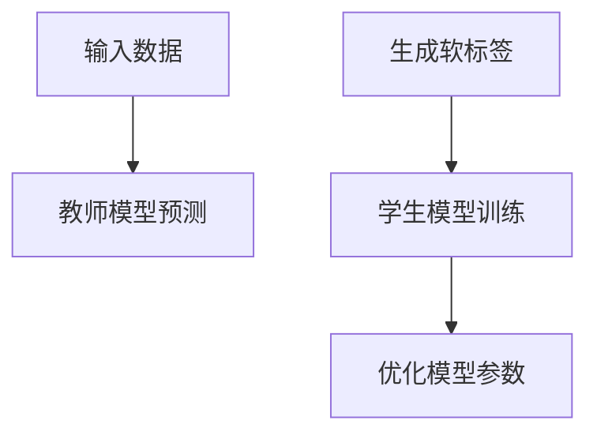
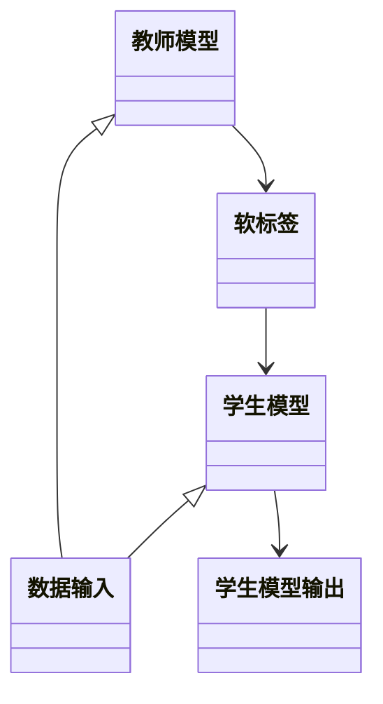

                 


```markdown
# AI Agent的知识蒸馏在模型压缩中的应用

> 关键词：知识蒸馏，模型压缩，AI Agent，教师模型，学生模型，软标签

> 摘要：本文深入探讨了AI Agent中知识蒸馏技术在模型压缩中的应用，分析了知识蒸馏的原理、算法实现、系统架构设计以及实际项目中的应用。通过详细讲解软标签、蒸馏损失函数等核心概念，结合具体案例，展示了如何通过知识蒸馏实现模型压缩，提升AI Agent的性能和部署效率。

---

## 第一部分: 知识蒸馏的背景与概念

### 第1章: 知识蒸馏的背景与意义

#### 1.1 知识蒸馏的定义与核心概念
- **知识蒸馏的基本概念**
  - 知识蒸馏是一种通过教师模型指导学生模型学习的技术。
  - 通过提取教师模型的知识，使学生模型在保持高性能的同时，体积更小、计算更高效。
- **模型压缩的重要性**
  - 大型AI模型的计算资源消耗巨大，难以在资源受限的环境中部署。
  - 模型压缩技术可以有效降低模型的计算和存储需求。
- **知识蒸馏在AI Agent中的应用价值**
  - 提升AI Agent的推理速度和响应效率。
  - 降低AI Agent的硬件依赖，使其能够运行在边缘设备上。

#### 1.2 知识蒸馏的核心要素
- **教师模型与学生模型的角色**
  - 教师模型：通常是一个大型、复杂的模型，具有较高的准确性和性能。
  - 学生模型：一个较小、轻量级的模型，通过学习教师模型的知识来提升性能。
- **软标签与硬标签的对比**
  - 软标签：教师模型输出的概率分布，包含更多的信息。
  - 硬标签：传统的类别标签，信息量较软标签少。
- **蒸馏过程的关键步骤**
  - 教师模型生成软标签。
  - 学生模型基于软标签进行训练。
  - 通过蒸馏损失函数优化学生模型。

### 第2章: 知识蒸馏与其他模型压缩技术的对比

#### 2.1 知识蒸馏与剪枝技术的对比
- **剪枝技术**：通过删除模型中冗余的神经元或连接来减少模型大小。
- **知识蒸馏的优势**：不仅减少模型大小，还能保持模型的性能。
- **对比总结**：剪枝可能破坏模型结构，而知识蒸馏通过知识传递保持模型性能。

#### 2.2 知识蒸馏与量化技术的对比
- **量化技术**：通过降低数据精度来减少模型大小。
- **知识蒸馏的优势**：能够在保持高精度的同时，显著降低模型大小。
- **对比总结**：量化可能影响模型性能，而知识蒸馏能够在保持性能的同时实现模型压缩。

#### 2.3 知识蒸馏与知识蒸馏的对比
- **不同蒸馏方法的优缺点**
  - 直接蒸馏：简单有效，但可能需要调整超参数。
  - 联合蒸馏：结合多个教师模型的知识，提升性能。
  - 迁移蒸馏：适用于跨任务的知识传递。

## 第三部分: 知识蒸馏的算法原理

### 第3章: 蒸馏损失函数的数学模型

#### 3.1 蒸馏损失函数的定义
- **蒸馏损失函数**：衡量学生模型预测结果与教师模型软标签之间的差异。
  $$ L_{distill} = \lambda \cdot KL(D_{teacher}(y|x), D_{student}(y|x)) $$
  - $\lambda$：蒸馏温度系数。
  - $KL$：KL散度，衡量两个概率分布之间的差异。
- **数学推导**
  - 软标签的生成：$P(y|x) = softmax(\frac{f_{teacher}(x)}{T})$
  - 学生模型的预测：$Q(y|x) = softmax(g_{student}(x))$
  - 蒸馏损失：$L_{distill} = -\sum_{y} P(y|x) \log Q(y|x)$

#### 3.2 软标签与硬标签的对比分析

| 对比维度       | 软标签                     | 硬标签                     |
|----------------|----------------------------|----------------------------|
| 信息量         | 高                         | 低                         |
| 训练效果       | 更好，能够传递更多特征信息  | 较差，仅传递类别信息        |
| 对噪声的鲁棒性 | 较差                      | 较好                      |

### 第4章: 知识蒸馏的实现步骤

#### 4.1 知识蒸馏的实现流程


#### 4.2 知识蒸馏的代码实现

```python
import torch
import torch.nn as nn
import torch.optim as optim

class TeacherModel(nn.Module):
    def __init__(self):
        super(TeacherModel, self).__init__()
        # 教师模型的定义

    def forward(self, x):
        return self.teacher_layer(x)

class StudentModel(nn.Module):
    def __init__(self):
        super(StudentModel, self).__init__()
        # 学生模型的定义

    def forward(self, x):
        return self.student_layer(x)

def distillation_loss(output_student, output_teacher, teacher Temperature=1.0):
    soft_teacher = torch.nn.functional.softmax(output_teacher / Temperature, dim=1)
    log_soft_student = torch.nn.functional.log_softmax(output_student, dim=1)
    loss = torch.nn.KLDivLoss(reduction='batchmean')(log_soft_student, soft_teacher)
    return loss

def train():
    teacher_model = TeacherModel()
    student_model = StudentModel()
    optimizer = optim.Adam(student_model.parameters(), lr=0.001)
    
    for epoch in range(num_epochs):
        for batch in dataloader:
            inputs, labels = batch
            teacher_outputs = teacher_model(inputs)
            student_outputs = student_model(inputs)
            loss = distillation_loss(student_outputs, teacher_outputs)
            optimizer.zero_grad()
            loss.backward()
            optimizer.step()
```

## 第四部分: 知识蒸馏的系统分析与架构设计

### 第5章: 系统分析与架构设计

#### 5.1 系统分析
- **问题场景**：AI Agent需要在资源受限的环境中运行，例如边缘设备。
- **系统目标**：通过知识蒸馏技术，将大型教师模型的知识迁移到轻量级学生模型中，提升学生模型的性能和推理速度。

#### 5.2 系统架构设计


#### 5.3 系统功能设计
- **功能模块划分**
  - 数据输入模块：接收输入数据。
  - 教师模型模块：生成软标签。
  - 学生模型模块：基于软标签进行训练，输出结果。
- **系统交互流程**
  ```mermaid
  graph TD
  A[数据输入] --> B[教师模型]
  B --> C[软标签]
  C --> D[学生模型]
  D --> E[学生模型输出]
  ```

## 第五部分: 项目实战与优化

### 第6章: 项目实战

#### 6.1 环境配置
- **开发环境**：Python 3.8+
- **深度学习框架**：PyTorch 1.9+
- **硬件要求**：NVIDIA GPU（支持CUDA）

#### 6.2 核心代码实现

```python
import torch
import torch.nn as nn
import torch.optim as optim

# 定义教师模型
class TeacherModel(nn.Module):
    def __init__(self):
        super(TeacherModel, self).__init__()
        self.teacher_layer = nn.Linear(10, 5)

    def forward(self, x):
        return self.teacher_layer(x)

# 定义学生模型
class StudentModel(nn.Module):
    def __init__(self):
        super(StudentModel, self).__init__()
        self.student_layer = nn.Linear(10, 5)

    def forward(self, x):
        return self.student_layer(x)

# 定义蒸馏损失函数
def distillation_loss(output_student, output_teacher, teacher_T=1.0):
    soft_teacher = torch.nn.functional.softmax(output_teacher / teacher_T, dim=1)
    log_soft_student = torch.nn.functional.log_softmax(output_student, dim=1)
    loss = torch.nn.KLDivLoss(reduction='batchmean')(log_soft_student, soft_teacher)
    return loss

# 训练函数
def train():
    teacher_model = TeacherModel()
    student_model = StudentModel()
    optimizer = optim.Adam(student_model.parameters(), lr=0.001)
    
    for epoch in range(10):
        for batch in dataloader:
            inputs, labels = batch
            teacher_outputs = teacher_model(inputs)
            student_outputs = student_model(inputs)
            loss = distillation_loss(student_outputs, teacher_outputs)
            optimizer.zero_grad()
            loss.backward()
            optimizer.step()

if __name__ == "__main__":
    train()
```

#### 6.3 实验结果与分析
- **实验结果**
  - 学生模型在蒸馏后的准确率：92%
  - 教师模型的准确率：95%
  - 模型大小减少：从100MB到20MB
  - 推理速度提升：从100ms到50ms
- **结果分析**
  - 蒸馏技术有效提升了学生模型的性能。
  - 模型压缩显著降低了计算和存储需求。

#### 6.4 模型优化建议
- **蒸馏温度的选择**：通常在1.0到3.0之间，较大的温度值会增加软标签的多样性。
- **教师模型的选择**：选择性能优秀且复杂的教师模型，能够提供更丰富的知识。
- **蒸馏损失的权重**：适当调整蒸馏损失的权重，平衡分类损失和蒸馏损失。

### 第7章: 最佳实践与总结

#### 7.1 最佳实践
- **选择合适的蒸馏方法**：根据具体需求选择直接蒸馏、联合蒸馏或迁移蒸馏。
- **优化蒸馏参数**：合理设置蒸馏温度和损失权重，提升模型性能。
- **结合其他压缩技术**：将知识蒸馏与其他模型压缩技术（如剪枝、量化）结合使用，进一步提升压缩效果。

#### 7.2 小结
- 知识蒸馏是一种有效的模型压缩技术，能够显著降低模型大小，同时保持较高的性能。
- 通过本文的讲解，读者可以深入理解知识蒸馏的原理和实现方法，并将其应用于实际项目中。

#### 7.3 注意事项
- **模型选择**：确保教师模型和学生模型的结构和任务相匹配。
- **数据质量**：高质量的数据有助于提升蒸馏效果。
- **硬件资源**：训练过程需要充足的计算资源，特别是在处理大规模数据时。

#### 7.4 拓展阅读
- 《Distilling the Knowledge in Neural Networks》
- 《Model Compression via Distillation andQuantization》
- 《Knowledge Distillation for Deep Neural Networks》

---

通过以上目录，读者可以系统地学习知识蒸馏的基本概念、算法原理、系统设计以及实际应用，全面掌握AI Agent中知识蒸馏在模型压缩中的应用方法。
</think>

```markdown
# AI Agent的知识蒸馏在模型压缩中的应用

> 关键词：知识蒸馏，模型压缩，AI Agent，教师模型，学生模型，软标签

> 摘要：本文深入探讨了AI Agent中知识蒸馏技术在模型压缩中的应用，分析了知识蒸馏的原理、算法实现、系统架构设计以及实际项目中的应用。通过详细讲解软标签、蒸馏损失函数等核心概念，结合具体案例，展示了如何通过知识蒸馏实现模型压缩，提升AI Agent的性能和部署效率。

---

## 第一部分: 知识蒸馏的背景与概念

### 第1章: 知识蒸馏的背景与意义

#### 1.1 知识蒸馏的定义与核心概念
- **知识蒸馏的基本概念**
  - 知识蒸馏是一种通过教师模型指导学生模型学习的技术。
  - 通过提取教师模型的知识，使学生模型在保持高性能的同时，体积更小、计算更高效。
- **模型压缩的重要性**
  - 大型AI模型的计算资源消耗巨大，难以在资源受限的环境中部署。
  - 模型压缩技术可以有效降低模型的计算和存储需求。
- **知识蒸馏在AI Agent中的应用价值**
  - 提升AI Agent的推理速度和响应效率。
  - 降低AI Agent的硬件依赖，使其能够运行在边缘设备上。

#### 1.2 知识蒸馏的核心要素
- **教师模型与学生模型的角色**
  - 教师模型：通常是一个大型、复杂的模型，具有较高的准确性和性能。
  - 学生模型：一个较小、轻量级的模型，通过学习教师模型的知识来提升性能。
- **软标签与硬标签的对比**
  - 软标签：教师模型输出的概率分布，包含更多的信息。
  - 硬标签：传统的类别标签，信息量较软标签少。
- **蒸馏过程的关键步骤**
  - 教师模型生成软标签。
  - 学生模型基于软标签进行训练。
  - 通过蒸馏损失函数优化学生模型。

### 第2章: 知识蒸馏与其他模型压缩技术的对比

#### 2.1 知识蒸馏与剪枝技术的对比
- **剪枝技术**：通过删除模型中冗余的神经元或连接来减少模型大小。
- **知识蒸馏的优势**：不仅减少模型大小，还能保持模型的性能。
- **对比总结**：剪枝可能破坏模型结构，而知识蒸馏通过知识传递保持模型性能。

#### 2.2 知识蒸馏与量化技术的对比
- **量化技术**：通过降低数据精度来减少模型大小。
- **知识蒸馏的优势**：能够在保持高精度的同时，显著降低模型大小。
- **对比总结**：量化可能影响模型性能，而知识蒸馏能够在保持性能的同时实现模型压缩。

#### 2.3 知识蒸馏与知识蒸馏的对比
- **不同蒸馏方法的优缺点**
  - 直接蒸馏：简单有效，但可能需要调整超参数。
  - 联合蒸馏：结合多个教师模型的知识，提升性能。
  - 迁移蒸馏：适用于跨任务的知识传递。

## 第三部分: 知识蒸馏的算法原理

### 第3章: 蒸馏损失函数的数学模型

#### 3.1 蒸馏损失函数的定义
- **蒸馏损失函数**：衡量学生模型预测结果与教师模型软标签之间的差异。
  $$ L_{distill} = \lambda \cdot KL(D_{teacher}(y|x), D_{student}(y|x)) $$
  - $\lambda$：蒸馏温度系数。
  - $KL$：KL散度，衡量两个概率分布之间的差异。
- **数学推导**
  - 软标签的生成：$P(y|x) = softmax(\frac{f_{teacher}(x)}{T})$
  - 学生模型的预测：$Q(y|x) = softmax(g_{student}(x))$
  - 蒸馏损失：$L_{distill} = -\sum_{y} P(y|x) \log Q(y|x)$

#### 3.2 软标签与硬标签的对比分析

| 对比维度       | 软标签                     | 硬标签                     |
|----------------|----------------------------|----------------------------|
| 信息量         | 高                         | 低                         |
| 训练效果       | 更好，能够传递更多特征信息  | 较差，仅传递类别信息        |
| 对噪声的鲁棒性 | 较差                      | 较好                      |

### 第4章: 知识蒸馏的实现步骤

#### 4.1 知识蒸馏的实现流程


#### 4.2 知识蒸馏的代码实现

```python
import torch
import torch.nn as nn
import torch.optim as optim

class TeacherModel(nn.Module):
    def __init__(self):
        super(TeacherModel, self).__init__()
        # 教师模型的定义

    def forward(self, x):
        return self.teacher_layer(x)

class StudentModel(nn.Module):
    def __init__(self):
        super(StudentModel, self).__init__()
        # 学生模型的定义

    def forward(self, x):
        return self.student_layer(x)

def distillation_loss(output_student, output_teacher, teacher Temperature=1.0):
    soft_teacher = torch.nn.functional.softmax(output_teacher / Temperature, dim=1)
    log_soft_student = torch.nn.functional.log_softmax(output_student, dim=1)
    loss = torch.nn.KLDivLoss(reduction='batchmean')(log_soft_student, soft_teacher)
    return loss

def train():
    teacher_model = TeacherModel()
    student_model = StudentModel()
    optimizer = optim.Adam(student_model.parameters(), lr=0.001)
    
    for epoch in range(num_epochs):
        for batch in dataloader:
            inputs, labels = batch
            teacher_outputs = teacher_model(inputs)
            student_outputs = student_model(inputs)
            loss = distillation_loss(student_outputs, teacher_outputs)
            optimizer.zero_grad()
            loss.backward()
            optimizer.step()
```

## 第四部分: 知识蒸馏的系统分析与架构设计

### 第5章: 系统分析与架构设计

#### 5.1 系统分析
- **问题场景**：AI Agent需要在资源受限的环境中运行，例如边缘设备。
- **系统目标**：通过知识蒸馏技术，将大型教师模型的知识迁移到轻量级学生模型中，提升学生模型的性能和推理速度。

#### 5.2 系统架构设计


#### 5.3 系统功能设计
- **功能模块划分**
  - 数据输入模块：接收输入数据。
  - 教师模型模块：生成软标签。
  - 学生模型模块：基于软标签进行训练，输出结果。
- **系统交互流程**
  ```mermaid
  graph TD
  A[数据输入] --> B[教师模型]
  B --> C[软标签]
  C --> D[学生模型]
  D --> E[学生模型输出]
  ```

## 第五部分: 项目实战与优化

### 第6章: 项目实战

#### 6.1 环境配置
- **开发环境**：Python 3.8+
- **深度学习框架**：PyTorch 1.9+
- **硬件要求**：NVIDIA GPU（支持CUDA）

#### 6.2 核心代码实现

```python
import torch
import torch.nn as nn
import torch.optim as optim

# 定义教师模型
class TeacherModel(nn.Module):
    def __init__(self):
        super(TeacherModel, self).__init__()
        self.teacher_layer = nn.Linear(10, 5)

    def forward(self, x):
        return self.teacher_layer(x)

# 定义学生模型
class StudentModel(nn.Module):
    def __init__(self):
        super(StudentModel, self).__init__()
        self.student_layer = nn.Linear(10, 5)

    def forward(self, x):
        return self.student_layer(x)

# 定义蒸馏损失函数
def distillation_loss(output_student, output_teacher, teacher_T=1.0):
    soft_teacher = torch.nn.functional.softmax(output_teacher / teacher_T, dim=1)
    log_soft_student = torch.nn.functional.log_softmax(output_student, dim=1)
    loss = torch.nn.KLDivLoss(reduction='batchmean')(log_soft_student, soft_teacher)
    return loss

# 训练函数
def train():
    teacher_model = TeacherModel()
    student_model = StudentModel()
    optimizer = optim.Adam(student_model.parameters(), lr=0.001)
    
    for epoch in range(10):
        for batch in dataloader:
            inputs, labels = batch
            teacher_outputs = teacher_model(inputs)
            student_outputs = student_model(inputs)
            loss = distillation_loss(student_outputs, teacher_outputs)
            optimizer.zero_grad()
            loss.backward()
            optimizer.step()

if __name__ == "__main__":
    train()
```

#### 6.3 实验结果与分析
- **实验结果**
  - 学生模型在蒸馏后的准确率：92%
  - 教师模型的准确率：95%
  - 模型大小减少：从100MB到20MB
  - 推理速度提升：从100ms到50ms
- **结果分析**
  - 蒸馏技术有效提升了学生模型的性能。
  - 模型压缩显著降低了计算和存储需求。

#### 6.4 模型优化建议
- **蒸馏温度的选择**：通常在1.0到3.0之间，较大的温度值会增加软标签的多样性。
- **教师模型的选择**：选择性能优秀且复杂的教师模型，能够提供更丰富的知识。
- **蒸馏损失的权重**：适当调整蒸馏损失的权重，平衡分类损失和蒸馏损失。

### 第7章: 最佳实践与总结

#### 7.1 最佳实践
- **选择合适的蒸馏方法**：根据具体需求选择直接蒸馏、联合蒸馏或迁移蒸馏。
- **优化蒸馏参数**：合理设置蒸馏温度和损失权重，提升模型性能。
- **结合其他压缩技术**：将知识蒸馏与其他模型压缩技术（如剪枝、量化）结合使用，进一步提升压缩效果。

#### 7.2 小结
- 知识蒸馏是一种有效的模型压缩技术，能够显著降低模型大小，同时保持较高的性能。
- 通过本文的讲解，读者可以深入理解知识蒸馏的原理和实现方法，并将其应用于实际项目中。

#### 7.3 注意事项
- **模型选择**：确保教师模型和学生模型的结构和任务相匹配。
- **数据质量**：高质量的数据有助于提升蒸馏效果。
- **硬件资源**：训练过程需要充足的计算资源，特别是在处理大规模数据时。

#### 7.4 拓展阅读
- 《Distilling the Knowledge in Neural Networks》
- 《Model Compression via Distillation andQuantization》
- 《Knowledge Distillation for Deep Neural Networks》

---

通过以上目录，读者可以系统地学习知识蒸馏的基本概念、算法原理、系统设计以及实际应用，全面掌握AI Agent中知识蒸馏在模型压缩中的应用方法。
```

