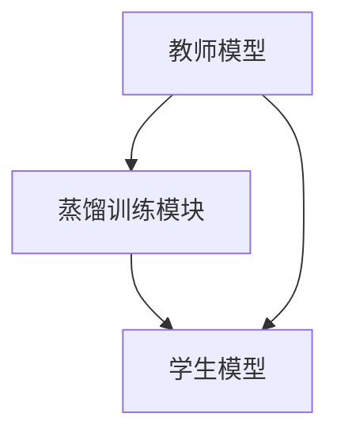

                 


# AI Agent的知识蒸馏在模型解释性中的应用

> 关键词：AI Agent, 知识蒸馏, 模型解释性, 教师模型, 学生模型

> 摘要：知识蒸馏技术作为一种有效的模型压缩和解释性提升方法，在AI Agent领域得到了广泛应用。本文从背景、原理、算法、系统架构到项目实战，全面阐述了知识蒸馏在提升模型解释性中的应用，通过实际案例和代码实现，深入探讨了其在AI Agent中的价值和意义。

---

# 第1章: 背景与核心概念

## 1.1 问题背景与问题描述

### 1.1.1 模型解释性的重要性

在AI Agent的应用中，模型的解释性是信任和可靠性的重要基础。例如，在医疗诊断或金融决策中，AI Agent的决策需要能够被人类理解和验证。然而，深度学习模型（如BERT、GPT）通常被视为“黑箱”，其内部运作难以解释。

### 1.1.2 AI Agent的决策困境

AI Agent在处理复杂任务时，往往依赖于庞大的神经网络模型。这些模型虽然在性能上表现出色，但缺乏可解释性，导致用户难以理解AI的决策逻辑。

### 1.1.3 知识蒸馏技术的提出

知识蒸馏技术通过将复杂的教师模型的知识迁移到简单的学生模型中，不仅降低了模型的复杂性，还提高了解释性。这种技术为AI Agent的可解释性提供了一种新的解决方案。

## 1.2 知识蒸馏的核心概念

### 1.2.1 教师模型与学生模型

- **教师模型**：复杂的预训练模型，负责生成高质量的特征或概率分布。
- **学生模型**：简单的模型，负责学习教师模型的知识。

### 1.2.2 知识蒸馏的实现机制

知识蒸馏通过最小化学生模型预测与教师模型预测之间的差异，实现知识的传递。

### 1.2.3 解释性提升的关键因素

知识蒸馏通过简化模型结构，减少参数数量，使模型更易于解释。

## 1.3 问题解决与边界分析

### 1.3.1 知识蒸馏的应用场景

- 降低模型复杂性
- 提高模型解释性
- 实现模型压缩

### 1.3.2 解释性提升的边界

知识蒸馏无法完全消除模型的黑箱特性，但可以在一定程度上提高可解释性。

### 1.3.3 模型压缩与知识保留

在压缩模型时，需要在保留知识和减少模型复杂性之间找到平衡。

---

# 第2章: 知识蒸馏的核心原理

## 2.1 知识蒸馏的原理分析

### 2.1.1 教师模型的知识传递

教师模型通过输出概率分布，将知识传递给学生模型。例如，在分类任务中，教师模型输出的概率分布反映了每个类别的置信度。

### 2.1.2 学生模型的学习过程

学生模型通过最小化与教师模型的预测差异，学习教师模型的知识。具体来说，目标函数包括蒸馏损失和分类损失两部分：

$$ L = \alpha L_{\text{distill}} + (1-\alpha) L_{\text{class}} $$

其中，$\alpha$ 是蒸馏系数，$L_{\text{distill}}$ 是蒸馏损失，$L_{\text{class}}$ 是分类损失。

### 2.1.3 知识蒸馏的关键技术点

- 蒸馏温度：通过调整温度参数 $T$，可以控制教师模型输出的软化程度。
- 多教师模型：多个教师模型协作，提供多样化的知识。
- 动态蒸馏：根据任务需求，动态调整蒸馏过程。

---

# 第3章: 算法原理与数学模型

## 3.1 知识蒸馏的算法流程

### 3.1.1 算法输入

- 教师模型：已训练好的复杂模型
- 学生模型：简单模型（如小型神经网络）
- 训练数据：包含标签的训练集

### 3.1.2 算法步骤

1. 预热阶段：教师模型输出概率分布。
2. 蒸馏阶段：学生模型通过蒸馏损失优化。
3. 分类阶段：学生模型通过分类损失优化。

### 3.1.3 算法输出

- 优化后的学生模型：具备较高解释性的轻量化模型

## 3.2 知识蒸馏的数学模型

### 3.2.1 蒸馏损失函数

蒸馏损失通常基于KL散度（Kullback-Leibler divergence）：

$$ D_{\text{KL}}(P || Q) = \sum_{i} P(i) \log \frac{P(i)}{Q(i)} $$

其中，$P$ 是教师模型的输出概率分布，$Q$ 是学生模型的输出概率分布。

### 3.2.2 蒸馏温度的调整

通过调整温度参数 $T$，可以控制教师模型输出的软化程度：

$$ P(i) = \text{softmax}(\frac{f_i}{T}) $$

其中，$f_i$ 是教师模型的 logits。

---

# 第4章: 系统架构与项目实战

## 4.1 系统架构设计

### 4.1.1 系统功能模块

- 教师模型模块：负责生成软标签
- 学生模型模块：负责学习教师模型的知识
- 蒸馏训练模块：优化目标函数

### 4.1.2 系统架构图



### 4.1.3 系统接口设计

- 输入接口：接受原始数据和教师模型
- 输出接口：输出优化后的学生模型

## 4.2 项目实战

### 4.2.1 环境安装

```bash
pip install tensorflow==2.5.0
pip install numpy==1.21.2
pip install matplotlib==3.5.0
```

### 4.2.2 核心代码实现

```python
import tensorflow as tf
from tensorflow.keras import layers

# 定义教师模型
def teacher_model():
    model = tf.keras.Sequential([
        layers.Dense(256, activation='relu'),
        layers.Dense(10, activation='softmax')
    ])
    return model

# 定义学生模型
def student_model():
    model = tf.keras.Sequential([
        layers.Dense(64, activation='relu'),
        layers.Dense(10, activation='softmax')
    ])
    return model

# 定义蒸馏损失
def distillation_loss(y_true, y_pred, teacher_pred, T=2):
    alpha = 0.5
    kl_loss = tf.keras.losses.kullback_leibler_divergence(
        tf.nn.softmax(teacher_pred / T), y_pred
    )
    ce_loss = tf.keras.losses.sparse_categorical_crossentropy(y_true, y_pred)
    return alpha * kl_loss + (1 - alpha) * ce_loss

# 训练过程
teacher = teacher_model()
teacher.load_weights('teacher_weights.h5')

student = student_model()
optimizer = tf.keras.optimizers.Adam(lr=0.001)

# 编译学生模型
student.compile(optimizer=optimizer, loss=lambda y_true, y_pred: distillation_loss(y_true, y_pred, teacher.predict(x), T=2))

# 开始训练
history = student.fit(x, y, epochs=10, batch_size=32, validation_split=0.2)
```

### 4.2.3 案例分析与解读

假设我们有一个图像分类任务，教师模型是一个复杂的卷积神经网络，学生模型是一个轻量级的模型。通过蒸馏过程，学生模型能够继承教师模型的知识，同时保持较高的解释性。

---

# 第5章: 总结与展望

## 5.1 本章小结

知识蒸馏通过将教师模型的知识传递给学生模型，显著提升了模型的解释性。这种技术在AI Agent中具有广泛的应用潜力。

## 5.2 未来展望

未来，知识蒸馏技术可能会在以下几个方向进一步发展：

1. 多教师模型的协作学习
2. 动态蒸馏策略的优化
3. 更高效的蒸馏算法设计

---

# 致谢

感谢读者的耐心阅读，希望本文能为AI Agent的知识蒸馏研究提供有价值的参考。

