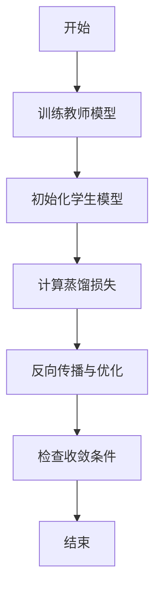
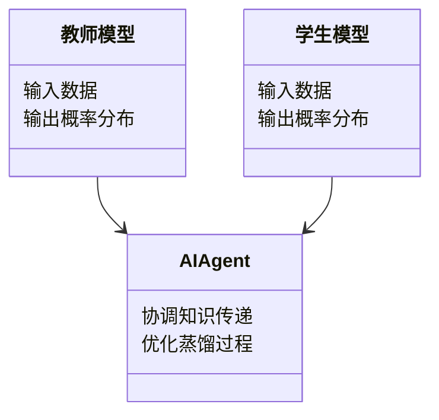
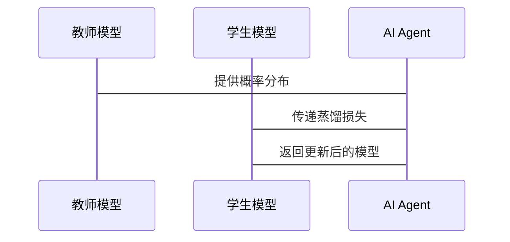

                 


# AI Agent的知识蒸馏在模型轻量化中的应用

## 关键词：知识蒸馏, 模型轻量化, AI Agent, 深度学习, 机器学习

## 摘要：知识蒸馏是一种通过教师模型将知识传递给学生模型的技术，旨在减少模型的大小和计算成本，同时保持或提高性能。本文详细探讨了AI Agent在知识蒸馏中的应用，从背景、原理、算法、系统设计到项目实战，全面分析了知识蒸馏在模型轻量化中的实现和优化策略，最后总结了实际应用中的经验和未来发展方向。

---

## 正文

## 第一部分：背景介绍

### 第1章：知识蒸馏的基本概念

#### 1.1 问题背景与模型轻量化的重要性

在深度学习领域，模型的复杂性不断增加，导致计算资源消耗大、推理时间长，难以在资源受限的环境中部署。模型轻量化的目标是通过压缩模型体积和优化计算效率，使其能够在边缘设备和实时应用中高效运行。

知识蒸馏作为一种有效的模型压缩技术，通过教师模型将知识传递给学生模型，显著降低了模型的复杂性，同时保持甚至提升了性能。这种技术在AI Agent中的应用尤为广泛，因为AI Agent需要在资源受限的环境中执行复杂任务。

#### 1.2 知识蒸馏的定义与核心思想

知识蒸馏是一种通过教师模型指导学生模型学习的技术。教师模型通常是一个复杂且训练良好的大模型，而学生模型是一个较小的模型。知识蒸馏的核心思想是将教师模型的知识（如概率分布）传递给学生模型，使学生模型能够学习到教师模型的决策边界和特征表示。

#### 1.3 AI Agent在知识蒸馏中的角色

AI Agent作为知识蒸馏的执行者，负责协调教师模型和学生模型的交互，优化知识传递过程。AI Agent能够动态调整蒸馏策略，选择最优的知识表示方式，确保学生模型在轻量化的同时具备高效的推理能力。

---

## 第二部分：核心概念与联系

### 第2章：知识蒸馏的核心原理

#### 2.1 知识蒸馏的原理与流程

知识蒸馏的过程包括以下步骤：
1. **教师模型训练**：训练一个高性能的教师模型。
2. **学生模型初始化**：构建一个较小的学生模型。
3. **知识蒸馏**：通过损失函数将教师模型的知识传递给学生模型，通常采用KL散度作为损失函数。

#### 2.2 知识蒸馏的核心要素对比

以下是知识蒸馏与传统迁移学习的对比：

| **对比维度** | **知识蒸馏** | **传统迁移学习** |
|--------------|--------------|------------------|
| **目标**     | 减少模型大小，保持性能 | 利用预训练模型提升新任务性能 |
| **知识来源** | 教师模型的概率分布 | 预训练模型的特征 |
| **应用场景** | 资源受限环境 | 多任务学习 |

#### 2.3 知识蒸馏的ER实体关系图

```mermaid
erDiagram
    actor 教师模型 {
        id (NUMBER)
        参数 (PARAMETERS)
    }
    actor 学生模型 {
        id (NUMBER)
        参数 (PARAMETERS)
    }
    relationship 知识传递 {
        从教师模型流向学生模型
        以概率分布形式传递
    }
```

---

## 第三部分：算法原理与数学模型

### 第3章：知识蒸馏的算法原理

#### 3.1 知识蒸馏的数学模型

知识蒸馏的核心损失函数如下：

$$\mathcal{L}_{\text{distill}} = -\sum_{i} p_i \log q_i$$

其中，\( p_i \) 是教师模型的输出概率，\( q_i \) 是学生模型的输出概率。

#### 3.2 算法流程与步骤

以下是知识蒸馏的算法流程：



#### 3.3 算法优化策略

- **调整温度**：通过增加温度参数，使教师模型的概率分布更平滑，帮助学生模型更好地学习。
- **组合损失函数**：结合分类损失和蒸馏损失，平衡学生模型的直接学习和知识蒸馏的效果。

---

## 第四部分：系统分析与架构设计

### 第4章：系统设计

#### 4.1 问题场景介绍

系统需要在边缘设备上部署轻量化模型，要求模型推理速度快、资源消耗低，同时保持较高的准确性。

#### 4.2 系统功能设计

以下是系统功能模块：



#### 4.3 系统架构设计

以下是系统架构图：


#### 4.4 系统接口设计

系统接口采用RESTful API，如下所示：

```http
POST /distill
{
    "teacher_output": [...],
    "student_output": [...]
}
```

#### 4.5 系统交互设计

以下是系统交互流程：



---

## 第五部分：项目实战

### 第5章：项目实现

#### 5.1 环境安装

需要安装以下库：

```bash
pip install numpy tensorflow keras
```

#### 5.2 核心代码实现

以下是知识蒸馏的核心代码：

```python
import numpy as np
import tensorflow as tf
from tensorflow import keras

# 定义教师模型
def teacher_model():
    model = keras.Sequential([
        keras.layers.Dense(128, activation='relu'),
        keras.layers.Dense(10, activation='softmax')
    ])
    return model

# 定义学生模型
def student_model():
    model = keras.Sequential([
        keras.layers.Dense(64, activation='relu'),
        keras.layers.Dense(10, activation='softmax')
    ])
    return model

# 知识蒸馏损失函数
def distillation_loss(y_true, y_pred, alpha=0.5, temperature=3.0):
    teacher_loss = keras.losses.sparse_categorical_crossentropy(y_true, y_pred)
    student_loss = keras.losses.sparse_categorical_crossentropy(y_true, y_pred)
    total_loss = (1 - alpha) * teacher_loss + alpha * student_loss
    return total_loss

# 知识蒸馏训练
def train_distillation(teacher_model, student_model, distillation_loss):
    optimizer = keras.optimizers.Adam()
    for epoch in range(num_epochs):
        for batch in dataset:
            with tf.GradientTape() as tape:
                teacher_output = teacher_model(batch['input'])
                student_output = student_model(batch['input'])
                loss = distillation_loss(batch['label'], student_output)
            gradients = tape.gradient(loss, student_model.trainable_weights)
            optimizer.apply_gradients(gradients, student_model.trainable_weights)
```

#### 5.3 代码解读与分析

- **教师模型**：用于生成概率分布，通常是一个较大的模型。
- **学生模型**：需要轻量化的模型。
- **知识蒸馏损失函数**：结合教师模型和学生模型的输出，计算蒸馏损失。
- **训练过程**：通过反向传播优化学生模型的参数，使其逼近教师模型的概率分布。

#### 5.4 实际案例分析

以下是一个实际案例：

```python
# 示例数据
X_train = np.random.rand(1000, 64)
y_train = np.random.randint(0, 10, 1000)

teacher = teacher_model()
student = student_model()

# 训练教师模型
teacher.compile(optimizer='adam', loss='sparse_categorical_crossentropy')
teacher.fit(X_train, y_train, epochs=10)

# 初始化学生模型
student.compile(optimizer='adam', loss=lambda y_true, y_pred: distillation_loss(y_true, y_pred, alpha=0.5, temperature=3.0))
student.fit(X_train, y_train, epochs=10)

# 比较模型大小和性能
print("教师模型参数数量：", teacher.count_params())
print("学生模型参数数量：", student.count_params())
print("教师模型准确率：", teacher.evaluate(X_train, y_train)[1])
print("学生模型准确率：", student.evaluate(X_train, y_train)[1])
```

---

## 第六部分：最佳实践与未来展望

### 第6章：总结与建议

#### 6.1 小结

知识蒸馏是一种有效的模型轻量化技术，通过教师模型和学生模型的协作，显著降低了模型的复杂性，同时保持了性能。AI Agent在知识蒸馏中的应用，进一步优化了知识传递的过程，提升了模型的效率和效果。

#### 6.2 注意事项

- 确保教师模型的训练充分，避免知识传递不充分。
- 调整温度和损失函数参数，找到最佳的蒸馏策略。
- 在资源受限的环境中测试模型的性能和效率。

#### 6.3 拓展阅读

建议阅读以下文献，深入了解知识蒸馏的最新进展：

- Hinton, G., et al. "Distilling the knowledge in neural networks." arXiv preprint arXiv:1406.5228 (2014).
- Zhang, X., et al. "Progressive knowledge distillation for deep learning model compression." arXiv preprint arXiv:1808.08162 (2018).

---

## 结语

知识蒸馏作为模型轻量化的重要技术，已经在AI Agent中得到广泛应用。通过本文的详细讲解，读者可以全面理解知识蒸馏的核心原理、系统设计和实际应用。未来，随着AI技术的不断发展，知识蒸馏将在更多领域发挥重要作用，帮助构建高效、轻量化的AI系统。

