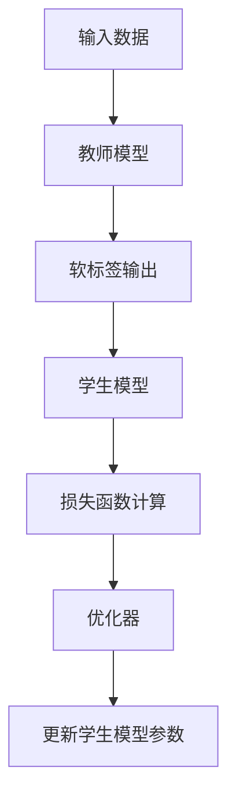
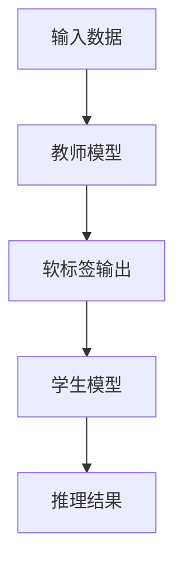

                 


# AI Agent的知识蒸馏在移动设备上的应用

> **关键词**：AI Agent、知识蒸馏、移动设备、模型压缩、深度学习、移动应用开发、边缘计算

> **摘要**：随着AI技术的快速发展，AI Agent在移动设备上的应用越来越广泛。然而，大型AI模型在移动设备上的部署面临性能和资源的限制。知识蒸馏作为一种有效的模型压缩技术，能够将大型模型的知识迁移到更小、更高效的模型中，从而在移动设备上实现高性能的AI推理。本文将详细介绍知识蒸馏的核心概念、算法原理、在移动设备上的应用需求、系统设计与优化方法，以及实际项目实现的步骤，帮助读者全面理解AI Agent的知识蒸馏技术及其在移动设备上的应用价值。

---

# 第1章: AI Agent与知识蒸馏概述

## 1.1 AI Agent的基本概念

### 1.1.1 AI Agent的定义与特点

AI Agent（人工智能代理）是一种能够感知环境、自主决策并执行任务的智能实体。它通过传感器获取信息，利用推理能力做出决策，并通过执行器与环境交互。AI Agent的核心特点包括：

- **自主性**：能够在没有外部干预的情况下自主运行。
- **反应性**：能够实时感知环境并做出响应。
- **目标导向**：具有明确的目标，能够优化决策以实现目标。
- **社会性**：能够与其他AI Agent或人类进行协作或竞争。

### 1.1.2 AI Agent的核心功能与应用场景

AI Agent的核心功能包括信息处理、决策优化、任务执行和人机交互。其应用场景广泛，包括智能助手（如Siri、Google Assistant）、推荐系统、自动驾驶、智能安防等。

### 1.1.3 知识蒸馏的定义与基本原理

知识蒸馏是一种将大型复杂模型（教师模型）的知识迁移到简单模型（学生模型）的技术。教师模型通过软标签（概率分布）或硬标签（类别标签）指导学生模型学习，从而实现知识的压缩与传递。

---

## 1.2 知识蒸馏的背景与意义

### 1.2.1 大型AI模型的局限性

大型AI模型（如BERT、GPT）虽然在性能上表现出色，但其计算资源需求和存储需求过高，难以直接在移动设备上部署。

### 1.2.2 知识蒸馏技术的提出与目标

知识蒸馏技术的提出旨在解决大型模型在资源受限场景下的部署问题，通过将知识迁移到小型模型，实现模型的轻量化。

### 1.2.3 知识蒸馏在移动设备上的应用价值

在移动设备上，知识蒸馏可以显著降低模型的计算复杂度，提升推理速度，同时减少对网络的依赖，适用于离线场景。

---

## 1.3 本章小结

本章介绍了AI Agent的基本概念和核心功能，并详细阐述了知识蒸馏的定义和基本原理，分析了其在移动设备上的应用价值。

---

# 第2章: 知识蒸馏的核心概念与原理

## 2.1 知识蒸馏的理论基础

### 2.1.1 教师模型与学生模型的关系

知识蒸馏的核心是教师模型和学生模型的关系。教师模型通常是一个复杂的大模型，学生模型是一个简单的小模型。学生模型通过模仿教师模型的学习，获得接近教师模型的性能。

### 2.1.2 知识蒸馏的三要素:教师、学生、蒸馏过程

知识蒸馏的三要素包括：

1. **教师模型**：提供知识的来源。
2. **学生模型**：接收并学习知识。
3. **蒸馏过程**：知识传递的过程，通常通过损失函数实现。

### 2.1.3 知识蒸馏与模型压缩的区别与联系

- **区别**：知识蒸馏是一种知识转移技术，而模型压缩是一种直接减少模型参数的技术。
- **联系**：知识蒸馏可以与模型压缩结合使用，进一步降低模型的计算复杂度。

---

## 2.2 知识蒸馏的关键技术

### 2.2.1 温度缩放（Temperature Scaling）

温度缩放是一种常用的蒸馏技术，通过调整教师模型的输出概率分布的“软化”程度，使学生模型更容易学习。

公式如下：

$$ P(y|x) = \text{softmax}(f_{\theta}(x)/T) $$

其中，$T$ 是温度参数，$T>1$时，概率分布更分散；$T<1$时，概率分布更集中。

### 2.2.2 概率分布匹配（KL散度）

KL散度是一种衡量两个概率分布差异性的指标，用于衡量学生模型输出与教师模型输出的差距。

公式如下：

$$ L_{\text{KL}} = -\sum_{i=1}^{n} P(y_i|x) \log Q(y_i|x) $$

其中，$P$ 是教师模型的输出概率，$Q$ 是学生模型的输出概率。

### 2.2.3 软标签与硬标签的对比

- **软标签**：教师模型输出概率分布，学生模型通过匹配概率分布进行学习。
- **硬标签**：教师模型输出类别标签，学生模型通过匹配类别标签进行学习。

---

## 2.3 知识蒸馏的数学模型

### 2.3.1 教师模型的输出概率公式

$$ P(y|x) = \text{softmax}(f_{\theta}(x)/T) $$

### 2.3.2 学生模型的损失函数公式

$$ L = -\sum_{i=1}^{n} P(y_i|x) \log Q(y_i|x) $$

---

## 2.4 本章小结

本章详细介绍了知识蒸馏的核心概念与关键技术，包括教师模型、学生模型、温度缩放和KL散度等。

---

# 第3章: 知识蒸馏在移动设备上的应用

## 3.1 移动设备上的AI Agent需求分析

### 3.1.1 移动设备的硬件与性能限制

移动设备的硬件资源有限，包括CPU、GPU性能不足，内存和存储空间有限，以及电池续航和功耗的限制。

### 3.1.2 大型AI模型的部署难题

大型AI模型在移动设备上部署面临以下问题：

- **计算复杂度高**：模型推理速度慢。
- **存储需求大**：模型参数占用存储空间大。
- **网络依赖强**：部分模型需要依赖云端计算。

### 3.1.3 网络延迟与离线场景的应对

知识蒸馏技术可以在移动设备上部署轻量级模型，减少对网络的依赖，适用于离线场景。

---

## 3.2 知识蒸馏在移动设备上的优势

### 3.2.1 模型轻量化的优势

知识蒸馏可以显著降低模型的参数数量和计算复杂度，使其能够在移动设备上高效运行。

### 3.2.2 本地推理的效率提升

通过知识蒸馏，可以在移动设备上部署高效的本地推理模型，减少对云端的依赖。

### 3.2.3 离线场景下的可用性增强

知识蒸馏技术可以在离线场景下提供高性能的AI推理能力，适用于无法联网的环境。

---

## 3.3 本章小结

本章分析了知识蒸馏在移动设备上的需求和优势，强调了其在资源受限场景下的应用价值。

---

# 第4章: 知识蒸馏的算法实现与优化

## 4.1 知识蒸馏的算法流程图



---

## 4.2 温度缩放的实现细节

### 4.2.1 温度参数T的选取策略

温度参数$T$的选取会影响蒸馏效果。通常，$T$的取值范围在0.1到10之间。可以通过实验或验证集调整$T$的值。

### 4.2.2 温度调整对模型性能的影响

- **$T$较大**：概率分布更分散，学生模型更容易学习。
- **$T$较小**：概率分布更集中，学生模型学习难度增加。

### 4.2.3 温度缩放的数学公式

$$ P(y|x) = \text{softmax}(f_{\theta}(x)/T) $$

---

## 4.3 知识蒸馏的优化方法

### 4.3.1 使用KL散度作为损失函数

KL散度可以衡量学生模型输出与教师模型输出的差距，公式如下：

$$ L_{\text{KL}} = -\sum_{i=1}^{n} P(y_i|x) \log Q(y_i|x) $$

### 4.3.2 结合交叉熵损失的优化策略

在实际应用中，可以结合交叉熵损失和KL散度损失，公式如下：

$$ L = \alpha L_{\text{CE}} + (1-\alpha) L_{\text{KL}} $$

其中，$\alpha$ 是平衡系数。

---

## 4.4 本章小结

本章详细介绍了知识蒸馏的算法实现与优化方法，包括温度缩放和KL散度等关键技术。

---

# 第5章: 系统分析与架构设计

## 5.1 系统分析

### 5.1.1 系统功能需求

- 教师模型训练与部署。
- 学生模型训练与优化。
- 模型推理与结果输出。

### 5.1.2 系统性能需求

- 计算效率高。
- 存储空间小。
- 推理速度快。

---

## 5.2 系统架构设计

### 5.2.1 系统架构图



### 5.2.2 系统功能模块

- **教师模型模块**：负责生成软标签。
- **学生模型模块**：负责学习软标签。
- **损失函数模块**：计算KL散度损失。
- **优化器模块**：优化学生模型参数。

---

## 5.3 本章小结

本章分析了系统的功能需求和性能需求，并设计了系统的架构图和功能模块。

---

# 第6章: 项目实战

## 6.1 环境安装

### 6.1.1 安装Python

```bash
python --version
```

### 6.1.2 安装深度学习框架

```bash
pip install torch
```

### 6.1.3 安装其他依赖库

```bash
pip install numpy matplotlib
```

---

## 6.2 系统核心实现源代码

### 6.2.1 教师模型定义

```python
import torch
import torch.nn as nn

class TeacherModel(nn.Module):
    def __init__(self):
        super(TeacherModel, self).__init__()
        self.fc = nn.Linear(10, 5)
    
    def forward(self, x):
        return torch.softmax(self.fc(x), dim=1)
```

### 6.2.2 学生模型定义

```python
class StudentModel(nn.Module):
    def __init__(self):
        super(StudentModel, self).__init__()
        self.fc = nn.Linear(10, 5)
    
    def forward(self, x):
        return torch.softmax(self.fc(x), dim=1)
```

### 6.2.3 损失函数定义

```python
def knowledge_distillation_loss(output, teacher_output, temperature=1.0):
    student_log = output / temperature
    teacher_soft = teacher_output / temperature
    loss = -torch.sum(teacher_soft * torch.log(torch.exp(student_log)))
    return loss
```

---

## 6.3 代码应用解读与分析

### 6.3.1 教师模型与学生模型的对比

教师模型和学生模型的结构相同，但教师模型通过温度缩放生成软标签，学生模型通过匹配软标签进行学习。

### 6.3.2 损失函数的实现细节

知识蒸馏损失函数通过匹配学生模型和教师模型的概率分布，实现知识的传递。

---

## 6.4 实际案例分析

### 6.4.1 数据集准备

使用MNIST数据集进行训练和测试。

### 6.4.2 模型训练

```python
teacher_model = TeacherModel()
student_model = StudentModel()
optimizer = torch.optim.Adam(student_model.parameters(), lr=0.001)
criterion = knowledge_distillation_loss

for epoch in range(10):
    for batch_x, batch_y in dataloader:
        teacher_output = teacher_model(batch_x)
        student_output = student_model(batch_x)
        loss = criterion(student_output, teacher_output)
        optimizer.zero_grad()
        loss.backward()
        optimizer.step()
```

### 6.4.3 模型推理

```python
def inference(model, input_data):
    with torch.no_grad():
        output = model(input_data)
        return output.argmax(dim=1).item()

print(inference(student_model, test_input))
```

---

## 6.5 本章小结

本章通过实际案例分析，详细讲解了知识蒸馏技术的实现步骤和代码实现。

---

# 第7章: 总结与展望

## 7.1 总结

知识蒸馏是一种有效的模型压缩技术，能够将大型模型的知识迁移到小型模型，适用于移动设备上的AI Agent部署。

## 7.2 展望

未来，知识蒸馏技术将在移动设备上的AI应用中发挥更大的作用，包括更高效的模型优化算法和更广泛的应用场景。

---

## 7.3 最佳实践 Tips

- **温度参数的选择**：通过实验确定合适的温度参数。
- **损失函数的优化**：结合交叉熵损失和KL散度损失。
- **模型架构设计**：确保教师模型和学生模型的兼容性。

---

## 7.4 注意事项

- **数据质量**：确保教师模型和学生模型的训练数据一致。
- **模型收敛性**：关注学生模型的收敛速度和效果。

---

## 7.5 拓展阅读

- **论文推荐**：《Distilling the Knowledge in a Neural Network》
- **技术博客**：[链接]

---

# 结语

通过本文的详细讲解，读者可以全面理解AI Agent的知识蒸馏技术及其在移动设备上的应用价值。从理论到实践，从算法实现到系统设计，本文为读者提供了一套完整的知识蒸馏技术解决方案。

