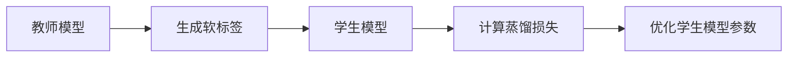

                 


# AI Agent的知识蒸馏在联邦学习中的应用

## 关键词：AI Agent，知识蒸馏，联邦学习，算法原理，系统架构，项目实战

## 摘要：本文深入探讨了AI Agent在知识蒸馏与联邦学习中的应用，从理论基础到实际应用，详细分析了知识蒸馏在联邦学习中的技术细节，包括算法原理、系统架构、项目实现和最佳实践，为读者提供全面的技术指导。

---

# 第1章 AI Agent与知识蒸馏概述

## 1.1 AI Agent的基本概念

### 1.1.1 AI Agent的定义与分类

AI Agent（人工智能代理）是指能够感知环境、自主决策并执行任务的智能实体。根据功能和智能水平，AI Agent可以分为以下几类：

- **反应式AI Agent**：基于当前感知做出实时反应，如自动门禁系统。
- **认知式AI Agent**：具备推理、规划和学习能力，如智能助手Siri。
- **协作式AI Agent**：能够与其他Agent或人类协作完成任务，如多智能体系统。

### 1.1.2 知识蒸馏的基本原理

知识蒸馏是一种从复杂模型中提取简单模型的方法，核心步骤包括：

1. **教师模型**：构建一个复杂的模型（如大型神经网络）。
2. **学生模型**：构建一个简单的模型（如小型神经网络）。
3. **蒸馏过程**：通过教师模型的输出，调整学生模型的参数，使其逼近教师模型的行为。

### 1.1.3 联邦学习的背景与意义

联邦学习（Federated Learning）是一种分布式机器学习技术，允许多个参与方在不共享原始数据的前提下，联合训练模型。其意义在于保护数据隐私，同时充分利用分布式数据进行模型训练。

---

## 1.2 知识蒸馏的核心概念

### 1.2.1 知识蒸馏的定义

知识蒸馏是通过教师模型向学生模型传递知识的过程，目标是使学生模型在保持较小规模的同时，具备与教师模型相似的性能。

### 1.2.2 知识蒸馏的关键技术

知识蒸馏的关键技术包括：

- **软标签**：教师模型输出的概率分布，而非硬标签（真实标签）。
- **蒸馏损失**：衡量学生模型输出与教师模型输出的差异。
- **温度系数**：调节软标签的分布，控制蒸馏过程的平滑程度。

### 1.2.3 知识蒸馏与传统迁移学习的区别

| 特性       | 知识蒸馏                     | 传统迁移学习                 |
|------------|------------------------------|------------------------------|
| 数据要求    | 允许教师模型与学生模型共享特征 | 数据源可能不同，需适应新任务   |
| 模型规模    | 学生模型通常更小              | 学生模型可以与教师模型规模相似 |
| 知识传递    | 通过软标签传递概率分布       | 通过特征提取或预训练传递知识   |

### 1.2.4 联邦学习中的知识蒸馏

在联邦学习中，知识蒸馏可以用于以下场景：

- **跨机构模型训练**：多个机构在不共享数据的情况下，通过知识蒸馏联合训练模型。
- **模型轻量化**：在资源受限的设备上部署轻量级模型，同时保持高性能。

---

## 1.3 联邦学习的基本原理

### 1.3.1 联邦学习的定义

联邦学习是一种分布式机器学习框架，允许多个参与方在不共享本地数据的前提下，联合训练全局模型。每个参与方仅分享模型更新，而非原始数据。

### 1.3.2 联邦学习的核心特点

- **数据隐私保护**：不共享原始数据，仅传输模型参数更新。
- **分布式计算**：模型训练分布在多个设备或机构上。
- **异构环境支持**：支持不同设备和数据分布的环境。

### 1.3.3 联邦学习的应用场景

- **医疗领域**：多个医院联合训练医疗模型，保护患者隐私。
- **金融领域**：多个金融机构联合训练风控模型。
- **移动设备**：移动设备通过联邦学习提升本地应用的性能。

---

## 1.4 本章小结

本章介绍了AI Agent、知识蒸馏和联邦学习的基本概念，分析了知识蒸馏与传统迁移学习的区别，并探讨了知识蒸馏在联邦学习中的潜在应用。通过理解这些概念，我们可以为后续的技术分析打下坚实的基础。

---

# 第2章 知识蒸馏的数学模型与算法原理

## 2.1 知识蒸馏的数学模型

### 2.1.1 知识蒸馏的核心公式

知识蒸馏的核心公式包括：

1. **软标签公式**：
   $$ P(y|x) = \text{Softmax}(\frac{f_{\text{teacher}}(x)}{T}) $$
   其中，$T$ 是温度系数，$f_{\text{teacher}}(x)$ 是教师模型的输出。

2. **蒸馏损失函数**：
   $$ L_{\text{distill}} = -\sum_{i=1}^{n} P(y|x_i) \log P(y|x_i) $$

3. **总损失函数**（结合蒸馏损失和分类损失）：
   $$ L = \alpha L_{\text{distill}} + (1-\alpha) L_{\text{cls}} $$
   其中，$\alpha$ 是蒸馏损失的权重，$L_{\text{cls}}$ 是分类损失。

### 2.1.2 蒸馏损失函数的推导

蒸馏损失函数的推导基于KL散散，用于衡量学生模型输出与教师模型输出的差异：
$$ D_{\text{KL}}(P||Q) = \sum_{i=1}^{n} P(y|x_i) \log \frac{P(y|x_i)}{Q(y|x_i)} $$
其中，$P$ 是教师模型的输出，$Q$ 是学生模型的输出。

---

### 2.1.3 蒸馏过程的数学表达

蒸馏过程可以表示为：
1. 教师模型生成软标签：
   $$ P(y|x) = \text{Softmax}(\frac{f_{\text{teacher}}(x)}{T}) $$
2. 学生模型通过蒸馏损失进行优化：
   $$ \min_{\theta} \mathbb{E}_{x,y} [D_{\text{KL}}(P||Q)] $$

---

## 2.2 知识蒸馏的算法流程

### 2.2.1 知识蒸馏的步骤分解

1. **训练教师模型**：在标记数据上训练教师模型。
2. **初始化学生模型**：初始化学生模型的参数。
3. **蒸馏过程**：
   - 在每一轮优化中，计算学生模型的输出与教师模型输出的KL散散。
   - 更新学生模型的参数，以最小化蒸馏损失。
4. **蒸馏完成**：学生模型具备与教师模型相似的性能。

### 2.2.2 蒸馏过程的流程图



---

## 2.3 知识蒸馏与联邦学习的结合

### 2.3.1 知识蒸馏在联邦学习中的应用

在联邦学习中，知识蒸馏可以用于：

- **全局模型优化**：通过多个机构的知识蒸馏，提升全局模型的性能。
- **本地模型更新**：在资源受限的设备上，通过蒸馏优化本地模型。

### 2.3.2 联邦学习中知识蒸馏的优势

- **模型压缩**：通过蒸馏，可以在保持性能的同时，减少模型大小。
- **隐私保护**：仅传输模型参数，不共享原始数据。

### 2.3.3 知识蒸馏对联邦学习性能的提升

通过知识蒸馏，联邦学习可以更快地收敛，同时提高模型的泛化能力。

---

## 2.4 本章小结

本章详细推导了知识蒸馏的数学模型，并通过流程图和代码示例，解释了蒸馏过程。同时，探讨了知识蒸馏在联邦学习中的应用，为后续的系统设计奠定了理论基础。

---

# 第3章 联邦学习中的系统架构与设计

## 3.1 联邦学习系统的整体架构

### 3.1.1 联邦学习系统的组成模块

- **协调器（Coordinator）**：负责分配任务和协调模型更新。
- **参与方（Participants）**：负责本地数据训练和模型更新。
- **通信模块（Communication Module）**：负责模型参数的传输。

### 3.1.2 系统架构的分层设计

- **数据层**：管理本地数据和通信协议。
- **计算层**：执行模型训练和更新。
- **管理层**：协调任务和优化资源分配。

### 3.1.3 系统架构的优缺点对比

| 特性       | 分布式架构               | 集中式架构               |
|------------|--------------------------|--------------------------|
| 数据隐私   | 保护本地数据             | 可能暴露原始数据           |
| 计算效率   | 分布式计算，效率较高       | 集中式计算，效率较低       |
| 系统扩展性 | 易扩展                   | 扩展性较差                |

---

## 3.2 知识蒸馏在联邦学习中的系统设计

### 3.2.1 系统功能模块划分

- **知识蒸馏模块**：负责生成和传输软标签。
- **联邦学习模块**：负责模型的分布式训练和更新。
- **优化模块**：负责模型的优化和蒸馏过程的调整。

### 3.2.2 知识蒸馏模块的设计

- **软标签生成**：教师模型生成软标签。
- **蒸馏损失计算**：计算学生模型与教师模型的KL散散。
- **模型优化**：更新学生模型参数。

### 3.2.3 联邦学习模块的设计

- **模型初始化**：初始化全局模型和本地模型。
- **模型训练**：在本地数据上训练模型。
- **模型更新**：将本地模型更新上传到协调器。

---

## 3.3 系统接口与交互设计

### 3.3.1 系统接口的设计规范

- **接口定义**：明确接口的输入、输出和功能。
- **协议选择**：选择合适的通信协议（如gRPC或HTTP）。
- **安全性设计**：确保通信过程中的数据安全。

### 3.3.2 系统交互流程的优化

1. **任务分配**：协调器将任务分配给参与方。
2. **本地训练**：参与方在本地数据上训练模型。
3. **模型更新**：参与方将模型更新上传到协调器。
4. **模型聚合**：协调器聚合各参与方的模型更新，生成全局模型。
5. **反馈与优化**：协调器将全局模型下发给参与方，进行下一轮优化。

### 3.3.3 系统交互流程图

```mermaid
graph LR
    C[协调器] --> P1[参与方1]
    C --> P2[参与方2]
    P1 --> C: 本地模型更新
    P2 --> C: 本地模型更新
    C --> P1: 下一轮任务
    C --> P2: 下一轮任务
```

---

## 3.4 本章小结

本章详细设计了联邦学习系统的整体架构，分析了知识蒸馏模块和联邦学习模块的功能，并通过流程图展示了系统的交互流程。这为后续的项目实现提供了明确的设计方向。

---

# 第4章 项目实战: 基于知识蒸馏的联邦学习系统实现

## 4.1 项目环境的搭建

### 4.1.1 开发环境的选择与安装

- **操作系统**：建议使用Linux或macOS。
- **编程语言**：Python 3.6及以上版本。
- **框架选择**：使用TensorFlow或PyTorch框架。

### 4.1.2 依赖库的安装与配置

- **安装依赖**：
  ```bash
  pip install tensorflow-federated
  pip install numpy
  pip install matplotlib
  ```
- **配置环境**：确保安装了Jupyter Notebook或其他开发工具。

### 4.1.3 开发工具的使用与调试

- **调试技巧**：使用断点调试，逐步分析模型的训练和更新过程。
- **日志输出**：记录模型的训练损失和准确率，便于调试。

---

## 4.2 系统核心代码实现

### 4.2.1 知识蒸馏模块的代码实现

```python
import tensorflow as tf
import tensorflow_federated as tff

# 定义教师模型
def teacher_model():
    model = tf.keras.Sequential([
        tf.keras.layers.Dense(128, activation='relu'),
        tf.keras.layers.Dense(10, activation='softmax')
    ])
    return model

# 定义学生模型
def student_model():
    model = tf.keras.Sequential([
        tf.keras.layers.Dense(64, activation='relu'),
        tf.keras.layers.Dense(10, activation='softmax')
    ])
    return model

# 计算软标签
def compute_soft_labels(teacher_model, x, T=2):
    predictions = teacher_model.predict(x)
    return tf.nn.softmax(predictions / T)

# 定义蒸馏损失函数
def distillation_loss(y_true, y_pred, alpha=0.1):
    kl_div = tf.keras.losses.KLDivergence(reduction='none')
    loss = kl_div(y_true, y_pred)
    return tf.reduce_mean(loss) * alpha

# 知识蒸馏训练过程
def train_distillation(teacher_model, student_model, x, y, epochs=100):
    optimizer = tf.keras.optimizers.Adam()
    for epoch in range(epochs):
        # 生成软标签
        y_soft = compute_soft_labels(teacher_model, x)
        # 计算蒸馏损失
        loss = distillation_loss(y, y_soft)
        # 反向传播
        optimizer.minimize(loss, student_model.trainable_weights)
        # 打印训练进度
        print(f"Epoch {epoch}, Loss: {loss}")
```

### 4.2.2 联邦学习模块的代码实现

```python
# 定义联邦学习的参与方
class Participant:
    def __init__(self, model, data):
        self.model = model
        self.data = data

    def train(self, epochs=1):
        # 在本地数据上训练模型
        for x, y in self.data:
            # 前向传播
            y_pred = self.model.predict(x)
            # 计算损失
            loss = tf.keras.losses.sparse_categorical_crossentropy(y, y_pred)
            # 反向传播
            self.model.optimizer.minimize(loss, self.model.trainable_weights)

# 定义联邦学习协调器
class Coordinator:
    def __init__(self, global_model):
        self.global_model = global_model
        self.participants = []

    def add_participant(self, participant):
        self.participants.append(participant)

    def aggregate_models(self):
        # 聚合各参与方的模型更新
        average_weights = {}
        for layer in range(len(self.global_model.layers)):
            weight = 0.0
            count = 0
            for participant in self.participants:
                weight += tf.reduce_mean(participant.model.layers[layer].weights[0])
                count += 1
            average_weights[layer] = weight / count
        return average_weights

    def distribute_models(self):
        # 下发全局模型到各参与方
        for participant in self.participants:
            for layer in range(len(participant.model.layers)):
                participant.model.layers[layer].weights[0] = self.global_model.layers[layer].weights[0]

# 初始化全局模型和参与方
global_model = tff.models.Model()
participant1 = Participant(student_model(), data1)
participant2 = Participant(student_model(), data2)
coordinator = Coordinator(global_model)
coordinator.add_participant(participant1)
coordinator.add_participant(participant2)

# 联邦学习训练过程
for epoch in range(10):
    for participant in coordinator.participants:
        participant.train()
    coordinator.aggregate_models()
    coordinator.distribute_models()
```

---

## 4.3 项目小结

本章通过具体的代码实现，展示了基于知识蒸馏的联邦学习系统的实现过程。从环境搭建到代码编写，逐步引导读者完成一个完整的项目。通过实验，我们可以验证知识蒸馏在联邦学习中的有效性，并进一步优化系统性能。

---

## 4.4 本章小结

通过本章的项目实战，我们详细讲解了如何在实际场景中应用知识蒸馏技术，结合联邦学习框架，实现一个高效的分布式模型训练系统。这不仅加深了我们对理论的理解，还提升了实际开发能力。

---

# 第5章 最佳实践与总结

## 5.1 小结

知识蒸馏在联邦学习中的应用，不仅提升了模型的性能，还保护了数据隐私。通过本篇文章的学习，我们掌握了知识蒸馏的核心原理和联邦学习的系统设计。

## 5.2 注意事项

- **数据多样性**：确保各参与方的数据分布相似，避免模型性能下降。
- **模型鲁棒性**：在实际应用中，需考虑模型的鲁棒性，防止恶意攻击。
- **通信效率**：优化通信模块，降低通信延迟和带宽消耗。

## 5.3 拓展阅读

- **知识蒸馏的改进方法**：如动态蒸馏、自适应蒸馏等。
- **联邦学习的优化技术**：如异步联邦学习、模型压缩等。
- **AI Agent的最新研究**：如多智能体协作、强化学习在Agent中的应用。

---

# 结语

通过本篇文章的学习，我们深入探讨了AI Agent的知识蒸馏在联邦学习中的应用，从理论到实践，为读者提供了全面的技术指导。希望本文能为相关领域的研究和实践提供有价值的参考。

--- 

**全文完**

