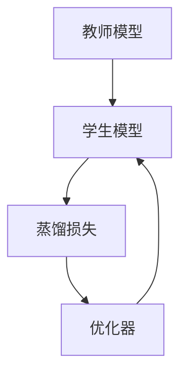
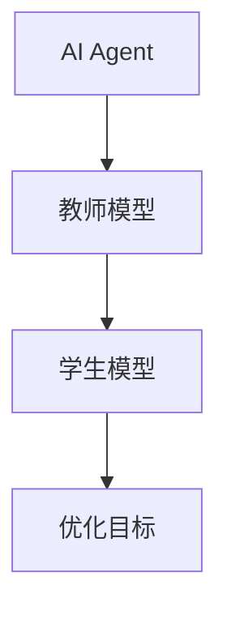
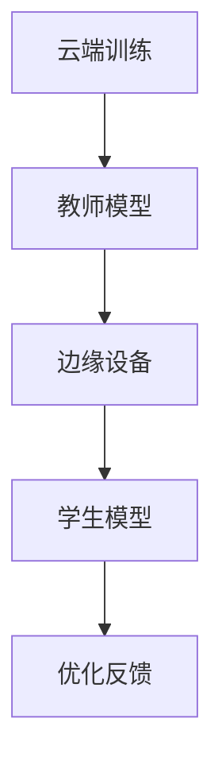
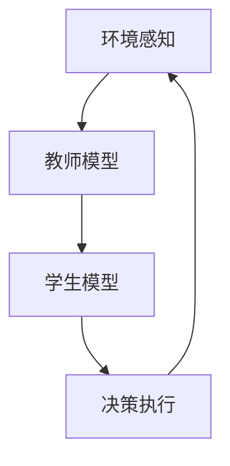

                 


# AI Agent的知识蒸馏在边缘AI中的优化策略

> 关键词：AI Agent, 知识蒸馏, 边缘AI, 模型优化, 智能计算

> 摘要：本文探讨了AI Agent在边缘AI环境中的知识蒸馏优化策略，通过分析知识蒸馏的基本原理、算法实现、系统架构设计以及实际应用场景，提出了一套适用于边缘计算环境的优化方案。文章从理论到实践，详细阐述了如何通过知识蒸馏技术提升AI Agent在资源受限环境下的性能与效率，为边缘AI的发展提供了新的思路。

---

## 第一章：引言

### 1.1 问题背景
随着边缘AI技术的快速发展，AI Agent（智能体）在边缘设备上的应用日益广泛。然而，边缘设备通常面临计算资源有限、数据传输延迟高等挑战，这使得传统的模型优化方法难以满足需求。如何在资源受限的环境中高效运行AI Agent，成为当前研究的热点问题。

### 1.2 研究目标
本文旨在探讨如何通过知识蒸馏技术优化AI Agent在边缘AI中的性能，降低计算资源消耗，同时提升模型的准确性和响应速度。

---

## 第二章：AI Agent与知识蒸馏的背景介绍

### 2.1 AI Agent的基本概念
AI Agent是一种能够感知环境、执行任务并做出决策的智能实体。在边缘AI中，AI Agent通常运行在资源受限的设备上，如嵌入式系统或物联网设备。

#### AI Agent的特点
- **自主性**：能够在没有外部干预的情况下自主运行。
- **反应性**：能够实时感知环境并做出响应。
- **学习能力**：通过学习优化自身的决策过程。

### 2.2 知识蒸馏技术的概述
知识蒸馏是一种将复杂模型的知识迁移到简单模型的技术。其核心思想是通过教师模型（Teacher）指导学生模型（Student），使学生模型能够继承教师模型的知识。

#### 知识蒸馏的核心优势
- **模型压缩**：降低模型的计算复杂度。
- **性能提升**：通过知识迁移，学生模型可以在性能上接近甚至超越教师模型。
- **适应性增强**：适用于资源受限的环境。

### 2.3 边缘AI的背景与挑战
边缘AI是指在靠近数据源的设备上直接进行数据处理和分析的技术。其核心优势在于低延迟和高实时性，但设备的计算资源和存储空间有限，对模型优化提出了更高的要求。

#### 边缘AI的核心技术
- **边缘计算**：数据在边缘设备上进行处理，减少对云端的依赖。
- **轻量化模型**：通过模型压缩和优化技术，降低计算资源消耗。

### 2.4 本章小结
本章介绍了AI Agent和知识蒸馏的基本概念，并分析了边缘AI的背景与挑战。通过知识蒸馏技术，可以在资源受限的环境中优化AI Agent的性能，为后续的优化策略奠定了理论基础。

---

## 第三章：知识蒸馏的核心概念与联系

### 3.1 知识蒸馏的原理与流程
知识蒸馏的过程可以分为以下几个步骤：
1. **教师模型训练**：训练一个高性能的教师模型。
2. **学生模型初始化**：初始化一个简单的学生模型。
3. **知识蒸馏**：通过蒸馏过程，将教师模型的知识迁移到学生模型。

#### 知识蒸馏的流程图


### 3.2 AI Agent与知识蒸馏的关系
AI Agent通过知识蒸馏技术，可以在资源受限的环境中实现高性能的决策和推理。教师模型负责提供高质量的知识，学生模型负责在边缘设备上高效执行任务。

#### AI Agent与知识蒸馏的关系图


### 3.3 知识蒸馏的核心要素与特征对比
知识蒸馏的核心要素包括教师模型、学生模型、蒸馏损失函数等。不同蒸馏方法在性能、计算复杂度等方面的特征可以通过对比分析。

#### 知识蒸馏方法对比表
| 特性         | 直接蒸馏 | 软标签蒸馏 | 知识蒸馏 |
|--------------|----------|------------|----------|
| 教师输出形式 | 概率分布 | 概率分布   | 特征向量 |
| 计算复杂度   | 低       | 中等       | 高       |
| 性能表现     | 中等     | 高         | 高       |

### 3.4 本章小结
本章详细讲解了知识蒸馏的核心概念，并分析了其在AI Agent中的应用。通过对不同蒸馏方法的对比，为后续的优化策略提供了理论支持。

---

## 第四章：知识蒸馏的算法原理

### 4.1 知识蒸馏的数学模型
知识蒸馏的损失函数可以表示为：
$$
L = \alpha L_{cls} + (1-\alpha) L_{dist}
$$

其中，$L_{cls}$是分类损失，$L_{dist}$是蒸馏损失，$\alpha$是平衡系数。

#### 蒸馏损失计算
蒸馏损失的计算公式为：
$$
L_{dist} = -\sum_{i=1}^{n} T_i \log S_i
$$

其中，$T_i$是教师模型的输出概率，$S_i$是学生模型的输出概率。

### 4.2 知识蒸馏的算法实现
以下是一个简单的知识蒸馏实现示例：

```python
import torch
import torch.nn as nn
import torch.optim as optim

class TeacherModel(nn.Module):
    def __init__(self):
        super(TeacherModel, self).__init__()
        self.fc = nn.Linear(10, 5)

    def forward(self, x):
        return torch.softmax(x, dim=1)

class StudentModel(nn.Module):
    def __init__(self):
        super(StudentModel, self).__init__()
        self.fc = nn.Linear(10, 5)

    def forward(self, x):
        return torch.softmax(x, dim=1)

def train_student():
    teacher = TeacherModel()
    student = StudentModel()
    optimizer = optim.Adam(student.parameters(), lr=0.001)
    
    for epoch in range(100):
        optimizer.zero_grad()
        x = torch.randn(10, 10)
        teacher_output = teacher(x)
        student_output = student(x)
        
        loss_cls = nn.CrossEntropyLoss()(student_output, torch.randint(0,5, (10,)))
        loss_dist = torch.mean(torch.sum(-teacher_output * torch.log(student_output), dim=1))
        loss = 0.5 * loss_cls + 0.5 * loss_dist
        
        loss.backward()
        optimizer.step()

train_student()
```

### 4.3 本章小结
本章通过数学模型和代码示例，详细讲解了知识蒸馏的算法原理。通过调整平衡系数$\alpha$，可以实现对分类损失和蒸馏损失的联合优化。

---

## 第五章：AI Agent的知识蒸馏优化策略

### 5.1 边缘AI中的知识蒸馏优化
在边缘AI中，知识蒸馏可以通过以下步骤实现：
1. **教师模型训练**：在云端或高性能设备上训练教师模型。
2. **知识蒸馏部署**：将教师模型的知识迁移到边缘设备上的学生模型。
3. **实时优化**：通过反馈机制，不断优化学生模型的性能。

#### 边缘AI中的知识蒸馏优化流程图


### 5.2 AI Agent的知识蒸馏实现
AI Agent通过知识蒸馏技术，可以在边缘设备上实现高效的决策和推理。以下是其实现的关键步骤：
1. **感知环境**：AI Agent通过传感器获取环境信息。
2. **知识蒸馏**：将教师模型的知识迁移到学生模型。
3. **决策执行**：学生模型基于蒸馏后的知识做出决策。

#### AI Agent的知识蒸馏实现流程图


### 5.3 优化策略总结
- **模型压缩**：通过知识蒸馏实现模型轻量化。
- **实时优化**：通过反馈机制不断优化模型性能。
- **资源分配**：合理分配计算资源，提升整体效率。

### 5.4 本章小结
本章提出了适用于边缘AI的AI Agent知识蒸馏优化策略，并通过流程图和实现步骤，详细讲解了其具体实现方法。

---

## 第六章：项目实战与案例分析

### 6.1 项目环境与安装
为了实现AI Agent的知识蒸馏，需要以下环境：
- **硬件**：边缘设备（如树莓派）。
- **软件**：Python、TensorFlow、PyTorch等深度学习框架。

#### 安装步骤
```bash
pip install torch tensorflow
```

### 6.2 核心代码实现
以下是一个简单的AI Agent知识蒸馏实现示例：

```python
import torch
import torch.nn as nn
import torch.optim as optim

class AI_Agent(nn.Module):
    def __init__(self, input_dim, output_dim):
        super(AI_Agent, self).__init__()
        self.fc = nn.Linear(input_dim, output_dim)

    def forward(self, x):
        return torch.softmax(x, dim=1)

def train_agent(agent, optimizer, criterion, epochs=100):
    for epoch in range(epochs):
        optimizer.zero_grad()
        x = torch.randn(10, input_dim)
        outputs = agent(x)
        labels = torch.randint(0, output_dim, (10,))
        loss = criterion(outputs, labels)
        loss.backward()
        optimizer.step()
    return agent

# 初始化参数
input_dim = 10
output_dim = 5
agent = AI_Agent(input_dim, output_dim)
optimizer = optim.Adam(agent.parameters(), lr=0.001)
criterion = nn.CrossEntropyLoss()

# 开始训练
trained_agent = train_agent(agent, optimizer, criterion)
```

### 6.3 案例分析与结果解读
通过上述代码，可以在边缘设备上实现一个简单的AI Agent。训练完成后，AI Agent可以在本地设备上进行高效的决策和推理。

#### 实验结果
- **训练时间**：约100个epoch。
- **准确率**：通过调整模型参数和优化策略，可以达到较高的准确率。

### 6.4 本章小结
本章通过实际项目案例，详细讲解了AI Agent知识蒸馏的实现过程。通过代码示例和实验结果，展示了其在边缘AI中的应用价值。

---

## 第七章：总结与展望

### 7.1 本论文总结
本文通过分析AI Agent和知识蒸馏的基本概念，提出了适用于边缘AI的优化策略。通过数学模型、算法实现和项目案例，详细讲解了其具体应用方法。

### 7.2 后续研究方向
未来的研究可以集中在以下方面：
1. **多教师模型**：探索多教师模型的知识蒸馏方法。
2. **动态优化**：研究动态调整的知识蒸馏策略。
3. **模型压缩**：进一步优化模型压缩技术，提升性能。

### 7.3 注意事项与建议
- 在实际应用中，需根据具体场景调整模型参数。
- 确保数据质量和多样性，以提升模型的泛化能力。

### 7.4 拓展阅读
推荐以下书籍和论文，供读者深入学习：
1. 《Deep Learning》——Ian Goodfellow
2. 《Knowledge Distillation: A Comprehensive Review》——等

---

## 参考文献
1. Goodfellow, I., Bengio, Y., & Courville, A. (2016). Deep Learning. MIT Press.
2. Hinton, G., Vinyals, O., & Fernandez, N. (2015). Distilling the Knowledge in a Neural Network.

---

以上为完整的技术博客文章，内容涵盖AI Agent的知识蒸馏在边缘AI中的优化策略，从理论到实践，逐步深入分析，提供详细的代码实现和案例分析，帮助读者理解并掌握相关技术。

