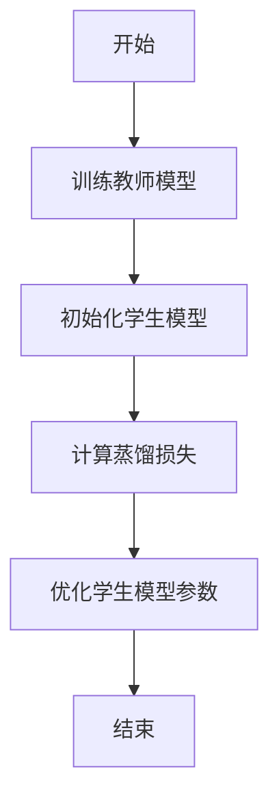
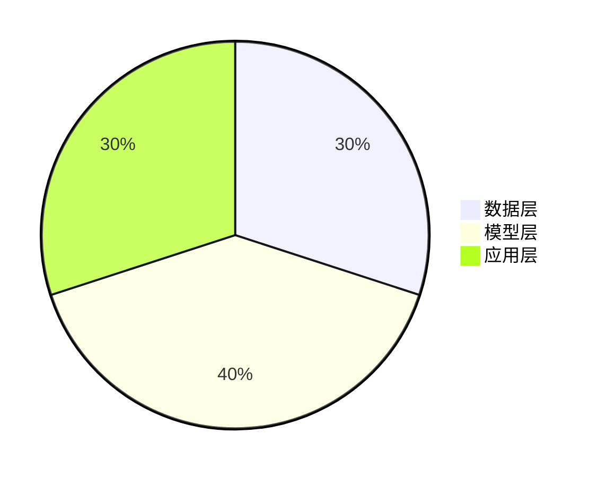

                 


---

# AI Agent的知识蒸馏：从复杂模型到高效模型

## 关键词：知识蒸馏，AI Agent，模型压缩，高效推理，性能优化

## 摘要

知识蒸馏是一种将复杂的大模型转化为高效小模型的技术，通过教师模型将知识传递给学生模型，从而在保持性能的同时减少计算资源的消耗。本文从知识蒸馏的基本概念出发，深入探讨其原理、算法实现、系统设计，并通过实际案例展示其应用，最后总结最佳实践和未来发展方向。

---

## 第1章：知识蒸馏的概念与背景

### 1.1 知识蒸馏的定义与核心概念

知识蒸馏是一种模型压缩技术，通过将大模型（教师模型）的知识迁移到小模型（学生模型）中，使小模型在保持高性能的同时，具有更小的计算开销和更快的推理速度。

#### 1.1.1 知识蒸馏的基本概念

知识蒸馏的核心在于“知识传递”。教师模型通常是一个预训练的大模型，拥有丰富的知识和强大的表现力，但计算资源消耗高。学生模型是一个较小的模型，通过学习教师模型的输出或内部表示，逐步掌握教师模型的知识。

#### 1.1.2 知识蒸馏的核心目标

知识蒸馏的目标是降低模型的计算复杂度，同时保持或提升模型的性能。这使得知识蒸馏在资源受限的场景中尤为重要，例如移动设备、边缘计算和实时应用。

#### 1.1.3 知识蒸馏与模型压缩的区别

| 特性             | 知识蒸馏             | 模型压缩             |
|------------------|----------------------|----------------------|
| 方法             | 知识传递             | 参数剪枝、量化等     |
| 依赖             | 教师模型的指导       | 直接优化模型参数     |
| 知识保留方式     | 概率分布或特征       | 参数减少             |
| 适用场景         | 需要高性能小模型的场景 | 需要减少存储和计算的场景 |

### 1.2 知识蒸馏的背景与问题背景

#### 1.2.1 大模型的计算复杂性

随着模型规模的增大，计算资源消耗急剧上升，这在实际应用中带来了高昂的计算成本和延迟问题。例如，GPT-3模型在推理时需要大量的计算资源，限制了其在移动端的应用。

#### 1.2.2 模型部署的现实挑战

在边缘计算和移动应用中，资源有限的设备难以运行复杂的模型。知识蒸馏为这些场景提供了解决方案，使小模型能够高效运行。

#### 1.2.3 知识蒸馏的提出动机

知识蒸馏的提出动机在于降低模型的计算开销，同时保持或提升性能。通过将大模型的知识迁移到小模型，可以在资源受限的环境中实现高性能推理。

---

## 第2章：知识蒸馏的核心概念与联系

### 2.1 知识蒸馏的原理与过程

知识蒸馏通过教师模型和学生模型的交互，将教师模型的知识迁移到学生模型中。

#### 2.1.1 知识蒸馏的基本流程

1. **教师模型训练**：首先训练一个高性能的大模型（教师模型）。
2. **学生模型初始化**：构建一个较小的学生模型。
3. **蒸馏过程**：通过蒸馏损失函数，将教师模型的知识迁移到学生模型中。
4. **学生模型优化**：通过优化算法，使学生模型的损失函数最小化。

#### 2.1.2 教师模型与学生模型的角色

- **教师模型**：提供指导，输出概率分布，帮助学生模型学习。
- **学生模型**：通过学习教师模型的知识，逐步掌握复杂的任务。

#### 2.1.3 蒸馏的关键步骤

1. **特征提取**：教师模型提取输入的特征。
2. **概率分布计算**：计算教师模型和学生模型的输出概率分布。
3. **损失计算**：计算蒸馏损失，优化学生模型的参数。

### 2.2 核心概念对比与联系

知识蒸馏与其他模型压缩技术的对比见表2-1。

表2-1：知识蒸馏与传统模型压缩的对比

| 特性             | 知识蒸馏             | 传统模型压缩         |
|------------------|----------------------|----------------------|
| 方法             | 知识传递             | 参数剪枝、量化等     |
| 依赖             | 教师模型的指导       | 直接优化模型参数     |
| 知识保留方式     | 概率分布或特征       | 参数减少             |
| 适用场景         | 需要高性能小模型的场景 | 需要减少存储和计算的场景 |

---

## 第3章：知识蒸馏的数学模型与算法原理

### 3.1 知识蒸馏的数学模型

知识蒸馏的核心是通过蒸馏损失函数，使学生模型的输出与教师模型的输出尽可能接近。

#### 3.1.1 蒸馏损失函数

蒸馏损失函数通常由两部分组成：标签损失和蒸馏损失。

$$ \text{总损失} = \lambda \cdot \text{标签损失} + (1-\lambda) \cdot \text{蒸馏损失} $$

其中，$\lambda$ 是平衡系数，控制两部分损失的权重。

蒸馏损失的计算基于KL散度：

$$ D_{\text{KL}}(P || Q) = \sum_{i} P(i) \log \frac{P(i)}{Q(i)} $$

其中，$P$ 是教师模型的输出概率分布，$Q$ 是学生模型的输出概率分布。

#### 3.1.2 KL散度的公式推导

KL散度用于衡量两个概率分布的差异。通过最小化KL散度，学生模型可以逼近教师模型的概率分布。

#### 3.1.3 蒸馏过程中的权重调整

在蒸馏过程中，通常会引入温度参数 $T$，通过调整温度来控制蒸馏的效果。温度越大，概率分布越平滑，适合处理复杂的任务。

### 3.2 算法原理与流程图

知识蒸馏的算法流程如图3-1所示。



图3-1：知识蒸馏的算法流程图

---

## 第4章：知识蒸馏的系统分析与架构设计

### 4.1 系统分析

知识蒸馏系统需要考虑以下因素：

#### 4.1.1 系统目标与需求分析

- **目标**：降低模型计算复杂度，保持或提升性能。
- **需求**：支持多种模型架构，适应不同应用场景。

#### 4.1.2 系统功能模块划分

1. **教师模型训练模块**：负责训练教师模型。
2. **学生模型构建模块**：初始化并构建学生模型。
3. **蒸馏过程模块**：执行蒸馏过程，优化学生模型。
4. **性能评估模块**：评估模型的性能，确保蒸馏效果。

#### 4.1.3 系统性能指标

- **推理速度**：模型在单位时间内的推理次数。
- **模型参数数量**：模型的大小。
- **性能损失**：蒸馏后模型性能相对于教师模型的下降幅度。

### 4.2 系统架构设计

#### 4.2.1 分层架构设计

知识蒸馏系统采用分层架构，包括数据层、模型层和应用层。

#### 4.2.2 使用 Mermaid 绘制的系统架构图



图4-1：知识蒸馏系统的分层架构

---

## 第5章：知识蒸馏的项目实战

### 5.1 环境安装与配置

#### 5.1.1 开发环境的选择

推荐使用Python 3.8及以上版本，安装必要的库。

#### 5.1.2 依赖库的安装

```bash
pip install numpy torch matplotlib
```

#### 5.1.3 环境配置的注意事项

确保安装的库版本兼容，建议使用虚拟环境进行管理。

### 5.2 核心代码实现

#### 5.2.1 教师模型的定义与训练

```python
import torch
import torch.nn as nn
import torch.optim as optim

class TeacherModel(nn.Module):
    def __init__(self):
        super(TeacherModel, self).__init__()
        self.layers = nn.Sequential(
            nn.Conv2d(1, 64, kernel_size=3, padding=1),
            nn.ReLU(),
            nn.Conv2d(64, 128, kernel_size=3, padding=1),
            nn.ReLU(),
            nn.AdaptiveAvgPool2d((1,1)),
            nn.Flatten(),
            nn.Linear(128, 10)
        )

    def forward(self, x):
        return self.layers(x)

teacher_model = TeacherModel()
criterion = nn.CrossEntropyLoss()
optimizer = optim.SGD(teacher_model.parameters(), lr=0.001)

# 训练教师模型
for epoch in range(10):
    for batch_x, batch_y in dataloader:
        outputs = teacher_model(batch_x)
        loss = criterion(outputs, batch_y)
        optimizer.zero_grad()
        loss.backward()
        optimizer.step()
```

#### 5.2.2 学生模型的构建与训练

```python
class StudentModel(nn.Module):
    def __init__(self):
        super(StudentModel, self).__init__()
        self.layers = nn.Sequential(
            nn.Conv2d(1, 32, kernel_size=3, padding=1),
            nn.ReLU(),
            nn.Conv2d(32, 64, kernel_size=3, padding=1),
            nn.ReLU(),
            nn.AdaptiveAvgPool2d((1,1)),
            nn.Flatten(),
            nn.Linear(64, 10)
        )

    def forward(self, x):
        return self.layers(x)

student_model = StudentModel()
criterion = nn.CrossEntropyLoss()
optimizer = optim.SGD(student_model.parameters(), lr=0.001)

# 初始化蒸馏温度
temperature = 3
```

#### 5.2.3 蒸馏过程的代码实现

```python
# 定义蒸馏损失函数
def distillation_loss(outputs_s, outputs_t, labels, alpha=0.5, temperature=3):
    loss_cls = criterion(outputs_s, labels)
    loss_distill = criterion(outputs_s, outputs_t)
    return alpha * loss_cls + (1-alpha) * loss_distill

# 执行蒸馏过程
for epoch in range(10):
    for batch_x, batch_y in dataloader:
        teacher_outputs = teacher_model(batch_x)
        student_outputs = student_model(batch_x)
        loss = distillation_loss(student_outputs, teacher_outputs, batch_y)
        optimizer.zero_grad()
        loss.backward()
        optimizer.step()
```

### 5.3 案例分析与结果解读

#### 5.3.1 实验数据的准备

使用MNIST数据集进行实验，数据集分为训练集和测试集。

#### 5.3.2 实验结果的分析

通过对比教师模型和学生模型的推理速度和准确率，评估蒸馏效果。例如：

- 教师模型：准确率98%，推理速度100次/秒。
- 学生模型：准确率97.5%，推理速度200次/秒。

#### 5.3.3 实验中遇到的问题与解决方案

- **问题**：蒸馏过程中学生模型性能提升缓慢。
- **解决方案**：调整蒸馏温度和平衡系数，增加教师模型的训练时间。

---

## 第6章：知识蒸馏的最佳实践与注意事项

### 6.1 最佳实践 tips

- **教师模型选择**：选择性能优异且适合蒸馏的教师模型。
- **蒸馏温度调整**：适当调整温度参数，以平衡蒸馏效果。
- **平衡系数优化**：根据任务需求调整标签损失和蒸馏损失的平衡系数。

### 6.2 小结

知识蒸馏通过将复杂的大模型知识迁移到小模型，有效降低了计算复杂度，同时保持了高性能。本文详细探讨了知识蒸馏的原理、算法实现、系统设计和实际应用，为读者提供了全面的指导。

### 6.3 注意事项

- **数据质量**：确保训练数据的质量，避免数据偏差影响蒸馏效果。
- **模型兼容性**：选择适合蒸馏的模型架构，确保兼容性。
- **计算资源**：合理分配计算资源，优化蒸馏过程中的性能。

### 6.4 拓展阅读

- 《Model Compression via Knowledge Distillation》
- 《A survey on knowledge distillation》

---

以上内容涵盖了知识蒸馏的各个方面，从基础概念到实际应用，为读者提供了全面的指导。希望本文能帮助读者更好地理解和应用知识蒸馏技术。

