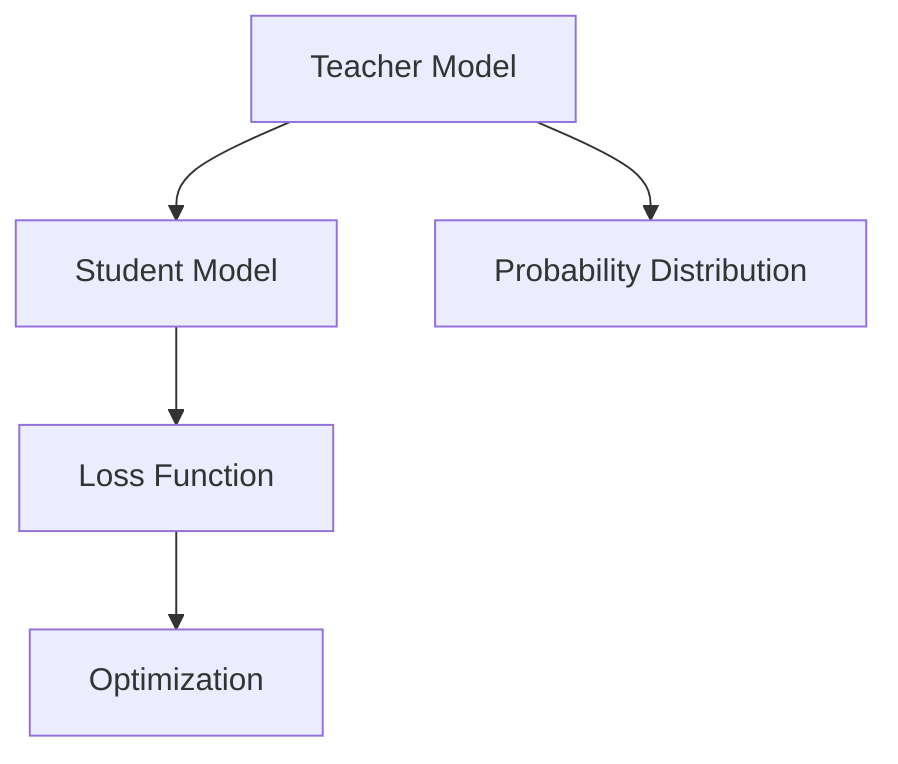
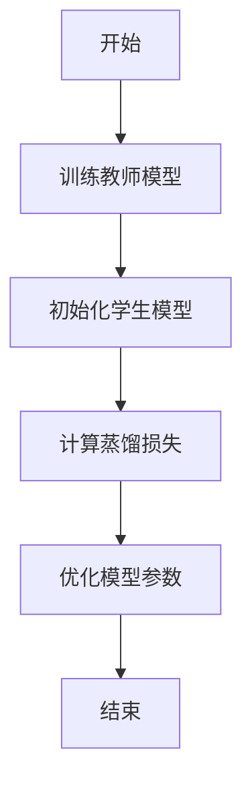
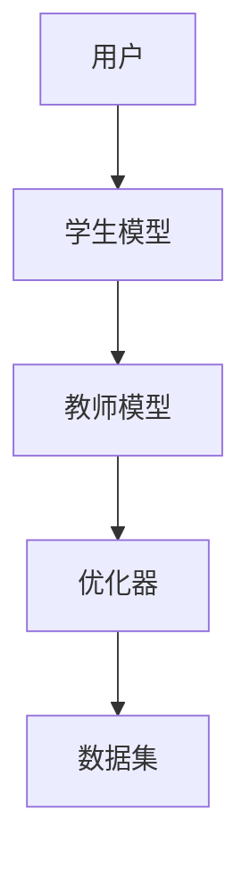
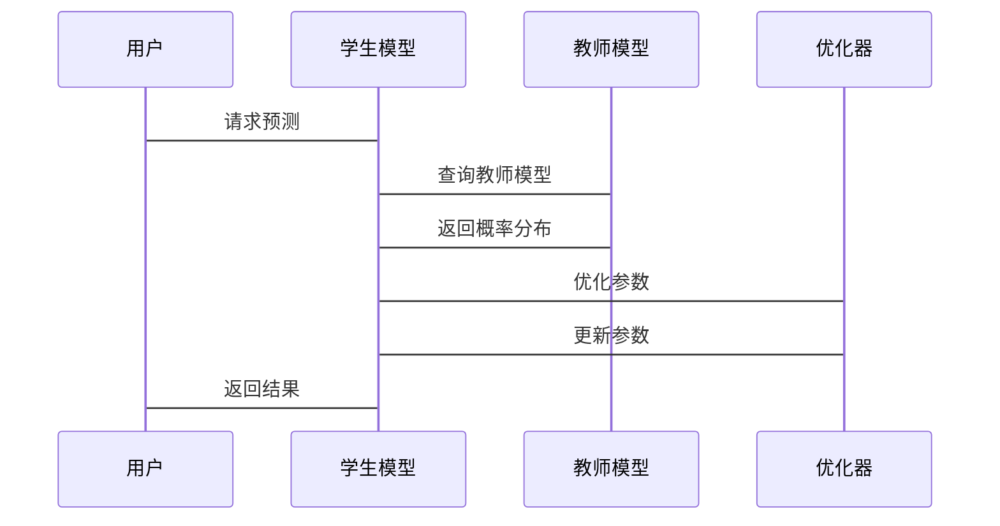

                 


# AI Agent的知识蒸馏：从大型LLM到轻量级模型

## 关键词：知识蒸馏，AI Agent，大型语言模型，轻量级模型，模型压缩

## 摘要：本文系统地探讨了AI Agent的知识蒸馏技术，从理论基础到算法实现，再到系统设计和项目实战，全面解析了如何将大型语言模型的知识迁移到轻量级模型，以满足实际应用中的性能和资源需求。

---

# 第一部分: AI Agent的知识蒸馏基础

## 第1章: 知识蒸馏的背景与问题背景

### 1.1 问题背景与问题描述

#### 1.1.1 大型语言模型的局限性
大型语言模型（如GPT-4）在性能和准确性方面表现出色，但它们通常需要大量的计算资源和存储空间。在移动设备或边缘计算环境中，这些模型可能无法高效运行。

#### 1.1.2 轻量级模型的应用需求
轻量级模型在资源受限的环境中具有优势，但它们通常缺乏复杂任务的处理能力。通过知识蒸馏，可以将大型模型的知识迁移到轻量级模型，提升其性能。

#### 1.1.3 知识蒸馏的概念与目标
知识蒸馏是一种技术，通过教师模型（大型模型）指导学生模型（轻量级模型）学习，使学生模型继承教师模型的知识和能力，同时保持较小的模型规模。

### 1.2 问题解决与边界定义

#### 1.2.1 知识蒸馏的核心问题
如何有效地将教师模型的知识迁移到学生模型，同时保持学生模型的性能和效率。

#### 1.2.2 蒸馏过程中的边界与限制
- 计算资源限制
- 模型规模限制
- 知识迁移的深度

#### 1.2.3 蒸馏技术的适用场景与外延
适用于资源受限的环境，如移动应用、嵌入式系统等，同时可以扩展到多模态模型和其他任务。

### 1.3 核心概念与概念结构

#### 1.3.1 大型模型与轻量级模型的关系
教师模型通过蒸馏过程指导学生模型学习，学生模型逐步逼近教师模型的性能。

#### 1.3.2 知识蒸馏的理论基础
基于经验风险最小化，通过损失函数优化，使学生模型在教师模型的指导下学习。

#### 1.3.3 蒸馏过程中的关键要素
- 教师模型输出
- 学生模型结构
- 蒸馏损失函数

## 第2章: 知识蒸馏的核心概念与联系

### 2.1 知识蒸馏的基本原理

#### 2.1.1 蒸馏过程中的信息传递机制
教师模型通过软标签或硬标签指导学生模型学习，使学生模型在概率分布上逼近教师模型。

#### 2.1.2 知识蒸馏的分类与对比
- 直接蒸馏：直接迁移概率分布
- 适应性蒸馏：结合任务特定调整
- 多教师蒸馏：多个教师模型协作

### 2.2 知识蒸馏的模型特性对比

#### 2.2.1 模型压缩与知识蒸馏的联系与区别
- 模型压缩：减少模型参数，可能影响性能
- 知识蒸馏：保持模型结构，优化参数以继承知识

### 2.3 知识蒸馏的ER实体关系图



---

# 第二部分: 知识蒸馏的算法原理与数学模型

## 第3章: 知识蒸馏的算法原理

### 3.1 知识蒸馏算法的概述

#### 3.1.1 知识蒸馏的基本流程
1. 训练教师模型
2. 初始化学生模型
3. 训练学生模型，优化蒸馏损失函数

### 3.2 知识蒸馏算法的详细讲解

#### 3.2.1 蒸馏过程的数学模型

损失函数定义：
$$ L = \alpha L_{CE} + (1-\alpha) L_{KD} $$
其中，$L_{CE}$是交叉熵损失，$L_{KD}$是知识蒸馏损失，$\alpha$是平衡参数。

### 3.3 算法的mermaid流程图



## 第4章: 知识蒸馏的数学模型与公式

### 4.1 知识蒸馏的数学模型

蒸馏损失函数：
$$ L_{KD}(y, y') = KL(D(y|x), D'(y|x)) $$
其中，$D$和$D'$分别是教师模型和学生模型的概率分布。

---

# 第三部分: 系统分析与架构设计

## 第5章: 系统分析与架构设计方案

### 5.1 系统功能设计

#### 5.1.1 系统功能模块
- 教师模型训练模块
- 学生模型初始化模块
- 蒸馏训练模块
- 模型评估模块

### 5.2 系统架构设计

#### 5.2.1 系统架构图



### 5.3 接口设计与交互流程

#### 5.3.1 系统接口
- 输入接口：接收教师模型输出和学生模型预测
- 输出接口：输出优化后的学生模型参数

#### 5.3.2 交互流程图



---

# 第四部分: 项目实战

## 第6章: 项目实战与应用案例

### 6.1 环境安装

#### 6.1.1 环境配置
- Python 3.8+
- PyTorch 1.9+
- Transformers库

### 6.2 系统核心实现

#### 6.2.1 教师模型训练代码

```python
def train_teacher(model, train_loader, optimizer, criterion, epochs):
    for epoch in range(epochs):
        for inputs, labels in train_loader:
            outputs = model(inputs)
            loss = criterion(outputs, labels)
            optimizer.zero_grad()
            loss.backward()
            optimizer.step()
```

#### 6.2.2 学生模型蒸馏代码

```python
def train_student(model, teacher, train_loader, optimizer, criterion_kd, alpha, epochs):
    for epoch in range(epochs):
        for inputs, labels in train_loader:
            with torch.no_grad():
                teacher_outputs = teacher(inputs)
            student_outputs = model(inputs)
            loss_ce = criterion_kd(student_outputs, labels)
            loss_kd = kl_div(student_outputs, teacher_outputs)
            total_loss = alpha * loss_ce + (1-alpha) * loss_kd
            optimizer.zero_grad()
            total_loss.backward()
            optimizer.step()
```

### 6.3 代码实现与应用解读

#### 6.3.1 代码实现
- 教师模型训练
- 学生模型蒸馏
- 模型评估

#### 6.3.2 案例分析
通过具体案例，展示如何将知识蒸馏应用于实际项目，提升轻量级模型的性能。

---

## 总结

知识蒸馏是一种高效的技术，能够将大型语言模型的知识迁移到轻量级模型，满足实际应用的需求。通过系统化的分析和实战案例，可以更好地理解其原理和应用。

---

## 参考文献

- 论文：Distilling the Knowledge in a Neural Network
- 书籍：《Deep Learning》
- 在线资源：Transformers库文档

---

**感谢阅读，希望这篇文章能为您提供有价值的知识和见解。**

