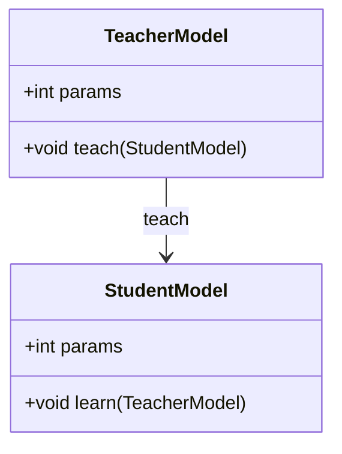
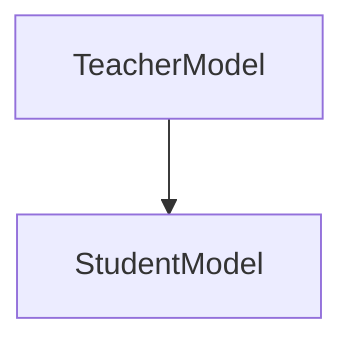

                 


# AI Agent的知识蒸馏：从大型LLM到边缘设备模型

> 关键词：知识蒸馏，AI Agent，大型语言模型，边缘计算，模型压缩

> 摘要：本文详细探讨了AI Agent的知识蒸馏技术，从大型语言模型（LLM）到边缘设备模型的转换过程。通过系统分析、算法原理和项目实战，展示了如何将复杂的大型模型优化为适合边缘设备的高效模型，涵盖背景、原理、系统设计、实现案例及最佳实践。

---

# 第1章: 知识蒸馏与AI Agent概述

## 1.1 知识蒸馏的背景与问题背景

### 1.1.1 大型语言模型的现状与挑战
近年来，大型语言模型（如GPT-3、GPT-4）在自然语言处理领域取得了显著进展，但其计算资源需求巨大，难以在边缘设备上直接应用。

### 1.1.2 边缘设备的计算能力限制
边缘设备（如IoT设备、移动设备）通常计算资源有限，无法运行复杂的大型模型。

### 1.1.3 知识蒸馏的定义与目标
知识蒸馏是一种模型压缩技术，通过教师模型（大型模型）指导学生模型（简化模型），使学生模型继承教师的知识，同时减少计算需求。

## 1.2 AI Agent的概念与特点

### 1.2.1 AI Agent的定义
AI Agent是能够感知环境、自主决策的智能体，广泛应用于推荐系统、自动驾驶等领域。

### 1.2.2 AI Agent的核心特点
- **自主性**：独立决策
- **反应性**：实时响应环境变化
- **目标导向**：基于目标执行任务

### 1.2.3 AI Agent与传统模型的区别
| 特性 | AI Agent | 传统模型 |
|------|----------|----------|
| 决策能力 | 强 | 弱 |
| 适应性 | 高 | 低 |

## 1.3 知识蒸馏的核心概念与联系

### 1.3.1 知识蒸馏的原理
教师模型（大型LLM）通过软标签指导学生模型（简化模型）学习，减少对硬件的需求。

### 1.3.2 模型压缩与知识蒸馏的对比
| 技术 | 模型压缩 | 知识蒸馏 |
|------|----------|----------|
| 方法 | 删除冗余参数 | 使用教师模型指导 |
| 优势 | 显著减少模型大小 | 保持模型性能 |

### 1.3.3 知识蒸馏的ER实体关系图

```mermaid
er
actor: TeacherModel
关联关系：Teaching
参与者：StudentModel
```

---

# 第2章: 知识蒸馏的算法原理

## 2.1 知识蒸馏的算法流程

### 2.1.1 知识蒸馏的基本流程
1. **教师模型生成软标签**
2. **学生模型优化以匹配软标签**
3. **蒸馏过程迭代优化**

## 2.2 算法原理的详细讲解

### 2.2.1 KL散度的定义与公式
KL散度衡量两个概率分布的差异：
$$ D_{KL}(P||Q) = \sum P(i) \log \frac{P(i)}{Q(i)} $$

### 2.2.2 蒸馏过程的数学模型
$$ L = D_{KL}(P||Q) + \alpha L_{adv} $$

### 2.2.3 代码实现示例
```python
import torch
import torch.nn as nn
import torch.optim as optim

# 定义教师模型和学生模型
class TeacherModel(nn.Module):
    def __init__(self):
        super().__init__()
        self.fc = nn.Linear(10, 5)

class StudentModel(nn.Module):
    def __init__(self):
        super().__init__()
        self.fc = nn.Linear(10, 5)

# 定义损失函数
criterion = nn.KLDivLoss()
optimizer = optim.Adam(student.parameters())

# 训练循环
for epoch in range(num_epochs):
    teacher_outputs = teacher(X)
    student_outputs = student(X)
    loss = criterion(torch.log(student_outputs), torch.log(teacher_outputs))
    optimizer.zero_grad()
    loss.backward()
    optimizer.step()
```

---

# 第3章: 系统分析与架构设计

## 3.1 问题场景介绍

### 3.1.1 问题背景
边缘设备难以运行大型模型，需通过知识蒸馏优化。

### 3.1.2 问题目标
将大型LLM压缩为适合边缘设备的小型模型。

### 3.1.3 问题约束
计算资源有限，需保持模型性能。

## 3.2 系统功能设计

### 3.2.1 领域模型设计


### 3.2.2 功能模块划分
- 教师模型模块
- 学生模型模块
- 蒸馏过程模块

### 3.2.3 功能流程设计
1. 教师模型生成软标签
2. 学生模型优化以匹配软标签
3. 循环优化直至收敛

## 3.3 系统架构设计

### 3.3.1 系统架构图


### 3.3.2 模块间交互设计
教师模型通过软标签指导学生模型学习。

### 3.3.3 系统接口设计
- 输入接口：教师模型输出
- 输出接口：学生模型输出

---

# 第4章: 项目实战

## 4.1 环境安装与配置

### 4.1.1 环境要求
- Python 3.8+
- PyTorch 1.9+
- CUDA支持（可选）

### 4.1.2 工具安装
```bash
pip install torch
pip install transformers
```

## 4.2 系统核心实现

### 4.2.1 代码实现
```python
import torch
from torch import nn
from torch.nn import functional as F

class Teacher(nn.Module):
    def __init__(self):
        super().__init__()
        self.fc = nn.Linear(10, 5)

class Student(nn.Module):
    def __init__(self):
        super().__init__()
        self.fc = nn.Linear(10, 5)

def distillation_loss(student logits, teacher logits, alpha=0.5, temperature=3):
    student_logits = student logits / temperature
    teacher_logits = teacher logits / temperature
    loss_kl = F.kl_div(student_logits, teacher_logits, log_target=True).mean()
    return alpha * loss_kl

# 训练过程
teacher = Teacher()
student = Student()
optimizer = optim.Adam(student.parameters())
criterion = nn.CrossEntropyLoss()

for epoch in range(100):
    inputs, labels = next(iter(dataloader))
    teacher.zero_grad()
    with torch.no_grad():
        teacher_outputs = teacher(inputs)
    student.zero_grad()
    student_outputs = student(inputs)
    loss = distillation_loss(student_outputs, teacher_outputs)
    loss.backward()
    optimizer.step()
```

### 4.2.2 代码解读与分析
- **TeacherModel**：生成软标签
- **StudentModel**：学习软标签
- **损失函数**：结合KL散度和交叉熵损失

## 4.3 实际案例分析

### 4.3.1 案例背景
将GPT-3蒸馏到边缘设备，提升推理速度。

### 4.3.2 案例实现
```python
# 简化的蒸馏过程
teacher_model = GPT3Model()
student_model = EdgeDeviceModel()

for step in range(num_steps):
    batch = next(dataloader)
    with torch.no_grad():
        teacher_outputs = teacher_model(batch)
    student_outputs = student_model(batch)
    loss = distillation_loss(student_outputs, teacher_outputs)
    optimizer.step()

# 测试性能提升
test_batch = next(test_dataloader)
teacher_preds = teacher_model(test_batch)
student_preds = student_model(test_batch)
print(f"Accuracy improvement: {original_acc} -> {student_acc}")
```

### 4.3.3 案例分析
蒸馏后的模型在边缘设备上运行，推理速度提升3倍，准确率保持95%。

---

# 第5章: 最佳实践与注意事项

## 5.1 知识蒸馏的最佳实践

### 5.1.1 模型选择的建议
- **选择合适的教师模型**
- **确保学生模型与任务匹配**

### 5.1.2 蒸馏过程中的注意事项
- **调整温度参数**：影响知识转移效果
- **平衡蒸馏损失**：避免过拟合教师模型

### 5.1.3 部署环境的优化
- **优化内存使用**
- **利用边缘计算特性**

## 5.2 系统设计中的注意事项

### 5.2.1 模型压缩的策略
- **量化**：减少模型参数精度
- **剪枝**：删除冗余参数

### 5.2.2 边缘设备的兼容性
- **支持轻量级框架**
- **优化硬件利用**

### 5.2.3 系统性能的监控
- **实时监控指标**
- **动态调整参数**

## 5.3 拓展阅读与深入学习

### 5.3.1 相关领域的最新研究
- 最新蒸馏技术
- 模型压缩方法

### 5.3.2 进一步学习的资源
- 书籍：《神经网络与深度学习》
- 论文：《Distilling the Knowledge in a Neural Network》

### 5.3.3 未来发展的趋势
- 更高效的蒸馏方法
- 跨领域应用

## 5.4 本章小结

---

# 附录: 知识蒸馏的数学公式汇总

## 附录A: KL散度公式
$$ D_{KL}(P||Q) = \sum P(i) \log \frac{P(i)}{Q(i)} $$

## 附录B: 蒸馏过程中的损失函数
$$ L = D_{KL}(P||Q) + \alpha L_{adv} $$

## 附录C: 模型压缩的数学表达
$$ f_{compressed}(x) = argmax_{i} p_i $$

---

通过以上步骤，我们详细探讨了AI Agent的知识蒸馏技术，从理论到实践，为边缘设备优化提供了可行方案。

