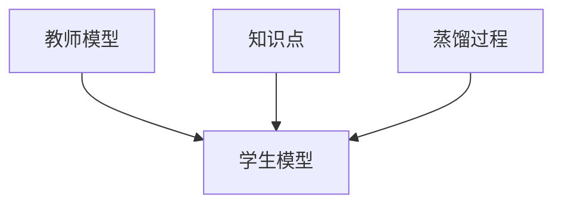
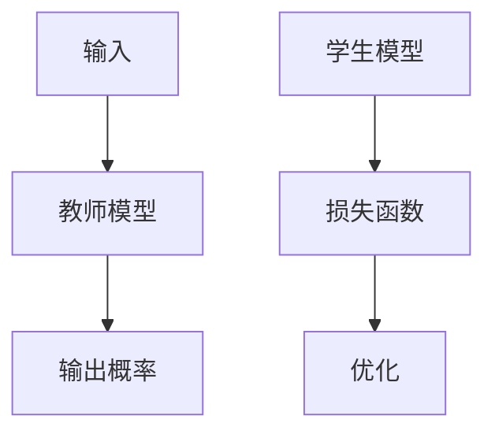
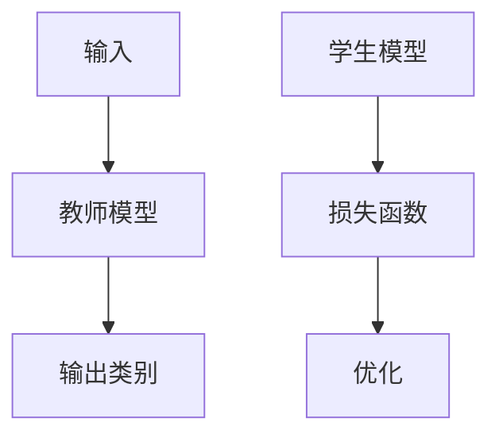
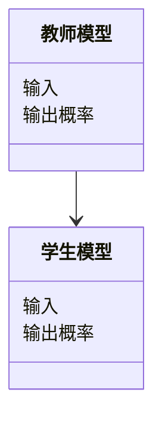
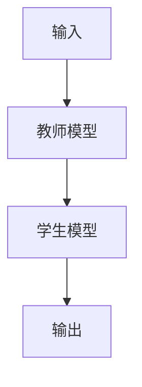
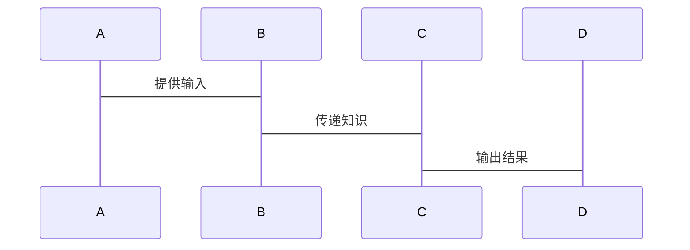

                 


# AI Agent的知识蒸馏：从大模型到轻量级应用

## 关键词
AI Agent, 知识蒸馏, 大模型, 轻量级应用, 模型压缩, 迁移学习

## 摘要
知识蒸馏是一种将大模型的知识迁移到轻量级模型的技术，能够在保持性能的同时减少模型的复杂度。本文从AI Agent的角度出发，系统地介绍知识蒸馏的基本概念、算法原理、系统架构，并通过项目实战展示其应用。文章深入分析了软蒸馏和硬蒸馏的实现细节，并提供了一个完整的Python实现案例，帮助读者理解知识蒸馏的核心思想和技术细节。最后，本文总结了知识蒸馏的优势与挑战，并展望了未来的研究方向。

---

## 第一部分: AI Agent的知识蒸馏概述

### 第1章: 知识蒸馏的背景与概念

#### 1.1 知识蒸馏的定义与背景
知识蒸馏是一种通过教师模型将复杂的大模型知识迁移到学生模型的技术，学生模型通常更小、更轻量。其核心目标是降低模型的计算成本，同时保持或提升性能。

##### 1.1.1 知识蒸馏的基本概念
知识蒸馏通过教师模型和学生模型的交互，将复杂的知识简化并迁移到学生模型中。教师模型通常是一个预训练的大模型，而学生模型是一个轻量级的模型。

##### 1.1.2 AI Agent的发展与挑战
AI Agent需要在复杂环境中执行任务，依赖于高效的模型推理能力。大模型虽然性能强大，但在资源受限的环境中难以部署，因此需要通过蒸馏技术将知识迁移到轻量级模型。

##### 1.1.3 知识蒸馏的背景与意义
随着深度学习模型的规模越来越大，计算成本和部署难度也在增加。知识蒸馏为模型优化提供了新的思路，能够在保持性能的同时显著降低模型复杂度。

---

#### 1.2 AI大模型的知识蒸馏
知识蒸馏在AI Agent中的应用，使得轻量级模型能够继承大模型的知识，从而在资源受限的环境中实现高效的推理和决策。

##### 1.2.1 大模型的知识表示与存储
大模型通过复杂的参数关系表示知识，蒸馏技术需要将这些知识转化为学生模型能够理解和利用的形式。

##### 1.2.2 知识蒸馏的目标与核心问题
蒸馏的目标是将教师模型的知识迁移到学生模型，核心问题包括知识的表示、提取和迁移。

##### 1.2.3 蒸馏技术在AI Agent中的应用
蒸馏技术使得AI Agent能够在资源受限的环境中运行复杂的模型，提升其推理和决策能力。

---

### 第2章: AI Agent的知识蒸馏核心概念

#### 2.1 知识蒸馏的基本原理
知识蒸馏通过教师模型的输出指导学生模型的训练，使得学生模型能够学习教师模型的知识。

##### 2.1.1 教师模型与学生模型的关系
教师模型和学生模型之间的关系是指导与被指导的关系，学生模型通过模仿教师模型的学习过程来掌握知识。

##### 2.1.2 知识蒸馏的关键步骤
蒸馏的关键步骤包括教师模型输出的获取、损失函数的设计以及优化过程的实现。

##### 2.1.3 蒸馏过程中的信息传递机制
信息传递机制决定了知识如何从教师模型传递到学生模型，通常包括概率分布的匹配或其他形式的信息迁移。

---

#### 2.2 知识蒸馏的核心概念对比
通过对比蒸馏与其他技术的概念，可以帮助更好地理解蒸馏的独特性和优势。

##### 2.2.1 蒸馏与迁移学习的对比
| 对比维度 | 蒸馏 | 迁移学习 |
|----------|------|----------|
| 核心思想 | 知识迁移 | 特征提取 |
| 应用场景 | 轻量级模型 | 多任务学习 |

##### 2.2.2 蒸馏与模型压缩的对比
| 对比维度 | 蒸馏 | 模型压缩 |
|----------|------|----------|
| 核心思想 | 知识传递 | 参数减少 |
| 依赖性 | 高 | 低 |

##### 2.2.3 蒸馏与知识图谱的对比
| 对比维度 | 蒸馏 | 知识图谱 |
|----------|------|----------|
| 数据来源 | 教师模型 | 结构化知识 |
| 表达形式 | 概率分布 | 图结构 |

---

#### 2.3 知识蒸馏的实体关系图


---

## 第二部分: 知识蒸馏的算法原理

### 第3章: 知识蒸馏的算法实现

#### 3.1 软蒸馏算法
软蒸馏通过概率分布的匹配实现知识迁移。

##### 3.1.1 软蒸馏的基本原理
软蒸馏将教师模型的输出概率分布作为目标，学生模型通过最小化输出分布的KL散度来学习。

##### 3.1.2 软蒸馏的数学模型
$$ P(y|x) = \text{softmax}(f(x)) $$

##### 3.1.3 软蒸馏的实现流程


---

#### 3.2 硬蒸馏算法
硬蒸馏通过类别标签的蒸馏实现知识迁移。

##### 3.2.1 硬蒸馏的基本原理
硬蒸馏将教师模型的输出类别作为目标，学生模型通过分类任务进行学习。

##### 3.2.2 硬蒸馏的数学模型
$$ y = \text{argmax}(P(y|x)) $$

##### 3.2.3 硬蒸馏的实现流程


---

#### 3.3 自适应蒸馏算法
自适应蒸馏根据数据分布动态调整蒸馏策略。

##### 3.3.1 自适应蒸馏的基本原理
自适应蒸馏通过动态权重调整，使得学生模型能够更好地适应不同数据分布。

##### 3.3.2 自适应蒸馏的数学模型
$$ w_i = \alpha \cdot w_i + (1-\alpha) \cdot w_j $$

##### 3.3.3 自适应蒸馏的实现流程


---

## 第三部分: 系统分析与架构设计方案

### 第4章: 系统架构设计

#### 4.1 问题场景介绍
知识蒸馏系统需要在资源受限的环境中运行，因此需要设计高效的系统架构。

#### 4.2 系统功能设计
系统功能包括知识提取、蒸馏过程和模型部署三个部分。

##### 4.2.1 领域模型


##### 4.2.2 系统架构图


##### 4.2.3 系统交互图


---

## 第四部分: 项目实战

### 第5章: 知识蒸馏的Python实现

#### 5.1 环境安装
```bash
pip install numpy torch
```

#### 5.2 核心实现代码
```python
import torch
import torch.nn as nn
import torch.optim as optim

class TeacherModel(nn.Module):
    def __init__(self):
        super(TeacherModel, self).__init__()
        self.fc = nn.Linear(10, 5)

    def forward(self, x):
        return torch.softmax(x, dim=1)

class StudentModel(nn.Module):
    def __init__(self):
        super(StudentModel, self).__init__()
        self.fc = nn.Linear(10, 5)

    def forward(self, x):
        return torch.softmax(x, dim=1)

def knowledge_distillation_loss(student_output, teacher_output, temperature=1.0):
    student_output = student_output / temperature
    teacher_output = teacher_output / temperature
    loss = nn.KLDivLoss()(student_output, teacher_output)
    return loss

def main():
    teacher = TeacherModel()
    student = StudentModel()
    optimizer = optim.Adam(student.parameters(), lr=0.001)
    criterion = knowledge_distillation_loss

    for epoch in range(100):
        inputs = torch.randn(10, 10)
        teacher_output = teacher(inputs)
        student_output = student(inputs)
        loss = criterion(student_output, teacher_output)
        optimizer.zero_grad()
        loss.backward()
        optimizer.step()

if __name__ == "__main__":
    main()
```

#### 5.3 代码解读与分析
- **TeacherModel**：教师模型定义了一个简单的全连接层，输出概率分布。
- **StudentModel**：学生模型同样定义了一个全连接层，用于学习教师模型的知识。
- **knowledge_distillation_loss**：知识蒸馏损失函数，使用KL散度衡量学生输出与教师输出的差异。
- **main**：训练过程，通过优化器更新学生模型参数，使其输出接近教师模型。

---

## 第五部分: 小结与展望

### 第6章: 总结与展望

#### 6.1 小结
知识蒸馏通过教师模型将大模型的知识迁移到轻量级模型，显著降低了模型的计算成本，同时保持了性能。

#### 6.2 最佳实践 tips
- 在选择蒸馏方法时，需根据具体任务选择软蒸馏或硬蒸馏。
- 蒸馏过程中的温度参数设置会影响结果，需进行调优。
- 学生模型的设计需与任务需求匹配，避免过度复杂。

#### 6.3 注意事项
- 蒸馏过程可能需要大量数据，需注意数据质量。
- 温度参数和损失函数的权重需合理设置，避免过拟合。
- 学生模型的容量需足够，否则无法有效学习教师模型的知识。

#### 6.4 拓展阅读
- 《Distilling the Knowledge in a Neural Network》
- 《Progressive Knowledge Distillation for Deep Neural Networks》

---

通过以上内容，我们系统地介绍了知识蒸馏在AI Agent中的应用，从算法原理到系统架构，再到项目实战，全面剖析了知识蒸馏的核心思想和技术细节。未来的研究可以进一步探索自适应蒸馏和其他优化策略，以提升知识蒸馏的效果和效率。

