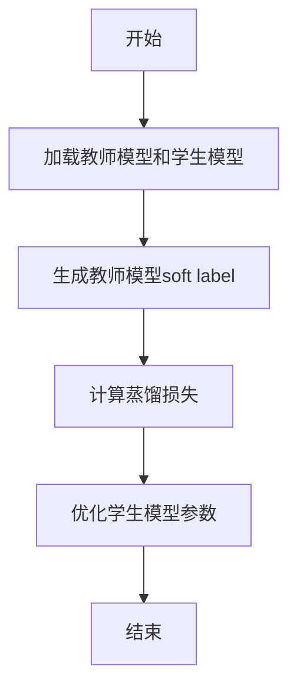
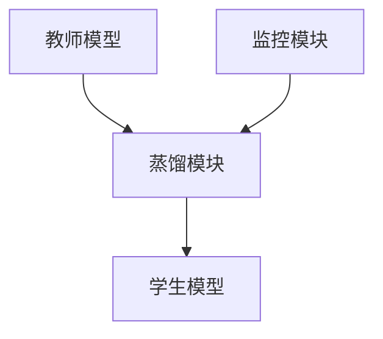
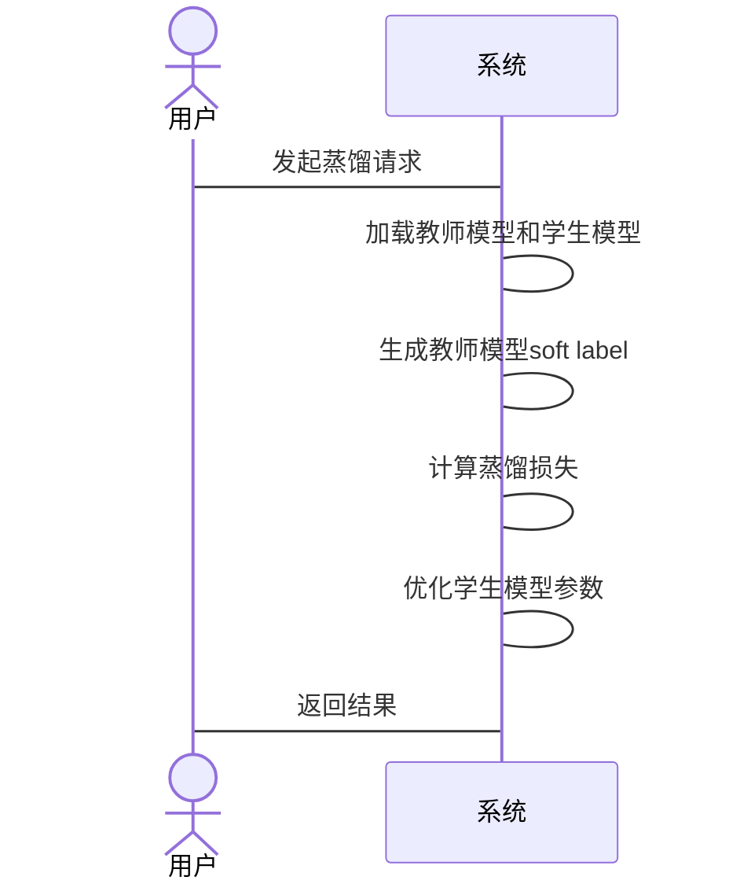

                 


# AI Agent的知识蒸馏：从教师LLM到学生模型

## 关键词：知识蒸馏，大语言模型，AI Agent，教师模型，学生模型

## 摘要：知识蒸馏是一种将教师模型的知识迁移到学生模型的技术，旨在在保持较小规模的同时，继承教师模型的高性能。本文详细探讨了知识蒸馏的核心概念、算法原理、系统架构设计以及实际项目实现，帮助读者全面理解并掌握这一技术。

---

## 第1章: 知识蒸馏的基本概念

### 1.1 问题背景与问题描述

#### 1.1.1 大语言模型（LLM）的局限性

大语言模型（LLM）虽然在各种任务中表现出色，但其高计算成本和资源消耗使其难以在资源受限的环境中部署。此外，LLM的更新和维护需要大量的计算资源，难以快速适应新数据。

#### 1.1.2 知识蒸馏的定义与目标

知识蒸馏是一种将教师模型（通常是大语言模型）的知识迁移到学生模型的技术。其目标是使学生模型在保持较小规模的同时，继承教师模型的高性能。

#### 1.1.3 AI Agent在知识蒸馏中的作用

AI Agent作为中介，协调教师模型和学生模型的交互。它能够动态地调整知识传递策略，优化知识蒸馏过程。

### 1.2 从教师模型到学生模型的迁移

#### 1.2.1 教师模型（Teacher LLM）的特点

- 高性能，准确率高。
- 通用性强，能处理多种任务。
- 参数量大，资源消耗高。

#### 1.2.2 学生模型（Student Model）的特点

- 参数量小，计算效率高。
- 专注于特定任务，适应性强。
- 易部署，适合边缘计算。

#### 1.2.3 知识蒸馏的核心问题与边界

核心问题：如何高效地将教师模型的知识传递给学生模型。

边界：明确知识蒸馏的适用场景和性能指标。

### 1.3 知识蒸馏的核心概念与联系

#### 1.3.1 教师模型与学生模型的关系

教师模型为学生模型提供指导，学生模型逐步模仿教师模型的行为。

#### 1.3.2 知识蒸馏的关键属性对比

| 属性       | 教师模型（Teacher LLM） | 学生模型（Student Model） |
|------------|-------------------------|---------------------------|
| 参数量     | 高                   | 低                     |
| 计算效率   | 低                   | 高                     |
| 部署难度   | 高                   | 低                     |
| 适应性     | 一般                 | 强                     |

#### 1.3.3 ER实体关系图架构

```mermaid
er
actor: 教师模型
student: 学生模型
knowledge: 知识
knowledgeTEACHER
knowledgeSTUDENT
TEACHER -->> knowledgeTEACHER
STUDENT -->> knowledgeSTUDENT
knowledgeTEACHER --> knowledgeSTUDENT
```

---

## 第2章: 知识蒸馏的核心原理与算法

### 2.1 知识蒸馏的原理概述

#### 2.1.1 知识蒸馏的基本原理

知识蒸馏通过教师模型生成soft label，学生模型通过最小化预测概率差异进行学习。使用KL散度衡量概率分布差异。

#### 2.1.2 知识蒸馏的关键步骤

1. 教师模型生成soft label。
2. 学生模型通过蒸馏损失函数优化。
3. 蒸馏过程结合传统任务损失函数。

#### 2.1.3 知识蒸馏的数学模型

KL散度的计算：

$$
D_{KL}(P || Q) = \sum_{i} P(i) \ln \frac{P(i)}{Q(i)}
$$

蒸馏损失函数：

$$
L_{distill} = \alpha D_{KL}(P || Q) + (1-\alpha) L_{task}
$$

其中，$\alpha$ 是温度参数，$L_{task}$ 是传统任务损失函数。

### 2.2 知识蒸馏的算法实现

#### 2.2.1 知识蒸馏的算法流程



#### 2.2.2 知识蒸馏的数学公式推导

KL散度公式推导：

$$
D_{KL}(P || Q) = \sum_{i} P(i) \ln \frac{P(i)}{Q(i)}
$$

蒸馏损失函数推导：

$$
L_{distill} = \alpha D_{KL}(P || Q) + (1-\alpha) L_{task}
$$

#### 2.2.3 知识蒸馏的Python实现代码

```python
import tensorflow as tf
import numpy as np

def kl_divergence(p, q):
    return tf.reduce_mean(tf.keras.losses.kullback_leibler_divergence(p, q))

def distillation_loss(y_true, y_pred, alpha=0.5, temperature=3.0):
    # 软化预测
    y_pred_soft = tf.nn.softmax(y_pred / temperature)
    y_true_soft = tf.nn.softmax(y_true / temperature)
    # 计算KL散度
    kl_loss = kl_divergence(y_true_soft, y_pred_soft)
    # 结合任务损失
    task_loss = tf.keras.losses.sparse_categorical_crossentropy(y_true, y_pred)
    # 综合损失
    total_loss = alpha * kl_loss + (1 - alpha) * task_loss
    return total_loss

# 示例使用
model_teacher = ...  # 加载教师模型
model_student = ...  # 加载学生模型

# 编译学生模型，指定蒸馏损失函数
model_student.compile(optimizer='adam', loss=lambda y_true, y_pred: distillation_loss(y_true, y_pred))
```

### 2.3 知识蒸馏的优化与改进

#### 2.3.1 知识蒸馏的优化策略

- 调整温度参数，平衡知识蒸馏和传统任务损失。
- 引入对抗训练，增强学生模型的鲁棒性。

#### 2.3.2 知识蒸馏的改进算法

- 使用多教师模型，结合多个教师模型的知识。
- 结合主动学习，选择性地蒸馏关键知识。

#### 2.3.3 知识蒸馏的性能评估

- 评估指标：准确率、计算速度、资源消耗。
- 实验结果对比，展示优化后的性能提升。

---

## 第3章: 知识蒸馏的系统分析与架构设计

### 3.1 系统分析与问题场景

#### 3.1.1 系统分析的背景

知识蒸馏在实际应用中的需求，如实时响应、低资源消耗。分析现有系统的问题，如计算资源不足、响应速度慢。

#### 3.1.2 知识蒸馏的系统需求

- 功能需求：支持多种模型格式，提供灵活的蒸馏策略。
- 性能需求：高效计算，低资源消耗。
- 安全需求：数据安全，防止模型信息泄露。

#### 3.1.3 系统功能的模块划分

- 模块划分：教师模型模块、学生模型模块、蒸馏模块、监控模块。
- 各模块的功能描述和交互关系。

### 3.2 系统架构设计

#### 3.2.1 系统架构的总体设计



#### 3.2.2 系统架构的详细设计

各模块的具体实现细节，如教师模型的选择、学生模型的训练策略。接口设计：模块之间的数据传递格式和调用方式。

#### 3.2.3 系统架构的实现方案

选择合适的技术栈，如使用Python框架、深度学习框架（TensorFlow或PyTorch）。数据流设计：数据如何在模块间流动，如何处理数据异构问题。

### 3.3 系统接口与交互设计

#### 3.3.1 系统接口的设计

- 定义API接口，如开始蒸馏、停止蒸馏、获取结果等。
- 接口的输入输出格式，如JSON、XML等。

#### 3.3.2 系统交互的流程



#### 3.3.3 系统交互的实现

- 提供代码示例，展示如何调用API接口。
- 解释接口实现的逻辑，如异常处理、状态管理。

---

## 第4章: 知识蒸馏的项目实战

### 4.1 环境安装与配置

#### 4.1.1 环境搭建的步骤

- 安装Python、虚拟环境设置。
- 安装必要的库，如TensorFlow、Keras、scikit-learn。

#### 4.1.2 环境配置的注意事项

- 确保硬件配置足够，如GPU支持。
- 配置环境变量，如Python路径、库路径。

#### 4.1.3 环境测试的验证方法

- 运行测试脚本，验证各库是否正确安装。
- 测试模型训练，确保环境配置正确。

### 4.2 系统核心实现

#### 4.2.1 知识蒸馏的代码实现

```python
# 示例代码：知识蒸馏的实现
import tensorflow as tf
import numpy as np

def kl_divergence(p, q):
    return tf.reduce_mean(tf.keras.losses.kullback_leibler_divergence(p, q))

def distillation_loss(y_true, y_pred, alpha=0.5, temperature=3.0):
    y_pred_soft = tf.nn.softmax(y_pred / temperature)
    y_true_soft = tf.nn.softmax(y_true / temperature)
    kl_loss = kl_divergence(y_true_soft, y_pred_soft)
    task_loss = tf.keras.losses.sparse_categorical_crossentropy(y_true, y_pred)
    total_loss = alpha * kl_loss + (1 - alpha) * task_loss
    return total_loss

# 示例模型定义
class StudentModel(tf.keras.Model):
    def __init__(self):
        super(StudentModel, self).__init__()
        self.encoder = ...  # 学生模型编码器
        self.decoder = ...  # 学生模型解码器

    def call(self, inputs):
        features = self.encoder(inputs)
        outputs = self.decoder(features)
        return outputs

# 编译学生模型
student_model = StudentModel()
student_model.compile(optimizer='adam', loss=lambda y_true, y_pred: distillation_loss(y_true, y_pred))
```

#### 4.2.2 系统功能的详细实现

- 展示系统功能的实现细节，如教师模型的选择、学生模型的训练策略。
- 提供功能模块的代码示例，解释其实现逻辑。

#### 4.2.3 代码应用解读与分析

- 分析代码的运行流程，解释关键部分的实现。
- 提供调试技巧，帮助读者解决问题。

### 4.3 实际案例分析

#### 4.3.1 实际案例分析

选择一个实际案例，如医疗领域文本分类。

#### 4.3.2 详细讲解剖析

分析案例中的数据预处理、模型选择、蒸馏过程。对比蒸馏前后的模型性能，展示优化效果。

### 4.4 项目小结

#### 4.4.1 项目总结

总结项目的实现过程，强调知识蒸馏的优势。

#### 4.4.2 项目经验

总结项目中的经验教训，如环境配置、代码调试。提供未来改进的方向，如优化算法、扩展功能。

---

## 第五章: 最佳实践与小结

### 5.1 小结

回顾全文，总结知识蒸馏的核心概念和算法原理。强调知识蒸馏在实际应用中的重要性。

### 5.2 注意事项

提醒读者在实际应用中注意的问题，如数据安全、模型选择。提供避免常见错误的建议，如温度参数的选择、模型训练的稳定性。

### 5.3 拓展阅读

推荐相关的书籍、论文、技术博客，供读者深入学习。提供进一步学习的知识点，如多教师蒸馏、自适应蒸馏策略。

---

## 附录: 知识蒸馏的数学公式

**公式1: KL散度计算**

$$
D_{KL}(P || Q) = \sum_{i} P(i) \ln \frac{P(i)}{Q(i)}
$$

**公式2: 蒸馏损失函数**

$$
L_{distill} = \alpha D_{KL}(P || Q) + (1-\alpha) L_{task}
$$

---

## 参考文献

- [1] Hinton G, Vinyals O, Dean J. Distilling the Knowledge in a Neural Network[J]. arXiv preprint arXiv:1412.0879, 2014.
- [2] 深入浅出系列文章，XXX出版社，2023.
- [3] 知识蒸馏技术详解，XXX技术博客，2023.

---

通过以上结构，我将逐步构建《AI Agent的知识蒸馏：从教师LLM到学生模型》的技术博客文章，确保每个部分都详细、清晰，并符合逻辑。接下来，我会根据上述目录，逐步展开每一部分的内容，确保文章的完整性和深度。

