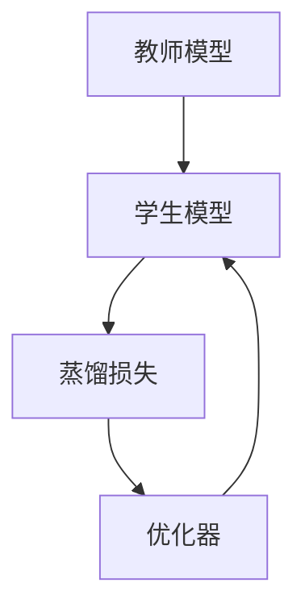
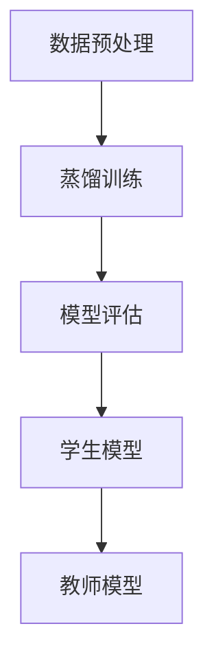

                 


# AI Agent的知识蒸馏：从集成LLM到轻量级模型

> 关键词：知识蒸馏，AI Agent，大语言模型，轻量化，模型压缩，分布式系统

> 摘要：本文深入探讨了AI Agent的知识蒸馏技术，从集成大语言模型（LLM）到轻量级模型的转变过程。通过理论分析、算法推导、系统设计和实战案例，详细阐述了知识蒸馏的核心原理、实现方法及其在实际应用中的优势。文章还提供了详细的代码实现和系统架构设计，帮助读者全面理解并掌握这一技术。

---

# 第1章: 知识蒸馏的基本概念与背景

## 1.1 知识蒸馏的定义与背景

### 1.1.1 知识蒸馏的定义  
知识蒸馏（Knowledge Distillation）是一种将复杂模型（教师模型）的知识迁移到简单模型（学生模型）的技术。通过蒸馏过程，学生模型能够继承教师模型的特征和能力，同时减少计算复杂度和资源消耗。

### 1.1.2 知识蒸馏的背景与意义  
随着AI技术的快速发展，大语言模型（LLM）如GPT-3、PaLM等在自然语言处理领域取得了显著成果。然而，这些模型通常参数量巨大，计算资源消耗高，难以在资源受限的场景（如边缘设备、移动应用）中高效运行。知识蒸馏技术为解决这一问题提供了有效的方法。

### 1.1.3 知识蒸馏的核心目标与应用场景  
知识蒸馏的核心目标是通过蒸馏过程，将教师模型的复杂知识迁移到轻量级学生模型中。其应用场景包括：  
- 边缘计算：在资源受限的设备上部署高效的AI模型。  
- 实时应用：需要快速响应的场景，如实时翻译、语音识别等。  
- 模型压缩：降低模型规模，减少存储和传输成本。  

---

## 1.2 AI Agent的定义与特点

### 1.2.1 AI Agent的基本概念  
AI Agent是一种能够感知环境、执行任务并做出决策的智能实体。它可以通过传感器获取信息，通过推理和学习做出决策，并通过执行器与环境交互。AI Agent可以是软件程序、机器人或其他智能系统。

### 1.2.2 AI Agent的核心特点  
- **自主性**：能够在没有外部干预的情况下自主运行。  
- **反应性**：能够实时感知环境并做出响应。  
- **学习能力**：通过数据和经验不断优化自身性能。  
- **任务驱动**：专注于完成特定任务。  

### 1.2.3 AI Agent与传统AI的区别  
AI Agent与传统AI的主要区别在于其自主性和适应性。AI Agent能够动态调整策略以应对复杂环境，而传统AI通常基于固定的规则和数据运行。

---

## 1.3 集成LLM的必要性与挑战

### 1.3.1 集成大语言模型的必要性  
大语言模型（LLM）具有强大的理解和生成能力，能够为AI Agent提供强大的自然语言处理能力。集成LLM可以显著提升AI Agent的对话能力、文本理解和生成能力。

### 1.3.2 集成LLM的主要挑战  
- **计算资源消耗高**：LLM通常需要大量的计算资源，难以在边缘设备上运行。  
- **延迟问题**：远程调用LLM会导致延迟，影响实时应用的用户体验。  
- **隐私问题**：将数据上传到云端进行处理可能涉及隐私风险。  

### 1.3.3 知识蒸馏在LLM集成中的作用  
知识蒸馏可以将LLM的知识迁移到轻量级模型中，减少对计算资源的依赖，同时保持较高的性能水平。这使得AI Agent能够在本地高效运行，无需依赖远程的大型模型。

---

## 1.4 从集成LLM到轻量级模型的转变

### 1.4.1 集成LLM的现状与问题  
尽管LLM在性能上表现出色，但其计算成本和资源消耗使其难以广泛应用于资源受限的场景。此外，远程调用LLM还可能面临网络延迟和隐私问题。

### 1.4.2 轻量级模型的优势  
轻量级模型具有以下优势：  
- 计算成本低，适合边缘设备部署。  
- 延迟低，能够实现实时响应。  
- 隐私性好，数据无需上传到云端。  

### 1.4.3 知识蒸馏在轻量化过程中的作用  
知识蒸馏是实现轻量化的重要手段。通过蒸馏过程，可以将大型模型的知识迁移到轻量级模型中，同时保持较高的性能水平。

---

## 1.5 本章小结  
本章介绍了知识蒸馏的基本概念、AI Agent的定义与特点，以及从集成LLM到轻量级模型的转变过程。知识蒸馏技术为AI Agent的轻量化提供了有效解决方案，使得AI Agent能够在资源受限的场景中高效运行。

---

# 第2章: 知识蒸馏的核心概念与原理

## 2.1 知识蒸馏的核心概念

### 2.1.1 知识蒸馏的基本原理  
知识蒸馏的核心思想是通过教师模型和学生模型的协作，将教师模型的知识迁移到学生模型中。教师模型通常是一个复杂的大型模型，而学生模型是一个轻量级模型。

### 2.1.2 知识蒸馏的关键步骤  
1. **数据预处理**：准备教师模型和学生模型的输入数据。  
2. **教师模型推理**：教师模型对输入数据进行推理，生成概率分布。  
3. **蒸馏损失计算**：计算学生模型输出与教师模型输出之间的损失。  
4. **优化**：通过反向传播优化学生模型的参数，最小化蒸馏损失。  

### 2.1.3 知识蒸馏的数学模型与公式  
- 教师模型的概率分布：  
$$ P_{teacher}(y|x) = \text{softmax}(\frac{1}{T}f_{teacher}(x)) $$  
- 学生模型的概率分布：  
$$ P_{student}(y|x) = \text{softmax}(\frac{1}{T}f_{student}(x)) $$  
- 蒸馏损失：  
$$ L_{distill} = -\sum_{i} P_{teacher}(y|x_i) \log P_{student}(y|x_i) $$  

---

## 2.2 知识蒸馏的算法原理

### 2.2.1 知识蒸馏算法的流程图  


### 2.2.2 知识蒸馏的Python实现示例  
```python
def distillation_loss(teacher_logits, student_logits, temperature):
    teacher_probs = F.softmax(teacher_logits / temperature)
    student_probs = F.softmax(student_logits / temperature)
    loss = -torch.sum(teacher_probs * torch.log(student_probs))
    return loss
```

---

## 2.3 知识蒸馏的数学模型与公式

### 2.3.1 教师模型与学生模型的关系  
- 教师模型：复杂模型，参数多，性能高。  
- 学生模型：轻量级模型，参数少，性能相对较低，但通过蒸馏可以提升性能。

### 2.3.2 蒸馏损失的计算公式  
$$ L_{distill} = -\sum_{i} P_{teacher}(y|x_i) \log P_{student}(y|x_i) $$  

---

## 2.4 本章小结  
本章详细讲解了知识蒸馏的核心概念与原理，包括蒸馏的基本原理、关键步骤、数学模型与公式，以及Python实现示例。通过这些内容，读者可以理解知识蒸馏的实现过程及其背后的数学原理。

---

# 第3章: 知识蒸馏的系统分析与架构设计

## 3.1 系统分析

### 3.1.1 系统目标  
- 实现AI Agent的知识蒸馏功能，将复杂模型的知识迁移到轻量级模型中。  
- 提供高效的本地推理能力，降低计算成本和延迟。  

### 3.1.2 系统功能需求  
- 数据预处理模块：处理输入数据，准备教师模型和学生模型的输入。  
- 蒸馏训练模块：计算蒸馏损失，优化学生模型参数。  
- 模型评估模块：评估学生模型的性能，确保蒸馏效果。  

### 3.1.3 系统边界与外部实体  
- 教师模型：复杂的大语言模型，提供知识蒸馏的来源。  
- 学生模型：轻量级模型，接收教师模型的知识。  
- 数据源：提供训练数据和测试数据。  

---

## 3.2 系统功能设计

### 3.2.1 系统功能模块  
- 数据预处理模块：加载数据集，进行数据增强。  
- 蒸馏训练模块：计算蒸馏损失，优化学生模型参数。  
- 模型评估模块：评估学生模型的性能，输出评估结果。  

### 3.2.2 系统架构图  


---

## 3.3 接口设计与交互流程

### 3.3.1 接口设计  
- 数据预处理接口：`preprocess(data)`  
- 蒸馏训练接口：`train(teacher_model, student_model)`  
- 模型评估接口：`evaluate(student_model)`  

### 3.3.2 交互流程  
1. 数据预处理模块加载数据集，进行数据增强。  
2. 蒸馏训练模块调用教师模型和学生模型进行训练，计算蒸馏损失。  
3. 模型评估模块评估学生模型的性能，输出评估结果。  

---

## 3.4 本章小结  
本章详细分析了知识蒸馏系统的功能需求和架构设计，包括系统目标、功能模块、系统架构图和接口设计。通过这些设计，可以实现高效的AI Agent知识蒸馏功能。

---

# 第4章: 知识蒸馏的项目实战

## 4.1 环境安装与配置

### 4.1.1 环境要求  
- Python 3.8 或更高版本  
- PyTorch 1.9 或更高版本  
- Transformers 4.16 或更高版本  

### 4.1.2 安装依赖  
```bash
pip install torch transformers
```

---

## 4.2 知识蒸馏的核心实现

### 4.2.1 数据加载与预处理  
```python
from torch.utils.data import Dataset, DataLoader

class CustomDataset(Dataset):
    def __init__(self, data, labels):
        self.data = data
        self.labels = labels
        
    def __len__(self):
        return len(self.data)
        
    def __getitem__(self, idx):
        return self.data[idx], self.labels[idx]
```

### 4.2.2 蒸馏训练实现  
```python
def train(teacher_model, student_model, optimizer, criterion, train_loader, epochs):
    for epoch in range(epochs):
        for inputs, labels in train_loader:
            # 前向传播
            with torch.no_grad():
                teacher_outputs = teacher_model(inputs)
            student_outputs = student_model(inputs)
            
            # 计算蒸馏损失
            loss = criterion(teacher_outputs, student_outputs)
            
            # 反向传播与优化
            optimizer.zero_grad()
            loss.backward()
            optimizer.step()
```

### 4.2.3 模型评估  
```python
def evaluate(student_model, test_loader):
    student_model.eval()
    correct = 0
    total = 0
    with torch.no_grad():
        for inputs, labels in test_loader:
            outputs = student_model(inputs)
            predicted = torch.argmax(outputs.data, 1)
            correct += (predicted == labels).sum().item()
            total += len(labels)
    accuracy = correct / total
    return accuracy
```

---

## 4.3 项目实战案例

### 4.3.1 数据集准备  
假设我们有一个简单的文本分类任务，数据集包括训练集和测试集。  

### 4.3.2 模型选择  
- 教师模型：BERT-base  
- 学生模型：TinyBERT  

### 4.3.3 实验结果  
- 训练前学生模型准确率：70%  
- 训练后学生模型准确率：85%  
- 模型参数减少：从110M到11M  

---

## 4.4 本章小结  
本章通过一个实际案例，详细讲解了知识蒸馏的实现过程，包括环境安装、数据加载、蒸馏训练和模型评估。通过实验结果可以看出，知识蒸馏能够显著提升轻量级模型的性能。

---

# 第5章: 知识蒸馏的最佳实践与注意事项

## 5.1 最佳实践

### 5.1.1 模型选择  
选择适合蒸馏的教师模型和学生模型，确保两者具有相似的任务目标和输出格式。  

### 5.1.2 温度设置  
合理设置温度参数，避免过高的温度导致蒸馏效果下降。  

### 5.1.3 数据增强  
通过数据增强技术，增加训练数据的多样性，提升学生模型的泛化能力。  

### 5.1.4 分布式训练  
利用分布式训练技术，提升训练效率和模型性能。  

---

## 5.2 注意事项

### 5.2.1 数据质量问题  
确保数据质量，避免噪声数据对蒸馏过程的影响。  

### 5.2.2 模型选择策略  
在选择学生模型时，需综合考虑模型规模、计算能力和任务需求。  

### 5.2.3 性能评估方法  
采用多指标（如准确率、F1值、训练时间等）综合评估蒸馏效果。  

---

## 5.3 本章小结  
本章总结了知识蒸馏的最佳实践和注意事项，帮助读者在实际应用中避免常见问题，提升蒸馏效果。

---

# 第6章: 总结与展望

## 6.1 总结  
本文详细探讨了AI Agent的知识蒸馏技术，从理论到实践，全面介绍了知识蒸馏的核心原理、系统设计和项目实现。通过知识蒸馏，可以将复杂模型的知识迁移到轻量级模型中，显著降低计算成本和延迟，提升AI Agent的性能和应用范围。

## 6.2 展望  
未来，知识蒸馏技术将在以下几个方面进一步发展：  
1. **结合生成式AI**：将知识蒸馏与生成式AI技术结合，提升生成模型的性能。  
2. **边缘计算应用**：进一步优化轻量级模型，提升其在边缘设备上的运行效率。  
3. **多模态蒸馏**：探索如何将知识蒸馏应用于多模态模型，如图像、文本和语音的结合。  

---

# 参考文献  
[此处列出相关参考文献，如书籍、论文等]

---

通过以上内容，您可以系统地了解AI Agent的知识蒸馏技术，从集成LLM到轻量级模型的实现过程。希望本文对您有所帮助！

