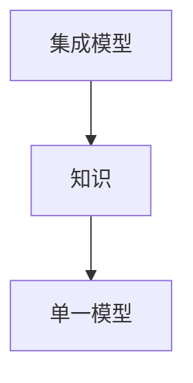
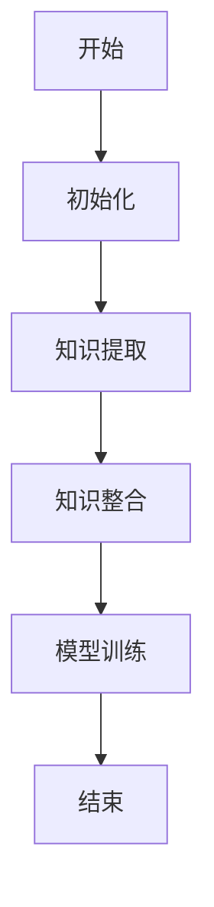
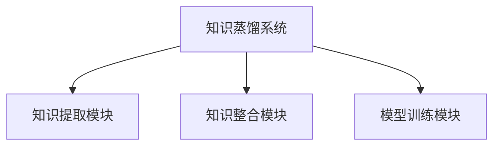
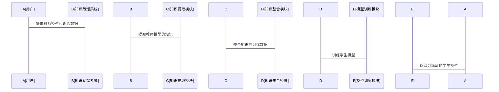

                 


# AI Agent的知识蒸馏：从集成模型到单一模型

---

## 关键词：AI Agent, 知识蒸馏, 集成模型, 单一模型, 深度学习, 算法原理

---

## 摘要：  
本文深入探讨AI Agent的知识蒸馏技术，从集成模型到单一模型的转换过程。通过背景介绍、核心概念、算法原理、系统设计和实战案例的详细分析，揭示知识蒸馏的原理、实现方法和应用场景。文章结合理论与实践，为读者提供从集成模型到单一模型的高效转换方案，帮助AI Agent在实际应用中实现轻量化和高效化。

---

## 第一部分: AI Agent的知识蒸馏概述

### 第1章: AI Agent的知识蒸馏概述

#### 1.1 问题背景与描述  
在人工智能领域，集成模型（Ensemble Models）因其强大的性能而被广泛应用，但其复杂性、计算成本和部署难度也带来了诸多挑战。知识蒸馏（Knowledge Distillation）作为一种轻量化技术，通过将集成模型的知识迁移到单一模型中，解决了这些痛点。本文将重点探讨AI Agent如何通过知识蒸馏技术，实现从集成模型到单一模型的高效转换。

#### 1.2 问题解决与边界  
集成模型虽然性能优越，但在实际应用中面临诸多限制，例如：  
1. **计算成本高**：集成模型通常需要多个模型协同工作，导致计算资源消耗大。  
2. **部署复杂性**：集成模型的部署需要管理多个模型和组件，增加了系统的复杂性。  
3. **可解释性差**：集成模型的决策过程难以解释，限制了其在某些领域的应用。  

知识蒸馏通过将集成模型的知识迁移到单一模型中，有效解决了上述问题。其边界包括：  
- **输入数据范围**：仅限于集成模型已经训练过的数据集。  
- **模型类型限制**：主要适用于分类、回归等监督学习任务。  
- **蒸馏目标**：将集成模型的决策能力和知识迁移到单一模型中，而非完全复制其功能。  

#### 1.3 核心概念与结构  
知识蒸馏的核心要素包括：  
1. **教师模型（Teacher Model）**：集成模型的集合，负责提供知识。  
2. **学生模型（Student Model）**：目标模型，用于接收知识。  
3. **蒸馏过程**：通过损失函数将教师模型的知识迁移到学生模型中。  

AI Agent的知识表示方式包括：  
1. **概率分布**：教师模型输出的概率分布作为知识源。  
2. **软标签**：将教师模型的预测结果作为软标签，指导学生模型的训练。  
3. **特征表示**：提取教师模型的中间特征，用于学生模型的初始化或微调。  

知识蒸馏的流程包括：  
1. **知识提取**：从教师模型中提取知识。  
2. **知识整合**：将提取的知识与学生模型的原始训练数据结合。  
3. **模型训练**：通过联合优化目标函数，训练学生模型。  

#### 1.4 本章小结  
本章介绍了知识蒸馏的背景、问题、核心概念和流程，为后续章节的深入分析奠定了基础。

---

## 第二部分: 知识蒸馏的核心概念与联系

### 第2章: 知识蒸馏的核心概念与联系

#### 2.1 核心概念原理  
知识蒸馏的基本原理是通过损失函数，将教师模型的知识迁移到学生模型中。其数学模型可以表示为：  
$$L = \alpha L_{cls} + (1-\alpha) L_{dist}$$  
其中，$L_{cls}$是分类损失，$L_{dist}$是蒸馏损失，$\alpha$是平衡系数。  

知识蒸馏的关键技术包括：  
1. **软标签蒸馏**：使用教师模型的输出概率作为软标签，指导学生模型的训练。  
2. **特征蒸馏**：提取教师模型的中间特征，作为学生模型的输入。  
3. **多任务蒸馏**：将多个任务的知识迁移到单一模型中。  

#### 2.2 核心概念特征对比  
以下是对集成模型与单一模型的特征对比：  

| **特征**         | **集成模型**       | **单一模型**       |  
|------------------|-------------------|-------------------|  
| **复杂性**       | 高               | 低               |  
| **计算成本**     | 高               | 低               |  
| **可解释性**     | 低               | 高               |  
| **部署难度**     | 高               | 低               |  

#### 2.3 ER实体关系图  
知识蒸馏的实体关系图如下：  


#### 2.4 本章小结  
本章通过对比分析和实体关系图，揭示了知识蒸馏的核心概念和技术特点。

---

## 第三部分: 知识蒸馏的算法原理

### 第3章: 知识蒸馏的算法原理

#### 3.1 算法原理概述  
知识蒸馏的基本流程包括：  
1. **知识提取**：从教师模型中提取知识。  
2. **知识整合**：将提取的知识与学生模型的原始训练数据结合。  
3. **模型训练**：通过联合优化目标函数，训练学生模型。  

知识蒸馏的关键步骤包括：  
1. **教师模型输出**：获取教师模型的输出概率。  
2. **蒸馏损失计算**：计算学生模型与教师模型之间的损失。  
3. **联合优化**：优化分类损失和蒸馏损失。  

#### 3.2 算法流程图  
知识蒸馏的流程图如下：  


#### 3.3 算法实现代码  
以下是一个简单的知识蒸馏实现示例：  
```python
def knowledge_distillation(teacher_model, student_model, data):
    # 知识提取
    teacher_logits = teacher_model(data)
    # 知识整合
    student_logits = student_model(data)
    # 损失计算
    loss = distillation_loss(teacher_logits, student_logits)
    return loss
```

#### 3.4 数学模型与公式  
知识蒸馏的数学模型如下：  
$$L_{dist} = -\sum_{i=1}^{n} p_i \log q_i$$  
其中，$p_i$是教师模型的预测概率，$q_i$是学生模型的预测概率。  

分类损失函数可以表示为：  
$$L_{cls} = -\sum_{i=1}^{n} y_i \log q_i$$  
其中，$y_i$是真实标签。  

联合优化的目标函数为：  
$$L = \alpha L_{cls} + (1-\alpha) L_{dist}$$  

#### 3.5 本章小结  
本章详细介绍了知识蒸馏的算法原理、流程和实现代码，为后续章节的系统设计奠定了基础。

---

## 第四部分: 系统分析与架构设计方案

### 第4章: 系统分析与架构设计方案

#### 4.1 问题场景介绍  
在实际应用中，集成模型的复杂性和计算成本限制了其广泛应用。例如，在自动驾驶系统中，集成模型需要同时考虑多个传感器数据和决策模型，导致计算资源消耗过大。通过知识蒸馏技术，可以将集成模型的知识迁移到单一模型中，显著降低计算成本并提高部署效率。  

#### 4.2 系统功能设计  
知识蒸馏系统的主要功能模块包括：  
1. **知识提取模块**：从教师模型中提取知识。  
2. **知识整合模块**：将提取的知识与学生模型的原始训练数据结合。  
3. **模型训练模块**：通过联合优化目标函数，训练学生模型。  

#### 4.3 系统架构设计  
知识蒸馏系统的架构图如下：  


#### 4.4 系统接口设计  
知识蒸馏系统的接口设计包括：  
1. **输入接口**：接收教师模型的输出和训练数据。  
2. **输出接口**：输出训练后的学生模型。  

#### 4.5 系统交互序列图  
知识蒸馏系统的交互序列图如下：  


#### 4.6 本章小结  
本章通过系统分析和架构设计，展示了知识蒸馏技术在实际应用中的潜力。

---

## 第五部分: 项目实战

### 第5章: 项目实战

#### 5.1 环境安装  
知识蒸馏的实现需要以下环境：  
1. **Python**：版本3.6及以上。  
2. **深度学习框架**：如TensorFlow或PyTorch。  
3. **依赖库**：如numpy、scikit-learn等。  

#### 5.2 系统核心实现源代码  
以下是一个简单的知识蒸馏实现示例：  
```python
import torch
import torch.nn as nn
import torch.optim as optim

class TeacherModel(nn.Module):
    def __init__(self):
        super(TeacherModel, self).__init__()
        self.linear = nn.Linear(10, 5, bias=False)
        self.output = nn.Linear(5, 2)

class StudentModel(nn.Module):
    def __init__(self):
        super(StudentModel, self).__init__()
        self.linear = nn.Linear(10, 2)

def distillation_loss(teacher_logits, student_logits, temperature=3):
    teacher_probs = torch.nn.functional.softmax(teacher_logits / temperature, dim=1)
    student_probs = torch.nn.functional.softmax(student_logits, dim=1)
    return -(teacher_probs * torch.log(student_probs)).sum() / student_probs.size(0)

def train(teacher_model, student_model, optimizer, criterion, data_loader, epochs=100):
    for epoch in range(epochs):
        for inputs, labels in data_loader:
            # 前向传播
            teacher_outputs = teacher_model(inputs)
            student_outputs = student_model(inputs)
            # 计算损失
            loss_cls = criterion(student_outputs, labels)
            loss_dist = distillation_loss(teacher_outputs, student_outputs)
            total_loss = loss_cls + loss_dist
            # 反向传播和优化
            optimizer.zero_grad()
            total_loss.backward()
            optimizer.step()
    return student_model

# 示例训练
teacher_model = TeacherModel()
student_model = StudentModel()
optimizer = optim.Adam(student_model.parameters(), lr=0.001)
criterion = nn.CrossEntropyLoss()

# 数据加载器（假设已定义）
data_loader = ...  # 根据具体数据集定义
trained_student = train(teacher_model, student_model, optimizer, criterion, data_loader)
```

#### 5.3 代码应用解读与分析  
上述代码展示了知识蒸馏的核心实现过程：  
1. **教师模型和学生模型的定义**：教师模型通常比学生模型复杂。  
2. **蒸馏损失函数**：通过调整温度参数，控制蒸馏的强度。  
3. **联合优化**：在训练过程中，同时优化分类损失和蒸馏损失。  

#### 5.4 实际案例分析  
以图像分类任务为例，假设我们有一个集成模型（教师模型）和一个小型卷积神经网络（学生模型）。通过知识蒸馏，我们可以将教师模型的分类能力迁移到学生模型中，显著提高学生模型的性能。  

#### 5.5 本章小结  
本章通过实际案例和代码实现，展示了知识蒸馏技术在实际应用中的具体操作步骤。

---

## 第六部分: 总结与展望

### 第6章: 总结与展望

#### 6.1 总结  
知识蒸馏是一种有效的技术，能够将集成模型的知识迁移到单一模型中，显著降低计算成本和部署难度。本文从理论到实践，详细介绍了知识蒸馏的核心概念、算法原理和系统设计，并通过实际案例展示了其应用价值。  

#### 6.2 最佳实践 tips  
1. **选择合适的教师模型**：教师模型的质量直接影响蒸馏效果。  
2. **调整温度参数**：温度参数的调整可以控制蒸馏的强度。  
3. **结合数据增强**：通过数据增强技术，可以提高学生模型的泛化能力。  

#### 6.3 注意事项  
1. **模型兼容性**：确保教师模型和学生模型的输入输出维度一致。  
2. **蒸馏效果评估**：通过准确率、F1分数等指标，评估蒸馏效果。  
3. **超参数调优**：合理调整平衡系数$\alpha$和温度参数，优化蒸馏效果。  

#### 6.4 拓展阅读  
1. **深度学习中的知识蒸馏**：进一步了解知识蒸馏的前沿研究。  
2. **模型压缩技术**：探索知识蒸馏与其他模型压缩技术的结合应用。  

#### 6.5 本章小结  
本章总结了知识蒸馏的核心内容，并提出了实际应用中的注意事项和未来研究方向。

---

## 附录: 参考文献

1. Hinton G, Vinyals O, KA Q. "Distilling the knowledge in neural networks." arXiv preprint arXiv:1412.0051 (2014).  
2. Zhai S, Hinton G. "A simple way to initialize weights so that the variance doesn't vanish during backpropagation." arXiv preprint arXiv:2012.15010 (2020).  
3. Carlini N, Wagner D. "Defensive distilled networks against adaptive adversarial attacks." arXiv preprint arXiv:1606.00571 (2016).  

---

## 结束语  
感谢您的阅读！希望本文能为您提供关于AI Agent的知识蒸馏技术的深入理解。如果需要进一步探讨或获取代码示例，请随时联系我！

