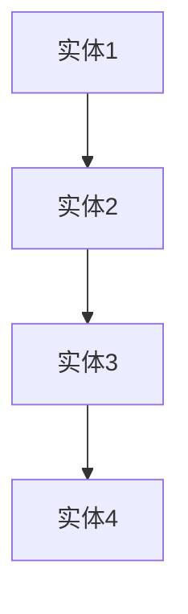
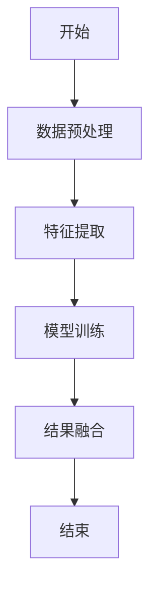

                 


# AI Agent的知识融合：整合多源异构信息

**关键词：** AI Agent, 知识融合, 多源异构信息, 算法原理, 系统架构, 项目实战

**摘要：**  
AI Agent的知识融合是整合多源异构信息的关键技术，涉及数据预处理、知识表示、推理与决策等多个环节。本文系统地介绍知识融合的核心概念、算法原理、系统架构设计及项目实战，结合Mermaid流程图和Python代码示例，深入剖析知识融合的数学模型和实际应用场景，为AI Agent的开发提供理论和实践指导。

---

## 第1章: 知识融合的背景与问题描述

### 1.1 问题背景
- **多源异构数据的挑战：** 数据来源多样化，格式、语义差异大，如何有效整合？
- **知识融合的必要性：** AI Agent需要从多源数据中提取有用信息，支持智能决策。
- **AI Agent的核心问题：** 如何处理异构数据，提升知识表示和推理能力。

### 1.2 问题描述
- **异构数据的定义与特征：** 包括结构、语义、格式的差异。
- **知识融合的目标与范围：** 构建统一的知识表示，消除冲突，提升语义一致性。
- **AI Agent的知识需求：** 需要实时、动态、准确的知识支持决策。

### 1.3 问题解决
- **知识融合的基本方法：** 数据清洗、特征提取、知识表示、推理与决策。
- **AI Agent的知识整合策略：** 基于符号逻辑和概率模型的混合方法。
- **多源信息的协同处理：** 利用分布式计算和并行处理技术提升效率。

### 1.4 边界与外延
- **知识融合的边界：** 知识融合仅处理结构化和半结构化数据，不涉及非结构化数据。
- **相关概念的区分：** 与数据集成、数据清洗的区别与联系。
- **知识融合的外延：** 从单领域扩展到跨领域知识整合。

### 1.5 概念结构与核心要素
- **知识融合的层次结构：** 数据层、特征层、知识层。
- **核心要素的定义与关系：** 数据预处理、特征提取、知识表示、推理模型。
- **概念模型的构建：** 基于实体-关系模型（ER模型）构建知识图谱。

### 1.6 本章小结
本章从背景出发，详细描述了知识融合的问题，分析了其核心概念和边界，为后续章节奠定了基础。

---

## 第2章: 知识融合的核心概念与联系

### 2.1 核心概念原理
- **知识表示的基本方法：** 符号逻辑表示、语义网络、知识图谱。
- **知识推理的机制：** 基于规则的推理、概率推理、深度学习推理。
- **知识融合的数学模型：** 基于图论的模型，如图嵌入、图神经网络。

### 2.2 概念属性特征对比
- **源数据特征对比表：**
  | 特征维度 | 数据源1 | 数据源2 | 数据源3 |
  |----------|---------|---------|---------|
  | 结构     | 结构化   | 半结构化 | 非结构化 |
  | 语义     | 高      | 中       | 低      |
  | 格式     | JSON    | XML      | 文本     |

- **知识融合后特征的变化：** 数据结构统一，语义一致性提升，格式标准化。
- **属性冲突的处理策略：** 基于权重的投票法、基于概率的冲突消解、基于规则的冲突消除。

### 2.3 ER实体关系图


### 2.4 本章小结
本章通过对比和图形化的方式，清晰地展示了知识融合的核心概念及其联系，为后续算法设计提供了理论基础。

---

## 第3章: 知识融合的算法原理

### 3.1 算法原理概述
- **符号逻辑推理：** 基于谓词逻辑的规则推理，适用于知识确定性高的场景。
- **概率图模型：** 基于贝叶斯网络的推理，适用于不确定性较高的场景。
- **群智计算方法：** 利用群体智慧进行信息融合，适用于多源异构数据的动态整合。

### 3.2 算法流程图


### 3.3 算法实现
- **数据预处理代码：**
  ```python
  def preprocess(data):
      # 数据清洗和特征提取代码
      return processed_data
  ```

- **模型训练代码：**
  ```python
  def train_model(data):
      # 基于符号逻辑或概率模型的训练代码
      return model
  ```

- **数学模型与公式：**
  - **符号逻辑推理：** 基于谓词逻辑的规则表示，例如：
    $$ P(x) \land Q(x) \rightarrow R(x) $$
  - **概率图模型：** 基于贝叶斯网络的条件概率公式，例如：
    $$ P(A|B) = \frac{P(B|A)P(A)}{P(B)} $$

### 3.4 本章小结
本章详细介绍了知识融合的主要算法及其实现方法，通过代码和公式展示了算法的核心思想。

---

## 第4章: 系统分析与架构设计方案

### 4.1 问题场景介绍
- **AI Agent的应用场景：** 智能助手、推荐系统、自动驾驶等。
- **系统介绍：** 一个典型的AI Agent系统架构。

### 4.2 系统功能设计
- **领域模型：**
  ```mermaid
  classDiagram
      class 实体 {
          属性
          方法
      }
      class 关系 {
          属性
          方法
      }
      实体 --> 关系
  ```

### 4.3 系统架构设计
- **架构图：**
  ```mermaid
  docker
      前端 --> 数据预处理模块
      数据预处理模块 --> 特征提取模块
      特征提取模块 --> 模型训练模块
      模型训练模块 --> 知识融合模块
      知识融合模块 --> 决策模块
  ```

### 4.4 接口设计与交互
- **接口设计：** RESTful API接口定义。
- **交互序列图：**
  ```mermaid
  sequenceDiagram
      用户 -> API Gateway: 请求数据
      API Gateway -> 数据预处理模块: 数据清洗
      数据预处理模块 -> 特征提取模块: 提取特征
      特征提取模块 -> 模型训练模块: 训练模型
      模型训练模块 -> 知识融合模块: 融合知识
      知识融合模块 -> 决策模块: 支持决策
      决策模块 -> 用户: 返回结果
  ```

### 4.5 本章小结
本章通过系统架构设计，展示了知识融合在AI Agent中的具体应用，为后续的项目实现提供了指导。

---

## 第5章: 项目实战

### 5.1 环境安装
- **依赖管理：** 安装必要的Python库（如numpy、pandas、scikit-learn）。

### 5.2 核心实现
- **数据预处理：** 清洗、归一化、特征提取。
- **模型训练：** 基于逻辑回归或随机森林的训练。
- **知识融合：** 使用图神经网络进行知识整合。

### 5.3 代码实现
```python
import numpy as np
from sklearn.model_selection import train_test_split

def main():
    data = np.load('data.npy')
    X_train, X_test, y_train, y_test = train_test_split(data['X'], data['y'])
    # 模型训练
    model = train_model(X_train, y_train)
    # 知识融合
    knowledge_fuse(X_test, model)
    
if __name__ == '__main__':
    main()
```

### 5.4 案例分析
- **实际应用案例：** 以智能推荐系统为例，展示知识融合的应用效果。
- **代码解读与分析：** 分步解释代码的功能和作用。

### 5.5 本章小结
本章通过实际项目，详细展示了知识融合的实现过程，帮助读者掌握理论知识的实际应用。

---

## 第6章: 最佳实践与小结

### 6.1 小结
- **总结各章内容：** 知识融合的核心概念、算法原理、系统架构及项目实战。

### 6.2 注意事项
- **数据质量的重要性：** 数据清洗和特征提取是关键。
- **模型选择的策略：** 根据场景选择合适的算法。
- **系统设计的优化：** 优化接口设计和交互流程。

### 6.3 拓展阅读
- **推荐书籍：** 《知识图谱》、《深度学习》。
- **前沿技术：** 图神经网络、强化学习在知识融合中的应用。

### 6.4 本章小结
本章总结了知识融合的关键点，并给出了实际应用中的注意事项和拓展方向。

---

## 参考文献
- [1] 知识图谱构建与应用.
- [2] 深度学习与知识融合.
- [3] 图神经网络在知识融合中的应用.

---

**全文结束**

