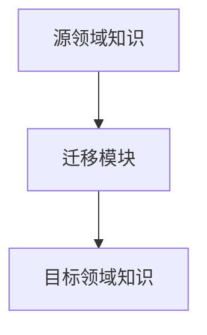

                 


# AI Agent的知识迁移：跨领域应用LLM的能力

> 关键词：AI Agent, 知识迁移, 大语言模型, 跨领域应用, 机器学习, 迁移学习

> 摘要：本文将详细探讨AI Agent的知识迁移能力，特别是在跨领域应用大语言模型（LLM）中的潜力。通过分析知识迁移的核心概念、算法原理、系统架构以及实际项目案例，本文旨在为读者提供一个全面的理解框架，帮助他们在实际应用中更好地利用AI Agent的知识迁移能力。

---

# 第一部分: AI Agent的知识迁移基础

## 第1章: AI Agent的基本概念

### 1.1 AI Agent的定义与特点
AI Agent（人工智能代理）是指在特定环境中能够感知并自主行动以实现目标的智能实体。与传统AI相比，AI Agent具有更强的自主性和适应性，能够在动态复杂的环境中做出决策和响应。以下是AI Agent的核心特点：

- **自主性**：AI Agent能够在没有外部干预的情况下自主运作。
- **反应性**：AI Agent能够实时感知环境并做出响应。
- **目标导向性**：AI Agent的行为以实现特定目标为导向。
- **学习能力**：AI Agent能够通过经验或数据进行学习和优化。

### 1.2 知识迁移的基本概念
知识迁移是指将已有的知识或经验应用于新的领域或问题中的过程。在AI Agent的语境下，知识迁移意味着将一个领域学到的知识或技能应用到另一个完全不同的领域中。这种能力对于AI Agent在跨领域应用中至关重要，尤其是在涉及大语言模型（LLM）的情况下。

- **知识迁移的分类**：
  - **正向迁移**：将知识从一个领域迁移到另一个领域，且目标领域与源领域有较高的相似性。
  - **负向迁移**：知识从一个领域迁移到另一个领域，但目标领域与源领域差异较大，导致性能下降。
  - **零样本迁移**：在没有目标领域数据的情况下进行知识迁移。

---

## 第2章: AI Agent的知识迁移背景

### 2.1 AI Agent在跨领域应用中的挑战
AI Agent在跨领域应用中面临的主要挑战包括：

- **领域差异性**：不同领域之间的数据分布、任务目标和语义差异可能导致模型无法直接迁移。
- **数据稀缺性**：某些领域可能缺乏足够的数据来支持模型训练。
- **模型适应性**：传统的模型可能无法很好地适应新的领域需求。

### 2.2 大语言模型（LLM）在知识迁移中的作用
大语言模型（LLM）在知识迁移中具有显著优势，尤其是在文本理解和生成方面。LLM通过预训练掌握了大量跨领域的知识，这使其成为AI Agent跨领域应用的理想工具。以下是LLM在知识迁移中的关键作用：

- **通用性**：LLM经过广泛的数据训练，能够理解和处理多种语言和领域的问题。
- **可迁移性**：LLM的预训练使其具备在不同领域之间进行知识迁移的能力。
- **可解释性**：尽管LLM的内部机制较为复杂，但其输出结果通常具有较高的可解释性。

---

# 第二部分: AI Agent的知识迁移机制

## 第3章: 知识迁移的核心概念与联系

### 3.1 知识迁移的机制分析
知识迁移的过程可以分为以下几个关键步骤：

1. **知识表示**：将知识转化为模型可以理解的形式，例如向量、符号或图结构。
2. **知识抽取**：从源领域中提取关键的知识或特征。
3. **知识重构**：将提取的知识转化为适用于目标领域的新形式。
4. **知识融合**：将目标领域的现有知识与迁移的知识进行融合。

### 3.2 AI Agent的知识迁移模型
AI Agent的知识迁移模型通常包括以下几个核心要素：

- **源领域模型**：用于表示源领域的知识。
- **目标领域模型**：用于表示目标领域的知识。
- **迁移模块**：负责将知识从源领域迁移到目标领域。

以下是一个简单的知识迁移流程图：



---

## 第4章: AI Agent知识迁移的算法原理

### 4.1 知识迁移的数学模型
知识迁移的数学模型通常涉及参数调整和损失函数的优化。以下是一个简化的知识迁移模型：

$$
\text{损失函数} = \alpha \cdot L_{\text{source}} + (1-\alpha) \cdot L_{\text{target}}
$$

其中，$\alpha$ 是一个超参数，用于权衡源领域和目标领域的损失。

### 4.2 知识迁移的算法实现
以下是一个简单的知识迁移算法实现示例：

```python
def knowledge_transfer(source_model, target_model, alpha=0.5, epochs=100):
    for epoch in range(epochs):
        # 前向传播
        source_output = source_model.forward(source_input)
        target_output = target_model.forward(target_input)
        
        # 计算损失
        source_loss = loss_function(source_output, source_label)
        target_loss = loss_function(target_output, target_label)
        
        # 知识迁移损失
        total_loss = alpha * source_loss + (1 - alpha) * target_loss
        
        # 反向传播和优化
        optimizer.zero_grad()
        total_loss.backward()
        optimizer.step()
    
    return source_model, target_model
```

---

# 第三部分: AI Agent知识迁移的系统架构与设计

## 第5章: 系统分析与架构设计

### 5.1 问题场景介绍
考虑一个AI Agent需要在医疗和金融领域之间进行知识迁移。源领域是医疗领域的疾病诊断，目标领域是金融领域的风险评估。系统的目标是利用医疗领域的诊断知识来优化金融领域的风险评估模型。

### 5.2 系统功能设计
以下是系统的功能模块设计：

- **领域模型设计**：
  ```mermaid
  classDiagram
      class Source_Domain {
          input
          output
      }
      class Target_Domain {
          input
          output
      }
      class Knowledge_Transfer {
          source_model
          target_model
      }
      Source_Domain --> Knowledge_Transfer
      Target_Domain --> Knowledge_Transfer
  ```

- **系统架构设计**：
  ```mermaid
  graph TD
      A[前端] --> B[API网关]
      B --> C[后端服务]
      C --> D[知识迁移模块]
      D --> E[源领域模型]
      D --> F[目标领域模型]
  ```

---

## 第6章: 项目实战

### 6.1 环境安装
以下是一个简单的知识迁移项目的环境安装示例：

```bash
pip install numpy
pip install tensorflow
pip install matplotlib
```

### 6.2 核心实现代码
以下是一个简单的知识迁移代码示例：

```python
import numpy as np
import tensorflow as tf

# 源领域数据
source_data = np.random.rand(100, 10)
source_labels = np.random.randint(2, size=100)

# 目标领域数据
target_data = np.random.rand(100, 10)
target_labels = np.random.randint(2, size=100)

# 模型定义
model = tf.keras.Sequential([
    tf.keras.layers.Dense(8, activation='relu'),
    tf.keras.layers.Dense(1, activation='sigmoid')
])

# 损失函数和优化器
loss_function = tf.keras.losses.BinaryCrossentropy()
optimizer = tf.keras.optimizers.Adam()

# 知识迁移训练
def transfer_learning(model, source_data, source_labels, target_data, target_labels, alpha=0.5, epochs=10):
    for epoch in range(epochs):
        # 前向传播
        source_preds = model(source_data)
        target_preds = model(target_data)
        
        # 计算损失
        source_loss = loss_function(source_labels, source_preds)
        target_loss = loss_function(target_labels, target_preds)
        
        # 知识迁移损失
        total_loss = alpha * source_loss + (1 - alpha) * target_loss
        
        # 反向传播和优化
        model.optimizer.zero_grad()
        total_loss.backward()
        model.optimizer.step()
    
    return model

# 训练模型
trained_model = transfer_learning(model, source_data, source_labels, target_data, target_labels, alpha=0.5, epochs=10)
```

---

## 第7章: 总结与展望

### 7.1 总结
本文详细探讨了AI Agent的知识迁移能力，尤其是在跨领域应用大语言模型（LLM）中的潜力。通过分析知识迁移的核心概念、算法原理、系统架构以及实际项目案例，我们展示了AI Agent在跨领域应用中的巨大潜力。

### 7.2 展望
未来，随着大语言模型（LLM）的不断发展，AI Agent的知识迁移能力将更加智能化和自动化。我们可以期待更多创新性的知识迁移算法和应用场景的出现。

---

**注意事项**：
- 知识迁移的效果取决于源领域和目标领域的相似性。
- 在实际应用中，需要根据具体需求调整知识迁移的参数和算法。
- 知识迁移的实现需要结合具体领域知识和数据。

**扩展阅读**：
- 《迁移学习：理论与实践》
- 《大语言模型：原理与应用》
- 《AI Agent：算法与实践》

