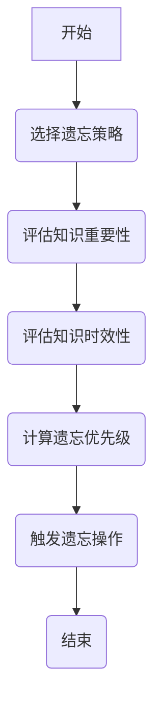
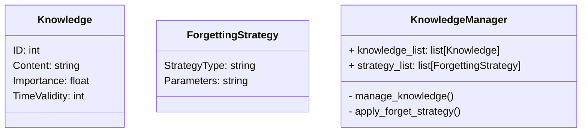
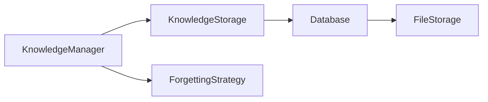

                 


# AI Agent的知识遗忘管理：平衡记忆与效率

> **关键词**：AI Agent，知识遗忘管理，记忆存储，效率优化，知识衰减，遗忘曲线

> **摘要**：本文探讨AI Agent在知识管理中的遗忘机制，分析如何通过遗忘曲线模型优化知识存储与检索效率。文章从概念解析、算法原理到系统设计，全面阐述知识遗忘管理的实现路径，为AI Agent的设计提供理论与实践参考。

---

## 第一部分：AI Agent的知识遗忘管理概述

### 第1章：AI Agent与知识遗忘管理概述

#### 1.1 知识遗忘管理的背景与问题背景

知识遗忘管理是AI Agent领域中的一个重要研究方向。随着AI Agent在智能推荐、自然语言处理、机器人控制等领域的广泛应用，如何高效管理知识存储成为关键问题。AI Agent在运行过程中会产生大量数据，包括用户行为数据、环境感知数据等，这些数据需要长期存储以便后续使用。然而，无限存储会导致资源浪费和性能下降，因此需要引入知识遗忘机制，平衡记忆与效率。

**问题背景**：
- AI Agent在运行过程中会产生大量数据，包括用户行为数据、环境感知数据等。
- 无限存储会导致资源浪费和性能下降。
- 知识的时效性和重要性差异需要动态管理。

**挑战**：
- 知识存储的资源限制。
- 知识的时效性和重要性动态变化。
- 知识遗忘的策略选择。

#### 1.2 知识遗忘管理的核心概念

**定义**：
知识遗忘管理是指AI Agent根据知识的重要性、时效性和关联性，动态调整知识存储的行为，以优化资源利用率和系统性能。

**核心要素**：
- **知识的重要性**：基于知识的使用频率和关联性。
- **知识的时效性**：基于知识的有效期限。
- **遗忘策略**：基于上述两个维度的动态调整。

**与传统记忆管理的区别**：
- 传统记忆管理注重数据的持久性，而知识遗忘管理注重数据的动态性和选择性。
- 传统记忆管理基于固定规则，而知识遗忘管理基于动态评估和调整。

#### 1.3 知识遗忘管理的特点与优势

**特点**：
- 动态性：根据知识的使用情况和环境变化，动态调整遗忘策略。
- 智能性：基于知识的重要性、时效性和关联性，智能选择遗忘目标。
- 自适应性：能够根据系统负载和资源情况，自动调整遗忘策略。

**优势**：
- 提高资源利用率。
- 降低系统负载。
- 提升系统响应速度。

#### 1.4 知识遗忘管理的应用场景

**AI Agent中的知识遗忘管理**：
- 智能推荐系统：根据用户的实时行为和历史行为，动态调整推荐策略。
- 自然语言处理：根据对话内容和语境，动态调整语言模型参数。
- 机器人控制：根据环境变化和任务需求，动态调整行为策略。

**典型应用场景**：
- 智能客服：根据用户咨询历史和当前问题，动态调整知识库。
- 自动驾驶：根据环境感知数据和驾驶场景，动态调整驾驶模型。
- 智能助手：根据用户需求和历史行为，动态调整服务策略。

#### 1.5 本章小结

本章从背景、概念、特点和应用场景四个方面，全面阐述了知识遗忘管理的重要性与必要性。通过对比传统记忆管理和知识遗忘管理的差异，明确了知识遗忘管理的核心思想与实现目标。

---

## 第二部分：知识遗忘管理的核心概念与原理

### 第2章：知识遗忘管理的核心概念与联系

#### 2.1 知识遗忘管理的原理

**遗忘曲线模型**：
遗忘曲线描述了知识遗忘的速度随时间变化的规律。研究表明，知识遗忘的速度与知识的使用频率、关联性以及存储时间密切相关。

**知识衰减模型**：
$$
\text{遗忘率} = e^{-\lambda t}
$$
其中，$\lambda$是遗忘系数，$t$是时间。

**知识保留率**：
$$
\text{知识保留率} = 1 - e^{-\lambda t}
$$

#### 2.2 核心概念对比与ER图分析

**核心概念对比表格**：

| 概念       | 定义                                                                 |
|------------|----------------------------------------------------------------------|
| 知识重要性  | 知识在当前任务中的使用频率和关联性。                                 |
| 知识时效性  | 知识的有效期限，通常基于知识的更新频率和环境变化。                 |
| 遗忘策略    | 根据知识重要性和时效性，动态调整遗忘目标和遗忘强度。               |

**ER实体关系图**：

```mermaid
er
  entity 知识 (Knowledge) {
    ID: int
    内容 (Content): string
    重要性 (Importance): float
    时效性 (TimeValidity): int
  }
  entity 遗忘策略 (ForgettingStrategy) {
    ID: int
    策略类型 (StrategyType): string
    参数 (Parameters): string
  }
  entity 遗忘记录 (ForgettingRecord) {
    ID: int
    知识ID (KnowledgeID): int
    遗忘时间 (ForgettingTime): datetime
  }
```

---

## 第三部分：知识遗忘管理的算法原理

### 第3章：知识遗忘管理的算法原理

#### 3.1 知识遗忘管理的算法选择

**基于时间的遗忘算法**：
根据知识的存储时间，自动触发遗忘操作。

**基于重要性的遗忘算法**：
根据知识的使用频率和关联性，动态调整遗忘优先级。

**混合遗忘算法**：
结合时间和重要性两种因素，综合评估遗忘优先级。

#### 3.2 算法原理的数学模型与公式

**遗忘曲线模型**：
$$
\text{遗忘率} = e^{-\lambda t}
$$

**遗忘优先级计算**：
$$
\text{遗忘优先级} = \alpha \cdot \text{重要性} + \beta \cdot \text{时效性}
$$
其中，$\alpha$和$\beta$是权重系数。

#### 3.3 算法实现的流程图



#### 3.4 算法实现的代码示例

```python
import time

class Knowledge:
    def __init__(self, content, importance, time_validity):
        self.content = content
        self.importance = importance
        self.time_validity = time_validity
        self.create_time = time.time()

def forgetting_priority(knowledge, lambda_val=0.1):
    t = time.time() - knowledge.create_time
    time_factor = math.exp(-lambda_val * t)
    priority = knowledge.importance * 0.7 + knowledge.time_validity * 0.3
    return priority

# 示例应用
knowledge = Knowledge("example content", 0.8, 24)
priority = forgetting_priority(knowledge)
print(f"Forgetting Priority: {priority}")
```

---

## 第四部分：系统分析与架构设计

### 第4章：知识遗忘管理的系统分析与架构设计

#### 4.1 问题场景介绍

**系统问题场景**：
AI Agent需要实时处理大量数据，知识存储空间有限，如何动态调整知识存储以优化系统性能。

**项目介绍**：
本项目旨在设计一个基于遗忘曲线模型的知识管理模块，实现知识的动态存储与遗忘管理。

#### 4.2 系统功能设计

**领域模型类图**：



#### 4.3 系统架构设计

**系统架构图**：



---

## 第五部分：项目实战

### 第5章：知识遗忘管理的项目实战

#### 5.1 环境安装

**安装依赖**：
- Python 3.8+
- Mermaid图生成工具
- Matplotlib（可选）

#### 5.2 核心代码实现

```python
import time
import math
import matplotlib.pyplot as plt

class ForgettingManager:
    def __init__(self, knowledge_list):
        self.knowledge_list = knowledge_list

    def calculate_forget_priority(self, knowledge, lambda_val=0.1):
        t = time.time() - knowledge.create_time
        time_factor = math.exp(-lambda_val * t)
        priority = knowledge.importance * 0.7 + knowledge.time_validity * 0.3
        return priority

    def apply_forget_strategy(self, threshold=0.3):
        for knowledge in self.knowledge_list:
            priority = self.calculate_forget_priority(knowledge)
            if priority < threshold:
                self.forget_knowledge(knowledge)

    def forget_knowledge(self, knowledge):
        # 实现知识遗忘逻辑，例如删除或归档知识
        print(f"Forget knowledge: {knowledge.content}")

# 示例应用
knowledge1 = Knowledge("example1", 0.8, 24)
knowledge2 = Knowledge("example2", 0.6, 12)
knowledge3 = Knowledge("example3", 0.4, 6)

manager = ForgettingManager([knowledge1, knowledge2, knowledge3])
manager.apply_forget_strategy(0.4)
```

---

## 第六部分：最佳实践与总结

### 第6章：最佳实践与总结

#### 6.1 最佳实践

**小结**：
- 知识遗忘管理是AI Agent优化的重要手段。
- 通过遗忘曲线模型和动态评估策略，可以有效平衡记忆与效率。

**注意事项**：
- 遗忘策略的选择需要根据具体场景调整。
- 知识的评估和遗忘操作需要实时动态调整。

**拓展阅读**：
- 《机器学习中的知识管理》
- 《分布式系统中的数据存储与遗忘机制》

#### 6.2 未来研究方向

- 更复杂的遗忘模型。
- 多模态知识的遗忘策略。
- 基于强化学习的遗忘优化。

---

**附录**：
- 术语表
- 参考文献
- 扩展资源

---

以上是《AI Agent的知识遗忘管理：平衡记忆与效率》的完整目录大纲与内容概述，涵盖从理论到实践的各个方面，旨在为读者提供全面的知识遗忘管理解决方案。

