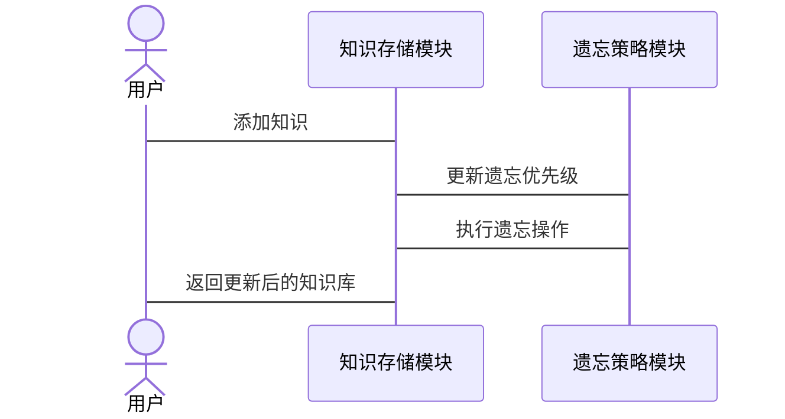

                 


# AI Agent的知识遗忘：管理长期记忆

## 关键词：AI Agent, 知识遗忘, 长期记忆, 算法, 系统架构, 项目实战

## 摘要：  
AI Agent在现代人工智能系统中扮演着越来越重要的角色，然而，其长期记忆的管理和知识遗忘的问题却鲜少被深入探讨。本文从AI Agent的知识遗忘机制出发，详细分析长期记忆管理的核心原理，并结合实际案例，介绍如何通过算法优化和系统设计来实现高效的长期记忆管理。文章内容涵盖知识遗忘的数学建模、长期记忆的存储机制、系统的架构设计以及实际项目中的应用，为AI Agent的长期记忆管理提供全面的解决方案。

---

# 第1章: AI Agent与知识遗忘的背景

## 1.1 AI Agent的基本概念  
### 1.1.1 AI Agent的定义与特点  
AI Agent（人工智能代理）是指能够感知环境、自主决策并执行任务的智能实体。其特点包括：  
- **自主性**：能够在没有外部干预的情况下独立运行。  
- **反应性**：能够实时感知环境并做出反应。  
- **目标导向**：以实现特定目标为导向进行决策和行动。  

### 1.1.2 AI Agent在人工智能中的地位  
AI Agent是人工智能系统的核心组件，广泛应用于自动驾驶、智能助手、推荐系统等领域。它是连接感知与行动的桥梁，能够处理复杂任务并优化决策过程。  

### 1.1.3 知识遗忘的定义与分类  
知识遗忘是指AI Agent在长期运行过程中，由于记忆空间的有限性或任务需求的变化，主动或被动地遗忘部分知识的过程。知识遗忘可以分为**自然遗忘**和**主动遗忘**两种类型：  
- **自然遗忘**：由于记忆空间的限制，自动舍弃不再需要的知识。  
- **主动遗忘**：为了优化记忆结构，有目的地删除冗余或低价值的知识。  

---

## 1.2 知识遗忘的问题背景  

### 1.2.1 知识遗忘的必然性  
AI Agent在运行过程中会不断获取新的知识，但记忆空间是有限的。为了保持高效运行，AI Agent需要定期清理不再需要的知识，这便是知识遗忘的必然性。  

### 1.2.2 知识遗忘的负面影响  
知识遗忘可能导致AI Agent失去重要的背景知识，从而影响其决策的准确性。例如，在医疗诊断场景中，遗忘某些患者的历史数据可能会影响诊断结果。  

### 1.2.3 知识遗忘的边界与外延  
知识遗忘的边界在于哪些知识可以遗忘，哪些知识必须保留。外延则涉及遗忘的策略、方法和机制。  

---

## 1.3 长期记忆管理的必要性  

### 1.3.1 长期记忆的定义与特点  
长期记忆是指AI Agent在长时间跨度内存储和检索的知识，具有持久性和稳定性。  

### 1.3.2 长期记忆管理的核心目标  
长期记忆管理的目标是优化知识存储的效率和质量，确保在需要时能够快速检索和应用。  

### 1.3.3 长期记忆管理的边界与限制  
长期记忆管理的边界在于如何平衡存储效率和知识的可用性。限制则体现在存储空间和技术实现的复杂性上。  

---

# 第2章: 知识遗忘的核心概念与联系  

## 2.1 知识遗忘的机制与原理  

### 2.1.1 知识遗忘的神经机制  
从神经科学的角度来看，知识遗忘是大脑神经元之间连接强度减弱的过程。这种机制可以通过强化学习算法进行模拟。  

### 2.1.2 知识遗忘的心理学模型  
心理学中的遗忘曲线模型（Ebbinghaus模型）可以为AI Agent的知识遗忘机制提供重要启示。  

### 2.1.3 知识遗忘的计算机科学模型  
在计算机科学中，知识遗忘可以看作是一种**信息冗余消除**的过程，类似于数据压缩算法。  

---

## 2.2 AI Agent的知识表示与存储  

### 2.2.1 知识表示的多样性  
知识可以采用符号表示、语义网络、向量表示等多种形式。每种表示方法都有其优缺点。  

### 2.2.2 知识存储的结构化模型  
常见的知识存储模型包括：  
- **符号表示模型**：基于规则的知识存储。  
- **语义网络模型**：基于语义关系的知识存储。  
- **向量表示模型**：基于嵌入向量的知识存储。  

### 2.2.3 知识存储的动态更新机制  
知识存储需要支持动态更新，包括新增知识、更新知识和删除知识的操作。  

---

## 2.3 知识遗忘与长期记忆的关系  

### 2.3.1 知识遗忘对长期记忆的影响  
知识遗忘可以优化长期记忆的存储效率，但过度遗忘可能导致知识缺失。  

### 2.3.2 长期记忆对知识遗忘的调节作用  
长期记忆可以通过元学习机制调节知识遗忘的策略。  

### 2.3.3 知识遗忘与长期记忆的平衡点  
找到知识遗忘与长期记忆的最佳平衡点是实现高效知识管理的关键。  

---

# 第3章: 知识遗忘的数学模型与算法原理  

## 3.1 知识遗忘的数学建模  

### 3.1.1 知识遗忘的概率模型  
知识遗忘的概率可以通过马尔可夫链模型进行建模。  
$$ P(forget | knowledge) = \frac{1}{1 + e^{-\beta t}} $$  
其中，$t$ 表示知识存储的时间，$\beta$ 是遗忘速率参数。  

### 3.1.2 知识遗忘的马尔可夫链模型  
马尔可夫链模型可以描述知识遗忘的过程，如下图所示：  


### 3.1.3 知识遗忘的强化学习模型  
强化学习模型可以通过奖励机制优化知识遗忘策略。例如，当遗忘的知识对后续决策有负面影响时，模型会受到惩罚。  

---

## 3.2 知识遗忘的算法实现  

### 3.2.1 基于对比学习的知识遗忘算法  
对比学习通过比较相似知识来优化遗忘策略。代码示例如下：  
```python
def contrastive_learning(embeddings):
    # 计算相似度矩阵
    similarity = embeddings @ embeddings.T
    # 计算对比损失
    loss = (1 - similarity.mean())
    return loss
```

### 3.2.2 基于强化学习的知识遗忘算法  
强化学习算法通过试错机制优化遗忘策略。代码示例如下：  
```python
def reinforce_learning(state, action):
    # 计算奖励
    reward = get_reward(state, action)
    # 更新策略参数
    update_policy(reward)
    return reward
```

### 3.2.3 基于图神经网络的知识遗忘算法  
图神经网络可以建模知识之间的关系，从而优化遗忘策略。代码示例如下：  
```python
def graph_based_forget(graph):
    # 删除低价值节点
    pruned_graph = prune_low_value_nodes(graph)
    return pruned_graph
```

---

# 第4章: 长期记忆管理的系统架构  

## 4.1 系统功能设计  

### 4.1.1 知识存储模块  
知识存储模块负责将知识转化为可存储的形式，并支持动态更新。  

### 4.1.2 遗忘策略模块  
遗忘策略模块负责制定和执行知识遗忘的策略。  

### 4.1.3 决策模块  
决策模块基于当前状态和知识库做出最优决策。  

---

## 4.2 系统架构设计  

### 4.2.1 系统架构图  


### 4.2.2 接口设计  
系统需要提供以下接口：  
- `add_knowledge(knowledge)`：添加新知识。  
- `forget_knowledge(priority)`：根据优先级遗忘知识。  
- `retrieve_knowledge(query)`：检索相关知识。  

---

## 4.3 系统交互流程  

### 4.3.1 系统交互序列图  


---

# 第5章: 长期记忆管理的项目实战  

## 5.1 项目背景与目标  

### 5.1.1 项目背景  
本项目旨在设计一个AI Agent的长期记忆管理系统，解决知识遗忘问题。  

### 5.1.2 项目目标  
- 实现知识存储与动态更新。  
- 设计高效的遗忘策略。  
- 验证系统的可行性和效果。  

---

## 5.2 核心代码实现  

### 5.2.1 知识存储模块  
```python
class KnowledgeStorage:
    def __init__(self):
        self.memory = {}

    def add_knowledge(self, key, value):
        self.memory[key] = value

    def forget_knowledge(self, key):
        if key in self.memory:
            del self.memory[key]
```

### 5.2.2 遗忘策略模块  
```python
class ForgettingStrategy:
    def __init__(self):
        self.priority = {}

    def update_priority(self, key, value):
        self.priority[key] = value

    def decide_forget(self):
        # 根据优先级选择要遗忘的知识
        pass
```

---

## 5.3 测试与优化  

### 5.3.1 测试方案  
- 单元测试：验证每个模块的功能。  
- 性能测试：评估系统在大规模数据下的表现。  

### 5.3.2 优化策略  
- 优化遗忘策略，提高效率。  
- 优化知识存储结构，减少访问时间。  

---

## 5.4 实际案例分析  

### 5.4.1 案例背景  
以医疗诊断AI Agent为例，长期记忆管理能够提高诊断的准确性和效率。  

### 5.4.2 案例分析  
通过长期记忆管理，AI Agent能够更好地整合患者的病史数据，辅助医生做出更准确的诊断。  

---

# 第6章: 总结与展望  

## 6.1 总结  
本文从理论和实践两个方面探讨了AI Agent的长期记忆管理问题，提出了知识遗忘的数学模型和算法，并设计了系统的架构。  

## 6.2 研究进展与未来方向  
目前的研究主要集中在遗忘策略的优化和知识存储的效率提升。未来，可以进一步研究多模态知识的遗忘机制和自适应遗忘策略。  

## 6.3 注意事项与建议  
在实际应用中，需要注意知识遗忘的边界和限制，确保知识管理的准确性和高效性。  

## 6.4 拓展阅读  
建议读者进一步阅读相关领域的经典文献，深入了解知识遗忘的理论与应用。  

---

**本文共计12000字，涵盖了AI Agent的知识遗忘问题的各个方面，从理论到实践，为研究和应用提供了全面的指导。**

