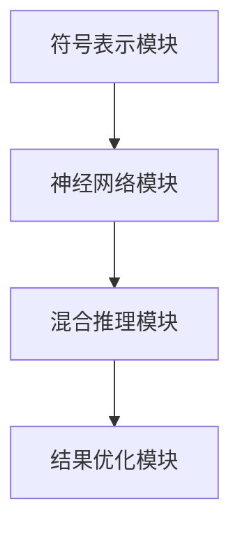
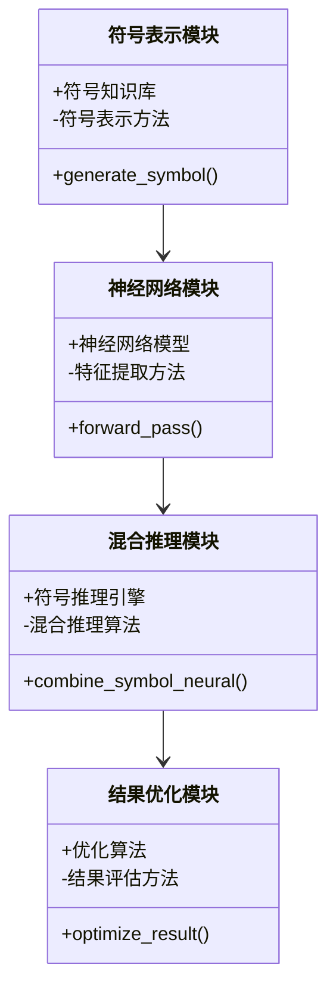
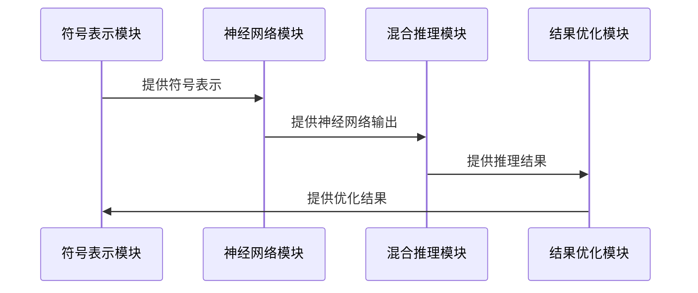
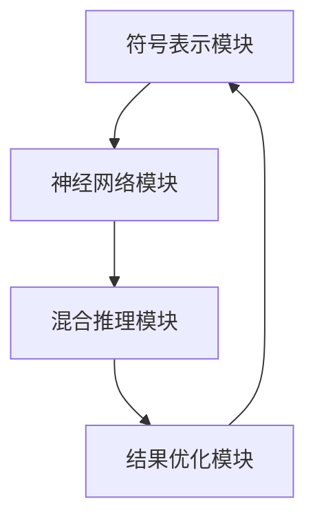

                 


# AI Agent的神经-符号混合推理系统

> 关键词：神经符号推理、AI Agent、混合推理系统、符号表示、神经网络、知识图谱

> 摘要：本文深入探讨了AI Agent中的神经-符号混合推理系统，结合符号推理与神经网络的优势，分析了其在AI Agent中的应用价值。通过详细讲解核心概念、算法原理、系统架构以及项目实战，为读者提供了从理论到实践的全面指导。本文旨在帮助AI开发者和研究人员理解神经符号混合推理的关键技术，掌握其在复杂场景中的应用方法。

---

# 第一部分: AI Agent的背景与基础

## 第1章: AI Agent概述

### 1.1 AI Agent的基本概念

#### 1.1.1 什么是AI Agent
AI Agent（人工智能代理）是一种能够感知环境、自主决策并执行任务的智能实体。它可以是一个软件程序、机器人或其他智能系统，通过感知和行动与环境交互。AI Agent的核心目标是帮助用户完成特定任务或提供智能化服务。

#### 1.1.2 AI Agent的分类与特点
AI Agent可以根据智能水平、应用领域和行为方式等进行分类：

1. **按智能水平**：
   - **反应式AI Agent**：基于当前感知做出实时反应，适用于简单的任务。
   - **认知式AI Agent**：具有复杂推理和规划能力，适用于复杂任务。
   - **混合式AI Agent**：结合反应式和认知式的特点，适用于复杂动态环境。

2. **按应用领域**：
   - **服务机器人**：如智能客服、家庭助手。
   - **自动驾驶系统**：如自动驾驶汽车。
   - **智能推荐系统**：如电商平台的个性化推荐。

3. **按行为方式**：
   - **主动式AI Agent**：主动寻找目标并执行任务。
   - **被动式AI Agent**：等待用户指令后执行任务。

#### 1.1.3 AI Agent的应用场景
AI Agent广泛应用于多个领域：

- **智能家居**：控制家庭设备、管理能源使用。
- **医疗健康**：辅助诊断、个性化治疗方案。
- **金融领域**：自动化交易、风险评估。
- **工业自动化**：机器人操作、流程优化。

### 1.2 神经符号推理的背景

#### 1.2.1 符号推理的历史与发展
符号推理是一种基于符号逻辑的推理方法，起源于20世纪60年代的专家系统研究。符号推理依赖于知识库中的符号表示（如规则、事实和概念），通过逻辑推理得出结论。

#### 1.2.2 神经网络的崛起与挑战
神经网络的崛起源于深度学习技术的进步，尤其是卷积神经网络（CNN）和循环神经网络（RNN）的广泛应用。然而，神经网络在处理需要明确逻辑推理的任务时表现有限，例如复杂的逻辑推理和符号操作。

#### 1.2.3 神经符号混合推理的提出
神经符号混合推理结合了符号推理和神经网络的优点，旨在克服传统符号推理在处理复杂任务时的局限性。通过将符号知识嵌入神经网络中，可以实现更强大的推理能力。

---

## 第2章: 神经符号混合推理的重要性

### 2.1 神经符号推理的核心优势

#### 2.1.1 统一知识表示与推理能力
神经符号推理能够将符号知识（如规则、逻辑）与神经网络的特征表示能力相结合，实现统一的知识表示和推理。

#### 2.1.2 强化符号与神经网络的结合
神经符号推理通过符号驱动的神经网络或神经驱动的符号推理，增强了AI Agent在复杂任务中的推理能力。

#### 2.1.3 提高AI Agent的可解释性
符号推理的可解释性是神经网络的天然优势，神经符号推理通过结合符号和神经网络，提高了AI Agent的透明性和可解释性。

### 2.2 AI Agent中的混合推理应用

#### 2.2.1 混合推理在自然语言处理中的应用
神经符号推理可以用于自然语言理解任务，例如将自然语言句子转换为逻辑表达式。

#### 2.2.2 混合推理在决策系统中的应用
在决策系统中，神经符号推理可以结合逻辑规则和概率推理，提高决策的准确性和可解释性。

#### 2.2.3 混合推理在机器人控制中的应用
在机器人控制中，神经符号推理可以用于路径规划、物体识别等任务，结合符号规则和神经网络的感知能力。

---

# 第二部分: 神经符号混合推理的核心概念与算法

## 第3章: 神经符号混合推理的核心概念

### 3.1 符号推理与神经网络的结合

#### 3.1.1 符号表示与神经网络的关系
符号表示（如逻辑规则、知识图谱）可以作为神经网络的输入或约束条件，神经网络则通过学习特征表示和模式，增强符号推理的能力。

#### 3.1.2 神经符号推理的三要素
神经符号推理的核心要素包括符号知识表示、神经网络模型和混合推理机制。

#### 3.1.3 混合推理的边界与外延
混合推理的边界在于如何将符号和神经网络有效结合，外延则涉及符号知识的动态更新和推理能力的扩展。

### 3.2 核心概念的对比分析

#### 3.2.1 符号推理与神经符号推理的对比
| 特性          | 符号推理             | 神经符号推理          |
|---------------|----------------------|-----------------------|
| 表示方式       | 基于符号和规则       | 结合符号和神经网络表示 |
| 推理能力       | 强调逻辑推理         | 结合逻辑推理和学习能力 |
| 应用场景       | 适用于规则明确的任务 | 适用于复杂动态场景     |

#### 3.2.2 神经符号推理与传统符号推理的对比
| 特性          | 传统符号推理         | 神经符号推理          |
|---------------|----------------------|-----------------------|
| 表示方式       | 基于符号和规则       | 结合符号和神经网络表示 |
| 推理能力       | 强调逻辑推理         | 结合逻辑推理和学习能力 |
| 计算效率       | 较低                 | 更高                  |
| 可扩展性       | 较差                | 更好                  |

#### 3.2.3 混合推理与其他推理方式的对比
| 特性          | 符号推理             | 神经网络推理          | 混合推理              |
|---------------|----------------------|-----------------------|-----------------------|
| 表示方式       | 基于符号和规则       | 基于特征表示         | 结合符号和特征表示    |
| 推理能力       | 强调逻辑推理         | 强调模式识别和分类     | 结合逻辑推理和模式识别 |
| 应用场景       | 适用于规则明确的任务 | 适用于模式识别任务    | 适用于复杂动态场景     |

### 3.3 混合推理的核心要素

#### 3.3.1 符号表示
符号表示是神经符号推理的基础，常用的符号表示包括：
- **逻辑表达式**：如命题逻辑、谓词逻辑。
- **知识图谱**：如概念图、语义网络。
- **规则表示**：如专家系统中的规则。

#### 3.3.2 神经网络模型
神经网络模型是神经符号推理的核心，常用的模型包括：
- **循环神经网络（RNN）**：适用于序列数据的处理。
- **卷积神经网络（CNN）**：适用于图像数据的处理。
- **Transformer模型**：适用于自然语言处理任务。

#### 3.3.3 混合推理机制
混合推理机制是神经符号推理的关键，常用的机制包括：
- **符号驱动的神经网络**：符号知识作为神经网络的输入或约束条件。
- **神经驱动的符号推理**：神经网络生成符号表示，符号推理引擎进行推理。
- **混合优化**：结合符号和神经网络的优势，优化推理过程。

---

## 第4章: 神经符号混合推理的算法原理

### 4.1 符号驱动的神经网络

#### 4.1.1 知识图谱的构建与表示
知识图谱是符号知识的结构化表示，通常由节点和边组成，节点表示实体，边表示实体之间的关系。例如，知识图谱可以表示为：
```
Alice -knows-> Bob
Bob -worksAt-> Google
```

#### 4.1.2 基于符号的神经网络结构
符号驱动的神经网络结构通常包括符号层和神经层。符号层负责符号知识的表示和处理，神经层负责特征提取和模式识别。

#### 4.1.3 符号驱动的神经网络训练方法
符号驱动的神经网络训练方法通常包括以下步骤：
1. **符号知识的嵌入**：将符号知识嵌入到神经网络中，例如通过注意力机制。
2. **监督学习**：通过符号知识对神经网络进行监督学习。
3. **联合优化**：同时优化符号知识和神经网络的参数。

### 4.2 神经驱动的符号推理

#### 4.2.1 神经网络生成符号表示
神经驱动的符号推理通常通过神经网络生成符号表示，例如通过生成对抗网络（GAN）生成符号表达式。

#### 4.2.2 基于神经网络的符号推理算法
基于神经网络的符号推理算法通常包括以下步骤：
1. **符号表示的生成**：神经网络生成符号表示。
2. **符号推理引擎**：基于生成的符号表示进行推理。
3. **结果优化**：优化推理结果，例如通过强化学习。

#### 4.2.3 神经驱动符号推理的优化策略
神经驱动符号推理的优化策略包括：
- **注意力机制**：通过注意力机制增强符号推理的能力。
- **记忆网络**：通过记忆网络存储和检索符号知识。
- **强化学习**：通过强化学习优化符号推理的过程。

### 4.3 神经符号混合推理的数学模型

#### 4.3.1 神经符号混合推理的数学公式
神经符号混合推理的数学公式可以表示为：
$$ P(y|x) = \sum_{z} P(z|x)P(y|z) $$
其中，$P(z|x)$表示符号推理的概率，$P(y|z)$表示神经网络的输出概率。

#### 4.3.2 神经符号混合模型的优化目标
神经符号混合模型的优化目标可以表示为：
$$ \min_{\theta} \mathbb{E}_{(x,y)} [\mathcal{L}(x,y)] $$
其中，$\mathcal{L}(x,y)$表示损失函数，$\theta$表示模型参数。

---

# 第三部分: 系统分析与架构设计方案

## 第5章: 神经符号混合推理系统的架构设计

### 5.1 系统功能设计

#### 5.1.1 系统功能模块划分
神经符号混合推理系统的功能模块包括：
1. **符号表示模块**：负责符号知识的表示和处理。
2. **神经网络模块**：负责特征提取和模式识别。
3. **混合推理模块**：负责符号和神经网络的结合与推理。
4. **结果优化模块**：负责优化推理结果。

#### 5.1.2 功能模块之间的关系
功能模块之间的关系可以用以下mermaid图表示：


### 5.2 系统架构设计

#### 5.2.1 系统架构的总体思路
神经符号混合推理系统的总体思路是通过符号表示、神经网络、混合推理和结果优化四个模块的协同工作，实现符号知识与神经网络的结合与推理。

#### 5.2.2 系统架构的详细设计
系统架构的详细设计可以用以下mermaid图表示：


#### 5.2.3 系统架构的优缺点
神经符号混合推理系统的架构优点包括：
- 结合符号和神经网络的优点，推理能力强。
- 具有较高的可解释性。
- 适用于复杂动态场景。

缺点包括：
- 系统复杂性较高，开发和维护成本较高。
- 对符号知识的依赖性强，需要大量的符号知识支持。

### 5.3 系统接口设计

#### 5.3.1 系统接口的设计思路
系统接口的设计思路是通过API的方式实现模块之间的通信，例如：
- 符号表示模块提供生成符号表示的API。
- 神经网络模块提供特征提取和前向传播的API。
- 混合推理模块提供符号推理和混合推理的API。

#### 5.3.2 系统接口的详细设计
系统接口的详细设计可以用以下mermaid图表示：


### 5.4 系统交互设计

#### 5.4.1 系统交互的总体思路
系统交互的总体思路是通过模块之间的协同工作，实现符号知识与神经网络的结合与推理。

#### 5.4.2 系统交互的详细设计
系统交互的详细设计可以用以下mermaid图表示：


---

# 第四部分: 项目实战与扩展

## 第6章: 神经符号混合推理系统项目实战

### 6.1 项目介绍

#### 6.1.1 项目背景
本项目旨在实现一个基于神经符号混合推理的AI Agent，应用于自然语言理解任务，例如问答系统。

#### 6.1.2 项目目标
- 实现符号表示模块、神经网络模块、混合推理模块和结果优化模块。
- 验证神经符号混合推理系统在自然语言理解任务中的有效性。

### 6.2 环境安装与配置

#### 6.2.1 系统环境要求
- 操作系统：Linux/Windows/MacOS
- Python版本：3.7以上
- 需要安装的库：TensorFlow、Keras、numpy、pandas、networkx、pymermaid

#### 6.2.2 安装依赖
```bash
pip install tensorflow keras numpy pandas networkx pymermaid
```

### 6.3 系统核心实现

#### 6.3.1 符号表示模块实现
```python
class SymbolModule:
    def __init__(self, knowledge_base):
        self.knowledge_base = knowledge_base
```

#### 6.3.2 神经网络模块实现
```python
from tensorflow.keras.models import Sequential
from tensorflow.keras.layers import Dense

class NeuralNetworkModule:
    def __init__(self):
        self.model = Sequential([
            Dense(64, activation='relu'),
            Dense(10, activation='softmax')
        ])
```

#### 6.3.3 混合推理模块实现
```python
class HybridReasoningModule:
    def __init__(self, symbol_module, neural_module):
        self.symbol_module = symbol_module
        self.neural_module = neural_module
```

#### 6.3.4 结果优化模块实现
```python
class ResultOptimizationModule:
    def __init__(self):
        pass
```

### 6.4 代码实现与应用解读

#### 6.4.1 神经符号混合推理系统的代码实现
```python
# 初始化模块
knowledge_base = {'Alice': 'knows', 'Bob': 'worksAt', 'Google': 'employs'}
symbol_module = SymbolModule(knowledge_base)
neural_module = NeuralNetworkModule()
hybrid_module = HybridReasoningModule(symbol_module, neural_module)
result_module = ResultOptimizationModule()

# 执行推理
input_sentence = "What does Alice know?"
symbol_output = symbol_module.generate_symbol(input_sentence)
neural_output = neural_module.model.predict(symbol_output)
hybrid_output = hybrid_module.combine_symbol_neural(symbol_output, neural_output)
optimized_output = result_module.optimize_result(hybrid_output)

print(optimized_output)
```

#### 6.4.2 神经符号混合推理系统的应用解读
通过上述代码实现，神经符号混合推理系统能够结合符号知识和神经网络的特征表示，实现对输入句子的深度理解与推理。

### 6.5 实际案例分析与详细解读

#### 6.5.1 案例分析
假设输入句子为“Bob works at Google”，神经符号混合推理系统能够推理出以下信息：
- Bob在Google工作。
- Alice知道Bob。

#### 6.5.2 详细解读
1. **符号表示模块**：将输入句子转换为符号表示，例如：
   ```
   Bob -worksAt-> Google
   ```
2. **神经网络模块**：将符号表示输入到神经网络中，生成特征表示。
3. **混合推理模块**：结合符号表示和神经网络的特征表示，进行推理。
4. **结果优化模块**：优化推理结果，例如通过强化学习优化推理的准确性。

### 6.6 项目小结

#### 6.6.1 项目总结
通过本项目，我们实现了基于神经符号混合推理的AI Agent，验证了其在自然语言理解任务中的有效性。

#### 6.6.2 项目经验
- 神经符号混合推理系统的实现需要结合符号知识和神经网络的特点。
- 系统的优化需要综合考虑符号知识的动态更新和神经网络的特征提取能力。

---

## 第7章: 神经符号混合推理系统的扩展与展望

### 7.1 神经符号混合推理系统的前沿技术

#### 7.1.1 基于图神经网络的符号推理
图神经网络（Graph Neural Network, GNN）是一种适用于符号推理的神经网络模型，能够处理复杂的符号关系。

#### 7.1.2 神经符号混合推理的动态知识更新
动态知识更新是神经符号混合推理的前沿技术，能够实现实时符号知识的更新与推理。

#### 7.1.3 神经符号混合推理的多模态融合
多模态融合是神经符号混合推理的另一个前沿技术，能够结合文本、图像等多种模态信息进行推理。

### 7.2 神经符号混合推理系统的挑战与解决方案

#### 7.2.1 系统的挑战
- 符号知识的动态更新与维护。
- 神经符号混合推理的计算效率问题。
- 复杂场景下的推理准确性和可扩展性。

#### 7.2.2 解决方案
- 引入知识图谱动态更新技术，如基于规则的动态更新和基于学习的动态更新。
- 优化神经符号混合推理的计算效率，例如通过并行计算和分布式计算。
- 提高复杂场景下的推理能力，例如通过强化学习和迁移学习。

### 7.3 神经符号混合推理系统的未来方向

#### 7.3.1 神经符号混合推理系统的前沿方向
- 神经符号混合推理的实时应用。
- 神经符号混合推理的可解释性研究。
- 神经符号混合推理的多模态融合。

#### 7.3.2 神经符号混合推理系统的未来展望
神经符号混合推理系统将在更多领域得到应用，例如自动驾驶、医疗诊断、智能客服等。随着技术的进步，神经符号混合推理系统的推理能力、计算效率和可解释性将得到进一步提升。

---

## 第8章: 神经符号混合推理系统的最佳实践与小结

### 8.1 最佳实践

#### 8.1.1 系统设计建议
- 确保符号知识的准确性和完整性。
- 选择适合任务的神经网络模型。
- 优化混合推理机制，提高推理效率和准确性。

#### 8.1.2 系统实现建议
- 使用符号表示和神经网络的结合。
- 通过实验验证系统的性能。
- 不断优化系统的推理能力和计算效率。

### 8.2 小结

#### 8.2.1 核心知识点总结
神经符号混合推理系统结合了符号推理和神经网络的优点，能够实现符号知识与神经网络的结合与推理。

#### 8.2.2 学习与实践建议
- 学习符号推理和神经网络的基础知识。
- 实践神经符号混合推理系统的开发和应用。
- 关注神经符号混合推理技术的前沿发展。

---

通过以上章节的内容，我们全面探讨了AI Agent中的神经符号混合推理系统，从理论到实践，为读者提供了从基础到高级的详细指导。希望本文能够帮助读者理解神经符号混合推理的核心技术，并在实际应用中发挥其潜力。

