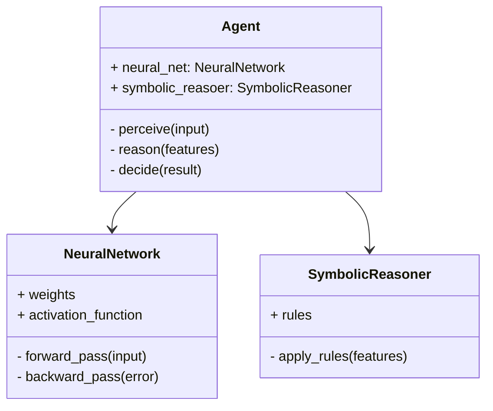
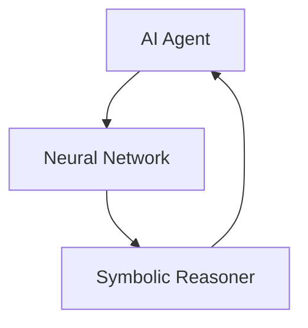
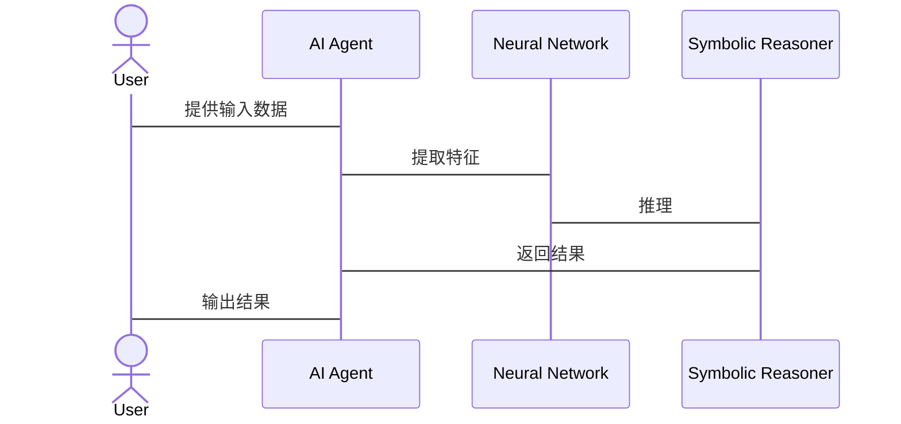

                 


# AI Agent的神经-符号混合推理系统

## 关键词：
- AI Agent
- 神经符号推理
- 混合推理系统
- 系统架构设计
- 算法实现

## 摘要：
本文详细探讨了AI Agent的神经-符号混合推理系统，从背景介绍到算法实现，系统地分析了神经符号推理的核心原理、系统架构设计、项目实战及最佳实践。文章通过丰富的案例分析和详细的代码实现，帮助读者深入理解这一前沿技术。

---

# 第一部分: AI Agent的神经-符号混合推理系统概述

## 第1章: AI Agent与神经-符号推理的背景介绍

### 1.1 问题背景

#### 1.1.1 传统符号推理的局限性
传统符号推理依赖于专家规则和逻辑推理，但面对复杂场景时，规则难以覆盖所有情况，且缺乏灵活性。

#### 1.1.2 神经网络推理的局限性
神经网络在处理图像和语言等感知任务上表现出色，但在需要明确逻辑推理的任务中，缺乏可解释性和灵活性。

#### 1.1.3 神经-符号混合推理的必要性
结合神经网络的感知能力与符号推理的逻辑能力，能够提升AI Agent在复杂任务中的表现。

### 1.2 问题描述

#### 1.2.1 AI Agent的核心任务
AI Agent需要在动态环境中做出决策，涉及感知、推理和行动。

#### 1.2.2 神经-符号推理的目标
构建一种混合系统，能够利用符号逻辑进行推理，同时结合神经网络的感知能力。

#### 1.2.3 系统设计的边界与外延
系统专注于推理模块的设计，不涉及感知和行动的具体实现。

### 1.3 问题解决

#### 1.3.1 神经-符号推理的解决方案
通过神经网络提取特征，符号推理进行逻辑推理，两者结合实现混合推理。

#### 1.3.2 系统架构的设计思路
分层设计：感知层、符号推理层、决策层。

### 1.4 概念结构与核心要素

#### 1.4.1 神经-符号推理的核心概念
- 神经网络：处理感知任务。
- 符号推理：处理逻辑任务。
- 混合推理：两者的结合。

#### 1.4.2 系统架构的组成要素
- 感知模块：图像识别、语音识别。
- 符号推理模块：逻辑推理。
- 决策模块：基于推理结果做出决策。

---

## 第2章: 神经-符号推理的核心概念与联系

### 2.1 神经符号推理的基本原理

#### 2.1.1 符号逻辑与神经网络的结合
神经网络用于特征提取，符号推理用于逻辑推理，两者结合实现端到端推理。

#### 2.1.2 神经网络的表示能力
神经网络擅长处理非结构化数据，如图像和文本。

#### 2.1.3 符号推理的可解释性
符号推理提供明确的逻辑规则，增强系统的可解释性。

### 2.2 算法原理与数学模型

#### 2.2.1 神经符号推理的数学模型
$$ f(x) = g(h(x)) $$
其中，$h(x)$是神经网络的输出，$g$是符号推理函数。

#### 2.2.2 神经网络与符号推理的联合优化
联合优化目标函数：
$$ \min_{\theta} \mathcal{L}(f(x), y) $$

#### 2.2.3 算法的收敛性分析
通过交替优化神经网络和符号推理模块，确保系统的收敛性。

### 2.3 核心概念的ER实体关系图

```mermaid
er
actor: AI Agent
goal: 推理目标
rule: 推理规则
fact: 输入事实
inference: 推理过程
result: 推理结果
```

---

## 第3章: 神经符号推理算法的实现

### 3.1 算法原理

#### 3.1.1 神经符号推理的算法步骤
1. 输入感知数据。
2. 神经网络提取特征。
3. 符号推理进行逻辑推理。
4. 输出推理结果。

#### 3.1.2 算法实现的数学模型
$$ f(x) = g(h(x)) $$

### 3.2 算法实现的代码示例

```python
class NeuralSymbolicAgent:
    def __init__(self):
        self.neural_net = NeuralNetwork()
        self.symbolic_reasoner = SymbolicReasoner()

    def perceive(self, input_data):
        features = self.neural_net.extract_features(input_data)
        return features

    def reason(self, features, rules):
        result = self.symbolic_reasoner.apply_rules(features, rules)
        return result

    def decide(self, result):
        action = self.decision_policy(result)
        return action
```

### 3.3 算法的优化与调优

#### 3.3.1 神经网络的优化
使用反向传播和梯度下降优化神经网络参数。

#### 3.3.2 符号推理的优化
通过逻辑规则的优化，提高推理效率。

---

## 第4章: 系统分析与架构设计

### 4.1 问题场景介绍

#### 4.1.1 问题场景描述
AI Agent需要在动态环境中进行推理和决策。

#### 4.1.2 问题分析
系统需要处理感知、推理和决策三个模块。

### 4.2 项目介绍

#### 4.2.1 项目目标
构建一个基于神经符号推理的AI Agent系统。

#### 4.2.2 项目范围
限定在推理模块的设计，不涉及感知和决策的具体实现。

### 4.3 系统功能设计

#### 4.3.1 系统功能模块
- 感知模块：图像识别。
- 符号推理模块：逻辑推理。
- 决策模块：基于推理结果做出决策。

#### 4.3.2 功能模块的ER类图



### 4.4 系统架构设计

#### 4.4.1 系统架构图



### 4.5 接口设计

#### 4.5.1 系统接口
- 输入接口：感知数据。
- 输出接口：推理结果。

#### 4.5.2 系统交互



---

## 第5章: 项目实战

### 5.1 环境安装

#### 5.1.1 环境配置
安装Python、TensorFlow、Keras等库。

#### 5.1.2 硬件配置
建议配置高性能GPU。

### 5.2 系统核心实现

#### 5.2.1 神经网络实现

```python
class NeuralNetwork:
    def __init__(self):
        self.weights = np.random.randn(2, 2)

    def forward_pass(self, input_data):
        return np.dot(input_data, self.weights)
```

#### 5.2.2 符号推理实现

```python
class SymbolicReasoner:
    def __init__(self):
        self.rules = [lambda x: x > 0.5]

    def apply_rules(self, features):
        result = []
        for feature in features:
            if any(rule(feature) for rule in self.rules):
                result.append(True)
            else:
                result.append(False)
        return result
```

### 5.3 代码应用解读

#### 5.3.1 神经网络代码解读
神经网络用于特征提取，输出特征向量。

#### 5.3.2 符号推理代码解读
符号推理根据特征向量应用规则，输出推理结果。

### 5.4 案例分析

#### 5.4.1 输入数据
输入图像数据，神经网络提取特征。

#### 5.4.2 推理过程
符号推理根据特征向量应用规则，输出推理结果。

### 5.5 项目小结

---

## 第6章: 最佳实践

### 6.1 小结

### 6.2 注意事项
- 神经网络的特征提取需准确。
- 符号推理规则需合理设计。

### 6.3 拓展阅读
推荐阅读相关领域的最新论文和技术博客。

---

## 结论

通过本文的详细讲解，读者可以全面理解AI Agent的神经-符号混合推理系统，从理论到实践，掌握系统的构建方法和优化技巧。

---

