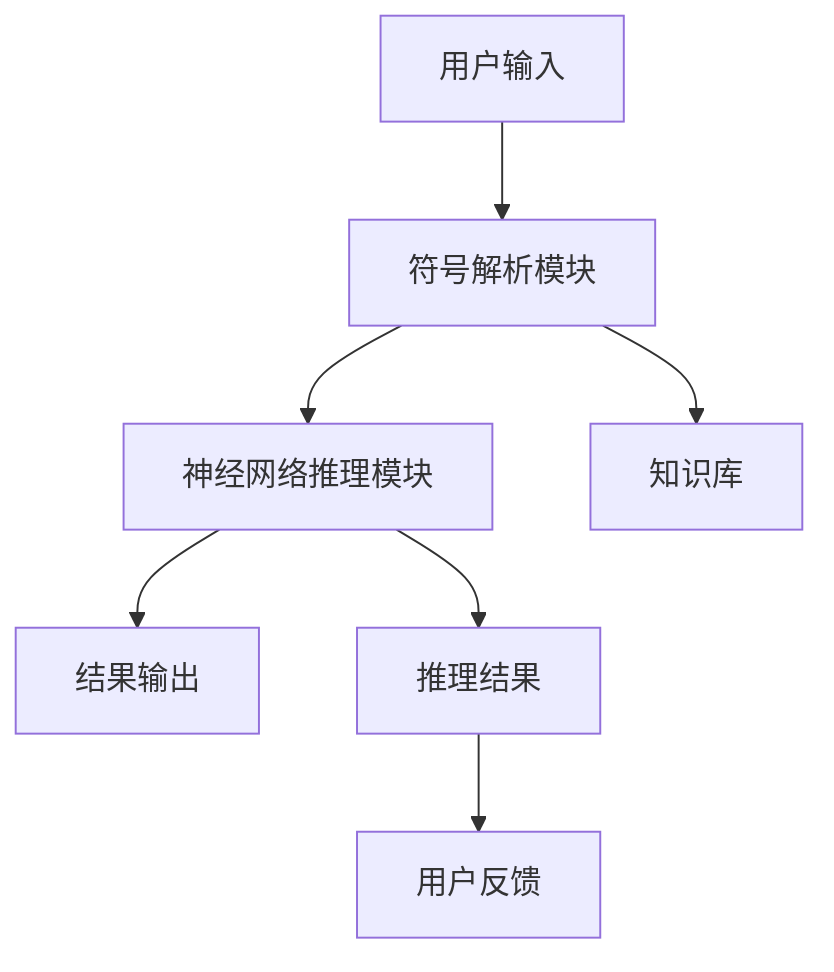
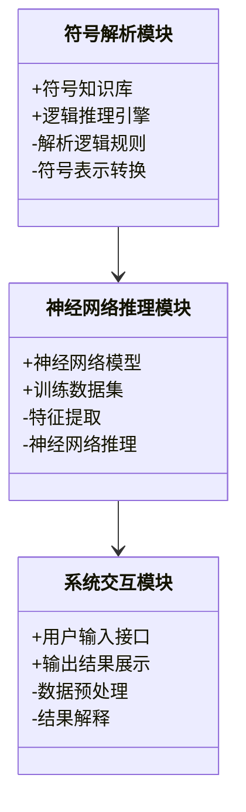
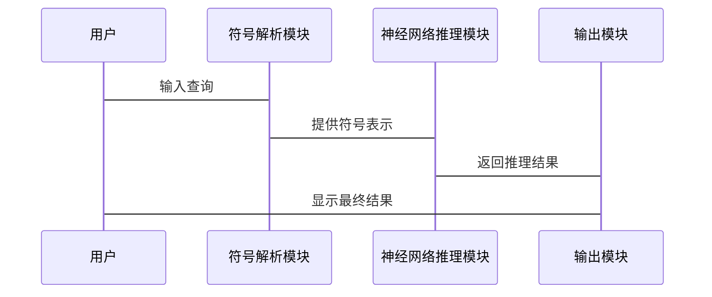

                 


# AI Agent的神经-符号混合架构实现

> 关键词：AI Agent, 神经符号, 混合架构, 逻辑推理, 神经网络

> 摘要：本文详细探讨了AI Agent的神经-符号混合架构的实现方法，从理论基础到算法原理，再到系统设计和项目实战，全面解析了神经符号混合架构的核心技术与应用。通过结合符号逻辑与神经网络的优势，本文为读者提供了一种高效、可解释的人工智能实现方案。

---

## 第三部分: 神经-符号混合架构的系统分析与架构设计

## 第5章: 系统架构设计

### 5.1 问题场景介绍
#### 5.1.1 问题背景与目标
#### 5.1.2 问题约束与边界
#### 5.1.3 问题需求与场景描述

### 5.2 系统功能设计
#### 5.2.1 领域模型设计
#### 5.2.2 模块划分与功能分配
#### 5.2.3 数据流与交互流程

### 5.3 系统架构设计
#### 5.3.1 系统架构图


#### 5.3.2 模块设计


### 5.4 系统接口设计
#### 5.4.1 接口定义
#### 5.4.2 接口交互流程
#### 5.4.3 接口实现细节

### 5.5 系统交互设计
#### 5.5.1 交互流程图


---

## 第6章: 项目实战

### 6.1 项目介绍
#### 6.1.1 项目背景
#### 6.1.2 项目目标
#### 6.1.3 项目技术选型

### 6.2 环境安装与配置
#### 6.2.1 系统环境要求
#### 6.2.2 软件安装与配置
#### 6.2.3 依赖库安装

### 6.3 核心代码实现
#### 6.3.1 符号解析模块实现
##### 6.3.1.1 知识库构建
```python
# 示例代码：符号知识库的构建
knowledge_base = {
    "符号规则": {
        "规则1": "输入必须满足的条件",
        "规则2": "符号与神经网络的接口规范"
    },
    "逻辑推理": {
        "前提1": "输入满足条件A",
        "前提2": "输入满足条件B",
        "结论": "输出结果为C"
    }
}
```

#### 6.3.1.2 逻辑推理实现
```python
# 示例代码：逻辑推理引擎
def logical_inference(knowledge_base, input):
    for rule in knowledge_base["符号规则"]:
        if rule.applied(input):
            return rule.result
    return None
```

#### 6.3.2 神经网络推理模块实现
##### 6.3.2.1 模型定义
```python
# 示例代码：神经网络模型定义
import tensorflow as tf

class NeuralSymbolicModel(tf.keras.Model):
    def __init__(self, input_dim, output_dim):
        super(NeuralSymbolicModel, self).__init__()
        self.symbolic_layer = SymbolicLayer(input_dim)
        self.neural_layer = tf.keras.layers.Dense(output_dim)
    
    def call(self, inputs):
        symbolic_features = self.symbolic_layer(inputs)
        outputs = self.neural_layer(symbolic_features)
        return outputs
```

##### 6.3.2.2 模型训练
```python
# 示例代码：神经网络模型训练
model = NeuralSymbolicModel(input_dim, output_dim)
optimizer = tf.keras.optimizers.Adam()
loss_function = tf.keras.losses.MeanSquaredError()

for epoch in epochs:
    for batch in batches:
        inputs, labels = batch
        with tf.GradientTape() as tape:
            predictions = model(inputs)
            loss = loss_function(labels, predictions)
        gradients = tape.gradient(loss, model.trainable_variables)
        optimizer.apply_gradients(model.trainable_variables, gradients)
```

### 6.4 代码应用解读与分析
#### 6.4.1 代码实现细节
#### 6.4.2 代码功能分析
#### 6.4.3 代码优化建议

### 6.5 实际案例分析
#### 6.5.1 案例背景
#### 6.5.2 数据准备
#### 6.5.3 模型训练
#### 6.5.4 模型推理
#### 6.5.5 结果分析

### 6.6 项目小结
#### 6.6.1 项目成果
#### 6.6.2 项目经验
#### 6.6.3 项目改进建议

---

## 第四部分: 最佳实践与未来展望

## 第7章: 最佳实践与小结

### 7.1 最佳实践
#### 7.1.1 神经符号混合架构的优化策略
#### 7.1.2 神经符号模型的训练技巧
#### 7.1.3 神经符号系统的部署与维护

### 7.2 小结
#### 7.2.1 核心知识点回顾
#### 7.2.2 知识拓展建议
#### 7.2.3 未来学习方向

## 第8章: 未来展望与研究方向

### 8.1 神经符号AI的未来发展趋势
#### 8.1.1 新型神经符号模型的研究
#### 8.1.2 神经符号模型的可解释性提升
#### 8.1.3 神经符号架构的跨领域应用

### 8.2 研究热点与挑战
#### 8.2.1 神经符号模型的计算效率优化
#### 8.2.2 神经符号系统的实时性提升
#### 8.2.3 神经符号模型的可扩展性研究

## 第9章: 拓展阅读与学习资源

### 9.1 相关书籍推荐
#### 《神经符号人工智能：理论与应用》
#### 《深度学习与符号推理的结合》
#### 《混合型人工智能系统的设计与实现》

### 9.2 网络资源与论文推荐
#### 神经符号AI领域的顶级论文
#### 开源项目与工具
#### 在线课程与培训资源

### 9.3 专业社区与技术博客
#### 神经符号AI的技术交流社区
#### 开源项目的GitHub仓库
#### 技术博客与文章合集

---

## 结语

通过本文的系统介绍，读者可以全面掌握AI Agent的神经-符号混合架构的核心技术与实现方法。从理论基础到算法原理，从系统设计到项目实战，本文为读者提供了一个完整的知识框架，帮助读者在实际应用中更好地设计和实现高效的神经符号混合架构。未来，随着技术的不断发展，神经符号AI将有更广阔的应用前景，值得我们深入研究和探索。

