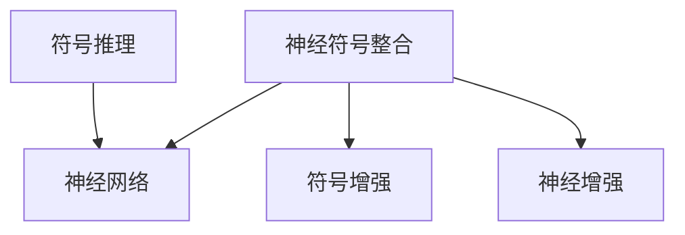
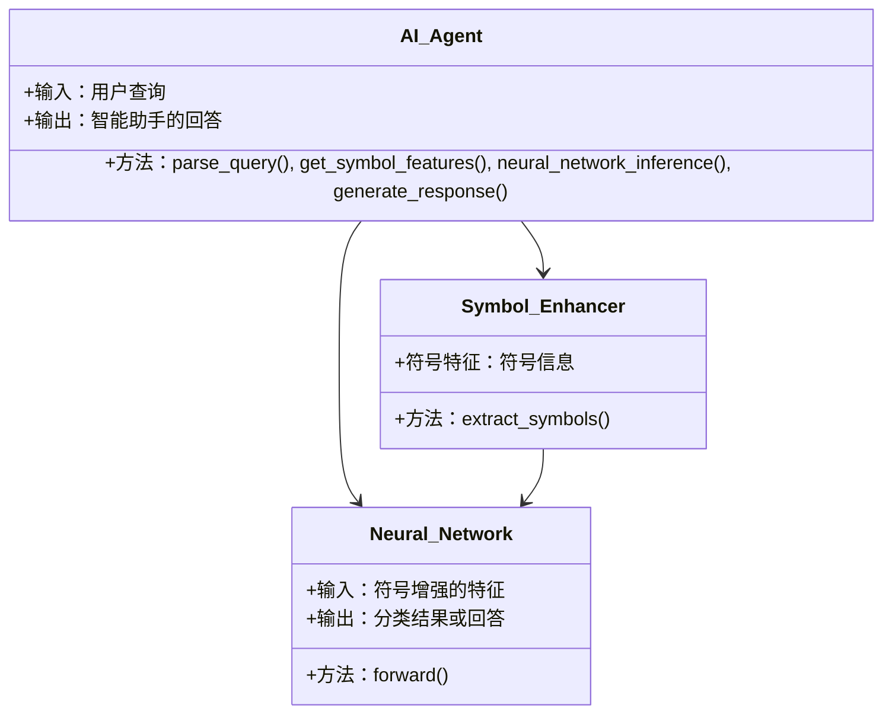
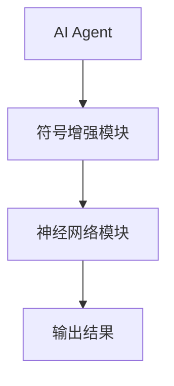
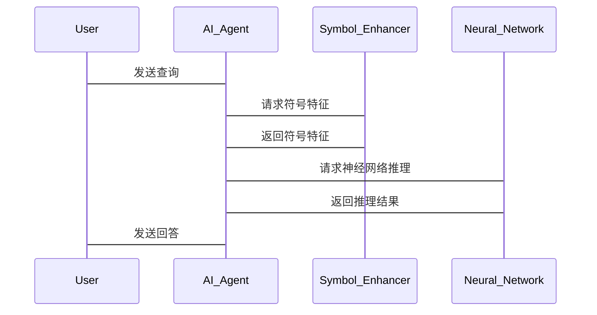

                 


# AI Agent的神经符号整合学习方法

> 关键词：AI Agent，神经符号整合，符号推理，神经网络，机器学习，知识图谱

> 摘要：本文详细探讨了AI Agent在神经符号整合学习方法中的应用，从核心概念到算法原理，再到系统架构和项目实战，全面解析神经符号整合学习的实现方式及其在AI Agent中的应用。通过本文，读者可以深入了解神经符号整合学习的理论基础、算法实现、系统设计和实际应用案例。

---

# 第一部分: AI Agent与神经符号整合学习的背景

## 第1章: AI Agent的基本概念

### 1.1 AI Agent的定义与特点

AI Agent（智能体）是指在计算机系统中，能够感知环境、自主决策并执行任务的实体。AI Agent可以是软件程序，也可以是机器人或其他智能设备。以下是AI Agent的主要特点：

- **自主性**：AI Agent能够在没有外部干预的情况下独立执行任务。
- **反应性**：AI Agent能够实时感知环境并做出相应的反应。
- **目标导向**：AI Agent的行为通常是为了实现特定的目标。
- **社交能力**：AI Agent能够与其他Agent或人类进行交互和协作。

### 1.2 AI Agent的应用场景

AI Agent广泛应用于多个领域，例如：

- **自动驾驶**：自动驾驶汽车中的AI Agent能够感知环境并做出驾驶决策。
- **智能助手**：如Siri、Alexa等，能够理解和执行用户的指令。
- **推荐系统**：基于用户行为和偏好，推荐个性化的内容或产品。
- **机器人协作**：多个AI Agent可以协作完成复杂的任务，如工厂中的机器人协作生产。

### 1.3 神经符号整合学习的必要性

尽管AI Agent在许多领域取得了成功，但传统的神经网络和符号推理方法各有其局限性：

- **符号推理的局限性**：符号推理方法（如逻辑推理）在处理复杂或模糊问题时表现不佳，且难以从数据中学习。
- **神经网络的局限性**：神经网络在处理符号推理任务时，难以解释其决策过程，且容易受到训练数据偏差的影响。

因此，神经符号整合学习方法应运而生，旨在结合符号推理和神经网络的优势，克服各自的局限性。

---

## 第2章: 神经符号整合学习的背景

### 2.1 符号推理与神经网络的结合

神经符号整合学习方法的核心思想是将符号推理和神经网络结合起来，利用符号推理的可解释性和神经网络的强大学习能力，解决复杂问题。

#### 2.1.1 符号推理的基本原理

符号推理是基于符号逻辑的一种推理方法，通常使用规则和逻辑推理来处理问题。例如，符号推理可以用于知识图谱的构建和推理。

#### 2.1.2 神经网络的基本原理

神经网络是一种机器学习模型，通过多层神经元网络来学习数据的特征和模式。神经网络在图像识别、自然语言处理等领域表现优异。

#### 2.1.3 神经符号整合学习的实现方式

神经符号整合学习可以通过以下方式实现：

- **符号增强的神经网络**：将符号推理的结果作为神经网络的输入特征，增强神经网络的表达能力。
- **符号驱动的注意力机制**：在神经网络中引入符号推理的注意力机制，用于处理符号信息。

### 2.2 神经符号整合学习的核心问题

神经符号整合学习的核心问题是如何有效地结合符号推理和神经网络，使其能够在复杂任务中协同工作。

#### 2.2.1 问题背景与问题描述

传统符号推理方法难以处理复杂任务，而神经网络在符号推理任务中表现不佳，因此需要一种新的方法来结合两者的优点。

#### 2.2.2 神经符号整合学习的目标

神经符号整合学习的目标是通过结合符号推理和神经网络，提高AI Agent在复杂任务中的表现，同时保持可解释性和灵活性。

#### 2.2.3 神经符号整合学习的边界与外延

神经符号整合学习的边界包括符号推理和神经网络的结合方式，以及其在AI Agent中的应用范围。其外延则包括符号增强的神经网络、符号驱动的注意力机制等。

---

## 第3章: 神经符号整合学习的核心概念

### 3.1 神经符号整合学习的核心概念

神经符号整合学习的核心概念包括符号推理和神经网络的结合方式，符号推理的可解释性和神经网络的强大学习能力。

#### 3.1.1 符号推理的特征分析

符号推理的特征包括：

- **可解释性**：符号推理的结果可以被人类理解和解释。
- **灵活性**：符号推理可以根据任务需求灵活调整推理规则。
- **局限性**：符号推理在处理复杂或模糊问题时表现不佳。

#### 3.1.2 神经网络的特征分析

神经网络的特征包括：

- **强大学习能力**：神经网络能够从大量数据中学习复杂的模式。
- **不可解释性**：神经网络的决策过程通常难以解释。
- **数据依赖性**：神经网络的表现依赖于训练数据的质量和数量。

#### 3.1.3 神经符号整合学习的特征分析

神经符号整合学习的特征包括：

- **结合优势**：结合符号推理的可解释性和神经网络的强大学习能力。
- **灵活性与可解释性**：在保持灵活性的同时，提供可解释的决策过程。
- **复杂任务处理能力**：能够处理传统符号推理和神经网络难以处理的复杂任务。

### 3.2 神经符号整合学习的ER实体关系架构

以下是神经符号整合学习的ER实体关系架构图：



---

## 第4章: 神经符号整合学习的算法原理

### 4.1 符号增强的神经网络

#### 4.1.1 算法流程

符号增强的神经网络的算法流程如下：

1. **输入数据**：输入原始数据（如图像、文本等）。
2. **符号特征提取**：从输入数据中提取符号特征（如图像中的物体类别）。
3. **神经网络处理**：将符号特征作为神经网络的输入，进行特征提取和分类。
4. **输出结果**：输出最终的分类结果。

#### 4.1.2 算法实现

以下是符号增强的神经网络的Python实现示例：

```python
import torch
import torch.nn as nn
import torch.optim as optim

# 定义符号特征提取函数
def extract_symbols(input):
    symbols = []
    # 假设input是图像数据
    # 从图像中提取符号特征（如物体类别）
    # 这里简化为从图像中提取一个类别标签
    with torch.no_grad():
        symbol_classifier = nn.Sequential(nn.Conv2d(3, 64, kernel_size=3, padding=1),
                                           nn.ReLU(),
                                           nn.Conv2d(64, 128, kernel_size=3, padding=1),
                                           nn.ReLU(),
                                           nn.AdaptiveAvgPool2d((1,1)),
                                           nn.Flatten(),
                                           nn.Linear(128, 10))
        symbol_classifier.eval()
        symbol_logits = symbol_classifier(input)
        _, predicted = torch.max(symbol_logits.data, 1)
        symbols = predicted.tolist()
    return symbols

# 定义符号增强的神经网络
class SymbolEnhancedNN(nn.Module):
    def __init__(self, input_size, hidden_size, output_size):
        super(SymbolEnhancedNN, self).__init__()
        self.fc1 = nn.Linear(input_size, hidden_size)
        self.fc2 = nn.Linear(hidden_size + 1, output_size)  # 增加一个符号特征输入
        self.relu = nn.ReLU()
        self.softmax = nn.Softmax(dim=1)
    
    def forward(self, x, symbols):
        x = self.fc1(x)
        x = self.relu(x)
        # 将符号特征嵌入到输入中
        symbol_embedding = torch.nn.functional.embedding(symbols, torch.randn(len(symbols), 1))
        x = torch.cat((x, symbol_embedding), dim=1)
        x = self.fc2(x)
        x = self.relu(x)
        x = self.softmax(x)
        return x

# 训练符号增强的神经网络
def train_symbol_enhanced_nn(train_loader, test_loader, input_size, hidden_size, output_size, num_epochs=10):
    model = SymbolEnhancedNN(input_size, hidden_size, output_size)
    criterion = nn.CrossEntropyLoss()
    optimizer = optim.Adam(model.parameters(), lr=0.001)
    
    for epoch in range(num_epochs):
        for batch_features, batch_labels, batch_symbols in train_loader:
            outputs = model(batch_features, batch_symbols)
            loss = criterion(outputs, batch_labels)
            loss.backward()
            optimizer.step()
            model.zero_grad()
        # 验证
        with torch.no_grad():
            correct = 0
            total = 0
            for val_features, val_labels, val_symbols in test_loader:
                outputs = model(val_features, val_symbols)
                _, predicted = torch.max(outputs.data, 1)
                total += val_labels.size(0)
                correct += (predicted == val_labels).sum().item()
            accuracy = correct / total
            print(f'Epoch [{epoch+1}/{num_epochs}], Accuracy: {accuracy*100}%')
```

#### 4.1.3 算法原理的数学模型和公式

符号增强的神经网络的数学模型如下：

$$
y = f(x, s)
$$

其中，\( x \) 是输入数据，\( s \) 是符号特征，\( f \) 是神经网络的前向传播函数。

#### 4.1.4 举例说明

例如，在图像分类任务中，符号特征可以是图像中的物体类别。符号增强的神经网络将物体类别嵌入到输入数据中，从而提高分类准确率。

---

## 第5章: 神经符号驱动的注意力机制

### 5.1 神经符号驱动的注意力机制

神经符号驱动的注意力机制是一种结合符号推理和注意力机制的方法，用于处理符号信息。

#### 5.1.1 注意力机制的基本原理

注意力机制是一种选择性关注输入数据中重要部分的机制，广泛应用于自然语言处理和计算机视觉领域。

#### 5.1.2 神经符号驱动的注意力机制的实现

神经符号驱动的注意力机制可以通过以下步骤实现：

1. **符号特征提取**：从输入数据中提取符号特征。
2. **注意力权重计算**：根据符号特征计算注意力权重。
3. **注意力应用**：将注意力权重应用于输入数据，得到最终的注意力输出。

#### 5.1.3 举例说明

例如，在机器翻译任务中，神经符号驱动的注意力机制可以根据源语言句子的语法结构（符号特征）计算注意力权重，从而提高翻译质量。

---

## 第6章: 神经符号整合学习的系统架构设计

### 6.1 问题场景介绍

考虑一个智能助手AI Agent的任务场景，AI Agent需要理解用户的自然语言查询，并结合知识图谱中的符号信息进行推理和回答。

### 6.2 系统功能设计

以下是系统功能设计的类图：



### 6.3 系统架构设计

以下是系统架构设计的架构图：



### 6.4 系统接口设计

以下是系统接口设计的交互序列图：



---

## 第7章: 项目实战

### 7.1 环境安装

为了运行以下代码，需要安装以下Python库：

- `torch`
- `numpy`
- `mermaid`

可以使用以下命令安装：

```bash
pip install torch numpy mermaid
```

### 7.2 核心代码实现

以下是符号增强的神经网络实现代码：

```python
import torch
import torch.nn as nn
import torch.optim as optim
import numpy as np

# 定义符号特征提取函数
def extract_symbols(input):
    symbols = []
    # 假设input是图像数据
    # 从图像中提取符号特征（如物体类别）
    # 这里简化为从图像中提取一个类别标签
    with torch.no_grad():
        symbol_classifier = nn.Sequential(nn.Conv2d(3, 64, kernel_size=3, padding=1),
                                           nn.ReLU(),
                                           nn.Conv2d(64, 128, kernel_size=3, padding=1),
                                           nn.ReLU(),
                                           nn.AdaptiveAvgPool2d((1,1)),
                                           nn.Flatten(),
                                           nn.Linear(128, 10))
        symbol_classifier.eval()
        symbol_logits = symbol_classifier(input)
        _, predicted = torch.max(symbol_logits.data, 1)
        symbols = predicted.tolist()
    return symbols

# 定义符号增强的神经网络
class SymbolEnhancedNN(nn.Module):
    def __init__(self, input_size, hidden_size, output_size):
        super(SymbolEnhancedNN, self).__init__()
        self.fc1 = nn.Linear(input_size, hidden_size)
        self.fc2 = nn.Linear(hidden_size + 1, output_size)  # 增加一个符号特征输入
        self.relu = nn.ReLU()
        self.softmax = nn.Softmax(dim=1)
    
    def forward(self, x, symbols):
        x = self.fc1(x)
        x = self.relu(x)
        # 将符号特征嵌入到输入中
        symbol_embedding = torch.nn.functional.embedding(symbols, torch.randn(len(symbols), 1))
        x = torch.cat((x, symbol_embedding), dim=1)
        x = self.fc2(x)
        x = self.relu(x)
        x = self.softmax(x)
        return x

# 训练符号增强的神经网络
def train_symbol_enhanced_nn(train_loader, test_loader, input_size, hidden_size, output_size, num_epochs=10):
    model = SymbolEnhancedNN(input_size, hidden_size, output_size)
    criterion = nn.CrossEntropyLoss()
    optimizer = optim.Adam(model.parameters(), lr=0.001)
    
    for epoch in range(num_epochs):
        for batch_features, batch_labels, batch_symbols in train_loader:
            outputs = model(batch_features, batch_symbols)
            loss = criterion(outputs, batch_labels)
            loss.backward()
            optimizer.step()
            model.zero_grad()
        # 验证
        with torch.no_grad():
            correct = 0
            total = 0
            for val_features, val_labels, val_symbols in test_loader:
                outputs = model(val_features, val_symbols)
                _, predicted = torch.max(outputs.data, 1)
                total += val_labels.size(0)
                correct += (predicted == val_labels).sum().item()
            accuracy = correct / total
            print(f'Epoch [{epoch+1}/{num_epochs}], Accuracy: {accuracy*100}%')
```

### 7.3 代码应用解读与分析

以上代码实现了一个符号增强的神经网络，能够将符号特征嵌入到输入数据中，从而提高分类准确率。代码包括符号特征提取、符号增强的神经网络定义和训练函数。

### 7.4 实际案例分析

假设我们有一个图像分类任务，任务目标是识别图像中的物体类别。符号增强的神经网络可以从图像中提取物体类别作为符号特征，并将其嵌入到神经网络中，从而提高分类准确率。

### 7.5 项目小结

通过以上代码和案例分析，我们可以看到符号增强的神经网络能够在传统神经网络的基础上，结合符号推理的优势，提高模型的性能和可解释性。

---

## 第8章: 最佳实践

### 8.1 小结

神经符号整合学习方法结合了符号推理和神经网络的优点，能够提高AI Agent在复杂任务中的表现。

### 8.2 注意事项

- 神经符号整合学习方法需要结合具体任务需求进行设计。
- 符号特征的提取和神经网络的设计需要仔细调参和优化。
- 神经符号整合学习方法的实现需要考虑计算资源和效率问题。

### 8.3 拓展阅读

- 神经符号整合学习的最新研究进展。
- 神经符号整合学习在自然语言处理中的应用。
- 神经符号整合学习在计算机视觉中的应用。

---

# 结语

通过本文的详细讲解，读者可以深入了解神经符号整合学习方法的核心概念、算法原理、系统架构和实际应用。神经符号整合学习方法为AI Agent在复杂任务中的应用提供了新的思路和方法，未来的研究可以进一步探索其在更多领域的应用。

--- 

以上是《AI Agent的神经符号整合学习方法》的完整目录和内容框架，您可以根据需要进一步扩展和细化各章节的内容。

