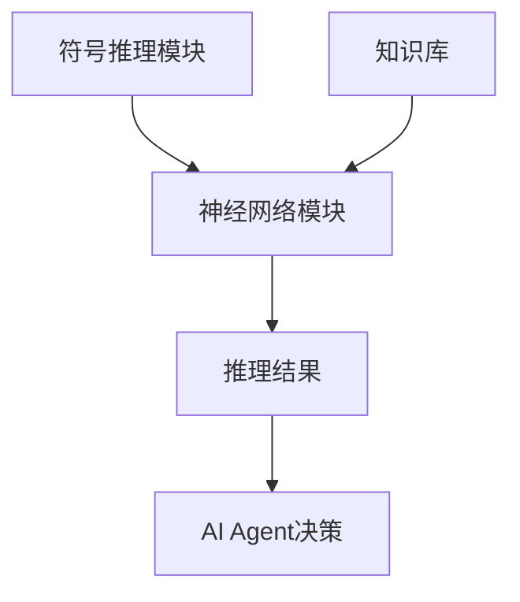
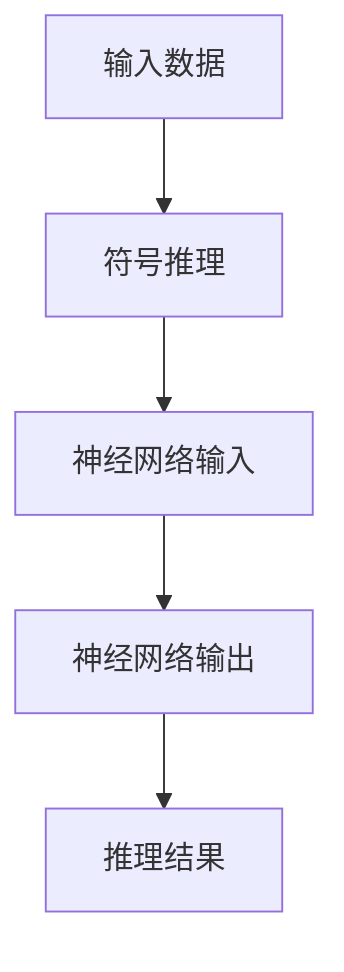
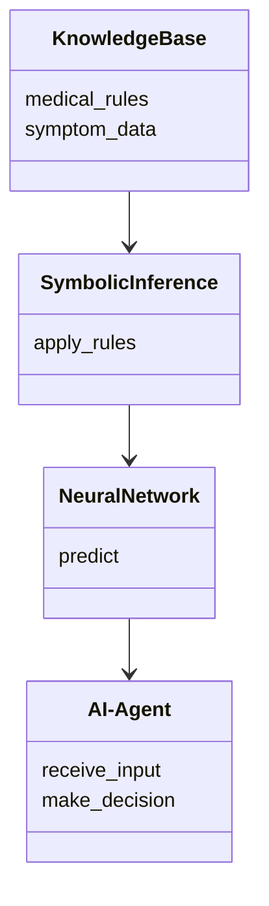
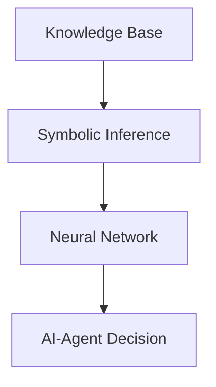
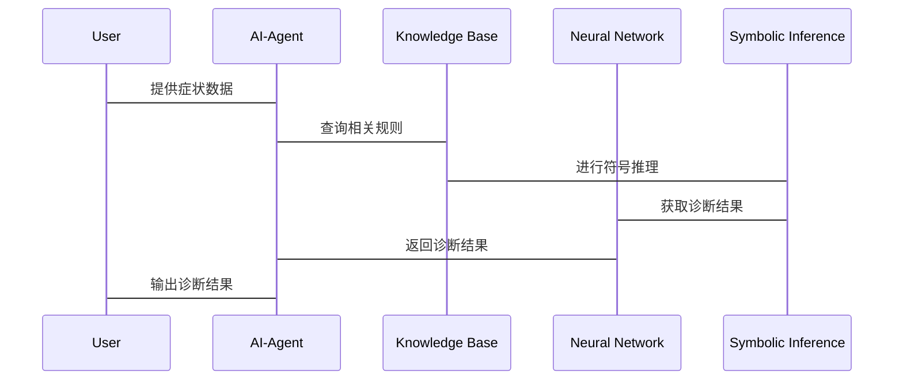

                 


# AI Agent的神经符号集成学习方法

> 关键词：AI Agent，神经符号集成学习，符号推理，神经网络，机器学习

> 摘要：本文探讨AI Agent结合神经符号集成学习的方法，分析其核心概念、算法原理、系统架构，并通过案例展示实际应用，最后总结其优势与未来发展方向。

---

## 第1章: AI Agent与神经符号集成学习的背景介绍

### 1.1 问题背景与问题描述

#### 1.1.1 AI Agent的发展现状
AI Agent，即人工智能代理，是一种能够感知环境并采取行动以实现目标的智能系统。当前，AI Agent在自然语言处理、计算机视觉等领域取得了显著进展，但仍面临处理复杂符号推理任务的挑战。

#### 1.1.2 神经符号集成学习的必要性
现有AI Agent主要依赖神经网络，但在处理需要逻辑推理的任务时表现不足。神经符号集成学习结合神经网络的学习能力和符号推理的逻辑能力，提供了一种新的解决方案。

#### 1.1.3 当前技术的局限性与挑战
传统神经网络难以处理符号逻辑，而符号推理在动态环境中的表现受限。神经符号集成学习旨在弥补这一差距，提升AI Agent的综合能力。

### 1.2 问题解决与边界外延

#### 1.2.1 神经符号集成学习的核心目标
通过结合神经网络和符号推理，提高AI Agent在复杂任务中的处理能力，如推理、决策和规划。

#### 1.2.2 AI Agent的边界与外延
AI Agent专注于特定任务，边界包括感知和行动范围。外延涉及与其他系统的协作和数据源的多样性。

#### 1.2.3 神经符号集成学习的适用场景与限制
适用于需要逻辑推理和数据学习的任务，如医疗诊断和自动驾驶，但在大规模数据和复杂环境中的性能仍需提升。

### 1.3 概念结构与核心要素

#### 1.3.1 神经符号集成学习的组成要素
- 神经网络模块：负责数据学习和模式识别。
- 符号推理模块：处理逻辑推理和符号操作。
- 知识库：存储领域知识，支持推理。

#### 1.3.2 AI Agent的核心功能模块
- 感知模块：处理环境输入。
- 决策模块：基于推理结果做出决策。
- 执行模块：执行具体动作。

#### 1.3.3 神经符号集成学习与AI Agent的交互关系
神经符号集成学习作为AI Agent的核心，连接感知和决策模块，通过符号推理提升决策的逻辑性，通过神经网络增强数据处理能力。

---

## 第2章: 神经符号集成学习的核心概念与联系

### 2.1 神经符号学习的原理

#### 2.1.1 符号推理的基本原理
符号推理基于逻辑规则，将符号表示转换为推理结果，常用于规则明确的领域，如专家系统。

#### 2.1.2 神经网络的基本原理
神经网络通过训练数据学习特征，处理非结构化数据，适用于模式识别和预测任务。

#### 2.1.3 神经符号集成学习的整合方式
通过符号推理模块和神经网络模块协作，前者处理逻辑推理，后者处理数据学习，共同提升系统性能。

### 2.2 核心概念的属性特征对比

| 属性        | 符号推理                  | 神经网络                  |
|-------------|--------------------------|--------------------------|
| 数据类型     | 符号、规则               | 非结构化数据（图像、文本）|
| 学习方式     | 基于规则                | 基于数据的模式学习        |
| 处理任务     | 逻辑推理                | 模式识别、预测            |
| 优点         | 高透明性、可解释性       | 强大表示能力、自动特征提取 |
| 局限性       | 需明确规则、适应性差     | 需大量数据、解释性差      |

#### 2.2.1 AI Agent中的符号与神经网络结合的优势
结合符号推理的可解释性和神经网络的泛化能力，提升AI Agent在复杂任务中的表现。

### 2.3 ER实体关系图架构



---

## 第3章: 神经符号集成学习的算法原理

### 3.1 算法原理概述

#### 3.1.1 神经符号集成学习的基本流程
1. 符号推理模块处理符号数据，生成中间结果。
2. 神经网络模块处理中间结果，生成最终输出。

#### 3.1.2 神经网络与符号推理的结合方式
神经网络作为符号推理的特征提取器，符号推理提供推理约束。

#### 3.1.3 算法的数学模型与公式
符号推理模块：逻辑规则表示为谓词逻辑公式。
神经网络模块：基于符号特征的分类任务，损失函数定义为交叉熵损失。

### 3.2 算法流程



#### 3.2.1 算法实现步骤
1. 输入符号数据和非符号数据。
2. 符号推理模块生成中间符号表达。
3. 神经网络模块处理中间符号，输出结果。
4. 反向传播更新参数。

#### 3.2.2 代码实现示例

```python
# 符号推理模块
def symbolic_inference(rules, input_data):
    # 根据规则进行推理
    result = apply_rules(rules, input_data)
    return result

# 神经网络模块
def neural_network(input_features):
    model = build_model()
    output = model.predict(input_features)
    return output

# 综合推理
def neural-symbolic_learn(rules, input_data):
    symbols = symbolic_inference(rules, input_data)
    output = neural_network(symbols)
    return output

# 示例
rules = [rule1, rule2, rule3]
input_data = [data1, data2, data3]
result = neural-symbolic_learn(rules, input_data)
print(result)
```

### 3.3 算法的数学模型与公式

符号推理模块的逻辑规则表示为：
$$
\text{符号推理结果} = \bigwedge_{i} (f_i(x) \leq y_i)
$$

神经网络模块的损失函数：
$$
L = -\sum_{i} y_i \log(p_i) + (1 - y_i) \log(1 - p_i)
$$

---

## 第4章: AI Agent的系统架构设计

### 4.1 问题场景介绍

#### 4.1.1 系统介绍
设计一个医疗诊断AI Agent，结合神经符号集成学习，分析症状和医学知识。

### 4.2 系统功能设计

#### 4.2.1 领域模型设计



#### 4.2.2 系统架构设计



#### 4.2.3 系统接口设计
- 输入接口：接收症状数据。
- 输出接口：输出诊断结果。

### 4.3 交互设计



---

## 第5章: 项目实战

### 5.1 环境安装

```bash
pip install numpy tensorflow mermaid matplotlib
```

### 5.2 核心代码实现

#### 5.2.1 知识库构建

```python
class KnowledgeBase:
    def __init__(self, rules):
        self.rules = rules

    def get_rules(self):
        return self.rules
```

#### 5.2.2 符号推理模块

```python
class SymbolicInference:
    def __init__(self, knowledge_base):
        self.kb = knowledge_base

    def infer(self, input_data):
        rules = self.kb.get_rules()
        result = apply_rules(rules, input_data)
        return result
```

#### 5.2.3 神经网络模块

```python
class NeuralNetwork:
    def __init__(self, input_shape):
        self.model = self.build_model(input_shape)

    def build_model(self, input_shape):
        # 定义神经网络模型
        return model

    def predict(self, input_features):
        return self.model.predict(input_features)
```

### 5.3 案例分析

#### 5.3.1 案例选择
医疗诊断场景，输入症状数据，结合医学知识进行诊断。

#### 5.3.2 分析与解读
符号推理模块应用医学规则，神经网络模块分析症状数据，最终输出诊断结果。

### 5.4 项目小结

---

## 第6章: 最佳实践、小结、注意事项和拓展阅读

### 6.1 最佳实践 tips

- 数据质量：确保知识库的准确性和完整性。
- 模型选择：根据任务需求选择合适的符号推理和神经网络组合。
- 可解释性：符号推理提供可解释性，神经网络增强结果的准确性。

### 6.2 小结

神经符号集成学习为AI Agent提供了强大的推理和学习能力，结合符号推理的逻辑性和神经网络的学习能力，适用于复杂任务。

### 6.3 注意事项

- 确保符号推理规则的准确性和适用性。
- 神经网络模块需要大量数据支持，防止过拟合。
- 系统设计时考虑模块间的高效协作。

### 6.4 拓展阅读

- 神经符号学习的最新研究。
- AI Agent在不同领域的应用案例。
- 组合算法的优化方法。

---

## 总结

本文详细探讨了AI Agent结合神经符号集成学习的方法，从背景到实现，从系统设计到项目实战，全面解析了这一技术的核心和应用。通过神经符号集成学习，AI Agent能够更高效地处理复杂任务，未来将拓展更多应用场景，推动人工智能技术的发展。

