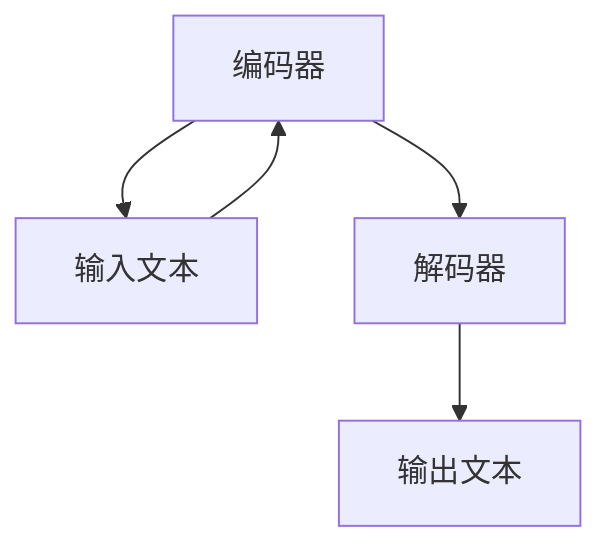
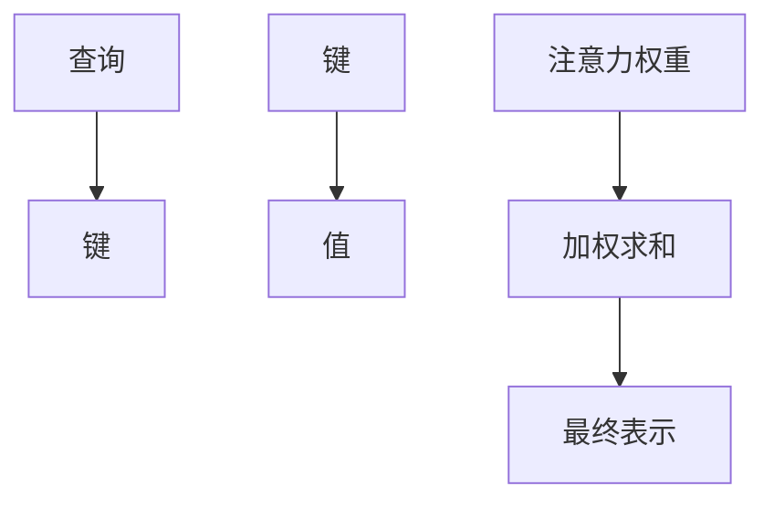
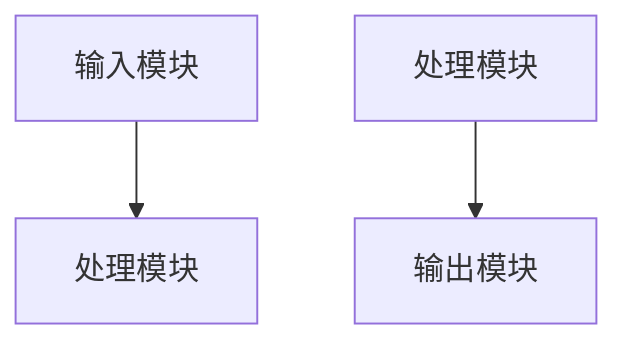
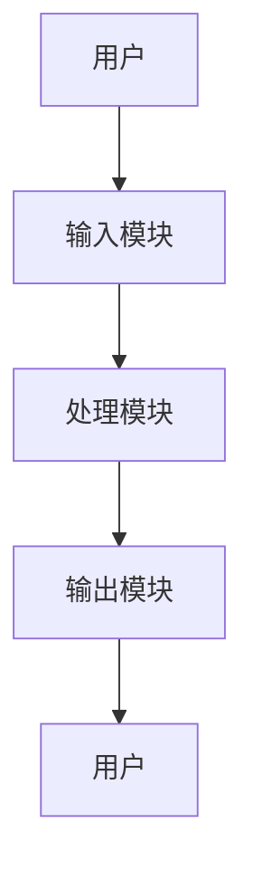

                 


# AI Agent的精确语言生成：细粒度控制LLM的输出质量

> 关键词：AI Agent, 大语言模型, 语言生成, 输出质量, 细粒度控制, LLM

> 摘要：AI Agent通过细粒度控制大语言模型（LLM）的输出质量，实现精确的语言生成。本文从AI Agent与LLM的基本概念出发，分析LLM的内部机制，探讨细粒度控制的方法，结合系统架构与项目实战，总结最佳实践，展望未来发展方向。

---

# 第一部分: AI Agent与大语言模型基础

## 第1章: AI Agent与大语言模型概述

### 1.1 AI Agent的基本概念

#### 1.1.1 AI Agent的定义
AI Agent（人工智能代理）是一种智能实体，能够感知环境、自主决策并执行任务。它可以是软件程序或物理设备，具备以下核心特征：
- **自主性**：无需外部干预，自主决策。
- **反应性**：能感知环境变化并实时响应。
- **目标导向**：以实现特定目标为导向。
- **学习能力**：通过经验或数据改进性能。

#### 1.1.2 AI Agent的核心特征
| 特征 | 描述 |
|------|------|
| 自主性 | 能够独立决策和行动。 |
| 反应性 | 能够感知环境并实时响应。 |
| 目标导向 | 以实现特定目标为导向。 |
| 学习能力 | 通过经验或数据优化性能。 |

#### 1.1.3 AI Agent与传统程序的区别
| 方面 | 传统程序 | AI Agent |
|------|----------|----------|
| 行为驱动 | 基于预设规则 | 基于目标和环境反馈 |
| 感知能力 | 无 | 具备感知能力 |
| 学习能力 | 无 | 具备学习能力 |

### 1.2 大语言模型的基本概念

#### 1.2.1 大语言模型的定义
大语言模型（Large Language Model, LLM）是基于深度学习的自然语言处理模型，具有以下特点：
- **大规模**：通常使用千亿级别的参数。
- **多任务能力**：能处理多种语言任务（如翻译、问答、文本生成）。
- **上下文理解**：能够捕捉文本的上下文信息。

#### 1.2.2 大语言模型的典型特点
| 特点 | 描述 |
|------|------|
| 大规模 | 参数量通常超过10亿。 |
| 多任务 | 能够处理多种语言任务。 |
| 上下文理解 | 能理解文本的上下文关系。 |

#### 1.2.3 大语言模型的训练机制
大语言模型通常采用以下训练机制：
1. **预训练**：在大规模通用数据上进行无监督学习。
2. **微调**：针对特定任务进行有监督微调。
3. **推理**：基于训练好的模型进行生成或理解任务。

### 1.3 AI Agent与大语言模型的结合

#### 1.3.1 AI Agent如何利用大语言模型
AI Agent通过调用大语言模型API，利用其强大的自然语言处理能力，实现以下功能：
- **自然语言理解**：理解用户输入的自然语言指令。
- **文本生成**：生成符合要求的自然语言文本。
- **对话交互**：与用户进行多轮对话交互。

#### 1.3.2 大语言模型如何增强AI Agent的能力
大语言模型通过提供强大的自然语言处理能力，增强了AI Agent的以下方面：
- **表达能力**：生成更自然、更流畅的文本。
- **理解能力**：更准确地理解用户的意图。
- **知识库**：利用大规模训练数据，具备广泛的知识覆盖。

#### 1.3.3 AI Agent与大语言模型结合的应用场景
| 场景 | 描述 |
|------|------|
| 智能客服 | 提供更自然的对话交互。 |
| 机器翻译 | 实现高质量的多语言翻译。 |
| 智能写作助手 | 帮助生成高质量的文本内容。 |

### 1.4 当前研究进展与挑战

#### 1.4.1 精确语言生成的研究现状
当前，大语言模型的生成质量已经取得了显著进展，但仍面临以下挑战：
- **生成多样性**：如何生成多样化的文本。
- **生成可控性**：如何实现细粒度的生成控制。
- **生成可解释性**：如何解释生成结果的逻辑。

#### 1.4.2 细粒度控制LLM输出质量的关键问题
细粒度控制LLM的输出质量需要解决以下关键问题：
1. **参数调优**：如何通过调整模型参数实现生成质量的优化。
2. **生成策略**：如何设计有效的生成策略，实现高质量的文本生成。
3. **反馈机制**：如何利用反馈信息优化生成质量。

#### 1.4.3 当前技术的局限性与未来方向
当前技术的局限性主要体现在以下几个方面：
- **计算资源需求高**：需要大量计算资源支持模型训练和推理。
- **生成质量不稳定**：生成结果可能不够准确或不符合预期。
- **模型可解释性差**：生成结果的逻辑难以解释。

未来的研究方向可能包括：
- **更高效的模型架构**：设计更高效的模型架构，降低计算资源需求。
- **更智能的生成策略**：开发更智能的生成策略，提高生成质量的稳定性。
- **更透明的模型解释**：研究模型解释性技术，提高生成结果的可解释性。

### 1.5 本章小结
本章介绍了AI Agent与大语言模型的基本概念、核心特征以及它们的结合方式。通过分析当前的研究进展与挑战，明确了细粒度控制LLM输出质量的关键问题和未来发展方向。

---

# 第二部分: 大语言模型的内部机制

## 第2章: 大语言模型的内部原理

### 2.1 大语言模型的架构分析

#### 2.1.1 模型的编码器与解码器结构
大语言模型通常采用编码器-解码器架构，编码器负责将输入文本转换为向量表示，解码器负责根据向量表示生成输出文本。



#### 2.1.2 注意力机制的原理
注意力机制是一种用于处理序列数据的关键技术，通过计算输入序列中每个位置的重要性来生成输出。



#### 2.1.3 梯度下降与优化算法
大语言模型通常采用梯度下降优化算法，通过不断调整模型参数，最小化损失函数。

$$ \text{损失函数} = \text{交叉熵损失} $$

### 2.2 大语言模型的训练过程

#### 2.2.1 预训练的目标函数
预训练的目标是最小化生成概率的对数似然。

$$ \text{损失函数} = -\sum_{i=1}^{n} \log P(y_i|x_{<i}) $$

#### 2.2.2 损失函数的计算
损失函数的计算通常采用交叉熵损失函数。

$$ \text{交叉熵损失} = -\sum_{i=1}^{n} y_i \log p(y_i) $$

#### 2.2.3 参数更新的数学推导
参数更新采用随机梯度下降算法。

$$ \theta_{t+1} = \theta_t - \eta \frac{\partial L}{\partial \theta_t} $$

### 2.3 大语言模型的生成机制

#### 2.3.1 生成概率的计算公式
生成概率通常采用最大概率生成策略。

$$ P(y|x) = \text{softmax}(W_y z) $$

其中，\( z \) 是解码器的隐状态。

#### 2.3.2 解码策略的对比分析
常用的解码策略包括贪心解码、随机采样和核对解码。

| 策略 | 描述 | 优点 | 缺点 |
|------|------|------|------|
| 贪心解码 | 每一步选择概率最大的词 | 简单高效 | 可能生成单调文本 |
| 随机采样 | 根据概率分布随机选择词 | 可能生成多样化文本 | 可能生成低概率词 |
| 核对解码 | 在生成过程中不断修正 | 可能生成高质量文本 | 计算复杂度高 |

#### 2.3.3 温度参数与核对机制的作用
温度参数 \( \tau \) 用于调节生成的多样性和确定性。

$$ P(y|x) = \text{softmax}(\frac{z}{\tau}) $$

核对机制通过不断生成和修正，提高生成质量。

### 2.4 影响输出质量的关键因素

#### 2.4.1 模型参数量对生成质量的影响
模型参数量越大，生成质量通常越高。

| 参数量 | 生成质量 |
|------|------|
| 小 | 较低 |
| 中 | 中等 |
| 大 | 高 |

#### 2.4.2 数据质量与分布对生成结果的影响
数据质量越高，生成质量通常越高。数据分布对生成结果的影响主要体现在生成结果的多样性和相关性上。

| 数据质量 | 生成质量 |
|------|------|
| 高 | 高 |
| 低 | 低 |

#### 2.4.3 生成策略的选择对输出质量的影响
生成策略的选择直接影响生成结果的质量和多样性。

| 策略 | 影响 |
|------|------|
| 贪心解码 | 生成质量中等，效率高 |
| 随机采样 | 生成质量可能较低，但多样性高 |
| 核对解码 | 生成质量高，但效率低 |

### 2.5 本章小结
本章详细介绍了大语言模型的内部机制，包括编码器-解码器架构、注意力机制、梯度下降优化算法、生成机制以及影响输出质量的关键因素。

---

# 第三部分: 细粒度控制LLM的输出质量

## 第3章: 细粒度控制LLM的输出质量

### 3.1 细粒度控制的基本概念

#### 3.1.1 细粒度控制的定义
细粒度控制是指在生成文本时，能够对生成过程中的每个步骤进行精确控制，从而实现高质量的文本生成。

#### 3.1.2 细粒度控制的关键要素
细粒度控制的关键要素包括：
- **生成策略**：如何选择生成的文本。
- **参数调整**：如何调整模型参数。
- **反馈机制**：如何利用反馈信息优化生成质量。

### 3.2 生成策略的优化

#### 3.2.1 基于概率的生成策略
基于概率的生成策略通过调整生成概率，实现细粒度控制。

$$ P(y|x) = \text{softmax}(W_y z) $$

#### 3.2.2 基于奖励的生成策略
基于奖励的生成策略通过引入奖励函数，优化生成策略。

$$ R(y|x) = \text{奖励函数} $$

#### 3.2.3 基于规则的生成策略
基于规则的生成策略通过预定义规则，实现生成结果的控制。

| 规则类型 | 描述 |
|------|------|
| 语法规则 | 基于语法规则生成文本。 |
| 语义规则 | 基于语义规则生成文本。 |

### 3.3 参数调整的策略

#### 3.3.1 全局参数调整
全局参数调整包括温度、核对机制等全局参数。

$$ \tau = \text{温度参数} $$

#### 3.3.2 局部参数调整
局部参数调整包括在特定位置调整生成策略。

#### 3.3.3 组合调整策略
组合调整策略结合全局和局部参数调整，实现更精细的控制。

### 3.4 反馈机制的设计

#### 3.4.1 基于人类反馈的反馈机制
基于人类反馈的反馈机制通过引入人工反馈，优化生成质量。

#### 3.4.2 基于自动评估的反馈机制
基于自动评估的反馈机制通过引入自动评估指标，优化生成质量。

#### 3.4.3 组合反馈机制
组合反馈机制结合基于人类反馈和基于自动评估的反馈机制，实现更高效的优化。

### 3.5 本章小结
本章详细探讨了细粒度控制LLM输出质量的关键策略，包括生成策略的优化、参数调整的策略以及反馈机制的设计。

---

## 第4章: 细粒度控制的实现方法

### 4.1 基于提示工程的生成控制

#### 4.1.1 提示工程的基本概念
提示工程是一种通过设计提示（prompt）来引导模型生成特定结果的技术。

#### 4.1.2 提示设计的关键要素
提示设计的关键要素包括：
- **提示内容**：提示的具体内容。
- **提示位置**：提示在生成过程中的位置。
- **提示风格**：提示的语气和风格。

#### 4.1.3 提示工程的实现步骤
提示工程的实现步骤包括：
1. **设计提示**：设计合适的提示。
2. **生成文本**：根据提示生成文本。
3. **评估结果**：评估生成结果的质量。

### 4.2 基于参数微调的生成控制

#### 4.2.1 参数微调的基本概念
参数微调是指在预训练模型的基础上，针对特定任务进行参数微调。

#### 4.2.2 微调的目标函数
微调的目标函数通常与预训练的目标函数相同。

$$ \text{损失函数} = \text{交叉熵损失} $$

#### 4.2.3 微调的实现步骤
微调的实现步骤包括：
1. **选择任务**：选择特定任务。
2. **构建数据集**：构建任务相关的数据集。
3. **微调模型**：在特定任务上微调模型。

### 4.3 基于反馈的生成优化

#### 4.3.1 反馈机制的基本概念
反馈机制是指在生成过程中，利用反馈信息优化生成结果。

#### 4.3.2 反馈信息的来源
反馈信息的来源包括：
- **人类反馈**：人工评估生成结果。
- **自动反馈**：自动评估生成结果。

#### 4.3.3 反馈机制的实现步骤
反馈机制的实现步骤包括：
1. **获取反馈**：获取生成结果的反馈。
2. **优化生成策略**：根据反馈优化生成策略。
3. **重新生成文本**：重新生成文本。

### 4.4 本章小结
本章详细探讨了细粒度控制LLM输出质量的实现方法，包括基于提示工程、参数微调和反馈机制的生成控制方法。

---

## 第5章: 系统架构与实现

### 5.1 系统架构设计

#### 5.1.1 系统功能模块
系统功能模块包括：
- **输入模块**：接收输入文本。
- **处理模块**：处理输入文本并生成输出。
- **输出模块**：输出生成结果。

#### 5.1.2 系统架构图


### 5.2 系统实现细节

#### 5.2.1 输入模块实现
输入模块负责接收输入文本，通常采用以下步骤：
1. **接收输入**：接收用户输入。
2. **预处理**：对输入进行预处理（如分词、去除停用词）。

#### 5.2.2 处理模块实现
处理模块负责处理输入文本并生成输出，通常采用以下步骤：
1. **选择生成策略**：根据需求选择生成策略。
2. **生成文本**：调用大语言模型生成文本。
3. **优化生成结果**：根据反馈优化生成结果。

#### 5.2.3 输出模块实现
输出模块负责输出生成结果，通常采用以下步骤：
1. **格式化输出**：将生成结果格式化。
2. **输出结果**：输出生成结果。

### 5.3 系统接口设计

#### 5.3.1 输入接口
输入接口通常采用以下形式：
```python
def input_handler(text):
    # 处理输入
    pass
```

#### 5.3.2 输出接口
输出接口通常采用以下形式：
```python
def output_handler(text):
    # 输出文本
    pass
```

### 5.4 系统交互流程

#### 5.4.1 交互流程图


### 5.5 本章小结
本章详细探讨了细粒度控制LLM输出质量的系统架构与实现，包括系统功能模块、系统架构设计、系统接口设计以及系统交互流程。

---

## 第6章: 项目实战与分析

### 6.1 项目背景与目标

#### 6.1.1 项目背景
本项目旨在通过细粒度控制大语言模型的输出质量，实现高质量的文本生成。

#### 6.1.2 项目目标
项目目标包括：
- **实现细粒度控制**：实现对大语言模型输出的细粒度控制。
- **优化生成质量**：优化生成文本的质量。
- **提高生成效率**：提高生成效率。

### 6.2 项目环境与工具

#### 6.2.1 环境配置
项目环境配置包括：
- **操作系统**：Linux/MacOS/Windows。
- **Python版本**：Python 3.8以上。
- **大语言模型选择**：选择合适的大语言模型（如GPT-3, GPT-4）。

#### 6.2.2 工具安装
工具安装包括：
- **Python库**：安装必要的Python库（如transformers, torch）。
- **模型加载工具**：加载选择的大语言模型。

### 6.3 系统核心实现

#### 6.3.1 提示工程实现
提示工程实现包括：
1. **设计提示**：设计合适的提示。
2. **生成文本**：根据提示生成文本。
3. **评估结果**：评估生成结果的质量。

#### 6.3.2 参数微调实现
参数微调实现包括：
1. **选择任务**：选择特定任务。
2. **构建数据集**：构建任务相关的数据集。
3. **微调模型**：在特定任务上微调模型。

#### 6.3.3 反馈机制实现
反馈机制实现包括：
1. **获取反馈**：获取生成结果的反馈。
2. **优化生成策略**：根据反馈优化生成策略。
3. **重新生成文本**：重新生成文本。

### 6.4 项目实战分析

#### 6.4.1 实验设计
实验设计包括：
- **实验目标**：验证细粒度控制方法的有效性。
- **实验步骤**：实施细粒度控制方法。
- **实验结果**：记录生成结果的质量和效率。

#### 6.4.2 实验结果分析
实验结果分析包括：
- **生成质量评估**：评估生成文本的质量。
- **生成效率评估**：评估生成效率。
- **细粒度控制的有效性**：分析细粒度控制方法的有效性。

### 6.5 本章小结
本章通过一个具体的项目实战，详细探讨了细粒度控制LLM输出质量的实现过程，包括项目背景与目标、项目环境与工具、系统核心实现以及项目实战分析。

---

## 第7章: 最佳实践与总结

### 7.1 最佳实践

#### 7.1.1 参数调整建议
参数调整建议包括：
- **温度参数**：合理设置温度参数，避免生成单调文本。
- **核对机制**：在生成复杂任务时，建议使用核对机制。
- **提示设计**：设计合适的提示，引导生成结果。

#### 7.1.2 模型选择建议
模型选择建议包括：
- **任务需求**：根据任务需求选择合适的模型。
- **计算资源**：根据计算资源选择合适规模的模型。
- **生成质量**：在生成质量要求高的任务中，建议选择参数量大的模型。

#### 7.1.3 反馈机制建议
反馈机制建议包括：
- **人工反馈**：在生成质量要求高的任务中，建议引入人工反馈。
- **自动反馈**：在生成效率要求高的任务中，建议引入自动反馈。
- **组合反馈**：在生成质量与效率都要求高的任务中，建议结合人工和自动反馈。

### 7.2 总结与展望

#### 7.2.1 总结
本文从AI Agent与大语言模型的基本概念出发，分析了大语言模型的内部机制，探讨了细粒度控制LLM输出质量的关键方法，结合系统架构与项目实战，总结了最佳实践。

#### 7.2.2 未来展望
未来的研究方向可能包括：
- **更高效的模型架构**：设计更高效的模型架构，降低计算资源需求。
- **更智能的生成策略**：开发更智能的生成策略，提高生成质量的稳定性。
- **更透明的模型解释**：研究模型解释性技术，提高生成结果的可解释性。

### 7.3 本章小结
本章总结了细粒度控制LLM输出质量的最佳实践，并展望了未来的研究方向。

---

# 附录: 代码实现与数学公式

## 附录A: 提示工程的代码实现

```python
from transformers import GPT2LMHeadModel, GPT2Tokenizer

def generate_text(prompt, model, tokenizer):
    inputs = tokenizer(prompt, return_tensors="pt")
    outputs = model.generate(inputs.input_ids, max_length=50, temperature=0.7)
    return tokenizer.decode(outputs[0], skip_special_tokens=True)

# 示例
model = GPT2LMHeadModel.from_pretrained('gpt2')
tokenizer = GPT2Tokenizer.from_pretrained('gpt2')
prompt = "今天天气怎么样？"
result = generate_text(prompt, model, tokenizer)
print(result)
```

## 附录B: 参数微调的代码实现

```python
from transformers import AutoTokenizer, AutoModelForCausalLM
import torch

def train_model(model, tokenizer, train_dataset, num_epochs=3):
    optimizer = torch.optim.AdamW(model.parameters(), lr=1e-5)
    model.train()
    for epoch in range(num_epochs):
        for batch in train_dataset:
            inputs = tokenizer(batch['input'], return_tensors="pt")
            labels = tokenizer(batch['label'], return_tensors="pt")
            outputs = model(input_ids=inputs['input_ids'].to('cuda'), labels=labels['input_ids'].to('cuda'))
            loss = outputs.loss
            optimizer.zero_grad()
            loss.backward()
            optimizer.step()
    return model

# 示例
tokenizer = AutoTokenizer.from_pretrained('gpt2')
model = AutoModelForCausalLM.from_pretrained('gpt2')
train_dataset = [...]  # 自定义训练数据集
model = train_model(model, tokenizer, train_dataset)
```

## 附录C: 数学公式

### 附录C.1: 损失函数
$$ \text{损失函数} = \text{交叉熵损失} $$

### 附录C.2: 生成概率
$$ P(y|x) = \text{softmax}(W_y z) $$

### 附录C.3: 温度参数
$$ \tau = \text{温度参数} $$

### 附录C.4: 奖励函数
$$ R(y|x) = \text{奖励函数} $$

---

# 结束语

通过本文的详细探讨，我们了解了AI Agent如何通过细粒度控制大语言模型的输出质量，实现精确的语言生成。希望本文对读者在相关领域的研究和实践提供有价值的参考和指导。

