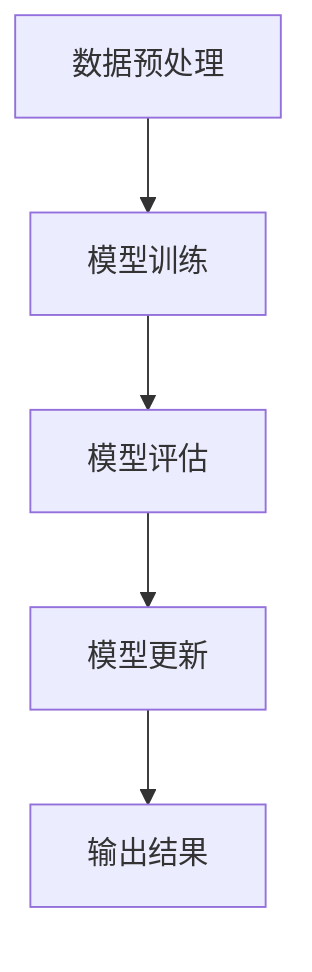

                 


# AI Agent的终身学习系统：持续适应新知识和技能

> **关键词**：AI Agent，终身学习，增量学习，连续学习，知识蒸馏，机器学习

> **摘要**：  
> 本文探讨了AI Agent的终身学习系统，重点分析其核心概念、算法原理、系统架构设计，以及实际应用场景。通过详细阐述终身学习系统的背景、核心要素、算法实现、系统架构、项目实战、最佳实践和未来展望，本文为读者提供了全面的视角，帮助理解和应用AI Agent的终身学习技术。

---

## 第1章: AI Agent与终身学习系统概述

### 1.1 AI Agent的基本概念
#### 1.1.1 什么是AI Agent
AI Agent（人工智能代理）是指能够感知环境并采取行动以实现特定目标的智能体。它具备自主性、反应性、目标导向和社会能力等核心特征。

#### 1.1.2 AI Agent的核心特征
1. **自主性**：能够在没有外部干预的情况下独立运作。
2. **反应性**：能够实时感知环境并做出反应。
3. **目标导向**：通过采取行动来实现特定目标。
4. **社会能力**：能够与其他Agent或人类进行交互和协作。

#### 1.1.3 终身学习系统的基本概念
终身学习系统是一种能够在不断变化的环境中持续学习和适应新知识的系统。其核心目标是使AI Agent能够像人类一样，通过持续学习来提升自身的智能水平。

---

### 1.2 终身学习系统的背景与意义
#### 1.2.1 人工智能发展的新趋势
人工智能正在从单一任务处理向多任务、多场景的智能体方向发展。终身学习系统是这一趋势的重要组成部分。

#### 1.2.2 终身学习系统的重要性
1. **应对动态环境**：使AI Agent能够适应快速变化的环境。
2. **提升智能水平**：通过持续学习，AI Agent可以不断优化其性能。
3. **扩展应用范围**：支持更多复杂场景的应用。

#### 1.2.3 现实需求与技术挑战
现实需求包括教育、医疗、金融等多个领域的智能化需求。技术挑战包括数据稀疏性、模型更新效率、知识遗忘等问题。

---

### 1.3 终身学习系统的核心要素
1. **数据流**：持续输入新的数据流。
2. **知识库**：存储已学习的知识和经验。
3. **学习模块**：负责模型的更新和优化。
4. **评估机制**：用于评估学习效果和系统性能。

---

## 第2章: 终身学习系统的核心概念与联系

### 2.1 终身学习系统的核心概念
#### 2.1.1 连续学习（Continuous Learning）
连续学习是指系统在接收到新的数据后，能够逐步更新其模型，而不是重新训练整个模型。

#### 2.1.2 增量学习（Incremental Learning）
增量学习是指系统在每次接收到少量新数据后，逐步更新其模型，而不是一次性训练整个数据集。

#### 2.1.3 知识表示与更新
知识表示是将知识以某种形式存储的过程，知识更新则是根据新数据对知识进行调整的过程。

---

### 2.2 终身学习系统的核心要素
#### 2.2.1 数据流
数据流是终身学习系统的输入，包括结构化数据、非结构化数据等多种形式。

#### 2.2.2 知识库
知识库是存储已学习知识的地方，支持快速查询和更新。

#### 2.2.3 学习模块
学习模块负责根据新数据更新模型，支持多种学习算法。

#### 2.2.4 评估机制
评估机制用于衡量学习效果和系统性能，通常包括准确性、效率等指标。

---

### 2.3 终身学习系统与其他学习方式的对比
#### 2.3.1 监督学习
- **监督学习**：需要标注数据，适用于静态任务。
- **增量学习**：无需标注数据，适用于动态任务。

#### 2.3.2 无监督学习
- **无监督学习**：发现数据中的结构，适用于未知任务。
- **连续学习**：结合新旧数据，适用于渐进式任务。

#### 2.3.3 半监督学习
- **半监督学习**：结合标注和未标注数据。
- **增量学习**：适用于数据逐步到达的场景。

---

## 第3章: 终身学习系统的算法原理

### 3.1 主流算法概述
#### 3.1.1 增量学习算法
- **ELM（Extreme Learning Machines）**：一种高效的增量学习算法。
- **iCauchy**：基于柯西分布的增量学习算法。

#### 3.1.2 连续学习算法
- ** lifelong neural networks**：适用于神经网络的连续学习。
- **Incremental SVM**：支持向量机的增量学习方法。

#### 3.1.3 知识蒸馏算法
- **知识蒸馏**：通过教师模型指导学生模型的学习。

---

### 3.2 增量学习算法的实现原理
#### 3.2.1 ELM算法的工作流程
1. 初始化网络参数。
2. 训练网络，更新权重。
3. 接收新数据，逐步更新权重。

#### 3.2.2 iCauchy算法的实现步骤
1. 接收新数据点。
2. 计算概率分布。
3. 更新模型参数。

#### 3.2.3 模型更新公式
- **ELM更新公式**：$$ w_{new} = w_{old} + \alpha x $$ 
- **iCauchy更新公式**：$$ w_{new} = w_{old} + \beta \cdot \frac{x}{1 + x^2} $$

---

### 3.3 终身学习系统的数学模型
#### 3.3.1 基于概率的模型
- **贝叶斯模型**：通过概率更新规则进行模型更新。
  $$ P(h|x) = \frac{P(x|h)P(h)}{P(x)} $$

#### 3.3.2 基于神经网络的模型
- **连续时间神经网络**：$$ \frac{dw}{dt} = -\eta (y - \hat{y}) x $$

---

## 第4章: 终身学习系统的系统架构设计

### 4.1 系统设计概述
#### 4.1.1 系统目标
实现AI Agent的持续学习和适应能力。

#### 4.1.2 系统范围
覆盖从数据输入到模型更新的整个流程。

#### 4.1.3 系统功能
1. 数据预处理
2. 模型训练
3. 模型评估
4. 模型更新

---

### 4.2 系统架构设计
#### 4.2.1 数据预处理模块
- 负责数据清洗和特征提取。

#### 4.2.2 模型训练模块
- 负责模型的初始化和训练。

#### 4.2.3 模型评估模块
- 负责模型性能的评估和优化。

#### 4.2.4 模型更新模块
- 负责根据新数据更新模型。

---

### 4.3 系统架构图


---

## 第5章: 终身学习系统的项目实战

### 5.1 环境搭建
- **Python 3.8+**
- **TensorFlow或PyTorch**

### 5.2 核心实现代码
```python
class IncrementalLearner:
    def __init__(self, model, optimizer):
        self.model = model
        self.optimizer = optimizer

    def update_model(self, x, y):
        self.optimizer.zero_grad()
        outputs = self.model(x)
        loss = loss_fn(outputs, y)
        loss.backward()
        self.optimizer.step()
```

### 5.3 案例分析
- **教育领域**：个性化学习推荐系统。
- **医疗领域**：实时病历更新和诊断支持。

---

## 第6章: 最佳实践与注意事项

### 6.1 设计原则
1. **模块化设计**：确保各模块独立可扩展。
2. **数据高效性**：尽量减少数据冗余。

### 6.2 注意事项
- **数据质量**：确保数据的准确性和完整性。
- **模型选择**：根据任务选择合适的算法。

### 6.3 未来趋势
- **在线学习**：实时更新模型。
- **多模态学习**：结合多种数据类型。

---

## 第7章: 结论与展望

### 7.1 全文总结
本文详细探讨了AI Agent的终身学习系统，从核心概念到算法实现，再到系统设计，为读者提供了全面的视角。

### 7.2 未来展望
未来，终身学习系统将在更多领域得到应用，算法也将更加高效和智能。

---

### 致谢
感谢读者的支持和关注，希望本文能为AI Agent的终身学习研究和应用提供有价值的参考。

